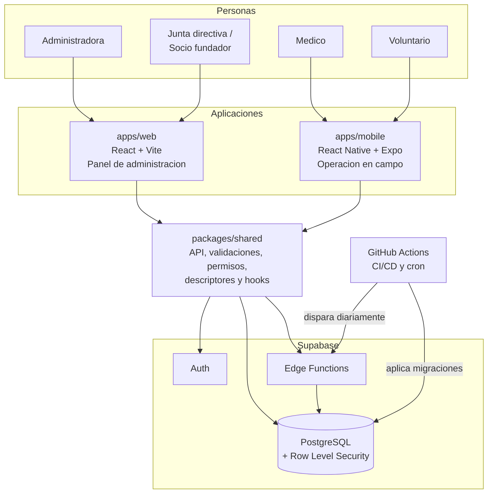
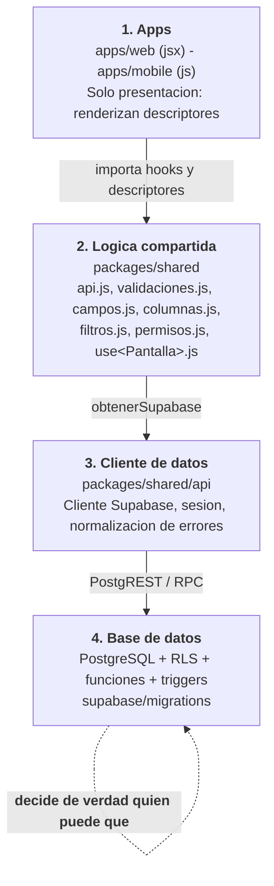
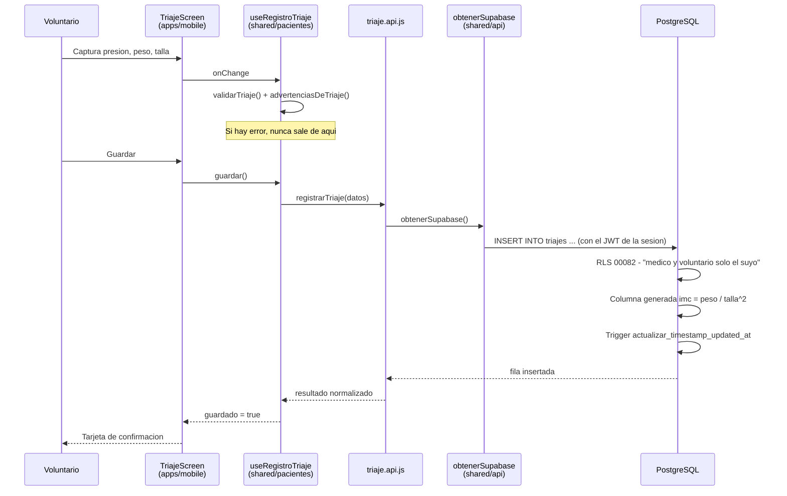
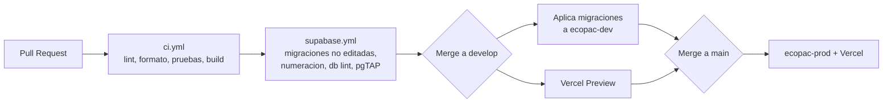

# Arquitectura del sistema - Ecopac Digital

Este documento es la **puerta de entrada tecnica** al repositorio: que construye el sistema, en
que piezas se divide, por que estan divididas asi, y donde esta escrito cada detalle.

Se lee de arriba hacia abajo sin necesidad de tener el codigo abierto. Cuando una seccion agota
lo que se puede explicar de forma general, enlaza al documento de referencia que lo desarrolla.

| Si buscas...                                | Ve a                                                     |
| ------------------------------------------- | -------------------------------------------------------- |
| Tablas, columnas, funciones y politicas RLS | [MODELO-DE-DATOS.md](./MODELO-DE-DATOS.md)               |
| Que pantallas existen y en que estado       | [MODULOS.md](./MODULOS.md)                               |
| Que exporta `packages/shared`               | [API-SHARED.md](./API-SHARED.md)                         |
| Como se comparte el frontend                | [ARQUITECTURA-FRONTEND.md](./ARQUITECTURA-FRONTEND.md)   |
| Quien puede hacer que                       | [PERMISOS.md](./PERMISOS.md)                             |
| Correr el proyecto                          | [QUICKSTART.md](./QUICKSTART.md)                         |

---

## 1. El problema

Ecopac Guatemala es una ONG que ejecuta jornadas medicas y dentales gratuitas en comunidades
rurales. Antes de este sistema, la operacion completa se sostenia sobre papel y WhatsApp:

- El expediente del paciente era una hoja fisica que viajaba en una caja. Si el paciente volvia
  en otra jornada, en otra comunidad, su historial no estaba ahi.
- El inventario de medicamentos se llevaba en cuadernos por bodega. Los vencimientos se
  descubrian al abrir la caja, en la comunidad, con el paciente enfrente.
- La planificacion de jornadas -quien va, con que turno, con que presupuesto- vivia en hilos de
  chat.
- Los reportes para donantes y junta directiva se armaban a mano al final de cada jornada.

El sistema digitaliza esas cuatro cosas, y agrega la que el papel nunca pudo dar: **trazabilidad**
(quien registro que, cuando) y **control de acceso** (que un voluntario no vea lo que no le toca).

### Restricciones que moldean el diseno

Estas no son detalles: explican casi todas las decisiones de las secciones siguientes.

| Restriccion                            | Consecuencia en el diseno                                                                |
| -------------------------------------- | ---------------------------------------------------------------------------------------- |
| Se trabaja en campo, sin buena senal   | La operacion de jornada vive en la app movil, no en la web                                |
| Son datos clinicos de personas reales  | El control de acceso se aplica en la base de datos (RLS), no en el cliente                |
| El equipo tecnico es pequeno           | Una sola implementacion de la logica, reutilizada por las dos apps                        |
| Plan gratuito de Supabase              | Sin `pg_cron`: las rutinas programadas se disparan desde GitHub Actions                   |
| Rotacion de voluntariado               | Roles y permisos finos, y auditoria de quien hizo cada cosa                               |

---

## 2. Vista de contexto



Quien usa que:

- **Web**: administracion, planificacion, reportes y gobernanza. La usan la administradora y los
  roles consultivos (junta directiva, socio fundador).
- **Movil**: lo que pasa durante la jornada. La usan medicos y voluntarios: registrar al
  paciente, tomar el triaje, hacer la consulta, emitir la receta, descontar del botiquin.
- **Reportes** existe unicamente en la web (`soloWeb: true` en `packages/shared/navegacion.js`).

---

## 3. Las cuatro capas



La regla que sostiene todo esto:

> Una pantalla es **un hook y unos descriptores en `packages/shared`**, mas **un componente por
> app**.

Ese es el contrato completo, y esta desarrollado en
[ARQUITECTURA-FRONTEND.md](./ARQUITECTURA-FRONTEND.md), lectura obligatoria antes de tocar
`apps/` o `packages/shared`.

### Que vive en cada capa

| Capa                | Contiene                                                                       | Nunca contiene                                                    |
| ------------------- | ------------------------------------------------------------------------------ | ----------------------------------------------------------------- |
| `apps/web`          | JSX con `react-bootstrap`, rutas, layout                                       | Validaciones, reglas de negocio, decisiones de permisos, SQL      |
| `apps/mobile`       | JSX con los componentes propios, navegacion                                    | Lo mismo                                                          |
| `packages/shared`   | Todo lo que no es JSX ni estilos                                               | `react-dom`, `react-native`, `react-bootstrap`, `document`, `window`, `localStorage`, JSX |
| `packages/ui-tokens`| Colores, tipografia, espaciado y textos comunes                                | Componentes                                                       |
| `supabase/`         | Esquema versionado, politicas RLS, funciones, Edge Functions                   | Nada que solo exista en la nube y no en un archivo                |

Las dos apps implementan **el mismo catalogo de componentes con las mismas props** (`FilterBar`,
`DataList`, `TextField`, `StatusChip`, `Modal`, `KanbanBoard`, `Tabs`, ...), de modo que portar
una pantalla de web a movil sea mecanico: cambia el import, no la logica.

---

## 4. Como se descompone una pantalla

Cada modulo de `packages/shared` sigue el mismo esqueleto. `packages/shared/pacientes/` es el
ejemplar de referencia.

| Archivo               | Responsabilidad                                                              |
| --------------------- | ---------------------------------------------------------------------------- |
| `api.js`              | Las llamadas a Supabase. Es el unico lugar del modulo que habla con la base   |
| `validaciones.js`     | Que datos son validos, y el mensaje exacto cuando no lo son                   |
| `campos.js`           | Descriptores de formulario: id, etiqueta, tipo, opciones, obligatoriedad      |
| `columnas.js`         | Columnas de tabla (web) y campos de tarjeta (movil), del mismo descriptor     |
| `filtros.js`          | Definicion de los filtros y su estado vacio                                   |
| `permisos.js`         | Que roles pueden que, del lado del cliente (la restriccion real es RLS)       |
| `use<Pantalla>.js`    | Un hook por pantalla: orquesta estado, carga, validacion y guardado           |

El componente de la app recibe eso ya resuelto y solo dibuja:

```jsx
// apps/web - la pantalla no sabe validar, ni consultar, ni decidir permisos
const { valores, errores, guardar, cargando } = useRegistroPaciente(sesion);
return <Formulario campos={CAMPOS_REGISTRO_PACIENTE} valores={valores} errores={errores} />;
```

---

## 5. Recorrido de una peticion

Un ejemplo real de punta a punta: **un voluntario toma el triaje de un paciente en la jornada**.



Lo importante de este recorrido son las **dos validaciones distintas**, que no son redundancia:

1. La del cliente (`validarTriaje`) existe para dar un mensaje util antes de gastar una ida al
   servidor.
2. La de la base (RLS + `CHECK` + columnas generadas) existe porque **es la unica que de verdad
   protege**. Un cliente modificado se salta la primera; nunca se salta la segunda.

El calculo del IMC ilustra la misma idea en pequeno: `calcularImc()` existe en el hook para
previsualizarlo mientras se escribe, pero el valor que se guarda es la **columna generada** de la
tabla `triajes`, calculada por Postgres. El cliente no puede mentir sobre el IMC.

---

## 6. Decisiones de arquitectura, y por que

### 6.1 La seguridad vive en la base de datos, no en el cliente

Las **107 politicas RLS** son la frontera real. El cliente esconde botones; la base niega filas.

La postura de partida es **denegacion por defecto** (migracion `00030`): una tabla sin politica no
devuelve nada a nadie. Encima de eso:

- Un perfil desactivado pierde su rol efectivo (`00079`): no basta con quitarle la contrasena.
- No se puede quedar sin administrador activo (`00072` y `00103`), ni desactivarse a si mismo.
- Los roles consultivos (junta directiva, socio fundador) ven agregados, **no filas clinicas**
  (`00054`): la junta directiva puede ver cuantos pacientes se atendieron, no quienes son.
- El acceso directo por id ajeno esta cerrado (`00082`, IDOR clinico): un medico no registra en la
  consulta de otro medico aunque conozca el UUID.
- `anon` no tiene privilegios (`00049`, `00056`), y el registro publico de cuentas esta cerrado
  (`00074`): las cuentas se crean por invitacion.

Se comprueba con **27 archivos de pruebas pgTAP** en `supabase/tests/database/`, que corren en CI.

La matriz completa esta en [PERMISOS.md](./PERMISOS.md).

### 6.2 Una sola implementacion de la logica, dos presentaciones

La alternativa habitual -escribir la pantalla dos veces, una por plataforma- se descarto porque
duplica tambien las reglas de negocio, y las reglas de negocio duplicadas divergen. El costo es que
`packages/shared` no puede usar nada especifico de plataforma; el beneficio es que una correccion
de validacion se hace una vez.

Los detalles de la frontera estan en [ARQUITECTURA-FRONTEND.md](./ARQUITECTURA-FRONTEND.md).

### 6.3 Las migraciones son la fuente de verdad

Cuando el codigo, la documentacion y la base no coinciden, **manda lo que esta en
`supabase/migrations/`**.

Dos reglas que se hacen cumplir en CI:

- **Una migracion aplicada no se edita nunca.** Supabase la registra en
  `supabase_migrations.schema_migrations` y no vuelve a ejecutarla: editarla cambia lo que valida
  el CI (que aplica todo desde cero) pero no cambia nada en las bases reales. La divergencia
  aparece despues del merge. Se corrige hacia adelante, con una migracion nueva.
- **Una migracion no se aplica a mano.** Nadie corre `supabase db push` desde su maquina contra
  `ecopac-dev` ni `ecopac-prod`. Se mergea el PR y la aplica el workflow.

El numero es de cinco digitos, secuencial, y se **vuelve a verificar antes de mergear**: otra rama
pudo tomarlo mientras tanto. Repetir un numero rompe el despliegue (`version` es clave primaria:
`db push` aborta con SQLSTATE 23505 y no aplica esa migracion ni las siguientes). Detalle completo
en [CI-CD.md](./CI-CD.md).

### 6.4 Sin `pg_cron`: el reloj esta en GitHub Actions

El proyecto esta en el plan gratuito de Supabase, que no incluye `pg_cron`. Las rutinas
programadas se disparan desde workflows (`.github/workflows/alertas-vencimiento.yml`), que llaman a
una Edge Function autenticada con la llave de servicio.

La logica de la rutina **no vive en la Edge Function**: vive en SQL (`fn_generar_alertas_caducidad`,
migracion `00088`). La funcion es un envoltorio delgado. Asi la rutina es comprobable con pgTAP y
no depende del disparador.

### 6.5 JavaScript, no TypeScript

El paquete compartido fue TypeScript y dejo de serlo (issue #493). El tipado se conserva donde
importa -`packages/shared/types/index.js` y los `Object.freeze` de `enums.js` y `roles.js`, que
hacen que un editor autocomplete los valores- sin pagar el costo de dos toolchains distintas
resolviendo extensiones de archivo de forma distinta (Vite y Metro no resuelven igual el cambio de
`.js` a `.ts`, que fue el bug #390).

### 6.6 Los nombres de columna son una decision, no un accidente

Convencion unificada en el issue #412:

- El **actor** de una accion lleva sufijo `_por`: `registrado_por`, `aprobado_por`, `atendida_por`,
  `anulada_por`, `tomado_por`, `realizado_por`.
- Su **marca de tiempo** usa la misma raiz con sufijo `_en`, nunca el prefijo `fecha_`:
  `aprobado_en`, `atendida_en`, `anulada_en`, `tomado_en`.
- La **persona responsable de una entidad completa** (no de una accion puntual) es
  `responsable_id`.

Cuando dos columnas parecen el mismo concepto pero nombran cosas distintas, no se fuerza un nombre
unico: se deja la diferencia y se documenta con `COMMENT ON` en la migracion. Los dos casos
existentes son `tipo_proveedor` / `origen_lote` (`00090`) y `pacientes.telefono_contacto`
(`00093`).

---

## 7. Que hay construido hoy

Estado sobre `develop`, septiembre de 2026.

| Area                       | Tamano                                                                  |
| -------------------------- | ----------------------------------------------------------------------- |
| Migraciones                | 103 archivos                                                            |
| Esquema                    | 42 tablas, 20 enums, 49 funciones, 7 vistas, 107 politicas RLS          |
| `packages/shared`          | 10 modulos de dominio y 6 de infraestructura, 191 archivos              |
| `apps/web`                 | 61 paginas, 20 componentes, 27 rutas                                    |
| `apps/mobile`              | 23 pantallas, 23 componentes, 5 tabs                                    |
| Edge Functions             | 2 (`invitar-usuario`, `alertas-vencimiento`)                            |
| Pruebas                    | 116 archivos de prueba (vitest) + 27 de pgTAP                           |
| Workflows de CI/CD         | 5                                                                       |

Los nueve modulos del sistema, definidos una sola vez en `packages/shared/navegacion.js`:

| Modulo       | Web | Movil | Quien lo ve                                            |
| ------------ | --- | ----- | ------------------------------------------------------ |
| Inicio       | Si  | Tab   | Todos                                                  |
| Pacientes    | Si  | Tab   | Administrador, medico, voluntario                      |
| Donaciones   | Si  | Si    | Administrador y consultivos                            |
| Inventario   | Si  | Tab   | Administrador, consultivos, medico, voluntario         |
| Presupuestos | Si  | Si    | Administrador y consultivos                            |
| Proyectos    | Si  | Si    | Administrador y consultivos                            |
| Reportes     | Si  | No    | Administrador y consultivos                            |
| Jornadas     | Si  | Tab   | Administrador, consultivos, medico, voluntario         |
| Voluntarios  | Si  | Si    | Solo administrador                                     |

Detalle pantalla por pantalla en [MODULOS.md](./MODULOS.md).

> **Nota sobre el estado real.** Que un modulo aparezca aqui significa que existe, no que este
> terminado y conectado. Hay pantallas que muestran datos de ejemplo como si fueran reales
> (#687, #688, #689) y piezas terminadas y probadas que nadie llego a conectar (#693). Antes de
> asumir que algo funciona de punta a punta, revisar las issues abiertas del modulo.

---

## 8. Ambientes y despliegue

| Ambiente             | Rama      | Base de datos    | Frontend             |
| -------------------- | --------- | ---------------- | -------------------- |
| Desarrollo / Staging | `develop` | `ecopac-dev`     | Vercel Preview       |
| Produccion           | `main`    | `ecopac-prod`    | Vercel (main)        |
| Local                | -         | `supabase start` | `npm run dev:web`    |



Las variables de entorno se copian desde `.env.example`. **Nunca se suben llaves reales al
repositorio**, y `packages/shared/entorno/reglas.js` rechaza al arrancar una `service_role` que
aparezca en el bundle del cliente.

Que valida cada workflow y que hacer cuando falla: [CI-CD.md](./CI-CD.md).
Nube contra stack local: [SUPABASE.md](./SUPABASE.md).

---

## 9. Mapa de la documentacion

```
Empezar aqui
  ARQUITECTURA.md          <- este documento: vision general y decisiones

Referencia tecnica
  MODELO-DE-DATOS.md       tablas, enums, funciones, vistas, RLS
  MODULOS.md               que pantalla existe, en que app, servida por que hook
  API-SHARED.md            que exporta cada modulo de packages/shared
  ARQUITECTURA-FRONTEND.md la regla de la frontera, en detalle
  PERMISOS.md              matriz de permisos por rol (fuente de verdad de acceso)

Operacion
  QUICKSTART.md            instalar y correr
  CI-CD.md                 workflows, migraciones, despliegue
  SUPABASE.md              nube contra local
  DATOS-DEMO.md            datos de prueba
  DEPENDENCIES.md          politica de versionado

Seguridad
  SEGURIDAD.md             contrasenas, sesion, credenciales
  PROTECCION-DE-DATOS.md   logs, almacenamiento movil, cifrado, secretos

Proceso y diseno
  CONTRIBUTING.md          ramas, commits, PRs, tablero
  DISENO.md                pantallas, navegacion, paleta
```
