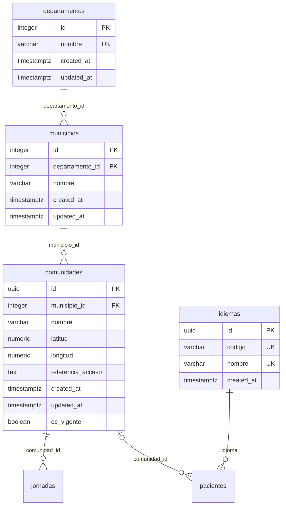
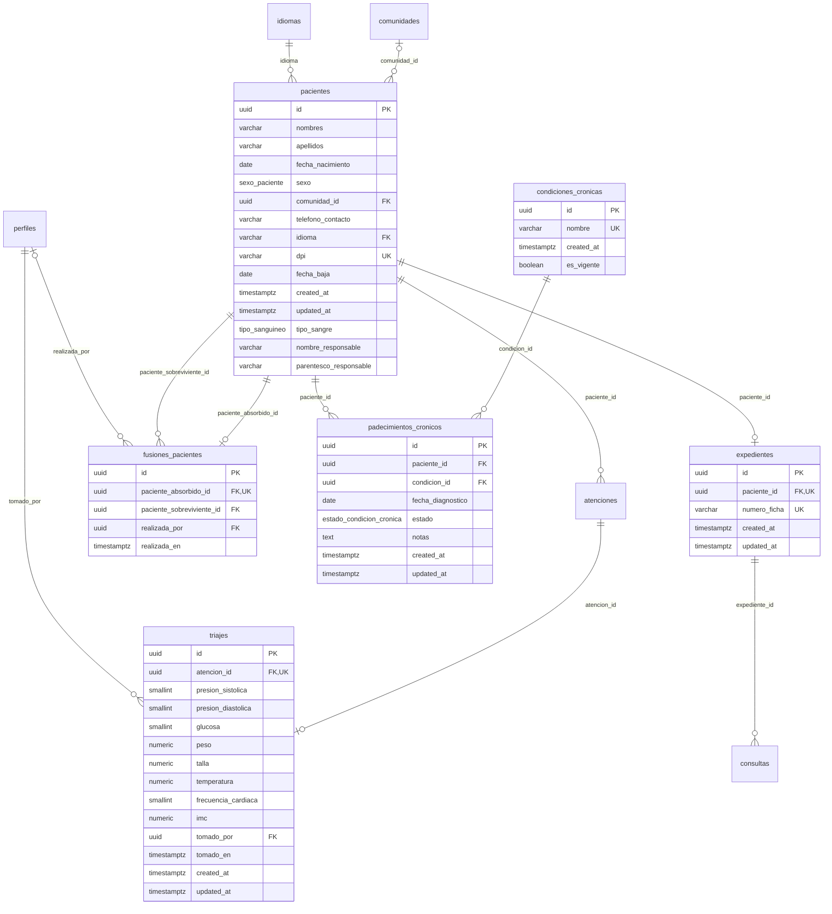
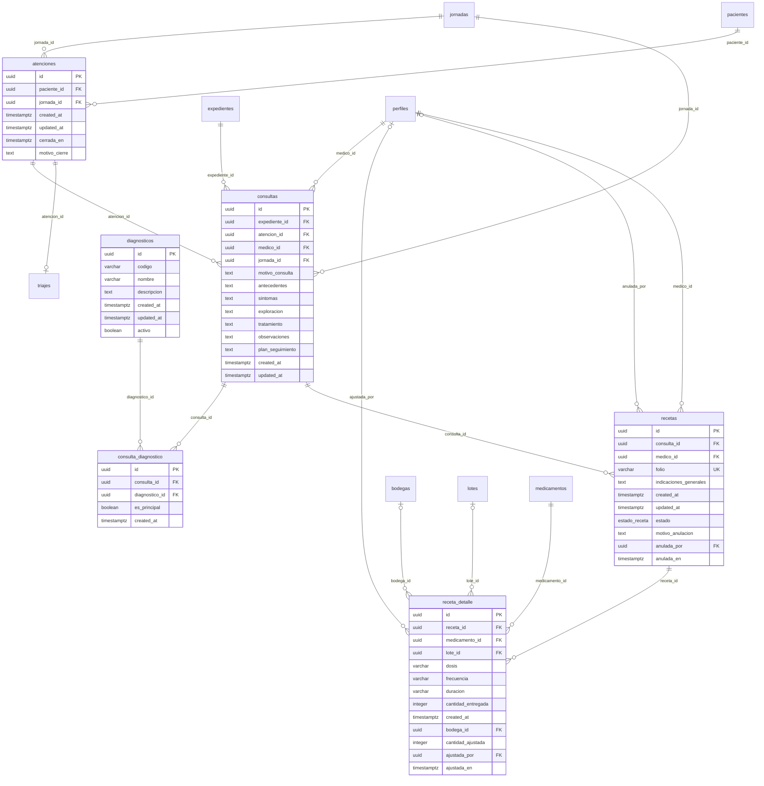
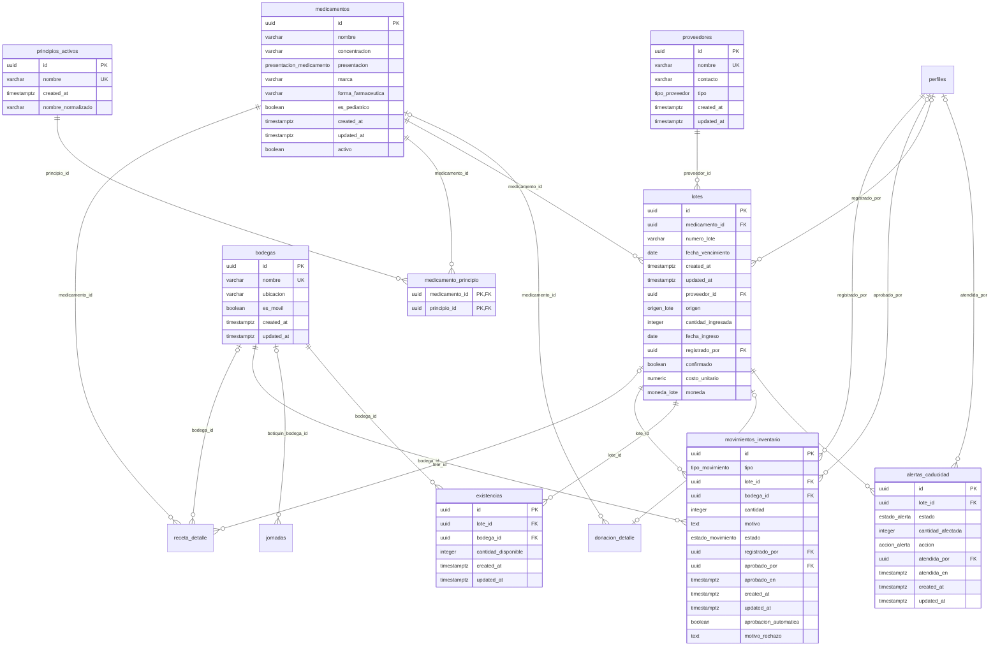
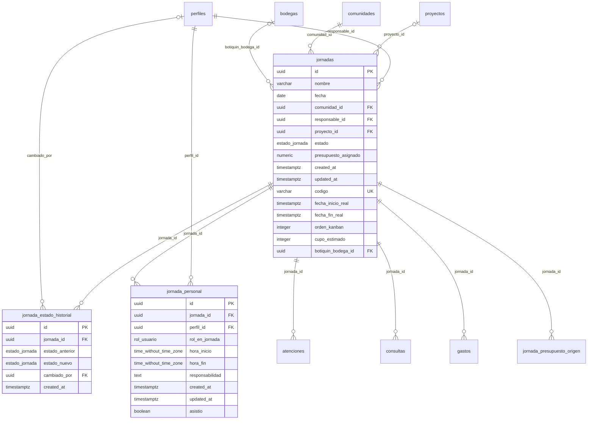
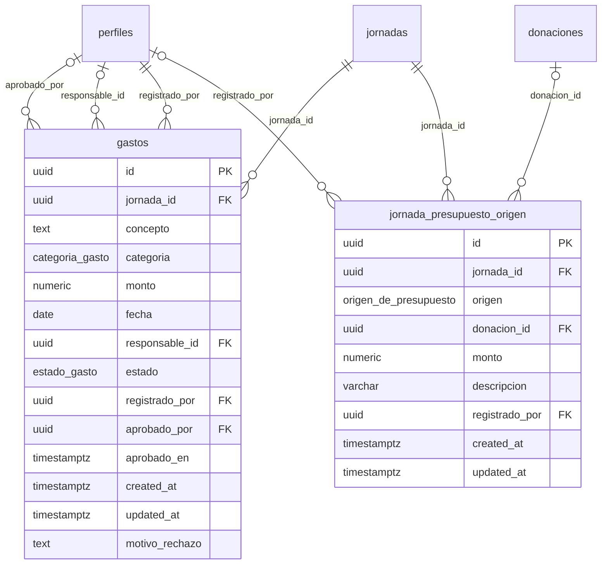
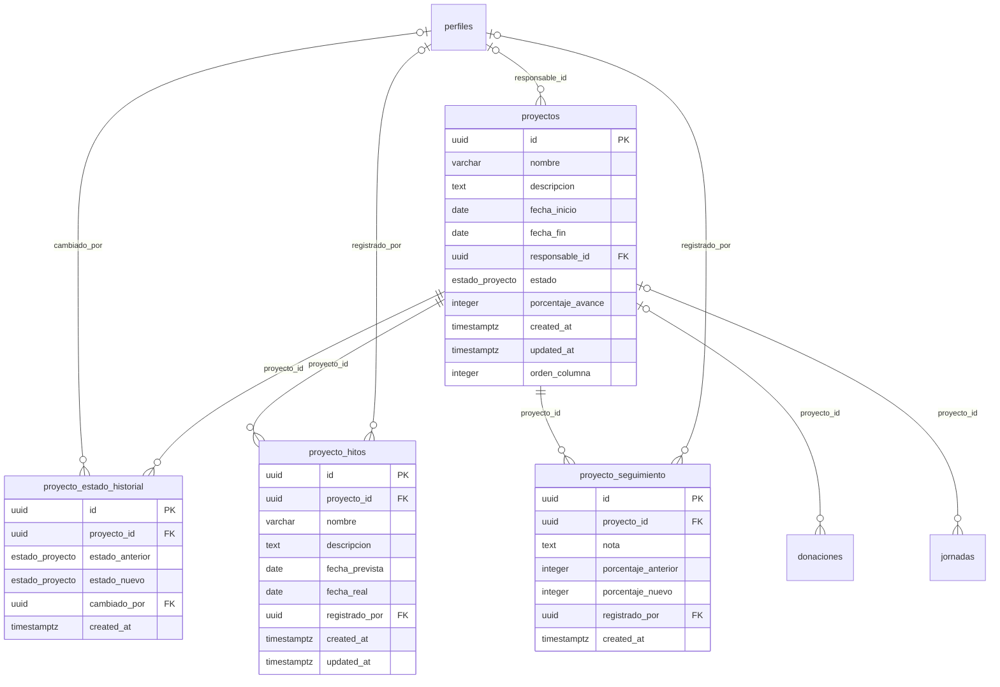
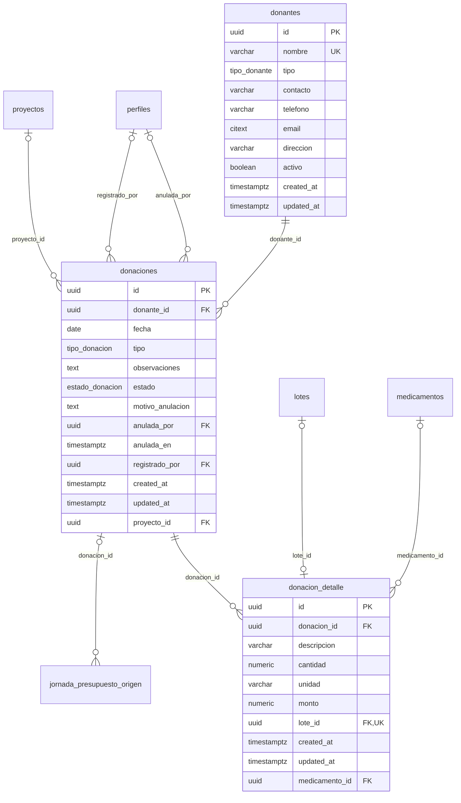
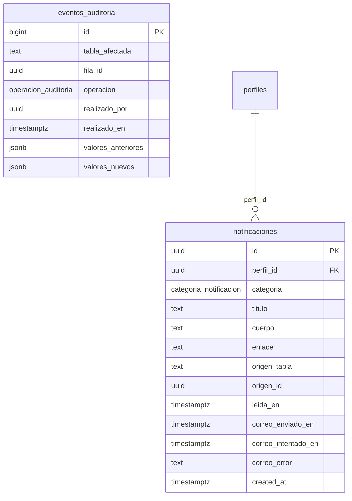

```mermaid
erDiagram
  perfiles {
    uuid id PK,FK
    varchar nombres
    varchar apellidos
    citext email UK
    varchar telefono
    rol_usuario rol
    boolean activo
    date fecha_ingreso
    timestamptz created_at
    timestamptz updated_at
    text direccion
    text notas
  }
  perfil_especialidad {
    uuid perfil_id PK,FK
    varchar nombre_especialidad PK
  }
  permisos {
    uuid id PK
    varchar clave UK
    varchar modulo
    text descripcion
  }
  rol_permiso {
    rol_usuario rol PK
    uuid permiso_id PK,FK
  }
  usuario_permiso {
    uuid perfil_id PK,FK
    uuid permiso_id PK,FK
    boolean concedido
    uuid otorgado_por FK
    text motivo
  }
  limites_de_uso {
    text recurso PK
    uuid actor_id PK
    integer contador
    timestamptz ventana_inicio
  }
  perfiles |o--o{ alertas_caducidad : "atendida_por"
  perfiles ||--o{ consultas : "medico_id"
  perfiles |o--o{ donaciones : "anulada_por"
  perfiles |o--o{ donaciones : "registrado_por"
  perfiles |o--o{ fusiones_pacientes : "realizada_por"
  perfiles |o--o{ gastos : "aprobado_por"
  perfiles |o--o{ gastos : "responsable_id"
  perfiles ||--o{ gastos : "registrado_por"
  perfiles |o--o{ jornada_estado_historial : "cambiado_por"
  perfiles ||--o{ jornada_personal : "perfil_id"
  perfiles |o--o{ jornada_presupuesto_origen : "registrado_por"
  perfiles ||--o{ jornadas : "responsable_id"
  perfiles |o--o{ lotes : "registrado_por"
  perfiles |o--o{ movimientos_inventario : "aprobado_por"
  perfiles ||--o{ movimientos_inventario : "registrado_por"
  perfiles ||--o{ notificaciones : "perfil_id"
  perfiles ||--o{ perfil_especialidad : "perfil_id"
  users ||--o| perfiles : "id"
  perfiles |o--o{ proyecto_estado_historial : "cambiado_por"
  perfiles |o--o{ proyecto_hitos : "registrado_por"
  perfiles |o--o{ proyecto_seguimiento : "registrado_por"
  perfiles |o--o{ proyectos : "responsable_id"
  perfiles |o--o{ receta_detalle : "ajustada_por"
  perfiles |o--o{ recetas : "anulada_por"
  perfiles ||--o{ recetas : "medico_id"
  permisos ||--o{ rol_permiso : "permiso_id"
  perfiles ||--o{ triajes : "tomado_por"
  perfiles |o--o{ usuario_permiso : "otorgado_por"
  perfiles ||--o{ usuario_permiso : "perfil_id"
  permisos ||--o{ usuario_permiso : "permiso_id"
```

# Diccionario de datos

> **Documento generado.** No se edita a mano: sale de `npm run docs:diccionario` (`scripts/generar-diccionario-de-datos.mjs`), que lee el catalogo de PostgreSQL de una base con todas las migraciones aplicadas, hasta la `00186_consumo_por_jornada_y_lo_comprometido.sql`. Las descripciones son los `COMMENT ON` de las migraciones: si falta una, se agrega con una migracion nueva y se regenera.

Complementa a [MODELO-DE-DATOS.md](MODELO-DE-DATOS.md), que explica el porque de cada decision, y a [PERMISOS.md](PERMISOS.md), que explica que puede hacer cada rol. Este documento es la referencia exhaustiva: cada tabla, cada campo, cada restriccion, cada politica y cada trigger.

## Resumen

| Objeto | Cantidad |
| --- | --- |
| Tablas | 45 |
| Tablas con RLS activo | 45 |
| Vistas | 7 |
| Tipos enumerados | 23 |
| Columnas (tablas y vistas) | 417 |
| Llaves foraneas | 77 |
| Restricciones CHECK | 40 |
| Politicas RLS | 117 |
| Triggers | 66 |
| Funciones (sin contar las de trigger) | 39 |
| Funciones de trigger | 35 |

### Como leer las tablas de este documento

- **Nulo**: `si` si la columna admite NULL.
- **Por defecto**: el valor que pone la base si el INSERT no lo manda (`auth.uid()` es quien esta conectado).
- **Llaves**: `PK` llave primaria, `FK` llave foranea (con la tabla a la que apunta y que pasa al borrar la fila referida), `UNIQUE` y `CHECK`.
- **Proteccion**: si la tabla tiene Row Level Security, que privilegios tienen los roles `authenticated` (sesion iniciada) y `anon` (sin sesion) y cada politica, con su condicion `USING` (que filas se ven o se tocan) y `WITH CHECK` (que filas se pueden dejar escritas).
- **Triggers**: la logica que corre la base sola al escribir, con la funcion que ejecuta.

## Indice por modulo

### Usuarios, roles y permisos

| Tabla | Descripcion |
| --- | --- |
| [`perfiles`](#perfiles) | _Sin COMMENT ON_ |
| [`perfil_especialidad`](#perfil_especialidad) | _Sin COMMENT ON_ |
| [`permisos`](#permisos) | _Sin COMMENT ON_ |
| [`rol_permiso`](#rol_permiso) | _Sin COMMENT ON_ |
| [`usuario_permiso`](#usuario_permiso) | _Sin COMMENT ON_ |
| [`limites_de_uso`](#limites_de_uso) | Contador de limite de peticiones (rate limiting) por recurso y actor, con ventana de tiempo fija que se reinicia sola al expirar (issue #761). recurso identifica que se limita ('invitar_usuario', 'buscar_pacientes'); actor_id es quien lo dispara. No expuesta a PostgREST ni a ningun rol de aplicacion: solo la tocan las funciones SECURITY DEFINER de esta migracion. |

### Territorio y catalogos generales

| Tabla | Descripcion |
| --- | --- |
| [`departamentos`](#departamentos) | _Sin COMMENT ON_ |
| [`municipios`](#municipios) | _Sin COMMENT ON_ |
| [`comunidades`](#comunidades) | _Sin COMMENT ON_ |
| [`idiomas`](#idiomas) | Catalogo de idiomas del paciente (issue #663). Sustituye al enum idioma_preferido de la 00001, que obligaba a una migracion por cada idioma nuevo. pacientes.idioma referencia codigo, no id, para que las pruebas y las semillas que ya escriben el valor por su nombre sigan siendo validas. Agregar un idioma es un INSERT. |

### Pacientes y expediente

| Tabla | Descripcion |
| --- | --- |
| [`pacientes`](#pacientes) | _Sin COMMENT ON_ |
| [`expedientes`](#expedientes) | _Sin COMMENT ON_ |
| [`fusiones_pacientes`](#fusiones_pacientes) | Registra que expediente absorbio a cual (issue #140). Se escribe solo por fn_fusionar_pacientes; sin politicas de escritura. |
| [`padecimientos_cronicos`](#padecimientos_cronicos) | _Sin COMMENT ON_ |
| [`condiciones_cronicas`](#condiciones_cronicas) | _Sin COMMENT ON_ |
| [`triajes`](#triajes) | _Sin COMMENT ON_ |

### Atencion clinica: consultas, diagnosticos y recetas

| Tabla | Descripcion |
| --- | --- |
| [`atenciones`](#atenciones) | _Sin COMMENT ON_ |
| [`consultas`](#consultas) | _Sin COMMENT ON_ |
| [`diagnosticos`](#diagnosticos) | _Sin COMMENT ON_ |
| [`consulta_diagnostico`](#consulta_diagnostico) | _Sin COMMENT ON_ |
| [`recetas`](#recetas) | _Sin COMMENT ON_ |
| [`receta_detalle`](#receta_detalle) | _Sin COMMENT ON_ |

### Inventario de medicamentos e insumos

| Tabla | Descripcion |
| --- | --- |
| [`medicamentos`](#medicamentos) | _Sin COMMENT ON_ |
| [`principios_activos`](#principios_activos) | _Sin COMMENT ON_ |
| [`medicamento_principio`](#medicamento_principio) | _Sin COMMENT ON_ |
| [`bodegas`](#bodegas) | _Sin COMMENT ON_ |
| [`proveedores`](#proveedores) | _Sin COMMENT ON_ |
| [`lotes`](#lotes) | _Sin COMMENT ON_ |
| [`existencias`](#existencias) | _Sin COMMENT ON_ |
| [`movimientos_inventario`](#movimientos_inventario) | _Sin COMMENT ON_ |
| [`alertas_caducidad`](#alertas_caducidad) | _Sin COMMENT ON_ |

### Jornadas

| Tabla | Descripcion |
| --- | --- |
| [`jornadas`](#jornadas) | _Sin COMMENT ON_ |
| [`jornada_personal`](#jornada_personal) | _Sin COMMENT ON_ |
| [`jornada_estado_historial`](#jornada_estado_historial) | _Sin COMMENT ON_ |

### Presupuestos y gastos

| Tabla | Descripcion |
| --- | --- |
| [`gastos`](#gastos) | _Sin COMMENT ON_ |
| [`jornada_presupuesto_origen`](#jornada_presupuesto_origen) | De donde viene cada parte del presupuesto de una jornada (issue #840). jornadas.presupuesto_asignado es la suma de estas filas y la mantiene fn_sincronizar_presupuesto_de_jornada; nadie la escribe a mano. |

### Proyectos sociales

| Tabla | Descripcion |
| --- | --- |
| [`proyectos`](#proyectos) | _Sin COMMENT ON_ |
| [`proyecto_hitos`](#proyecto_hitos) | Hitos de un proyecto social. Un hito esta pendiente mientras fecha_real sea nula. |
| [`proyecto_seguimiento`](#proyecto_seguimiento) | Bitacora de un proyecto: notas escritas a mano y cambios de porcentaje de avance, estos ultimos anotados por trigger. No lleva updated_at ni politicas de UPDATE o DELETE porque una bitacora no se corrige, se anota encima. |
| [`proyecto_estado_historial`](#proyecto_estado_historial) | _Sin COMMENT ON_ |

### Donaciones

| Tabla | Descripcion |
| --- | --- |
| [`donantes`](#donantes) | _Sin COMMENT ON_ |
| [`donaciones`](#donaciones) | _Sin COMMENT ON_ |
| [`donacion_detalle`](#donacion_detalle) | _Sin COMMENT ON_ |

### Notificaciones y auditoria

| Tabla | Descripcion |
| --- | --- |
| [`notificaciones`](#notificaciones) | Buzon interno de cada perfil y bandeja de salida del correo (issue #755). Una fila por incidencia y por destinatario. Solo la escriben los triggers de esta migracion; cada perfil lee las suyas y solo puede cambiar leida_en. |
| [`eventos_auditoria`](#eventos_auditoria) | Bitacora de cambios sobre informacion sensible. Se escribe solo por trigger y solo la lee la administradora. Sin politicas de INSERT, UPDATE ni DELETE: con RLS habilitado, lo que no tiene politica esta prohibido. No se usa FORCE ROW LEVEL SECURITY porque el dueno debe seguir eximido para que los triggers SECURITY DEFINER puedan insertar. |

## Diagramas entidad-relacion

Un diagrama por modulo, con todas las columnas de sus tablas. Las tablas de otros modulos a las que apuntan aparecen solo con su nombre. `||` es obligatorio, `|o` opcional (FK que admite NULL); `o{` es "muchos" y `o|` "a lo sumo uno" (FK unica). GitHub dibuja los bloques `mermaid`.

### Usuarios, roles y permisos

### Territorio y catalogos generales

### Pacientes y expediente

### Atencion clinica: consultas, diagnosticos y recetas

### Inventario de medicamentos e insumos

### Jornadas

### Presupuestos y gastos

### Proyectos sociales

### Donaciones

### Notificaciones y auditoria

## Tablas

### Modulo: Usuarios, roles y permisos

#### perfiles

_Sin descripcion (COMMENT ON TABLE)._

| Campo | Tipo | Nulo | Por defecto | Llave | Descripcion |
| --- | --- | --- | --- | --- | --- |
| `id` | `uuid` | no |  | PK, FK -> `users` |  |
| `nombres` | `varchar(100)` | no |  |  |  |
| `apellidos` | `varchar(100)` | no |  |  |  |
| `email` | `citext` | no |  |  |  |
| `telefono` | `varchar(20)` | si |  |  |  |
| `rol` | `rol_usuario` | no | `'voluntario general'::rol_usuario` |  |  |
| `activo` | `boolean` | no | `true` |  |  |
| `fecha_ingreso` | `date` | si |  |  |  |
| `created_at` | `timestamptz` | no | `now()` |  |  |
| `updated_at` | `timestamptz` | no | `now()` |  |  |
| `direccion` | `text` | si |  |  | Direccion de contacto en texto libre (ej. "Zona 10, Guatemala"). Nulable: dato opcional, sin formulario que lo escriba todavia. |
| `notas` | `text` | si |  |  | Notas internas sobre la persona (ej. disponibilidad, rol dentro del equipo). Nulable: dato opcional, sin formulario que lo escriba todavia. |

**Llaves y restricciones**

| Nombre | Tipo | Definicion |
| --- | --- | --- |
| `perfiles_id_fkey` | FK | `FOREIGN KEY (id) REFERENCES auth.users(id) ON DELETE CASCADE` (al borrar: CASCADE) |
| `perfiles_pkey` | PK | `PRIMARY KEY (id)` |
| `perfiles_email_key` | UNIQUE | `UNIQUE (email)` |

**La referencian:** `alertas_caducidad.atendida_por` (RESTRICT), `consultas.medico_id` (RESTRICT), `donaciones.anulada_por` (RESTRICT), `donaciones.registrado_por` (RESTRICT), `fusiones_pacientes.realizada_por` (RESTRICT), `gastos.aprobado_por` (RESTRICT), `gastos.responsable_id` (SET NULL), `gastos.registrado_por` (RESTRICT), `jornada_estado_historial.cambiado_por` (RESTRICT), `jornada_personal.perfil_id` (CASCADE), `jornada_presupuesto_origen.registrado_por` (SET NULL), `jornadas.responsable_id` (RESTRICT), `lotes.registrado_por` (NO ACTION), `movimientos_inventario.aprobado_por` (RESTRICT), `movimientos_inventario.registrado_por` (RESTRICT), `notificaciones.perfil_id` (CASCADE), `perfil_especialidad.perfil_id` (CASCADE), `proyecto_estado_historial.cambiado_por` (RESTRICT), `proyecto_hitos.registrado_por` (SET NULL), `proyecto_seguimiento.registrado_por` (SET NULL), `proyectos.responsable_id` (SET NULL), `receta_detalle.ajustada_por` (RESTRICT), `recetas.anulada_por` (RESTRICT), `recetas.medico_id` (RESTRICT), `triajes.tomado_por` (RESTRICT), `usuario_permiso.otorgado_por` (NO ACTION), `usuario_permiso.perfil_id` (CASCADE).

**Proteccion.** RLS activo. Privilegios: `authenticated`: INSERT, SELECT, UPDATE; `anon`: ninguno.

| Politica | Operacion | Roles | USING | WITH CHECK |
| --- | --- | --- | --- | --- |
| Solo administrador crea perfiles | Crear | public |  | `es_administrador()` |
| Administrador o el propio perfil leen perfiles | Leer | public | `(es_administrador() OR (id = auth.uid()))` |  |
| Administrador, o el propio perfil si sigue activo, editan perfi | Editar | public | `(es_administrador() OR ((id = auth.uid()) AND activo))` | `(es_administrador() OR ((id = auth.uid()) AND activo))` |

**Triggers**

| Trigger | Cuando | Funcion |
| --- | --- | --- |
| `trg_perfiles_auditoria` | AFTER INSERT OR DELETE OR UPDATE | `registrar_evento_auditoria()` |
| `trg_perfiles_impedir_autodesactivacion` | BEFORE UPDATE | `impedir_autodesactivacion()` |
| `trg_perfiles_impedir_borrar_ultimo_administrador` | BEFORE DELETE | `impedir_borrar_ultimo_administrador()` |
| `trg_perfiles_impedir_cambio_de_rol_propio` | BEFORE UPDATE | `impedir_cambio_de_rol_propio()` |
| `trg_perfiles_impedir_ultimo_administrador` | BEFORE UPDATE | `impedir_dejar_sin_administrador_activo()` |
| `trg_perfiles_updated_at` | BEFORE UPDATE | `actualizar_timestamp_updated_at()` |

#### perfil_especialidad

_Sin descripcion (COMMENT ON TABLE)._

| Campo | Tipo | Nulo | Por defecto | Llave | Descripcion |
| --- | --- | --- | --- | --- | --- |
| `perfil_id` | `uuid` | no |  | PK, FK -> `perfiles` |  |
| `nombre_especialidad` | `varchar(100)` | no |  | PK |  |

**Llaves y restricciones**

| Nombre | Tipo | Definicion |
| --- | --- | --- |
| `perfil_especialidad_perfil_id_fkey` | FK | `FOREIGN KEY (perfil_id) REFERENCES perfiles(id) ON DELETE CASCADE` (al borrar: CASCADE) |
| `perfil_especialidad_pkey` | PK | `PRIMARY KEY (perfil_id, nombre_especialidad)` |

**Proteccion.** RLS activo. Privilegios: `authenticated`: DELETE, INSERT, SELECT, UPDATE; `anon`: ninguno.

| Politica | Operacion | Roles | USING | WITH CHECK |
| --- | --- | --- | --- | --- |
| Administrador o el propio perfil borran sus especialidades | Borrar | authenticated | `(es_administrador() OR (perfil_id = auth.uid()))` |  |
| Administrador o el propio perfil registran sus especialidades | Crear | authenticated |  | `(es_administrador() OR (perfil_id = auth.uid()))` |
| Administrador o el propio perfil leen sus especialidades | Leer | authenticated | `(es_administrador() OR es_consultivo() OR (perfil_id = auth.uid()))` |  |

#### permisos

_Sin descripcion (COMMENT ON TABLE)._

| Campo | Tipo | Nulo | Por defecto | Llave | Descripcion |
| --- | --- | --- | --- | --- | --- |
| `id` | `uuid` | no | `extensions.gen_random_uuid()` | PK |  |
| `clave` | `varchar(100)` | no |  |  |  |
| `modulo` | `varchar(50)` | no |  |  |  |
| `descripcion` | `text` | si |  |  |  |

**Llaves y restricciones**

| Nombre | Tipo | Definicion |
| --- | --- | --- |
| `permisos_pkey` | PK | `PRIMARY KEY (id)` |
| `permisos_clave_key` | UNIQUE | `UNIQUE (clave)` |

**La referencian:** `rol_permiso.permiso_id` (CASCADE), `usuario_permiso.permiso_id` (CASCADE).

**Proteccion.** RLS activo. Privilegios: `authenticated`: INSERT, SELECT, UPDATE; `anon`: ninguno.

| Politica | Operacion | Roles | USING | WITH CHECK |
| --- | --- | --- | --- | --- |
| Sesion activa lee permisos | Leer | authenticated | `(rol_actual() IS NOT NULL)` |  |

#### rol_permiso

_Sin descripcion (COMMENT ON TABLE)._

| Campo | Tipo | Nulo | Por defecto | Llave | Descripcion |
| --- | --- | --- | --- | --- | --- |
| `rol` | `rol_usuario` | no |  | PK |  |
| `permiso_id` | `uuid` | no |  | PK, FK -> `permisos` |  |

**Llaves y restricciones**

| Nombre | Tipo | Definicion |
| --- | --- | --- |
| `rol_permiso_permiso_id_fkey` | FK | `FOREIGN KEY (permiso_id) REFERENCES permisos(id) ON DELETE CASCADE` (al borrar: CASCADE) |
| `rol_permiso_pkey` | PK | `PRIMARY KEY (rol, permiso_id)` |

**Proteccion.** RLS activo. Privilegios: `authenticated`: DELETE, INSERT, SELECT, UPDATE; `anon`: ninguno.

| Politica | Operacion | Roles | USING | WITH CHECK |
| --- | --- | --- | --- | --- |
| Solo administrador borra rol_permiso | Borrar | public | `es_administrador()` |  |
| Solo administrador escribe rol_permiso | Crear | public |  | `es_administrador()` |
| Sesion activa lee rol_permiso | Leer | authenticated | `(rol_actual() IS NOT NULL)` |  |

**Triggers**

| Trigger | Cuando | Funcion |
| --- | --- | --- |
| `trg_rol_permiso_auditoria` | AFTER INSERT OR DELETE | `registrar_evento_auditoria_rol_permiso()` |

#### usuario_permiso

_Sin descripcion (COMMENT ON TABLE)._

| Campo | Tipo | Nulo | Por defecto | Llave | Descripcion |
| --- | --- | --- | --- | --- | --- |
| `perfil_id` | `uuid` | no |  | PK, FK -> `perfiles` |  |
| `permiso_id` | `uuid` | no |  | PK, FK -> `permisos` |  |
| `concedido` | `boolean` | no |  |  |  |
| `otorgado_por` | `uuid` | si |  | FK -> `perfiles` |  |
| `motivo` | `text` | si |  |  |  |

**Llaves y restricciones**

| Nombre | Tipo | Definicion |
| --- | --- | --- |
| `usuario_permiso_otorgado_por_fkey` | FK | `FOREIGN KEY (otorgado_por) REFERENCES perfiles(id)` (al borrar: NO ACTION) |
| `usuario_permiso_perfil_id_fkey` | FK | `FOREIGN KEY (perfil_id) REFERENCES perfiles(id) ON DELETE CASCADE` (al borrar: CASCADE) |
| `usuario_permiso_permiso_id_fkey` | FK | `FOREIGN KEY (permiso_id) REFERENCES permisos(id) ON DELETE CASCADE` (al borrar: CASCADE) |
| `usuario_permiso_pkey` | PK | `PRIMARY KEY (perfil_id, permiso_id)` |

**Proteccion.** RLS activo. Privilegios: `authenticated`: DELETE, INSERT, SELECT, UPDATE; `anon`: ninguno.

| Politica | Operacion | Roles | USING | WITH CHECK |
| --- | --- | --- | --- | --- |
| Solo administrador borra usuario_permiso | Borrar | public | `(es_administrador() OR tiene_permiso('usuarios.gestionar_permisos'::text))` |  |
| Solo administrador escribe usuario_permiso | Crear | public |  | `(es_administrador() OR tiene_permiso('usuarios.gestionar_permisos'::text))` |
| Administrador o el propio perfil leen usuario_permiso | Leer | public | `(es_administrador() OR (perfil_id = auth.uid()) OR tiene_permiso('usuarios.gestionar_permisos'::text))` |  |
| Solo administrador actualiza usuario_permiso | Editar | public | `(es_administrador() OR tiene_permiso('usuarios.gestionar_permisos'::text))` | `(es_administrador() OR tiene_permiso('usuarios.gestionar_permisos'::text))` |

**Triggers**

| Trigger | Cuando | Funcion |
| --- | --- | --- |
| `trg_usuario_permiso_auditoria` | AFTER INSERT OR DELETE OR UPDATE | `registrar_evento_auditoria_usuario_permiso()` |
| `trg_usuario_permiso_impedir_escalada_consultivo` | BEFORE INSERT OR UPDATE | `impedir_permiso_escritura_a_consultivo()` |

#### limites_de_uso

Contador de limite de peticiones (rate limiting) por recurso y actor, con ventana de tiempo fija que se reinicia sola al expirar (issue #761). recurso identifica que se limita ('invitar_usuario', 'buscar_pacientes'); actor_id es quien lo dispara. No expuesta a PostgREST ni a ningun rol de aplicacion: solo la tocan las funciones SECURITY DEFINER de esta migracion.

| Campo | Tipo | Nulo | Por defecto | Llave | Descripcion |
| --- | --- | --- | --- | --- | --- |
| `recurso` | `text` | no |  | PK |  |
| `actor_id` | `uuid` | no |  | PK |  |
| `contador` | `integer` | no | `1` |  |  |
| `ventana_inicio` | `timestamptz` | no | `now()` |  |  |

**Llaves y restricciones**

| Nombre | Tipo | Definicion |
| --- | --- | --- |
| `limites_de_uso_pkey` | PK | `PRIMARY KEY (recurso, actor_id)` |

**Proteccion.** RLS activo. Privilegios: `authenticated`: INSERT, SELECT, UPDATE; `anon`: ninguno.

Sin politicas: con RLS activo y ninguna politica, nadie la lee ni la escribe directamente; solo funciones SECURITY DEFINER.

### Modulo: Territorio y catalogos generales

#### departamentos

_Sin descripcion (COMMENT ON TABLE)._

| Campo | Tipo | Nulo | Por defecto | Llave | Descripcion |
| --- | --- | --- | --- | --- | --- |
| `id` | `integer` | no |  | PK |  |
| `nombre` | `varchar(100)` | no |  |  |  |
| `created_at` | `timestamptz` | no | `now()` |  |  |
| `updated_at` | `timestamptz` | no | `now()` |  |  |

**Llaves y restricciones**

| Nombre | Tipo | Definicion |
| --- | --- | --- |
| `departamentos_pkey` | PK | `PRIMARY KEY (id)` |
| `departamentos_nombre_key` | UNIQUE | `UNIQUE (nombre)` |

**La referencian:** `municipios.departamento_id` (CASCADE).

**Proteccion.** RLS activo. Privilegios: `authenticated`: INSERT, SELECT, UPDATE; `anon`: ninguno.

| Politica | Operacion | Roles | USING | WITH CHECK |
| --- | --- | --- | --- | --- |
| Sesion activa lee departamentos | Leer | public | `(rol_actual() IS NOT NULL)` |  |

**Triggers**

| Trigger | Cuando | Funcion |
| --- | --- | --- |
| `trg_departamentos_updated_at` | BEFORE UPDATE | `actualizar_timestamp_updated_at()` |

#### municipios

_Sin descripcion (COMMENT ON TABLE)._

| Campo | Tipo | Nulo | Por defecto | Llave | Descripcion |
| --- | --- | --- | --- | --- | --- |
| `id` | `integer` | no |  | PK |  |
| `departamento_id` | `integer` | no |  | FK -> `departamentos` |  |
| `nombre` | `varchar(100)` | no |  |  |  |
| `created_at` | `timestamptz` | no | `now()` |  |  |
| `updated_at` | `timestamptz` | no | `now()` |  |  |

**Llaves y restricciones**

| Nombre | Tipo | Definicion |
| --- | --- | --- |
| `fk_departamentos` | FK | `FOREIGN KEY (departamento_id) REFERENCES departamentos(id) ON DELETE CASCADE` (al borrar: CASCADE) |
| `municipios_pkey` | PK | `PRIMARY KEY (id)` |
| `municipios_departamento_id_nombre_key` | UNIQUE | `UNIQUE (departamento_id, nombre)` |

**La referencian:** `comunidades.municipio_id` (CASCADE).

**Proteccion.** RLS activo. Privilegios: `authenticated`: INSERT, SELECT, UPDATE; `anon`: ninguno.

| Politica | Operacion | Roles | USING | WITH CHECK |
| --- | --- | --- | --- | --- |
| Sesion activa lee municipios | Leer | public | `(rol_actual() IS NOT NULL)` |  |

**Triggers**

| Trigger | Cuando | Funcion |
| --- | --- | --- |
| `trg_municipios_updated_at` | BEFORE UPDATE | `actualizar_timestamp_updated_at()` |

#### comunidades

_Sin descripcion (COMMENT ON TABLE)._

| Campo | Tipo | Nulo | Por defecto | Llave | Descripcion |
| --- | --- | --- | --- | --- | --- |
| `id` | `uuid` | no | `extensions.gen_random_uuid()` | PK |  |
| `municipio_id` | `integer` | no |  | FK -> `municipios` |  |
| `nombre` | `varchar(100)` | no |  |  |  |
| `latitud` | `numeric(9,6)` | si |  |  |  |
| `longitud` | `numeric(9,6)` | si |  |  |  |
| `referencia_acceso` | `text` | si |  |  |  |
| `created_at` | `timestamptz` | no | `now()` |  |  |
| `updated_at` | `timestamptz` | no | `now()` |  |  |
| `es_vigente` | `boolean` | no | `true` |  |  |

**Llaves y restricciones**

| Nombre | Tipo | Definicion |
| --- | --- | --- |
| `comunidades_municipio_id_fkey` | FK | `FOREIGN KEY (municipio_id) REFERENCES municipios(id) ON DELETE CASCADE` (al borrar: CASCADE) |
| `comunidades_pkey` | PK | `PRIMARY KEY (id)` |
| `comunidades_municipio_id_nombre_key` | UNIQUE | `UNIQUE (municipio_id, nombre)` |

**La referencian:** `jornadas.comunidad_id` (RESTRICT), `pacientes.comunidad_id` (RESTRICT).

**Proteccion.** RLS activo. Privilegios: `authenticated`: INSERT, SELECT, UPDATE; `anon`: ninguno.

| Politica | Operacion | Roles | USING | WITH CHECK |
| --- | --- | --- | --- | --- |
| Administrador crea comunidades | Crear | authenticated |  | `(EXISTS ( SELECT 1 FROM perfiles WHERE ((perfiles.id = auth.uid()) AND (perfiles.rol = 'administrador'::rol_usuario))))` |
| Sesion activa lee comunidades | Leer | public | `(rol_actual() IS NOT NULL)` |  |
| Administrador actualiza comunidades | Editar | authenticated | `(EXISTS ( SELECT 1 FROM perfiles WHERE ((perfiles.id = auth.uid()) AND (perfiles.rol = 'administrador'::rol_usuario))))` | `(EXISTS ( SELECT 1 FROM perfiles WHERE ((perfiles.id = auth.uid()) AND (perfiles.rol = 'administrador'::rol_usuario))))` |

**Triggers**

| Trigger | Cuando | Funcion |
| --- | --- | --- |
| `trg_comunidades_updated_at` | BEFORE UPDATE | `actualizar_timestamp_updated_at()` |

#### idiomas

Catalogo de idiomas del paciente (issue #663). Sustituye al enum idioma_preferido de la 00001, que obligaba a una migracion por cada idioma nuevo. pacientes.idioma referencia codigo, no id, para que las pruebas y las semillas que ya escriben el valor por su nombre sigan siendo validas. Agregar un idioma es un INSERT.

| Campo | Tipo | Nulo | Por defecto | Llave | Descripcion |
| --- | --- | --- | --- | --- | --- |
| `id` | `uuid` | no | `extensions.gen_random_uuid()` | PK |  |
| `codigo` | `varchar(30)` | no |  |  |  |
| `nombre` | `varchar(100)` | no |  |  |  |
| `created_at` | `timestamptz` | no | `now()` |  |  |

**Llaves y restricciones**

| Nombre | Tipo | Definicion |
| --- | --- | --- |
| `idiomas_pkey` | PK | `PRIMARY KEY (id)` |
| `idiomas_codigo_key` | UNIQUE | `UNIQUE (codigo)` |
| `idiomas_nombre_key` | UNIQUE | `UNIQUE (nombre)` |

**La referencian:** `pacientes.idioma` (RESTRICT).

**Proteccion.** RLS activo. Privilegios: `authenticated`: INSERT, SELECT, UPDATE; `anon`: ninguno.

| Politica | Operacion | Roles | USING | WITH CHECK |
| --- | --- | --- | --- | --- |
| Sesion activa lee idiomas | Leer | authenticated | `true` |  |

### Modulo: Pacientes y expediente

#### pacientes

_Sin descripcion (COMMENT ON TABLE)._

| Campo | Tipo | Nulo | Por defecto | Llave | Descripcion |
| --- | --- | --- | --- | --- | --- |
| `id` | `uuid` | no | `extensions.gen_random_uuid()` | PK |  |
| `nombres` | `varchar(100)` | no |  |  |  |
| `apellidos` | `varchar(100)` | no |  |  |  |
| `fecha_nacimiento` | `date` | no |  |  |  |
| `sexo` | `sexo_paciente` | no |  |  | Sexo del paciente, enum sexo_paciente desde la 00132 (issue #699). Hasta entonces era un VARCHAR(20) sin CHECK y cada pantalla podia escribir lo que quisiera. |
| `comunidad_id` | `uuid` | si |  | FK -> `comunidades` | Comunidad del paciente. Opcional desde la issue #657: en jornada no siempre se sabe, y obligarla llevaba a inventar una comunidad o a no registrar a la persona. fn_buscar_pacientes la une con LEFT JOIN para que un paciente sin comunidad siga apareciendo en el listado. |
| `telefono_contacto` | `varchar(20)` | si |  |  | Telefono para contactar sobre este paciente: puede ser el suyo o el de un tutor/familiar (comun en comunidades rurales con pacientes menores o adultos mayores sin telefono propio). Se llama distinto a perfiles.telefono/donantes.telefono a proposito -esas si son siempre el telefono de la persona duena del registro- y se documenta en vez de unificarse (issue #412). OPCIONAL desde la issue #838: en muchas comunidades no hay ningun numero al que llamar, y exigirlo llevaba a inventar uno o a no registrar al paciente. |
| `idioma` | `varchar(30)` | no |  | FK -> `idiomas` |  |
| `dpi` | `varchar(20)` | si |  |  |  |
| `fecha_baja` | `date` | si |  |  |  |
| `created_at` | `timestamptz` | no | `now()` |  |  |
| `updated_at` | `timestamptz` | no | `now()` |  |  |
| `tipo_sangre` | `tipo_sanguineo` | si |  |  |  |
| `nombre_responsable` | `varchar(150)` | si |  |  |  |
| `parentesco_responsable` | `varchar(50)` | si |  |  |  |

**Llaves y restricciones**

| Nombre | Tipo | Definicion |
| --- | --- | --- |
| `chk_pacientes_dpi_13_digitos` | CHECK | `CHECK (((dpi IS NULL) OR ((dpi)::text ~ '^[0-9]{13}$'::text)))` El DPI guatemalteco tiene exactamente 13 digitos (issue #699). Espejo de REGEX_DPI en packages/shared/pacientes/validaciones.js. NULL sigue permitido: el DPI es opcional. Validado sobre las filas anteriores en la 00137 (issue #847): las que solo tenian separadores se limpiaron, el resto quedo en NULL, y el DPI anterior de cada una esta en eventos_auditoria. |
| `pacientes_comunidad_id_fkey` | FK | `FOREIGN KEY (comunidad_id) REFERENCES comunidades(id) ON DELETE RESTRICT` (al borrar: RESTRICT) |
| `pacientes_idioma_fkey` | FK | `FOREIGN KEY (idioma) REFERENCES idiomas(codigo) ON UPDATE CASCADE ON DELETE RESTRICT` (al borrar: RESTRICT) |
| `pacientes_pkey` | PK | `PRIMARY KEY (id)` |
| `pacientes_dpi_key` | UNIQUE | `UNIQUE (dpi)` |

**La referencian:** `atenciones.paciente_id` (RESTRICT), `expedientes.paciente_id` (RESTRICT), `fusiones_pacientes.paciente_absorbido_id` (RESTRICT), `fusiones_pacientes.paciente_sobreviviente_id` (RESTRICT), `padecimientos_cronicos.paciente_id` (RESTRICT).

**Proteccion.** RLS activo. Privilegios: `authenticated`: INSERT, SELECT, UPDATE; `anon`: ninguno.

| Politica | Operacion | Roles | USING | WITH CHECK |
| --- | --- | --- | --- | --- |
| Administrador, medico y voluntario registran pacientes | Crear | public |  | `(es_administrador() OR (rol_actual() = 'medico'::rol_usuario) OR (rol_actual() = 'voluntario general'::rol_usuario))` |
| Administrador, medico y voluntario leen pacientes | Leer | public | `(es_administrador() OR (rol_actual() = 'medico'::rol_usuario) OR (rol_actual() = 'voluntario general'::rol_usuario))` |  |
| Administrador y medico editan pacientes | Editar | public | `(es_administrador() OR tiene_permiso('pacientes.editar'::text))` | `(es_administrador() OR tiene_permiso('pacientes.editar'::text))` |

**Triggers**

| Trigger | Cuando | Funcion |
| --- | --- | --- |
| `trg_pacientes_auditoria` | AFTER INSERT OR DELETE OR UPDATE | `registrar_evento_auditoria()` |
| `trg_pacientes_impedir_borrado_fisico` | BEFORE DELETE | `impedir_borrado_fisico_paciente()` |
| `trg_pacientes_updated_at` | BEFORE UPDATE | `actualizar_timestamp_updated_at()` |

#### expedientes

_Sin descripcion (COMMENT ON TABLE)._

| Campo | Tipo | Nulo | Por defecto | Llave | Descripcion |
| --- | --- | --- | --- | --- | --- |
| `id` | `uuid` | no | `extensions.gen_random_uuid()` | PK |  |
| `paciente_id` | `uuid` | no |  | FK -> `pacientes` |  |
| `numero_ficha` | `varchar(30)` | no | `lpad((nextval('expedientes_numero_ficha_seq'::regclass))::text, 6, '0'::text)` |  |  |
| `created_at` | `timestamptz` | no | `now()` |  |  |
| `updated_at` | `timestamptz` | no | `now()` |  |  |

**Llaves y restricciones**

| Nombre | Tipo | Definicion |
| --- | --- | --- |
| `expedientes_paciente_id_fkey` | FK | `FOREIGN KEY (paciente_id) REFERENCES pacientes(id) ON DELETE RESTRICT` (al borrar: RESTRICT) |
| `expedientes_pkey` | PK | `PRIMARY KEY (id)` |
| `expedientes_numero_ficha_key` | UNIQUE | `UNIQUE (numero_ficha)` |
| `expedientes_paciente_id_key` | UNIQUE | `UNIQUE (paciente_id)` |

**La referencian:** `consultas.expediente_id` (CASCADE).

**Proteccion.** RLS activo. Privilegios: `authenticated`: INSERT, SELECT, UPDATE; `anon`: ninguno.

| Politica | Operacion | Roles | USING | WITH CHECK |
| --- | --- | --- | --- | --- |
| Administrador, medico y voluntario crean expedientes | Crear | public |  | `(es_administrador() OR (rol_actual() = 'medico'::rol_usuario) OR (rol_actual() = 'voluntario general'::rol_usuario))` |
| Administrador, medico y voluntario leen expedientes | Leer | public | `(es_administrador() OR (rol_actual() = 'medico'::rol_usuario) OR (rol_actual() = 'voluntario general'::rol_usuario))` |  |
| Administrador y medico editan expedientes | Editar | public | `(es_administrador() OR tiene_permiso('pacientes.editar'::text))` | `(es_administrador() OR tiene_permiso('pacientes.editar'::text))` |

**Triggers**

| Trigger | Cuando | Funcion |
| --- | --- | --- |
| `trg_expedientes_auditoria` | AFTER INSERT OR DELETE OR UPDATE | `registrar_evento_auditoria()` |
| `trg_expedientes_updated_at` | BEFORE UPDATE | `actualizar_timestamp_updated_at()` |

#### fusiones_pacientes

Registra que expediente absorbio a cual (issue #140). Se escribe solo por fn_fusionar_pacientes; sin politicas de escritura.

| Campo | Tipo | Nulo | Por defecto | Llave | Descripcion |
| --- | --- | --- | --- | --- | --- |
| `id` | `uuid` | no | `extensions.gen_random_uuid()` | PK |  |
| `paciente_absorbido_id` | `uuid` | no |  | FK -> `pacientes` |  |
| `paciente_sobreviviente_id` | `uuid` | no |  | FK -> `pacientes` |  |
| `realizada_por` | `uuid` | si |  | FK -> `perfiles` |  |
| `realizada_en` | `timestamptz` | no | `now()` |  |  |

**Llaves y restricciones**

| Nombre | Tipo | Definicion |
| --- | --- | --- |
| `chk_fusiones_pacientes_no_autofusion` | CHECK | `CHECK ((paciente_absorbido_id <> paciente_sobreviviente_id))` |
| `fusiones_pacientes_paciente_absorbido_id_fkey` | FK | `FOREIGN KEY (paciente_absorbido_id) REFERENCES pacientes(id) ON DELETE RESTRICT` (al borrar: RESTRICT) |
| `fusiones_pacientes_paciente_sobreviviente_id_fkey` | FK | `FOREIGN KEY (paciente_sobreviviente_id) REFERENCES pacientes(id) ON DELETE RESTRICT` (al borrar: RESTRICT) |
| `fusiones_pacientes_realizada_por_fkey` | FK | `FOREIGN KEY (realizada_por) REFERENCES perfiles(id) ON DELETE RESTRICT` (al borrar: RESTRICT) |
| `fusiones_pacientes_pkey` | PK | `PRIMARY KEY (id)` |
| `fusiones_pacientes_paciente_absorbido_id_key` | UNIQUE | `UNIQUE (paciente_absorbido_id)` |

**Proteccion.** RLS activo. Privilegios: `authenticated`: INSERT, SELECT, UPDATE; `anon`: ninguno.

| Politica | Operacion | Roles | USING | WITH CHECK |
| --- | --- | --- | --- | --- |
| Solo administrador lee fusiones_pacientes | Leer | authenticated | `es_administrador()` |  |

#### padecimientos_cronicos

_Sin descripcion (COMMENT ON TABLE)._

| Campo | Tipo | Nulo | Por defecto | Llave | Descripcion |
| --- | --- | --- | --- | --- | --- |
| `id` | `uuid` | no | `extensions.gen_random_uuid()` | PK |  |
| `paciente_id` | `uuid` | no |  | FK -> `pacientes` |  |
| `condicion_id` | `uuid` | no |  | FK -> `condiciones_cronicas` |  |
| `fecha_diagnostico` | `date` | no |  |  |  |
| `estado` | `estado_condicion_cronica` | no | `'activa'::estado_condicion_cronica` |  |  |
| `notas` | `text` | si |  |  |  |
| `created_at` | `timestamptz` | no | `now()` |  |  |
| `updated_at` | `timestamptz` | no | `now()` |  |  |

**Llaves y restricciones**

| Nombre | Tipo | Definicion |
| --- | --- | --- |
| `padecimientos_cronicos_condicion_id_fkey` | FK | `FOREIGN KEY (condicion_id) REFERENCES condiciones_cronicas(id) ON DELETE RESTRICT` (al borrar: RESTRICT) |
| `padecimientos_cronicos_paciente_id_fkey` | FK | `FOREIGN KEY (paciente_id) REFERENCES pacientes(id) ON DELETE RESTRICT` (al borrar: RESTRICT) |
| `padecimientos_cronicos_pkey` | PK | `PRIMARY KEY (id)` |
| `padecimientos_cronicos_paciente_id_condicion_id_key` | UNIQUE | `UNIQUE (paciente_id, condicion_id)` |

**Proteccion.** RLS activo. Privilegios: `authenticated`: DELETE, INSERT, SELECT, UPDATE; `anon`: ninguno.

| Politica | Operacion | Roles | USING | WITH CHECK |
| --- | --- | --- | --- | --- |
| Solo administrador borra padecimientos_cronicos | Borrar | public | `es_administrador()` |  |
| Medico y administrador registran padecimientos_cronicos | Crear | public |  | `(es_administrador() OR (rol_actual() = 'medico'::rol_usuario))` |
| Medico y administrador leen padecimientos_cronicos | Leer | public | `(es_administrador() OR (rol_actual() = 'medico'::rol_usuario))` |  |
| Medico y administrador actualizan padecimientos_cronicos | Editar | public | `(es_administrador() OR (rol_actual() = 'medico'::rol_usuario))` | `(es_administrador() OR (rol_actual() = 'medico'::rol_usuario))` |

**Triggers**

| Trigger | Cuando | Funcion |
| --- | --- | --- |
| `trg_padecimientos_cronicos_auditoria` | AFTER INSERT OR DELETE OR UPDATE | `registrar_evento_auditoria()` |
| `trg_padecimientos_cronicos_updated_at` | BEFORE UPDATE | `actualizar_timestamp_updated_at()` |

#### condiciones_cronicas

_Sin descripcion (COMMENT ON TABLE)._

| Campo | Tipo | Nulo | Por defecto | Llave | Descripcion |
| --- | --- | --- | --- | --- | --- |
| `id` | `uuid` | no | `extensions.gen_random_uuid()` | PK |  |
| `nombre` | `varchar(100)` | no |  |  |  |
| `created_at` | `timestamptz` | no | `now()` |  |  |
| `es_vigente` | `boolean` | no | `true` |  | Retiro logico del catalogo (00115): FALSE deja de ofrecerla al asignar una condicion nueva, sin romper las fichas que ya la citan. Solo el administrador la cambia (00140). |

**Llaves y restricciones**

| Nombre | Tipo | Definicion |
| --- | --- | --- |
| `condiciones_cronicas_pkey` | PK | `PRIMARY KEY (id)` |
| `condiciones_cronicas_nombre_key` | UNIQUE | `UNIQUE (nombre)` |

**La referencian:** `padecimientos_cronicos.condicion_id` (RESTRICT).

**Proteccion.** RLS activo. Privilegios: `authenticated`: INSERT, SELECT, UPDATE; `anon`: ninguno.

| Politica | Operacion | Roles | USING | WITH CHECK |
| --- | --- | --- | --- | --- |
| Quien atiende crea condiciones cronicas | Crear | authenticated |  | `(es_administrador() OR (rol_actual() = ANY (ARRAY['medico'::rol_usuario, 'voluntario general'::rol_usuario])))` |
| Sesion activa lee condiciones_cronicas | Leer | public | `(rol_actual() IS NOT NULL)` |  |
| Solo administrador mantiene el catalogo de condiciones | Editar | authenticated | `es_administrador()` | `es_administrador()` |

#### triajes

_Sin descripcion (COMMENT ON TABLE)._

| Campo | Tipo | Nulo | Por defecto | Llave | Descripcion |
| --- | --- | --- | --- | --- | --- |
| `id` | `uuid` | no | `extensions.gen_random_uuid()` | PK |  |
| `atencion_id` | `uuid` | no |  | FK -> `atenciones` |  |
| `presion_sistolica` | `smallint` | si |  |  | mmHg. Opcional desde la 00136 (issue #840): va junto con la diastolica o no va ninguna. |
| `presion_diastolica` | `smallint` | si |  |  |  |
| `glucosa` | `smallint` | si |  |  |  |
| `peso` | `numeric(5,2)` | si |  |  |  |
| `talla` | `numeric(5,2)` | si |  |  |  |
| `temperatura` | `numeric(4,1)` | si |  |  |  |
| `frecuencia_cardiaca` | `smallint` | si |  |  | Latidos por minuto. Opcional desde la 00136 (issue #840). |
| `imc` | `numeric(6,1)` | si | generada: `round((peso / power((talla / 100.0), (2)::numeric)), 1)` |  | Indice de masa corporal, columna generada desde la 00013: ROUND(peso / (talla/100)^2, 1). Nunca se envia desde el cliente. NUMERIC(6,1) desde la 00133 (issue #699): con NUMERIC(4,1) una talla tecleada en metros desbordaba el INSERT con 22003 en vez de avisar. |
| `tomado_por` | `uuid` | no |  | FK -> `perfiles` |  |
| `tomado_en` | `timestamptz` | no | `now()` |  |  |
| `created_at` | `timestamptz` | no | `now()` |  |  |
| `updated_at` | `timestamptz` | no | `now()` |  |  |

**Llaves y restricciones**

| Nombre | Tipo | Definicion |
| --- | --- | --- |
| `chk_triajes_al_menos_un_signo` | CHECK | `CHECK (((presion_sistolica IS NOT NULL) OR (frecuencia_cardiaca IS NOT NULL) OR (glucosa IS NOT NULL) OR (peso IS NOT NULL) OR (talla IS NOT NULL) OR (temperatura IS NOT NULL)))` |
| `chk_triajes_frecuencia_cardiaca_rango` | CHECK | `CHECK (((frecuencia_cardiaca >= 20) AND (frecuencia_cardiaca <= 250)))` |
| `chk_triajes_glucosa_rango` | CHECK | `CHECK (((glucosa >= 20) AND (glucosa <= 800)))` |
| `chk_triajes_imc_rango` | CHECK | `CHECK (((imc IS NULL) OR ((imc >= (5)::numeric) AND (imc <= (200)::numeric))))` Acota el IMC a un rango humano posible (issue #699). Fuera de el, lo que hay casi siempre es una talla en metros o un peso en libras, y un 23514 con nombre permite decir que campo revisar. El espejo en el cliente es validarTriaje() en packages/shared/pacientes/triaje.validaciones.js, que lo avisa antes de viajar a la base. |
| `chk_triajes_peso_rango` | CHECK | `CHECK (((peso >= (1)::numeric) AND (peso <= (400)::numeric)))` |
| `chk_triajes_presion_coherente` | CHECK | `CHECK ((presion_sistolica > presion_diastolica))` |
| `chk_triajes_presion_completa` | CHECK | `CHECK (((presion_sistolica IS NULL) = (presion_diastolica IS NULL)))` |
| `chk_triajes_presion_diastolica_rango` | CHECK | `CHECK (((presion_diastolica >= 20) AND (presion_diastolica <= 200)))` |
| `chk_triajes_presion_sistolica_rango` | CHECK | `CHECK (((presion_sistolica >= 40) AND (presion_sistolica <= 300)))` |
| `chk_triajes_talla_rango` | CHECK | `CHECK (((talla >= (30)::numeric) AND (talla <= (250)::numeric)))` |
| `chk_triajes_temperatura_rango` | CHECK | `CHECK (((temperatura >= (25)::numeric) AND (temperatura <= (45)::numeric)))` |
| `triajes_atencion_id_fkey` | FK | `FOREIGN KEY (atencion_id) REFERENCES atenciones(id) ON DELETE CASCADE` (al borrar: CASCADE) |
| `triajes_tomado_por_fkey` | FK | `FOREIGN KEY (tomado_por) REFERENCES perfiles(id) ON DELETE RESTRICT` (al borrar: RESTRICT) |
| `triajes_pkey` | PK | `PRIMARY KEY (id)` |
| `triajes_atencion_id_key` | UNIQUE | `UNIQUE (atencion_id)` |

**Proteccion.** RLS activo. Privilegios: `authenticated`: INSERT, SELECT, UPDATE; `anon`: ninguno.

| Politica | Operacion | Roles | USING | WITH CHECK |
| --- | --- | --- | --- | --- |
| Administrador registra cualquier triaje; medico y voluntario so | Crear | public |  | `(es_administrador() OR (((rol_actual() = 'medico'::rol_usuario) OR (rol_actual() = 'voluntario general'::rol_usuario)) AND (tomado_por = auth.uid())))` |
| Administrador, medico y voluntario leen triajes | Leer | public | `(es_administrador() OR (rol_actual() = 'medico'::rol_usuario) OR (rol_actual() = 'voluntario general'::rol_usuario))` |  |
| Administrador y medico editan triajes | Editar | public | `(es_administrador() OR (rol_actual() = 'medico'::rol_usuario))` | `(es_administrador() OR (rol_actual() = 'medico'::rol_usuario))` |

**Triggers**

| Trigger | Cuando | Funcion |
| --- | --- | --- |
| `trg_triajes_updated_at` | BEFORE UPDATE | `actualizar_timestamp_updated_at()` |

### Modulo: Atencion clinica: consultas, diagnosticos y recetas

#### atenciones

_Sin descripcion (COMMENT ON TABLE)._

| Campo | Tipo | Nulo | Por defecto | Llave | Descripcion |
| --- | --- | --- | --- | --- | --- |
| `id` | `uuid` | no | `extensions.gen_random_uuid()` | PK |  |
| `paciente_id` | `uuid` | no |  | FK -> `pacientes` |  |
| `jornada_id` | `uuid` | no |  | FK -> `jornadas` |  |
| `created_at` | `timestamptz` | no | `now()` |  |  |
| `updated_at` | `timestamptz` | no | `now()` |  |  |
| `cerrada_en` | `timestamptz` | si |  |  | Cuando se retiro la atencion de la cola de la jornada. NULL = sigue abierta. La escribe cerrarAtencion() de packages/shared/atenciones/api.js (issue #173). |
| `motivo_cierre` | `text` | si |  |  | Por que se cerro: entrega completada, el paciente se retiro, se refirio a otro nivel. Texto libre y opcional; sirve para entender una cola que se vacio sin consultas. |

**Llaves y restricciones**

| Nombre | Tipo | Definicion |
| --- | --- | --- |
| `atenciones_jornada_id_fkey` | FK | `FOREIGN KEY (jornada_id) REFERENCES jornadas(id) ON DELETE RESTRICT` (al borrar: RESTRICT) |
| `atenciones_paciente_id_fkey` | FK | `FOREIGN KEY (paciente_id) REFERENCES pacientes(id) ON DELETE RESTRICT` (al borrar: RESTRICT) |
| `atenciones_pkey` | PK | `PRIMARY KEY (id)` |
| `atenciones_paciente_id_jornada_id_key` | UNIQUE | `UNIQUE (paciente_id, jornada_id)` |

**La referencian:** `consultas.atencion_id` (RESTRICT), `triajes.atencion_id` (CASCADE).

**Proteccion.** RLS activo. Privilegios: `authenticated`: INSERT, SELECT, UPDATE; `anon`: ninguno.

| Politica | Operacion | Roles | USING | WITH CHECK |
| --- | --- | --- | --- | --- |
| Administrador, medico y voluntario registran atenciones | Crear | public |  | `(es_administrador() OR (rol_actual() = 'medico'::rol_usuario) OR (rol_actual() = 'voluntario general'::rol_usuario))` |
| Administrador, medico y voluntario leen atenciones | Leer | public | `(es_administrador() OR (rol_actual() = 'medico'::rol_usuario) OR (rol_actual() = 'voluntario general'::rol_usuario))` |  |
| Administrador y medico editan atenciones | Editar | public | `(es_administrador() OR (rol_actual() = 'medico'::rol_usuario))` | `(es_administrador() OR (rol_actual() = 'medico'::rol_usuario))` |

**Triggers**

| Trigger | Cuando | Funcion |
| --- | --- | --- |
| `trg_atenciones_updated_at` | BEFORE UPDATE | `actualizar_timestamp_updated_at()` |
| `trg_validar_jornada_en_curso_atenciones` | BEFORE INSERT OR UPDATE | `validar_jornada_en_curso_atenciones()` |

#### consultas

_Sin descripcion (COMMENT ON TABLE)._

| Campo | Tipo | Nulo | Por defecto | Llave | Descripcion |
| --- | --- | --- | --- | --- | --- |
| `id` | `uuid` | no | `extensions.gen_random_uuid()` | PK |  |
| `expediente_id` | `uuid` | no |  | FK -> `expedientes` |  |
| `atencion_id` | `uuid` | no |  | FK -> `atenciones` |  |
| `medico_id` | `uuid` | no |  | FK -> `perfiles` |  |
| `jornada_id` | `uuid` | no |  | FK -> `jornadas` |  |
| `motivo_consulta` | `text` | no |  |  |  |
| `antecedentes` | `text` | si |  |  |  |
| `sintomas` | `text` | si |  |  |  |
| `exploracion` | `text` | si |  |  |  |
| `tratamiento` | `text` | si |  |  |  |
| `observaciones` | `text` | si |  |  |  |
| `plan_seguimiento` | `text` | si |  |  |  |
| `created_at` | `timestamptz` | no | `now()` |  |  |
| `updated_at` | `timestamptz` | no | `now()` |  |  |

**Llaves y restricciones**

| Nombre | Tipo | Definicion |
| --- | --- | --- |
| `consultas_atencion_id_fkey` | FK | `FOREIGN KEY (atencion_id) REFERENCES atenciones(id) ON DELETE RESTRICT` (al borrar: RESTRICT) |
| `consultas_expediente_id_fkey` | FK | `FOREIGN KEY (expediente_id) REFERENCES expedientes(id) ON DELETE CASCADE` (al borrar: CASCADE) |
| `consultas_jornada_id_fkey` | FK | `FOREIGN KEY (jornada_id) REFERENCES jornadas(id) ON DELETE RESTRICT` (al borrar: RESTRICT) |
| `consultas_medico_id_fkey` | FK | `FOREIGN KEY (medico_id) REFERENCES perfiles(id) ON DELETE RESTRICT` (al borrar: RESTRICT) |
| `consultas_pkey` | PK | `PRIMARY KEY (id)` |

**La referencian:** `consulta_diagnostico.consulta_id` (CASCADE), `recetas.consulta_id` (CASCADE).

**Proteccion.** RLS activo. Privilegios: `authenticated`: INSERT, SELECT, UPDATE; `anon`: ninguno.

| Politica | Operacion | Roles | USING | WITH CHECK |
| --- | --- | --- | --- | --- |
| Medico registra consultas en su jornada asignada; administrador | Crear | public |  | `(es_administrador() OR ((rol_actual() = 'medico'::rol_usuario) AND (medico_id = auth.uid()) AND participa_en_jornada(jornada_id)))` |
| Medico y administrador leen consultas | Leer | public | `(es_administrador() OR (rol_actual() = 'medico'::rol_usuario))` |  |
| El medico que creo la consulta la edita; administrador cualquie | Editar | public | `(es_administrador() OR (medico_id = auth.uid()))` | `(es_administrador() OR (medico_id = auth.uid()))` |

**Triggers**

| Trigger | Cuando | Funcion |
| --- | --- | --- |
| `trg_consultas_auditoria` | AFTER INSERT OR DELETE OR UPDATE | `registrar_evento_auditoria()` |
| `trg_consultas_updated_at` | BEFORE UPDATE | `actualizar_timestamp_updated_at()` |
| `trg_validar_jornada_en_curso` | BEFORE INSERT OR UPDATE | `validar_jornada_en_curso()` |

#### diagnosticos

_Sin descripcion (COMMENT ON TABLE)._

| Campo | Tipo | Nulo | Por defecto | Llave | Descripcion |
| --- | --- | --- | --- | --- | --- |
| `id` | `uuid` | no | `extensions.gen_random_uuid()` | PK |  |
| `codigo` | `varchar(20)` | si |  |  | Codigo CIE-10. Unico entre las filas que lo tienen (idx_diagnosticos_codigo_unico, 00105). Nullable a proposito: un diagnostico local sin equivalente CIE-10 es valido. |
| `nombre` | `varchar(255)` | no |  |  |  |
| `descripcion` | `text` | si |  |  |  |
| `created_at` | `timestamptz` | no | `now()` |  |  |
| `updated_at` | `timestamptz` | no | `now()` |  |  |
| `activo` | `boolean` | no | `true` |  | FALSE retira el diagnostico del selector de la consulta medica (issue #639) sin borrarlo: consulta_diagnostico lo referencia ON DELETE RESTRICT (00018) y las consultas que ya lo citan no cambian. Mismo patron que medicamentos.activo (00050). |

**Llaves y restricciones**

| Nombre | Tipo | Definicion |
| --- | --- | --- |
| `diagnosticos_pkey` | PK | `PRIMARY KEY (id)` |

**La referencian:** `consulta_diagnostico.diagnostico_id` (RESTRICT).

**Proteccion.** RLS activo. Privilegios: `authenticated`: INSERT, SELECT, UPDATE; `anon`: ninguno.

| Politica | Operacion | Roles | USING | WITH CHECK |
| --- | --- | --- | --- | --- |
| Solo administrador crea diagnosticos | Crear | authenticated |  | `es_administrador()` |
| Medico y administrador leen diagnosticos | Leer | public | `(es_administrador() OR (rol_actual() = 'medico'::rol_usuario))` |  |
| Solo administrador edita diagnosticos | Editar | authenticated | `es_administrador()` | `es_administrador()` |

**Triggers**

| Trigger | Cuando | Funcion |
| --- | --- | --- |
| `trg_diagnosticos_updated_at` | BEFORE UPDATE | `actualizar_timestamp_updated_at()` |

#### consulta_diagnostico

_Sin descripcion (COMMENT ON TABLE)._

| Campo | Tipo | Nulo | Por defecto | Llave | Descripcion |
| --- | --- | --- | --- | --- | --- |
| `id` | `uuid` | no | `extensions.gen_random_uuid()` | PK |  |
| `consulta_id` | `uuid` | no |  | FK -> `consultas` |  |
| `diagnostico_id` | `uuid` | no |  | FK -> `diagnosticos` |  |
| `es_principal` | `boolean` | no | `false` |  |  |
| `created_at` | `timestamptz` | no | `now()` |  |  |

**Llaves y restricciones**

| Nombre | Tipo | Definicion |
| --- | --- | --- |
| `consulta_diagnostico_consulta_id_fkey` | FK | `FOREIGN KEY (consulta_id) REFERENCES consultas(id) ON DELETE CASCADE` (al borrar: CASCADE) |
| `consulta_diagnostico_diagnostico_id_fkey` | FK | `FOREIGN KEY (diagnostico_id) REFERENCES diagnosticos(id) ON DELETE RESTRICT` (al borrar: RESTRICT) |
| `consulta_diagnostico_pkey` | PK | `PRIMARY KEY (id)` |
| `uq_consulta_diagnostico` | UNIQUE | `UNIQUE (consulta_id, diagnostico_id)` |

**Proteccion.** RLS activo. Privilegios: `authenticated`: DELETE, INSERT, SELECT, UPDATE; `anon`: ninguno.

| Politica | Operacion | Roles | USING | WITH CHECK |
| --- | --- | --- | --- | --- |
| Administrador quita cualquier diagnostico; medico solo el de su | Borrar | public | `(es_administrador() OR ((rol_actual() = 'medico'::rol_usuario) AND (EXISTS ( SELECT 1 FROM consultas c WHERE ((c.id = consulta_diagnostico.consulta_id) AND (c.medico_id = auth.uid()))))))` |  |
| Administrador registra en cualquier consulta; medico solo en la | Crear | public |  | `(es_administrador() OR ((rol_actual() = 'medico'::rol_usuario) AND (EXISTS ( SELECT 1 FROM consultas c WHERE ((c.id = consulta_diagnostico.consulta_id) AND (c.medico_id = auth.uid()))))))` |
| Medico y administrador leen consulta_diagnostico | Leer | public | `(es_administrador() OR (rol_actual() = 'medico'::rol_usuario))` |  |

#### recetas

_Sin descripcion (COMMENT ON TABLE)._

| Campo | Tipo | Nulo | Por defecto | Llave | Descripcion |
| --- | --- | --- | --- | --- | --- |
| `id` | `uuid` | no | `extensions.gen_random_uuid()` | PK |  |
| `consulta_id` | `uuid` | no |  | FK -> `consultas` |  |
| `medico_id` | `uuid` | no |  | FK -> `perfiles` |  |
| `folio` | `varchar(50)` | no | `('REC-'::text \|\| upper(SUBSTRING((extensions.gen_random_uuid())::text FROM 1 FOR 8)))` |  |  |
| `indicaciones_generales` | `text` | si |  |  |  |
| `created_at` | `timestamptz` | no | `now()` |  |  |
| `updated_at` | `timestamptz` | no | `now()` |  |  |
| `estado` | `estado_receta` | no | `'emitida'::estado_receta` |  | Una receta emitida no se edita: se anula indicando el motivo (issue #120, RF-11). El CHECK chk_recetas_anulacion_coherente obliga a que motivo_anulacion, anulada_por y anulada_en viajen juntos con el estado anulada, y a que esten en NULL mientras siga emitida. |
| `motivo_anulacion` | `text` | si |  |  |  |
| `anulada_por` | `uuid` | si |  | FK -> `perfiles` | Quien anulo la receta. Desde la 00075, la politica de UPDATE exige que coincida con la sesion cuando quien anula es el medico: solo la administradora puede registrar a un tercero. |
| `anulada_en` | `timestamptz` | si |  |  |  |

**Llaves y restricciones**

| Nombre | Tipo | Definicion |
| --- | --- | --- |
| `chk_recetas_anulacion_coherente` | CHECK | `CHECK ((((estado = 'emitida'::estado_receta) AND (motivo_anulacion IS NULL) AND (anulada_por IS NULL) AND (anulada_en IS NULL)) OR ((estado = 'anulada'::estado_receta) AND (motivo_anulacion IS NOT NULL) AND (anulada_por IS NOT NULL) AND (anulada_en IS NOT NULL))))` |
| `recetas_anulada_por_fkey` | FK | `FOREIGN KEY (anulada_por) REFERENCES perfiles(id) ON DELETE RESTRICT` (al borrar: RESTRICT) |
| `recetas_consulta_id_fkey` | FK | `FOREIGN KEY (consulta_id) REFERENCES consultas(id) ON DELETE CASCADE` (al borrar: CASCADE) |
| `recetas_medico_id_fkey` | FK | `FOREIGN KEY (medico_id) REFERENCES perfiles(id) ON DELETE RESTRICT` (al borrar: RESTRICT) |
| `recetas_pkey` | PK | `PRIMARY KEY (id)` |
| `recetas_folio_key` | UNIQUE | `UNIQUE (folio)` |

**La referencian:** `receta_detalle.receta_id` (CASCADE).

**Proteccion.** RLS activo. Privilegios: `authenticated`: INSERT, SELECT, UPDATE; `anon`: ninguno.

| Politica | Operacion | Roles | USING | WITH CHECK |
| --- | --- | --- | --- | --- |
| Medico emite recetas como si mismo; administrador cualquiera | Crear | public |  | `(es_administrador() OR ((rol_actual() = 'medico'::rol_usuario) AND (medico_id = auth.uid())))` |
| Medico y administrador leen recetas | Leer | public | `(es_administrador() OR (rol_actual() = 'medico'::rol_usuario))` |  |
| El medico anula su receta emitida; administrador cualquiera | Editar | public | `(es_administrador() OR ((medico_id = auth.uid()) AND (estado = 'emitida'::estado_receta)))` | `(es_administrador() OR ((medico_id = auth.uid()) AND (anulada_por = auth.uid())))` |

**Triggers**

| Trigger | Cuando | Funcion |
| --- | --- | --- |
| `trg_recetas_auditoria` | AFTER INSERT OR DELETE OR UPDATE | `registrar_evento_auditoria()` |
| `trg_recetas_updated_at` | BEFORE UPDATE | `actualizar_timestamp_updated_at()` |

#### receta_detalle

_Sin descripcion (COMMENT ON TABLE)._

| Campo | Tipo | Nulo | Por defecto | Llave | Descripcion |
| --- | --- | --- | --- | --- | --- |
| `id` | `uuid` | no | `extensions.gen_random_uuid()` | PK |  |
| `receta_id` | `uuid` | no |  | FK -> `recetas` |  |
| `medicamento_id` | `uuid` | no |  | FK -> `medicamentos` |  |
| `lote_id` | `uuid` | si |  | FK -> `lotes` |  |
| `dosis` | `varchar(100)` | no |  |  |  |
| `frecuencia` | `varchar(100)` | no |  |  |  |
| `duracion` | `varchar(100)` | no |  |  |  |
| `cantidad_entregada` | `integer` | no |  |  |  |
| `created_at` | `timestamptz` | no | `now()` |  |  |
| `bodega_id` | `uuid` | si |  | FK -> `bodegas` | Bodega de la que salio este renglon (issue #764). NULL cuando el renglon no tiene lote (receta sin lote especifico, 00019): sin lote no hay bodega de la que descontar. |
| `cantidad_ajustada` | `integer` | si |  |  | Ultima cantidad confirmada como realmente entregada, si difiere de cantidad_entregada (issue #764). NULL mientras nadie la corrija: en ese caso cantidad_entregada sigue siendo la cifra vigente. Solo fn_ajustar_entrega_receta() escribe esta columna. |
| `ajustada_por` | `uuid` | si |  | FK -> `perfiles` | Quien confirmo la ultima correccion de cantidad_ajustada (issue #764). |
| `ajustada_en` | `timestamptz` | si |  |  | Cuando se confirmo la ultima correccion de cantidad_ajustada (issue #764). |

**Llaves y restricciones**

| Nombre | Tipo | Definicion |
| --- | --- | --- |
| `chk_receta_detalle_ajuste_coherente` | CHECK | `CHECK ((((cantidad_ajustada IS NULL) AND (ajustada_por IS NULL) AND (ajustada_en IS NULL)) OR ((cantidad_ajustada IS NOT NULL) AND (ajustada_por IS NOT NULL) AND (ajustada_en IS NOT NULL))))` |
| `chk_receta_detalle_cantidad_ajustada_positiva` | CHECK | `CHECK (((cantidad_ajustada IS NULL) OR (cantidad_ajustada > 0)))` |
| `chk_receta_detalle_cantidad_positiva` | CHECK | `CHECK ((cantidad_entregada > 0))` |
| `receta_detalle_ajustada_por_fkey` | FK | `FOREIGN KEY (ajustada_por) REFERENCES perfiles(id) ON DELETE RESTRICT` (al borrar: RESTRICT) |
| `receta_detalle_bodega_id_fkey` | FK | `FOREIGN KEY (bodega_id) REFERENCES bodegas(id) ON DELETE SET NULL` (al borrar: SET NULL) |
| `receta_detalle_lote_id_fkey` | FK | `FOREIGN KEY (lote_id) REFERENCES lotes(id) ON DELETE SET NULL` (al borrar: SET NULL) |
| `receta_detalle_medicamento_id_fkey` | FK | `FOREIGN KEY (medicamento_id) REFERENCES medicamentos(id) ON DELETE RESTRICT` (al borrar: RESTRICT) |
| `receta_detalle_receta_id_fkey` | FK | `FOREIGN KEY (receta_id) REFERENCES recetas(id) ON DELETE CASCADE` (al borrar: CASCADE) |
| `receta_detalle_pkey` | PK | `PRIMARY KEY (id)` |

**Proteccion.** RLS activo. Privilegios: `authenticated`: INSERT, SELECT, UPDATE; `anon`: ninguno.

| Politica | Operacion | Roles | USING | WITH CHECK |
| --- | --- | --- | --- | --- |
| Administrador registra en cualquier receta; medico solo en la s | Crear | public |  | `(es_administrador() OR ((rol_actual() = 'medico'::rol_usuario) AND (EXISTS ( SELECT 1 FROM recetas r WHERE ((r.id = receta_detalle.receta_id) AND (r.medico_id = auth.uid()) AND (r.estado = 'emitida'::estado_receta))))))` |
| Medico y administrador leen receta_detalle | Leer | public | `(es_administrador() OR (rol_actual() = 'medico'::rol_usuario))` |  |

### Modulo: Inventario de medicamentos e insumos

#### medicamentos

_Sin descripcion (COMMENT ON TABLE)._

| Campo | Tipo | Nulo | Por defecto | Llave | Descripcion |
| --- | --- | --- | --- | --- | --- |
| `id` | `uuid` | no | `extensions.gen_random_uuid()` | PK |  |
| `nombre` | `varchar(150)` | no |  |  |  |
| `concentracion` | `varchar(100)` | no |  |  |  |
| `presentacion` | `presentacion_medicamento` | no |  |  |  |
| `marca` | `varchar(100)` | no |  |  |  |
| `forma_farmaceutica` | `varchar(100)` | si |  |  |  |
| `es_pediatrico` | `boolean` | no | `false` |  |  |
| `created_at` | `timestamptz` | no | `now()` |  |  |
| `updated_at` | `timestamptz` | no | `now()` |  |  |
| `activo` | `boolean` | no | `true` |  |  |

**Llaves y restricciones**

| Nombre | Tipo | Definicion |
| --- | --- | --- |
| `medicamentos_pkey` | PK | `PRIMARY KEY (id)` |
| `medicamentos_nombre_concentracion_presentacion_marca_key` | UNIQUE | `UNIQUE (nombre, concentracion, presentacion, marca)` |

**La referencian:** `donacion_detalle.medicamento_id` (RESTRICT), `lotes.medicamento_id` (CASCADE), `medicamento_principio.medicamento_id` (CASCADE), `receta_detalle.medicamento_id` (RESTRICT).

**Proteccion.** RLS activo. Privilegios: `authenticated`: INSERT, SELECT, UPDATE; `anon`: ninguno.

| Politica | Operacion | Roles | USING | WITH CHECK |
| --- | --- | --- | --- | --- |
| Solo administrador crea medicamentos | Crear | public |  | `es_administrador()` |
| Sesion activa lee medicamentos | Leer | authenticated | `(rol_actual() IS NOT NULL)` |  |
| Solo administrador edita medicamentos | Editar | public | `es_administrador()` | `es_administrador()` |

**Triggers**

| Trigger | Cuando | Funcion |
| --- | --- | --- |
| `trg_medicamentos_updated_at` | BEFORE UPDATE | `actualizar_timestamp_updated_at()` |

#### principios_activos

_Sin descripcion (COMMENT ON TABLE)._

| Campo | Tipo | Nulo | Por defecto | Llave | Descripcion |
| --- | --- | --- | --- | --- | --- |
| `id` | `uuid` | no | `extensions.gen_random_uuid()` | PK |  |
| `nombre` | `varchar(100)` | no |  |  |  |
| `created_at` | `timestamptz` | no | `now()` |  |  |
| `nombre_normalizado` | `varchar(100)` | si | generada: `lower(f_unaccent((nombre)::text))` |  | nombre en minusculas y sin acentos, calculado por la base de datos. Garantiza que dos nombres que solo difieren en acentos o mayusculas no coexistan, y es lo que packages/shared/inventario/principios-activos.api.js usa con .ilike() para buscar sin depender de como la persona haya escrito los acentos. |

**Llaves y restricciones**

| Nombre | Tipo | Definicion |
| --- | --- | --- |
| `principios_activos_pkey` | PK | `PRIMARY KEY (id)` |
| `principios_activos_nombre_key` | UNIQUE | `UNIQUE (nombre)` |

**La referencian:** `medicamento_principio.principio_id` (RESTRICT).

**Proteccion.** RLS activo. Privilegios: `authenticated`: DELETE, INSERT, SELECT, UPDATE; `anon`: ninguno.

| Politica | Operacion | Roles | USING | WITH CHECK |
| --- | --- | --- | --- | --- |
| Solo administrador elimina principios_activos | Borrar | authenticated | `es_administrador()` |  |
| Solo administrador crea principios_activos | Crear | public |  | `es_administrador()` |
| Sesion activa lee principios_activos | Leer | authenticated | `(rol_actual() IS NOT NULL)` |  |
| Solo administrador edita principios_activos | Editar | authenticated | `es_administrador()` | `es_administrador()` |

#### medicamento_principio

_Sin descripcion (COMMENT ON TABLE)._

| Campo | Tipo | Nulo | Por defecto | Llave | Descripcion |
| --- | --- | --- | --- | --- | --- |
| `medicamento_id` | `uuid` | no |  | PK, FK -> `medicamentos` |  |
| `principio_id` | `uuid` | no |  | PK, FK -> `principios_activos` |  |

**Llaves y restricciones**

| Nombre | Tipo | Definicion |
| --- | --- | --- |
| `medicamento_principio_medicamento_id_fkey` | FK | `FOREIGN KEY (medicamento_id) REFERENCES medicamentos(id) ON DELETE CASCADE` (al borrar: CASCADE) |
| `medicamento_principio_principio_id_fkey` | FK | `FOREIGN KEY (principio_id) REFERENCES principios_activos(id) ON DELETE RESTRICT` (al borrar: RESTRICT) |
| `medicamento_principio_pkey` | PK | `PRIMARY KEY (medicamento_id, principio_id)` |

**Proteccion.** RLS activo. Privilegios: `authenticated`: INSERT, SELECT, UPDATE; `anon`: ninguno.

| Politica | Operacion | Roles | USING | WITH CHECK |
| --- | --- | --- | --- | --- |
| Solo administrador asocia medicamento_principio | Crear | public |  | `es_administrador()` |
| Sesion activa lee medicamento_principio | Leer | authenticated | `(rol_actual() IS NOT NULL)` |  |

#### bodegas

_Sin descripcion (COMMENT ON TABLE)._

| Campo | Tipo | Nulo | Por defecto | Llave | Descripcion |
| --- | --- | --- | --- | --- | --- |
| `id` | `uuid` | no | `extensions.gen_random_uuid()` | PK |  |
| `nombre` | `varchar(100)` | no |  |  |  |
| `ubicacion` | `varchar(200)` | si |  |  |  |
| `es_movil` | `boolean` | no | `false` |  |  |
| `created_at` | `timestamptz` | no | `now()` |  |  |
| `updated_at` | `timestamptz` | no | `now()` |  |  |

**Llaves y restricciones**

| Nombre | Tipo | Definicion |
| --- | --- | --- |
| `bodegas_pkey` | PK | `PRIMARY KEY (id)` |
| `bodegas_nombre_key` | UNIQUE | `UNIQUE (nombre)` |

**La referencian:** `existencias.bodega_id` (RESTRICT), `jornadas.botiquin_bodega_id` (SET NULL), `movimientos_inventario.bodega_id` (RESTRICT), `receta_detalle.bodega_id` (SET NULL).

**Proteccion.** RLS activo. Privilegios: `authenticated`: INSERT, SELECT, UPDATE; `anon`: ninguno.

| Politica | Operacion | Roles | USING | WITH CHECK |
| --- | --- | --- | --- | --- |
| Solo administrador crea bodegas | Crear | public |  | `es_administrador()` |
| Sesion activa lee bodegas | Leer | authenticated | `(rol_actual() IS NOT NULL)` |  |
| Solo administrador edita bodegas | Editar | public | `es_administrador()` | `es_administrador()` |

**Triggers**

| Trigger | Cuando | Funcion |
| --- | --- | --- |
| `trg_bodegas_updated_at` | BEFORE UPDATE | `actualizar_timestamp_updated_at()` |

#### proveedores

_Sin descripcion (COMMENT ON TABLE)._

| Campo | Tipo | Nulo | Por defecto | Llave | Descripcion |
| --- | --- | --- | --- | --- | --- |
| `id` | `uuid` | no | `extensions.gen_random_uuid()` | PK |  |
| `nombre` | `varchar(150)` | no |  |  |  |
| `contacto` | `varchar(150)` | si |  |  |  |
| `tipo` | `tipo_proveedor` | no |  |  |  |
| `created_at` | `timestamptz` | no | `now()` |  |  |
| `updated_at` | `timestamptz` | no | `now()` |  |  |

**Llaves y restricciones**

| Nombre | Tipo | Definicion |
| --- | --- | --- |
| `proveedores_pkey` | PK | `PRIMARY KEY (id)` |
| `proveedores_nombre_key` | UNIQUE | `UNIQUE (nombre)` |

**La referencian:** `lotes.proveedor_id` (RESTRICT).

**Proteccion.** RLS activo. Privilegios: `authenticated`: INSERT, SELECT, UPDATE; `anon`: ninguno.

| Politica | Operacion | Roles | USING | WITH CHECK |
| --- | --- | --- | --- | --- |
| Solo administrador crea proveedores | Crear | public |  | `es_administrador()` |
| Sesion activa lee proveedores | Leer | authenticated | `(rol_actual() IS NOT NULL)` |  |
| Solo administrador edita proveedores | Editar | public | `es_administrador()` | `es_administrador()` |

**Triggers**

| Trigger | Cuando | Funcion |
| --- | --- | --- |
| `trg_proveedores_updated_at` | BEFORE UPDATE | `actualizar_timestamp_updated_at()` |

#### lotes

_Sin descripcion (COMMENT ON TABLE)._

| Campo | Tipo | Nulo | Por defecto | Llave | Descripcion |
| --- | --- | --- | --- | --- | --- |
| `id` | `uuid` | no | `extensions.gen_random_uuid()` | PK |  |
| `medicamento_id` | `uuid` | no |  | FK -> `medicamentos` |  |
| `numero_lote` | `varchar(50)` | no |  |  |  |
| `fecha_vencimiento` | `date` | no |  |  |  |
| `created_at` | `timestamptz` | no | `now()` |  |  |
| `updated_at` | `timestamptz` | no | `now()` |  |  |
| `proveedor_id` | `uuid` | no |  | FK -> `proveedores` |  |
| `origen` | `origen_lote` | no |  |  |  |
| `cantidad_ingresada` | `integer` | no |  |  |  |
| `fecha_ingreso` | `date` | no | `CURRENT_DATE` |  |  |
| `registrado_por` | `uuid` | si |  | FK -> `perfiles` | Quien dio de alta el lote. NULL en los lotes anteriores a la 00107 y en los que siembra el seed. Es lo que permite que su autor lo corrija mientras siga provisional. |
| `confirmado` | `boolean` | no | `false` |  | FALSE mientras el lote sea la propuesta que acompania a un ingreso pendiente; TRUE cuando la administradora aprueba ese ingreso (fn_aplicar_ajuste_existencias, 00107). Un lote sin confirmar no tiene existencias, asi que no se puede dispensar ni recetar. |
| `costo_unitario` | `numeric(12,2)` | si |  |  | Costo por unidad al momento del ingreso. NULL significa "no se conoce el costo" -- un lote donado, o uno de compra cuyo precio no se capturo-, NUNCA "cero": forzar un cero mentiria en los reportes financieros tanto como forzar un precio inventado. La funcion de valorizacion (fn_valor_de_inventario_disponible) tiene que declarar cuanto del inventario queda sin valorizar, no sumarlo como cero en silencio. Issue #752. |
| `moneda` | `moneda_lote` | no | `'GTQ'::moneda_lote` |  | GTQ por defecto porque hoy es la unica moneda del sistema (moneda_lote). No tiene sentido como NULL aunque costo_unitario lo sea: la moneda de un lote es un hecho del sistema, no un dato que se capture por lote. Issue #752. |

**Llaves y restricciones**

| Nombre | Tipo | Definicion |
| --- | --- | --- |
| `chk_lotes_cantidad_positiva` | CHECK | `CHECK ((cantidad_ingresada > 0))` |
| `chk_lotes_vencimiento_posterior` | CHECK | `CHECK ((fecha_vencimiento >= fecha_ingreso))` Un lote no puede vencer antes de haber ingresado. El limite es inclusivo desde la 00096 (issue #597): que venza el mismo dia en que ingresa es valido, porque un lote que vence hoy se sigue considerando entregable en vista_lotes_disponibles, en fn_aplicar_ajuste_existencias y en esLoteEntregable(). Antes era estricto y la base se negaba a registrar un lote que el resto del sistema si sabia despachar. No compara contra CURRENT_DATE: un lote historico ya vencido se registra con su fecha_ingreso real. |
| `lotes_medicamento_id_fkey` | FK | `FOREIGN KEY (medicamento_id) REFERENCES medicamentos(id) ON DELETE CASCADE` (al borrar: CASCADE) |
| `lotes_proveedor_id_fkey` | FK | `FOREIGN KEY (proveedor_id) REFERENCES proveedores(id) ON DELETE RESTRICT` (al borrar: RESTRICT) |
| `lotes_registrado_por_fkey` | FK | `FOREIGN KEY (registrado_por) REFERENCES perfiles(id)` (al borrar: NO ACTION) |
| `lotes_pkey` | PK | `PRIMARY KEY (id)` |
| `uq_lotes_medicamento_proveedor_numero` | UNIQUE | `UNIQUE (medicamento_id, proveedor_id, numero_lote)` |

**La referencian:** `alertas_caducidad.lote_id` (CASCADE), `donacion_detalle.lote_id` (SET NULL), `existencias.lote_id` (CASCADE), `movimientos_inventario.lote_id` (RESTRICT), `receta_detalle.lote_id` (SET NULL).

**Proteccion.** RLS activo. Privilegios: `authenticated`: INSERT, SELECT, UPDATE; `anon`: ninguno.

| Politica | Operacion | Roles | USING | WITH CHECK |
| --- | --- | --- | --- | --- |
| Administrador crea lotes; medico y voluntario los proponen | Crear | authenticated |  | `(es_administrador() OR ((rol_actual() = ANY (ARRAY['medico'::rol_usuario, 'voluntario general'::rol_usuario])) AND (confirmado = false) AND (registrado_por = auth.uid())))` |
| Sesion activa lee lotes | Leer | authenticated | `(rol_actual() IS NOT NULL)` |  |
| Administrador edita lotes; su autor mientras sean provisionales | Editar | authenticated | `(es_administrador() OR ((registrado_por = auth.uid()) AND (confirmado = false)))` | `(es_administrador() OR ((registrado_por = auth.uid()) AND (confirmado = false)))` |

**Triggers**

| Trigger | Cuando | Funcion |
| --- | --- | --- |
| `trg_lotes_updated_at` | BEFORE UPDATE | `actualizar_timestamp_updated_at()` |

#### existencias

_Sin descripcion (COMMENT ON TABLE)._

| Campo | Tipo | Nulo | Por defecto | Llave | Descripcion |
| --- | --- | --- | --- | --- | --- |
| `id` | `uuid` | no | `extensions.gen_random_uuid()` | PK |  |
| `lote_id` | `uuid` | no |  | FK -> `lotes` |  |
| `bodega_id` | `uuid` | no |  | FK -> `bodegas` |  |
| `cantidad_disponible` | `integer` | no | `0` |  |  |
| `created_at` | `timestamptz` | no | `now()` |  |  |
| `updated_at` | `timestamptz` | no | `now()` |  |  |

**Llaves y restricciones**

| Nombre | Tipo | Definicion |
| --- | --- | --- |
| `chk_existencias_cantidad_no_negativa` | CHECK | `CHECK ((cantidad_disponible >= 0))` |
| `existencias_bodega_id_fkey` | FK | `FOREIGN KEY (bodega_id) REFERENCES bodegas(id) ON DELETE RESTRICT` (al borrar: RESTRICT) |
| `existencias_lote_id_fkey` | FK | `FOREIGN KEY (lote_id) REFERENCES lotes(id) ON DELETE CASCADE` (al borrar: CASCADE) |
| `existencias_pkey` | PK | `PRIMARY KEY (id)` |
| `uq_existencias_lote_bodega` | UNIQUE | `UNIQUE (lote_id, bodega_id)` |

**Proteccion.** RLS activo. Privilegios: `authenticated`: INSERT, SELECT, UPDATE; `anon`: ninguno.

| Politica | Operacion | Roles | USING | WITH CHECK |
| --- | --- | --- | --- | --- |
| Solo administrador crea existencias | Crear | public |  | `es_administrador()` |
| Sesion activa lee existencias | Leer | authenticated | `(rol_actual() IS NOT NULL)` |  |
| Solo administrador edita existencias | Editar | public | `es_administrador()` | `es_administrador()` |

**Triggers**

| Trigger | Cuando | Funcion |
| --- | --- | --- |
| `trg_existencias_notificar_sin_stock` | AFTER UPDATE | `fn_notificar_medicamento_sin_stock()` |
| `trg_existencias_updated_at` | BEFORE UPDATE | `actualizar_timestamp_updated_at()` |

#### movimientos_inventario

_Sin descripcion (COMMENT ON TABLE)._

| Campo | Tipo | Nulo | Por defecto | Llave | Descripcion |
| --- | --- | --- | --- | --- | --- |
| `id` | `uuid` | no | `extensions.gen_random_uuid()` | PK |  |
| `tipo` | `tipo_movimiento` | no |  |  |  |
| `lote_id` | `uuid` | no |  | FK -> `lotes` |  |
| `bodega_id` | `uuid` | no |  | FK -> `bodegas` |  |
| `cantidad` | `integer` | no |  |  |  |
| `motivo` | `text` | no |  |  |  |
| `estado` | `estado_movimiento` | no | `'pendiente'::estado_movimiento` |  |  |
| `registrado_por` | `uuid` | no |  | FK -> `perfiles` |  |
| `aprobado_por` | `uuid` | si |  | FK -> `perfiles` |  |
| `aprobado_en` | `timestamptz` | si |  |  |  |
| `created_at` | `timestamptz` | no | `now()` |  |  |
| `updated_at` | `timestamptz` | no | `now()` |  |  |
| `aprobacion_automatica` | `boolean` | no | `false` |  | TRUE cuando el estado aprobado lo fijo el trigger tr_autoaprobar_movimiento_inventario al insertar (administrador). FALSE en el flujo manual de aprobacion de #80, incluido el caso en el que un administrador aprueba manualmente un movimiento pendiente ya existente. |
| `motivo_rechazo` | `text` | si |  |  | Motivo obligatorio al rechazar un movimiento (issue #491, mismo patron que gastos.motivo_rechazo de la 00071). El CHECK chk_movimientos_motivo_rechazo_coherente obliga a que viaje junto con estado = rechazado y a que este en NULL en cualquier otro estado. |

**Llaves y restricciones**

| Nombre | Tipo | Definicion |
| --- | --- | --- |
| `chk_movimientos_motivo_rechazo_coherente` | CHECK | `CHECK ((((estado = 'rechazado'::estado_movimiento) AND (motivo_rechazo IS NOT NULL) AND (length(TRIM(BOTH FROM motivo_rechazo)) > 0)) OR ((estado <> 'rechazado'::estado_movimiento) AND (motivo_rechazo IS NULL))))` |
| `movimientos_inventario_cantidad_check` | CHECK | `CHECK ((cantidad > 0))` |
| `movimientos_inventario_aprobado_por_fkey` | FK | `FOREIGN KEY (aprobado_por) REFERENCES perfiles(id) ON DELETE RESTRICT` (al borrar: RESTRICT) |
| `movimientos_inventario_bodega_id_fkey` | FK | `FOREIGN KEY (bodega_id) REFERENCES bodegas(id) ON DELETE RESTRICT` (al borrar: RESTRICT) |
| `movimientos_inventario_lote_id_fkey` | FK | `FOREIGN KEY (lote_id) REFERENCES lotes(id) ON DELETE RESTRICT` (al borrar: RESTRICT) |
| `movimientos_inventario_registrado_por_fkey` | FK | `FOREIGN KEY (registrado_por) REFERENCES perfiles(id) ON DELETE RESTRICT` (al borrar: RESTRICT) |
| `movimientos_inventario_pkey` | PK | `PRIMARY KEY (id)` |

**Proteccion.** RLS activo. Privilegios: `authenticated`: INSERT, SELECT, UPDATE; `anon`: ninguno.

| Politica | Operacion | Roles | USING | WITH CHECK |
| --- | --- | --- | --- | --- |
| Medico y voluntario registran movimientos propios pendientes; a | Crear | public |  | `(es_administrador() OR (((rol_actual() = 'medico'::rol_usuario) OR (rol_actual() = 'voluntario general'::rol_usuario)) AND (estado = 'pendiente'::estado_movimiento) AND (registrado_por = auth.uid())))` |
| Sesion activa lee movimientos_inventario | Leer | authenticated | `(rol_actual() IS NOT NULL)` |  |
| Administrador aprueba o rechaza | Editar | public | `(es_administrador() OR tiene_permiso('inventario.aprobar'::text) OR ((registrado_por = auth.uid()) AND (estado = 'pendiente'::estado_movimiento)))` | `(es_administrador() OR tiene_permiso('inventario.aprobar'::text) OR ((registrado_por = auth.uid()) AND (estado = 'pendiente'::estado_movimiento)))` |

**Triggers**

| Trigger | Cuando | Funcion |
| --- | --- | --- |
| `tr_actualizar_existencias` | BEFORE UPDATE | `fn_actualizar_existencias()` |
| `tr_autoaprobar_movimiento_inventario` | BEFORE INSERT | `fn_autoaprobar_movimiento_inventario()` |
| `tr_bloquear_movimiento_finalizado` | BEFORE DELETE OR UPDATE | `fn_bloquear_movimiento_finalizado()` |
| `tr_proteger_decision_de_movimiento` | BEFORE UPDATE | `fn_proteger_decision_de_movimiento()` |
| `trg_movimientos_inventario_auditoria` | AFTER INSERT OR DELETE OR UPDATE | `registrar_evento_auditoria()` |
| `trg_movimientos_inventario_notificar` | AFTER INSERT cuando `(new.estado = 'pendiente'::estado_movimiento)` | `fn_notificar_movimiento_por_validar()` |

#### alertas_caducidad

_Sin descripcion (COMMENT ON TABLE)._

| Campo | Tipo | Nulo | Por defecto | Llave | Descripcion |
| --- | --- | --- | --- | --- | --- |
| `id` | `uuid` | no | `extensions.gen_random_uuid()` | PK |  |
| `lote_id` | `uuid` | no |  | FK -> `lotes` |  |
| `estado` | `estado_alerta` | no | `'pendiente'::estado_alerta` |  |  |
| `cantidad_afectada` | `integer` | no |  |  |  |
| `accion` | `accion_alerta` | si |  |  |  |
| `atendida_por` | `uuid` | si |  | FK -> `perfiles` |  |
| `atendida_en` | `timestamptz` | si |  |  |  |
| `created_at` | `timestamptz` | no | `now()` |  |  |
| `updated_at` | `timestamptz` | no | `now()` |  |  |

**Llaves y restricciones**

| Nombre | Tipo | Definicion |
| --- | --- | --- |
| `chk_alertas_caducidad_cantidad_positiva` | CHECK | `CHECK ((cantidad_afectada > 0))` |
| `chk_alertas_caducidad_cierre_coherente` | CHECK | `CHECK ((((estado = 'pendiente'::estado_alerta) AND (accion IS NULL) AND (atendida_por IS NULL) AND (atendida_en IS NULL)) OR ((estado = 'atendida'::estado_alerta) AND (accion IS NOT NULL) AND (atendida_por IS NOT NULL) AND (atendida_en IS NOT NULL))))` |
| `alertas_caducidad_atendida_por_fkey` | FK | `FOREIGN KEY (atendida_por) REFERENCES perfiles(id) ON DELETE RESTRICT` (al borrar: RESTRICT) |
| `alertas_caducidad_lote_id_fkey` | FK | `FOREIGN KEY (lote_id) REFERENCES lotes(id) ON DELETE CASCADE` (al borrar: CASCADE) |
| `alertas_caducidad_pkey` | PK | `PRIMARY KEY (id)` |

**Proteccion.** RLS activo. Privilegios: `authenticated`: INSERT, SELECT; `anon`: ninguno.

| Politica | Operacion | Roles | USING | WITH CHECK |
| --- | --- | --- | --- | --- |
| Sesion activa lee alertas_caducidad | Leer | authenticated | `(rol_actual() IS NOT NULL)` |  |
| Solo administrador atiende alertas_caducidad | Editar | public | `es_administrador()` | `es_administrador()` |

**Triggers**

| Trigger | Cuando | Funcion |
| --- | --- | --- |
| `trg_alertas_caducidad_notificar` | AFTER INSERT | `fn_notificar_alerta_caducidad()` |
| `trg_alertas_caducidad_updated_at` | BEFORE UPDATE | `actualizar_timestamp_updated_at()` |

### Modulo: Jornadas

#### jornadas

_Sin descripcion (COMMENT ON TABLE)._

| Campo | Tipo | Nulo | Por defecto | Llave | Descripcion |
| --- | --- | --- | --- | --- | --- |
| `id` | `uuid` | no | `extensions.gen_random_uuid()` | PK |  |
| `nombre` | `varchar(150)` | no |  |  |  |
| `fecha` | `date` | no |  |  |  |
| `comunidad_id` | `uuid` | no |  | FK -> `comunidades` |  |
| `responsable_id` | `uuid` | no |  | FK -> `perfiles` |  |
| `proyecto_id` | `uuid` | si |  | FK -> `proyectos` |  |
| `estado` | `estado_jornada` | no | `'planificada'::estado_jornada` |  |  |
| `presupuesto_asignado` | `numeric(12,2)` | no | `0` |  |  |
| `created_at` | `timestamptz` | no | `now()` |  |  |
| `updated_at` | `timestamptz` | no | `now()` |  |  |
| `codigo` | `varchar(30)` | no | `('JOR-'::text \|\| lpad((nextval('jornadas_codigo_seq'::regclass))::text, 6, '0'::text))` |  | Identificador legible generado por el servidor (issue #756), nunca por quien registra: el DEFAULT toma el siguiente valor de jornadas_codigo_seq, formateado "JOR-" + 6 digitos con ceros a la izquierda. No es un campo de formulario: packages/shared/jornadas/campos.js ya no lo declara en CAMPOS_JORNADA (antes lo hacia, pero CAMPOS_FORMULARIO_JORNADA -issue #179- lo excluia del formulario real de todos modos). |
| `fecha_inicio_real` | `timestamptz` | si |  |  |  |
| `fecha_fin_real` | `timestamptz` | si |  |  |  |
| `orden_kanban` | `integer` | si |  |  |  |
| `cupo_estimado` | `integer` | si |  |  |  |
| `botiquin_bodega_id` | `uuid` | si |  | FK -> `bodegas` |  |

**Llaves y restricciones**

| Nombre | Tipo | Definicion |
| --- | --- | --- |
| `chk_jornadas_cupo_estimado_no_negativo` | CHECK | `CHECK (((cupo_estimado IS NULL) OR (cupo_estimado >= 0)))` |
| `chk_jornadas_fecha_no_anterior_a_creacion` | CHECK | `CHECK ((fecha >= ((created_at AT TIME ZONE 'America/Guatemala'::text))::date))` |
| `chk_jornadas_presupuesto_no_negativo` | CHECK | `CHECK ((presupuesto_asignado >= (0)::numeric))` |
| `jornadas_botiquin_bodega_id_fkey` | FK | `FOREIGN KEY (botiquin_bodega_id) REFERENCES bodegas(id) ON DELETE SET NULL` (al borrar: SET NULL) |
| `jornadas_comunidad_id_fkey` | FK | `FOREIGN KEY (comunidad_id) REFERENCES comunidades(id) ON DELETE RESTRICT` (al borrar: RESTRICT) |
| `jornadas_proyecto_id_fkey` | FK | `FOREIGN KEY (proyecto_id) REFERENCES proyectos(id) ON DELETE SET NULL` (al borrar: SET NULL) |
| `jornadas_responsable_id_fkey` | FK | `FOREIGN KEY (responsable_id) REFERENCES perfiles(id) ON DELETE RESTRICT` (al borrar: RESTRICT) |
| `jornadas_pkey` | PK | `PRIMARY KEY (id)` |
| `jornadas_codigo_key` | UNIQUE | `UNIQUE (codigo)` |

**La referencian:** `atenciones.jornada_id` (RESTRICT), `consultas.jornada_id` (RESTRICT), `gastos.jornada_id` (RESTRICT), `jornada_estado_historial.jornada_id` (CASCADE), `jornada_personal.jornada_id` (CASCADE), `jornada_presupuesto_origen.jornada_id` (CASCADE).

**Proteccion.** RLS activo. Privilegios: `authenticated`: INSERT, SELECT, UPDATE; `anon`: ninguno.

| Politica | Operacion | Roles | USING | WITH CHECK |
| --- | --- | --- | --- | --- |
| Solo administrador o quien tiene jornadas.gestionar crea jornad | Crear | authenticated |  | `(es_administrador() OR tiene_permiso('jornadas.gestionar'::text))` |
| Administrador y junta directiva leen todas las jornadas; el per | Leer | authenticated | `(es_administrador() OR es_consultivo() OR participa_en_jornada(id))` |  |
| Solo administrador o quien tiene jornadas.gestionar actualiza j | Editar | authenticated | `(es_administrador() OR tiene_permiso('jornadas.gestionar'::text))` | `(es_administrador() OR tiene_permiso('jornadas.gestionar'::text))` |

**Triggers**

| Trigger | Cuando | Funcion |
| --- | --- | --- |
| `tr_validar_transicion_estado_jornada` | BEFORE UPDATE OF estado cuando `(old.estado IS DISTINCT FROM new.estado)` | `fn_validar_transicion_estado_jornada()` |
| `trg_jornadas_estado_historial` | AFTER INSERT OR UPDATE OF estado | `registrar_cambio_estado_jornada()` |
| `trg_jornadas_impedir_presupuesto_a_mano` | BEFORE UPDATE OF presupuesto_asignado | `fn_impedir_presupuesto_a_mano()` |
| `trg_jornadas_origen_del_presupuesto_inicial` | AFTER INSERT | `fn_origen_del_presupuesto_inicial()` |
| `trg_jornadas_updated_at` | BEFORE UPDATE | `actualizar_timestamp_updated_at()` |

#### jornada_personal

_Sin descripcion (COMMENT ON TABLE)._

| Campo | Tipo | Nulo | Por defecto | Llave | Descripcion |
| --- | --- | --- | --- | --- | --- |
| `id` | `uuid` | no | `extensions.gen_random_uuid()` | PK |  |
| `jornada_id` | `uuid` | no |  | FK -> `jornadas` |  |
| `perfil_id` | `uuid` | no |  | FK -> `perfiles` |  |
| `rol_en_jornada` | `rol_usuario` | no |  |  |  |
| `hora_inicio` | `time without time zone` | no |  |  |  |
| `hora_fin` | `time without time zone` | no |  |  |  |
| `responsabilidad` | `text` | si |  |  |  |
| `created_at` | `timestamptz` | no | `now()` |  |  |
| `updated_at` | `timestamptz` | no | `now()` |  |  |
| `asistio` | `boolean` | no | `false` |  |  |

**Llaves y restricciones**

| Nombre | Tipo | Definicion |
| --- | --- | --- |
| `chk_jornada_personal_horario` | CHECK | `CHECK ((hora_fin > hora_inicio))` |
| `jornada_personal_jornada_id_fkey` | FK | `FOREIGN KEY (jornada_id) REFERENCES jornadas(id) ON DELETE CASCADE` (al borrar: CASCADE) |
| `jornada_personal_perfil_id_fkey` | FK | `FOREIGN KEY (perfil_id) REFERENCES perfiles(id) ON DELETE CASCADE` (al borrar: CASCADE) |
| `jornada_personal_pkey` | PK | `PRIMARY KEY (id)` |
| `jornada_personal_jornada_id_perfil_id_key` | UNIQUE | `UNIQUE (jornada_id, perfil_id)` |

**Proteccion.** RLS activo. Privilegios: `authenticated`: DELETE, INSERT, SELECT, UPDATE; `anon`: ninguno.

| Politica | Operacion | Roles | USING | WITH CHECK |
| --- | --- | --- | --- | --- |
| Solo administrador desasigna personal de jornadas | Borrar | authenticated | `es_administrador()` |  |
| Solo administrador asigna personal a jornadas | Crear | authenticated |  | `es_administrador()` |
| Administrador y junta directiva leen asignaciones; cada quien l | Leer | authenticated | `(es_administrador() OR es_consultivo() OR (perfil_id = auth.uid()))` |  |
| Solo administrador actualiza asignaciones de jornadas | Editar | authenticated | `es_administrador()` | `es_administrador()` |

**Triggers**

| Trigger | Cuando | Funcion |
| --- | --- | --- |
| `trg_jornada_personal_updated_at` | BEFORE UPDATE | `actualizar_timestamp_updated_at()` |

#### jornada_estado_historial

_Sin descripcion (COMMENT ON TABLE)._

| Campo | Tipo | Nulo | Por defecto | Llave | Descripcion |
| --- | --- | --- | --- | --- | --- |
| `id` | `uuid` | no | `extensions.gen_random_uuid()` | PK |  |
| `jornada_id` | `uuid` | no |  | FK -> `jornadas` |  |
| `estado_anterior` | `estado_jornada` | si |  |  |  |
| `estado_nuevo` | `estado_jornada` | no |  |  |  |
| `cambiado_por` | `uuid` | si |  | FK -> `perfiles` |  |
| `created_at` | `timestamptz` | no | `now()` |  |  |

**Llaves y restricciones**

| Nombre | Tipo | Definicion |
| --- | --- | --- |
| `jornada_estado_historial_cambiado_por_fkey` | FK | `FOREIGN KEY (cambiado_por) REFERENCES perfiles(id) ON DELETE RESTRICT` (al borrar: RESTRICT) |
| `jornada_estado_historial_jornada_id_fkey` | FK | `FOREIGN KEY (jornada_id) REFERENCES jornadas(id) ON DELETE CASCADE` (al borrar: CASCADE) |
| `jornada_estado_historial_pkey` | PK | `PRIMARY KEY (id)` |

**Proteccion.** RLS activo. Privilegios: `authenticated`: INSERT, SELECT, UPDATE; `anon`: ninguno.

| Politica | Operacion | Roles | USING | WITH CHECK |
| --- | --- | --- | --- | --- |
| Solo administrador lee jornada_estado_historial | Leer | authenticated | `es_administrador()` |  |

### Modulo: Presupuestos y gastos

#### gastos

_Sin descripcion (COMMENT ON TABLE)._

| Campo | Tipo | Nulo | Por defecto | Llave | Descripcion |
| --- | --- | --- | --- | --- | --- |
| `id` | `uuid` | no | `extensions.gen_random_uuid()` | PK |  |
| `jornada_id` | `uuid` | no |  | FK -> `jornadas` |  |
| `concepto` | `text` | no |  |  |  |
| `categoria` | `categoria_gasto` | no |  |  |  |
| `monto` | `numeric(12,2)` | no |  |  |  |
| `fecha` | `date` | no | `CURRENT_DATE` |  |  |
| `responsable_id` | `uuid` | si |  | FK -> `perfiles` |  |
| `estado` | `estado_gasto` | no | `'pendiente'::estado_gasto` |  |  |
| `registrado_por` | `uuid` | no |  | FK -> `perfiles` |  |
| `aprobado_por` | `uuid` | si |  | FK -> `perfiles` |  |
| `aprobado_en` | `timestamptz` | si |  |  |  |
| `created_at` | `timestamptz` | no | `now()` |  |  |
| `updated_at` | `timestamptz` | no | `now()` |  |  |
| `motivo_rechazo` | `text` | si |  |  | Motivo obligatorio al rechazar un gasto (issue #490). El CHECK chk_gastos_motivo_rechazo_coherente obliga a que viaje junto con estado = rechazado y a que este en NULL en cualquier otro estado. |

**Llaves y restricciones**

| Nombre | Tipo | Definicion |
| --- | --- | --- |
| `chk_gastos_motivo_rechazo_coherente` | CHECK | `CHECK ((((estado = 'rechazado'::estado_gasto) AND (motivo_rechazo IS NOT NULL) AND (length(TRIM(BOTH FROM motivo_rechazo)) > 0)) OR ((estado <> 'rechazado'::estado_gasto) AND (motivo_rechazo IS NULL))))` |
| `gastos_monto_check` | CHECK | `CHECK ((monto > (0)::numeric))` |
| `gastos_aprobado_por_fkey` | FK | `FOREIGN KEY (aprobado_por) REFERENCES perfiles(id) ON DELETE RESTRICT` (al borrar: RESTRICT) |
| `gastos_encargado_id_fkey` | FK | `FOREIGN KEY (responsable_id) REFERENCES perfiles(id) ON DELETE SET NULL` (al borrar: SET NULL) |
| `gastos_jornada_id_fkey` | FK | `FOREIGN KEY (jornada_id) REFERENCES jornadas(id) ON DELETE RESTRICT` (al borrar: RESTRICT) |
| `gastos_registrado_por_fkey` | FK | `FOREIGN KEY (registrado_por) REFERENCES perfiles(id) ON DELETE RESTRICT` (al borrar: RESTRICT) |
| `gastos_pkey` | PK | `PRIMARY KEY (id)` |

**Proteccion.** RLS activo. Privilegios: `authenticated`: INSERT, SELECT, UPDATE; `anon`: ninguno.

| Politica | Operacion | Roles | USING | WITH CHECK |
| --- | --- | --- | --- | --- |
| Administrador registra cualquier gasto; el personal asignado re | Crear | authenticated |  | `(es_administrador() OR tiene_permiso('presupuestos.registrar'::text) OR (participa_en_jornada(jornada_id) AND (estado = 'pendiente'::estado_gasto) AND (registrado_por = auth.uid())))` |
| Administrador, junta directiva y socio fundador leen todos los | Leer | authenticated | `(es_administrador() OR es_consultivo() OR participa_en_jornada(jornada_id))` |  |
| Administrador o quien tiene presupuestos.aprobar aprueba o rech | Editar | authenticated | `(es_administrador() OR tiene_permiso('presupuestos.aprobar'::text))` | `(es_administrador() OR tiene_permiso('presupuestos.aprobar'::text))` |

**Triggers**

| Trigger | Cuando | Funcion |
| --- | --- | --- |
| `tr_autoaprobar_gasto_administrador` | BEFORE INSERT | `fn_autoaprobar_gasto_administrador()` |
| `tr_bloquear_gasto_finalizado` | BEFORE DELETE OR UPDATE | `fn_bloquear_gasto_finalizado()` |
| `tr_gastos_updated_at` | BEFORE UPDATE | `actualizar_timestamp_updated_at()` |
| `trg_gastos_notificar` | AFTER INSERT cuando `(new.estado = 'pendiente'::estado_gasto)` | `fn_notificar_gasto_por_aprobar()` |

#### jornada_presupuesto_origen

De donde viene cada parte del presupuesto de una jornada (issue #840). jornadas.presupuesto_asignado es la suma de estas filas y la mantiene fn_sincronizar_presupuesto_de_jornada; nadie la escribe a mano.

| Campo | Tipo | Nulo | Por defecto | Llave | Descripcion |
| --- | --- | --- | --- | --- | --- |
| `id` | `uuid` | no | `extensions.gen_random_uuid()` | PK |  |
| `jornada_id` | `uuid` | no |  | FK -> `jornadas` |  |
| `origen` | `origen_de_presupuesto` | no |  |  | donacion: sale de una donacion de dinero (donacion_id). fondos_propios: dinero de la organizacion. aporte_externo: otra fuente que no pasa por el registro de donaciones. sin_clasificar: el presupuesto que existia antes de la 00135, o el de un INSERT de jornada que traia el monto ya puesto. |
| `donacion_id` | `uuid` | si |  | FK -> `donaciones` | La donacion de dinero de la que sale el monto. Obligatoria si y solo si origen = donacion. |
| `monto` | `numeric(12,2)` | no |  |  |  |
| `descripcion` | `varchar(200)` | si |  |  |  |
| `registrado_por` | `uuid` | si | `auth.uid()` | FK -> `perfiles` |  |
| `created_at` | `timestamptz` | no | `now()` |  |  |
| `updated_at` | `timestamptz` | no | `now()` |  |  |

**Llaves y restricciones**

| Nombre | Tipo | Definicion |
| --- | --- | --- |
| `chk_presupuesto_origen_donacion_coherente` | CHECK | `CHECK (((origen = 'donacion'::origen_de_presupuesto) = (donacion_id IS NOT NULL)))` |
| `chk_presupuesto_origen_monto_positivo` | CHECK | `CHECK ((monto > (0)::numeric))` |
| `jornada_presupuesto_origen_donacion_id_fkey` | FK | `FOREIGN KEY (donacion_id) REFERENCES donaciones(id) ON DELETE RESTRICT` (al borrar: RESTRICT) |
| `jornada_presupuesto_origen_jornada_id_fkey` | FK | `FOREIGN KEY (jornada_id) REFERENCES jornadas(id) ON DELETE CASCADE` (al borrar: CASCADE) |
| `jornada_presupuesto_origen_registrado_por_fkey` | FK | `FOREIGN KEY (registrado_por) REFERENCES perfiles(id) ON DELETE SET NULL` (al borrar: SET NULL) |
| `jornada_presupuesto_origen_pkey` | PK | `PRIMARY KEY (id)` |

**Proteccion.** RLS activo. Privilegios: `authenticated`: DELETE, INSERT, SELECT, UPDATE; `anon`: ninguno.

| Politica | Operacion | Roles | USING | WITH CHECK |
| --- | --- | --- | --- | --- |
| Administrador o quien gestiona jornadas quita origenes de presu | Borrar | authenticated | `(es_administrador() OR tiene_permiso('jornadas.gestionar'::text))` |  |
| Administrador o quien gestiona jornadas registra origenes de pr | Crear | authenticated |  | `(es_administrador() OR tiene_permiso('jornadas.gestionar'::text))` |
| Administrador, consultivos y quien gestiona jornadas leen orige | Leer | authenticated | `(es_administrador() OR es_consultivo() OR tiene_permiso('jornadas.gestionar'::text))` |  |
| Administrador o quien gestiona jornadas corrige origenes de pre | Editar | authenticated | `(es_administrador() OR tiene_permiso('jornadas.gestionar'::text))` | `(es_administrador() OR tiene_permiso('jornadas.gestionar'::text))` |

**Triggers**

| Trigger | Cuando | Funcion |
| --- | --- | --- |
| `trg_presupuesto_origen_registrado_por` | BEFORE INSERT | `fn_fijar_registrado_por_origen_de_presupuesto()` |
| `trg_presupuesto_origen_sincronizar` | AFTER INSERT OR DELETE OR UPDATE | `fn_sincronizar_presupuesto_de_jornada()` |
| `trg_presupuesto_origen_updated_at` | BEFORE UPDATE | `actualizar_timestamp_updated_at()` |
| `trg_presupuesto_origen_validar` | BEFORE INSERT OR UPDATE | `fn_validar_origen_de_presupuesto()` |

### Modulo: Proyectos sociales

#### proyectos

_Sin descripcion (COMMENT ON TABLE)._

| Campo | Tipo | Nulo | Por defecto | Llave | Descripcion |
| --- | --- | --- | --- | --- | --- |
| `id` | `uuid` | no | `extensions.gen_random_uuid()` | PK |  |
| `nombre` | `varchar(150)` | no |  |  |  |
| `descripcion` | `text` | si |  |  |  |
| `fecha_inicio` | `date` | si |  |  |  |
| `fecha_fin` | `date` | si |  |  |  |
| `responsable_id` | `uuid` | si |  | FK -> `perfiles` |  |
| `estado` | `estado_proyecto` | no | `'planificado'::estado_proyecto` |  |  |
| `porcentaje_avance` | `integer` | no | `0` |  |  |
| `created_at` | `timestamptz` | no | `now()` |  |  |
| `updated_at` | `timestamptz` | no | `now()` |  |  |
| `orden_columna` | `integer` | no | `0` |  |  |

**Llaves y restricciones**

| Nombre | Tipo | Definicion |
| --- | --- | --- |
| `chk_proyectos_porcentaje_avance` | CHECK | `CHECK (((porcentaje_avance >= 0) AND (porcentaje_avance <= 100)))` |
| `proyectos_responsable_id_fkey` | FK | `FOREIGN KEY (responsable_id) REFERENCES perfiles(id) ON DELETE SET NULL` (al borrar: SET NULL) |
| `proyectos_pkey` | PK | `PRIMARY KEY (id)` |

**La referencian:** `donaciones.proyecto_id` (RESTRICT), `jornadas.proyecto_id` (SET NULL), `proyecto_estado_historial.proyecto_id` (CASCADE), `proyecto_hitos.proyecto_id` (CASCADE), `proyecto_seguimiento.proyecto_id` (CASCADE).

**Proteccion.** RLS activo. Privilegios: `authenticated`: INSERT, SELECT, UPDATE; `anon`: ninguno.

| Politica | Operacion | Roles | USING | WITH CHECK |
| --- | --- | --- | --- | --- |
| Solo administrador crea proyectos | Crear | authenticated |  | `(es_administrador() OR tiene_permiso('proyectos.gestionar'::text))` |
| Administrador y junta directiva leen proyectos | Leer | authenticated | `(es_administrador() OR es_consultivo() OR tiene_permiso('proyectos.gestionar'::text))` |  |
| Solo administrador actualiza proyectos | Editar | authenticated | `(es_administrador() OR tiene_permiso('proyectos.gestionar'::text))` | `(es_administrador() OR tiene_permiso('proyectos.gestionar'::text))` |

**Triggers**

| Trigger | Cuando | Funcion |
| --- | --- | --- |
| `tr_validar_transicion_estado_proyecto` | BEFORE UPDATE OF estado cuando `(old.estado IS DISTINCT FROM new.estado)` | `fn_validar_transicion_estado_proyecto()` |
| `trg_proyectos_avance_seguimiento` | AFTER UPDATE OF porcentaje_avance | `registrar_avance_de_proyecto()` |
| `trg_proyectos_estado_historial` | AFTER INSERT OR UPDATE OF estado | `registrar_cambio_estado_proyecto()` |
| `trg_proyectos_updated_at` | BEFORE UPDATE | `actualizar_timestamp_updated_at()` |

#### proyecto_hitos

Hitos de un proyecto social. Un hito esta pendiente mientras fecha_real sea nula.

| Campo | Tipo | Nulo | Por defecto | Llave | Descripcion |
| --- | --- | --- | --- | --- | --- |
| `id` | `uuid` | no | `extensions.gen_random_uuid()` | PK |  |
| `proyecto_id` | `uuid` | no |  | FK -> `proyectos` |  |
| `nombre` | `varchar(150)` | no |  |  |  |
| `descripcion` | `text` | si |  |  |  |
| `fecha_prevista` | `date` | no |  |  |  |
| `fecha_real` | `date` | si |  |  | Fecha en que el hito se cumplio. Nula mientras siga pendiente. No se compara con fecha_prevista: cumplir antes de lo previsto es valido. |
| `registrado_por` | `uuid` | si | `auth.uid()` | FK -> `perfiles` | Quien creo el hito. El valor por defecto lo toma de auth.uid() para que la aplicacion no tenga que enviarlo ni pueda falsearlo. |
| `created_at` | `timestamptz` | no | `now()` |  |  |
| `updated_at` | `timestamptz` | no | `now()` |  |  |

**Llaves y restricciones**

| Nombre | Tipo | Definicion |
| --- | --- | --- |
| `proyecto_hitos_proyecto_id_fkey` | FK | `FOREIGN KEY (proyecto_id) REFERENCES proyectos(id) ON DELETE CASCADE` (al borrar: CASCADE) |
| `proyecto_hitos_registrado_por_fkey` | FK | `FOREIGN KEY (registrado_por) REFERENCES perfiles(id) ON DELETE SET NULL` (al borrar: SET NULL) |
| `proyecto_hitos_pkey` | PK | `PRIMARY KEY (id)` |

**Proteccion.** RLS activo. Privilegios: `authenticated`: DELETE, INSERT, SELECT, UPDATE; `anon`: ninguno.

| Politica | Operacion | Roles | USING | WITH CHECK |
| --- | --- | --- | --- | --- |
| Solo administrador borra hitos | Borrar | authenticated | `es_administrador()` |  |
| Solo administrador crea hitos | Crear | authenticated |  | `es_administrador()` |
| Administrador y junta directiva leen los hitos | Leer | authenticated | `(es_administrador() OR es_consultivo())` |  |
| Solo administrador actualiza hitos | Editar | authenticated | `es_administrador()` | `es_administrador()` |

**Triggers**

| Trigger | Cuando | Funcion |
| --- | --- | --- |
| `trg_proyecto_hitos_updated_at` | BEFORE UPDATE | `actualizar_timestamp_updated_at()` |

#### proyecto_seguimiento

Bitacora de un proyecto: notas escritas a mano y cambios de porcentaje de avance, estos ultimos anotados por trigger. No lleva updated_at ni politicas de UPDATE o DELETE porque una bitacora no se corrige, se anota encima.

| Campo | Tipo | Nulo | Por defecto | Llave | Descripcion |
| --- | --- | --- | --- | --- | --- |
| `id` | `uuid` | no | `extensions.gen_random_uuid()` | PK |  |
| `proyecto_id` | `uuid` | no |  | FK -> `proyectos` |  |
| `nota` | `text` | si |  |  |  |
| `porcentaje_anterior` | `integer` | si |  |  |  |
| `porcentaje_nuevo` | `integer` | si |  |  |  |
| `registrado_por` | `uuid` | si | `auth.uid()` | FK -> `perfiles` |  |
| `created_at` | `timestamptz` | no | `now()` |  |  |

**Llaves y restricciones**

| Nombre | Tipo | Definicion |
| --- | --- | --- |
| `chk_proyecto_seguimiento_contenido` | CHECK | `CHECK (((nota IS NOT NULL) OR (porcentaje_nuevo IS NOT NULL)))` Una entrada sin nota y sin cambio de porcentaje no dice nada, asi que no se guarda. |
| `chk_proyecto_seguimiento_porcentajes` | CHECK | `CHECK ((((porcentaje_anterior IS NULL) OR ((porcentaje_anterior >= 0) AND (porcentaje_anterior <= 100))) AND ((porcentaje_nuevo IS NULL) OR ((porcentaje_nuevo >= 0) AND (porcentaje_nuevo <= 100)))))` |
| `proyecto_seguimiento_proyecto_id_fkey` | FK | `FOREIGN KEY (proyecto_id) REFERENCES proyectos(id) ON DELETE CASCADE` (al borrar: CASCADE) |
| `proyecto_seguimiento_registrado_por_fkey` | FK | `FOREIGN KEY (registrado_por) REFERENCES perfiles(id) ON DELETE SET NULL` (al borrar: SET NULL) |
| `proyecto_seguimiento_pkey` | PK | `PRIMARY KEY (id)` |

**Proteccion.** RLS activo. Privilegios: `authenticated`: INSERT, SELECT, UPDATE; `anon`: ninguno.

| Politica | Operacion | Roles | USING | WITH CHECK |
| --- | --- | --- | --- | --- |
| Solo administrador anota en la bitacora | Crear | authenticated |  | `es_administrador()` |
| Administrador y junta directiva leen la bitacora | Leer | authenticated | `(es_administrador() OR es_consultivo())` |  |

#### proyecto_estado_historial

_Sin descripcion (COMMENT ON TABLE)._

| Campo | Tipo | Nulo | Por defecto | Llave | Descripcion |
| --- | --- | --- | --- | --- | --- |
| `id` | `uuid` | no | `extensions.gen_random_uuid()` | PK |  |
| `proyecto_id` | `uuid` | no |  | FK -> `proyectos` |  |
| `estado_anterior` | `estado_proyecto` | si |  |  |  |
| `estado_nuevo` | `estado_proyecto` | no |  |  |  |
| `cambiado_por` | `uuid` | si |  | FK -> `perfiles` |  |
| `created_at` | `timestamptz` | no | `now()` |  |  |

**Llaves y restricciones**

| Nombre | Tipo | Definicion |
| --- | --- | --- |
| `proyecto_estado_historial_cambiado_por_fkey` | FK | `FOREIGN KEY (cambiado_por) REFERENCES perfiles(id) ON DELETE RESTRICT` (al borrar: RESTRICT) |
| `proyecto_estado_historial_proyecto_id_fkey` | FK | `FOREIGN KEY (proyecto_id) REFERENCES proyectos(id) ON DELETE CASCADE` (al borrar: CASCADE) |
| `proyecto_estado_historial_pkey` | PK | `PRIMARY KEY (id)` |

**Proteccion.** RLS activo. Privilegios: `authenticated`: INSERT, SELECT, UPDATE; `anon`: ninguno.

| Politica | Operacion | Roles | USING | WITH CHECK |
| --- | --- | --- | --- | --- |
| Solo administrador lee proyecto_estado_historial | Leer | authenticated | `es_administrador()` |  |

### Modulo: Donaciones

#### donantes

_Sin descripcion (COMMENT ON TABLE)._

| Campo | Tipo | Nulo | Por defecto | Llave | Descripcion |
| --- | --- | --- | --- | --- | --- |
| `id` | `uuid` | no | `extensions.gen_random_uuid()` | PK |  |
| `nombre` | `varchar(150)` | no |  |  |  |
| `tipo` | `tipo_donante` | no |  |  |  |
| `contacto` | `varchar(150)` | si |  |  |  |
| `telefono` | `varchar(20)` | si |  |  |  |
| `email` | `citext` | si |  |  |  |
| `direccion` | `varchar(200)` | si |  |  |  |
| `activo` | `boolean` | no | `true` |  |  |
| `created_at` | `timestamptz` | no | `now()` |  |  |
| `updated_at` | `timestamptz` | no | `now()` |  |  |

**Llaves y restricciones**

| Nombre | Tipo | Definicion |
| --- | --- | --- |
| `donantes_pkey` | PK | `PRIMARY KEY (id)` |
| `donantes_nombre_key` | UNIQUE | `UNIQUE (nombre)` |

**La referencian:** `donaciones.donante_id` (RESTRICT).

**Proteccion.** RLS activo. Privilegios: `authenticated`: INSERT, SELECT, UPDATE; `anon`: ninguno.

| Politica | Operacion | Roles | USING | WITH CHECK |
| --- | --- | --- | --- | --- |
| Solo administrador registra donantes | Crear | authenticated |  | `(es_administrador() OR tiene_permiso('donaciones.registrar'::text))` |
| Administrador y consultivos leen donantes | Leer | authenticated | `(es_administrador() OR es_consultivo() OR tiene_permiso('donaciones.registrar'::text))` |  |
| Solo administrador actualiza donantes | Editar | authenticated | `es_administrador()` | `es_administrador()` |

**Triggers**

| Trigger | Cuando | Funcion |
| --- | --- | --- |
| `trg_donantes_updated_at` | BEFORE UPDATE | `actualizar_timestamp_updated_at()` |

#### donaciones

_Sin descripcion (COMMENT ON TABLE)._

| Campo | Tipo | Nulo | Por defecto | Llave | Descripcion |
| --- | --- | --- | --- | --- | --- |
| `id` | `uuid` | no | `extensions.gen_random_uuid()` | PK |  |
| `donante_id` | `uuid` | no |  | FK -> `donantes` |  |
| `fecha` | `date` | no | `CURRENT_DATE` |  |  |
| `tipo` | `tipo_donacion` | no |  |  |  |
| `observaciones` | `text` | si |  |  |  |
| `estado` | `estado_donacion` | no | `'registrada'::estado_donacion` |  |  |
| `motivo_anulacion` | `text` | si |  |  |  |
| `anulada_por` | `uuid` | si |  | FK -> `perfiles` |  |
| `anulada_en` | `timestamptz` | si |  |  |  |
| `registrado_por` | `uuid` | si |  | FK -> `perfiles` |  |
| `created_at` | `timestamptz` | no | `now()` |  |  |
| `updated_at` | `timestamptz` | no | `now()` |  |  |
| `proyecto_id` | `uuid` | si |  | FK -> `proyectos` |  |

**Llaves y restricciones**

| Nombre | Tipo | Definicion |
| --- | --- | --- |
| `chk_donaciones_anulacion_coherente` | CHECK | `CHECK ((((estado = 'registrada'::estado_donacion) AND (motivo_anulacion IS NULL) AND (anulada_por IS NULL) AND (anulada_en IS NULL)) OR ((estado = 'anulada'::estado_donacion) AND (motivo_anulacion IS NOT NULL) AND (anulada_por IS NOT NULL) AND (anulada_en IS NOT NULL))))` |
| `donaciones_anulada_por_fkey` | FK | `FOREIGN KEY (anulada_por) REFERENCES perfiles(id) ON DELETE RESTRICT` (al borrar: RESTRICT) |
| `donaciones_donante_id_fkey` | FK | `FOREIGN KEY (donante_id) REFERENCES donantes(id) ON DELETE RESTRICT` (al borrar: RESTRICT) |
| `donaciones_proyecto_id_fkey` | FK | `FOREIGN KEY (proyecto_id) REFERENCES proyectos(id) ON DELETE RESTRICT` (al borrar: RESTRICT) |
| `donaciones_registrada_por_fkey` | FK | `FOREIGN KEY (registrado_por) REFERENCES perfiles(id) ON DELETE RESTRICT` (al borrar: RESTRICT) |
| `donaciones_pkey` | PK | `PRIMARY KEY (id)` |

**La referencian:** `donacion_detalle.donacion_id` (CASCADE), `jornada_presupuesto_origen.donacion_id` (RESTRICT).

**Proteccion.** RLS activo. Privilegios: `authenticated`: INSERT, SELECT, UPDATE; `anon`: ninguno.

| Politica | Operacion | Roles | USING | WITH CHECK |
| --- | --- | --- | --- | --- |
| Solo administrador registra donaciones | Crear | authenticated |  | `(es_administrador() OR tiene_permiso('donaciones.registrar'::text))` |
| Administrador y consultivos leen donaciones | Leer | authenticated | `(es_administrador() OR es_consultivo() OR tiene_permiso('donaciones.registrar'::text))` |  |
| Solo administrador anula donaciones | Editar | authenticated | `es_administrador()` | `(es_administrador() AND (estado = 'anulada'::estado_donacion) AND (motivo_anulacion IS NOT NULL) AND (length(TRIM(BOTH FROM motivo_anulacion)) > 0))` |

**Triggers**

| Trigger | Cuando | Funcion |
| --- | --- | --- |
| `trg_donaciones_updated_at` | BEFORE UPDATE | `actualizar_timestamp_updated_at()` |

#### donacion_detalle

_Sin descripcion (COMMENT ON TABLE)._

| Campo | Tipo | Nulo | Por defecto | Llave | Descripcion |
| --- | --- | --- | --- | --- | --- |
| `id` | `uuid` | no | `extensions.gen_random_uuid()` | PK |  |
| `donacion_id` | `uuid` | no |  | FK -> `donaciones` |  |
| `descripcion` | `varchar(200)` | no |  |  |  |
| `cantidad` | `numeric(12,2)` | si |  |  |  |
| `unidad` | `varchar(50)` | si |  |  |  |
| `monto` | `numeric(12,2)` | si |  |  |  |
| `lote_id` | `uuid` | si |  | FK -> `lotes` |  |
| `created_at` | `timestamptz` | no | `now()` |  |  |
| `updated_at` | `timestamptz` | no | `now()` |  |  |
| `medicamento_id` | `uuid` | si |  | FK -> `medicamentos` | Medicamento del catalogo que se dono (issue #840). Obligatorio para las donaciones de medicamentos registradas desde la 00135 -lo exige fn_registrar_donacion-, NULL para los otros tipos y para las donaciones de medicamentos anteriores, que se capturaban como texto libre. Con el, el ingreso a inventario desde la donacion ya no pide volver a elegir el medicamento. |

**Llaves y restricciones**

| Nombre | Tipo | Definicion |
| --- | --- | --- |
| `chk_donacion_detalle_cantidad_positiva` | CHECK | `CHECK (((cantidad IS NULL) OR (cantidad > (0)::numeric)))` |
| `chk_donacion_detalle_monto_no_negativo` | CHECK | `CHECK (((monto IS NULL) OR (monto >= (0)::numeric)))` |
| `donacion_detalle_donacion_id_fkey` | FK | `FOREIGN KEY (donacion_id) REFERENCES donaciones(id) ON DELETE CASCADE` (al borrar: CASCADE) |
| `donacion_detalle_lote_id_fkey` | FK | `FOREIGN KEY (lote_id) REFERENCES lotes(id) ON DELETE SET NULL` (al borrar: SET NULL) |
| `donacion_detalle_medicamento_id_fkey` | FK | `FOREIGN KEY (medicamento_id) REFERENCES medicamentos(id) ON DELETE RESTRICT` (al borrar: RESTRICT) |
| `donacion_detalle_pkey` | PK | `PRIMARY KEY (id)` |
| `donacion_detalle_lote_id_key` | UNIQUE | `UNIQUE (lote_id)` |

**Proteccion.** RLS activo. Privilegios: `authenticated`: INSERT, SELECT, UPDATE; `anon`: ninguno.

| Politica | Operacion | Roles | USING | WITH CHECK |
| --- | --- | --- | --- | --- |
| Solo administrador registra donacion_detalle | Crear | authenticated |  | `(es_administrador() OR tiene_permiso('donaciones.registrar'::text))` |
| Administrador y consultivos leen donacion_detalle | Leer | authenticated | `(es_administrador() OR es_consultivo() OR tiene_permiso('donaciones.registrar'::text))` |  |
| Quien registra donaciones enlaza el lote de un renglon | Editar | authenticated | `((es_administrador() OR tiene_permiso('donaciones.registrar'::text)) AND (lote_id IS NULL))` | `(es_administrador() OR tiene_permiso('donaciones.registrar'::text))` |

**Triggers**

| Trigger | Cuando | Funcion |
| --- | --- | --- |
| `trg_donacion_detalle_updated_at` | BEFORE UPDATE | `actualizar_timestamp_updated_at()` |
| `trg_donacion_detalle_validar_lote` | BEFORE INSERT OR UPDATE OF lote_id | `fn_validar_lote_de_renglon_de_donacion()` |

### Modulo: Notificaciones y auditoria

#### notificaciones

Buzon interno de cada perfil y bandeja de salida del correo (issue #755). Una fila por incidencia y por destinatario. Solo la escriben los triggers de esta migracion; cada perfil lee las suyas y solo puede cambiar leida_en.

| Campo | Tipo | Nulo | Por defecto | Llave | Descripcion |
| --- | --- | --- | --- | --- | --- |
| `id` | `uuid` | no | `extensions.gen_random_uuid()` | PK |  |
| `perfil_id` | `uuid` | no |  | FK -> `perfiles` |  |
| `categoria` | `categoria_notificacion` | no |  |  |  |
| `titulo` | `text` | no |  |  |  |
| `cuerpo` | `text` | no |  |  |  |
| `enlace` | `text` | no |  |  | Ruta de la web donde se resuelve la incidencia (p. ej. /inventario?tab=alertas). La app movil no la usa tal cual: traduce la categoria a su propia pantalla (packages/shared/notificaciones/categorias.js). |
| `origen_tabla` | `text` | no |  |  | Tabla de la incidencia que produjo la notificacion: alertas_caducidad, movimientos_inventario, gastos o medicamentos. Con origen_id identifica la incidencia sin FK, porque apunta a tablas distintas segun la categoria. |
| `origen_id` | `uuid` | no |  |  |  |
| `leida_en` | `timestamptz` | si |  |  |  |
| `correo_enviado_en` | `timestamptz` | si |  |  | NULL mientras el correo no salio. La Edge Function enviar-notificaciones lo fija solo cuando el servidor SMTP acepto el mensaje, asi que un envio fallido se reintenta y uno exitoso no se repite. |
| `correo_intentado_en` | `timestamptz` | si |  |  | Cuando una corrida de enviar-notificaciones reclamo esta fila. Evita que dos corridas simultaneas (el webhook y la rutina diaria) manden el mismo correo dos veces; si la corrida murio sin terminar, la fila se vuelve a reclamar pasados 15 minutos. |
| `correo_error` | `text` | si |  |  |  |
| `created_at` | `timestamptz` | no | `now()` |  |  |

**Llaves y restricciones**

| Nombre | Tipo | Definicion |
| --- | --- | --- |
| `chk_notificaciones_enlace_es_ruta` | CHECK | `CHECK ((enlace ~~ '/%'::text))` |
| `chk_notificaciones_titulo_no_vacio` | CHECK | `CHECK ((length(TRIM(BOTH FROM titulo)) > 0))` |
| `notificaciones_perfil_id_fkey` | FK | `FOREIGN KEY (perfil_id) REFERENCES perfiles(id) ON DELETE CASCADE` (al borrar: CASCADE) |
| `notificaciones_pkey` | PK | `PRIMARY KEY (id)` |

**Proteccion.** RLS activo. Privilegios: `authenticated`: SELECT; `anon`: ninguno.

| Politica | Operacion | Roles | USING | WITH CHECK |
| --- | --- | --- | --- | --- |
| Cada perfil activo lee sus notificaciones | Leer | authenticated | `((perfil_id = auth.uid()) AND (rol_actual() IS NOT NULL))` |  |
| Cada perfil activo marca sus notificaciones | Editar | authenticated | `((perfil_id = auth.uid()) AND (rol_actual() IS NOT NULL))` | `((perfil_id = auth.uid()) AND (rol_actual() IS NOT NULL))` |

**Triggers**

| Trigger | Cuando | Funcion |
| --- | --- | --- |
| `trg_notificaciones_disparar_correo` | AFTER INSERT | `fn_disparar_correo_de_notificaciones()` |

#### eventos_auditoria

Bitacora de cambios sobre informacion sensible. Se escribe solo por trigger y solo la lee la administradora. Sin politicas de INSERT, UPDATE ni DELETE: con RLS habilitado, lo que no tiene politica esta prohibido. No se usa FORCE ROW LEVEL SECURITY porque el dueno debe seguir eximido para que los triggers SECURITY DEFINER puedan insertar.

| Campo | Tipo | Nulo | Por defecto | Llave | Descripcion |
| --- | --- | --- | --- | --- | --- |
| `id` | `bigint` | no |  | PK |  |
| `tabla_afectada` | `text` | no |  |  |  |
| `fila_id` | `uuid` | no |  |  | Llave primaria de la fila auditada. UUID porque las seis tablas auditadas la usan. |
| `operacion` | `operacion_auditoria` | no |  |  | La baja se distingue de una actualizacion cualquiera: es el UPDATE que estrena fecha_baja. |
| `realizado_por` | `uuid` | si |  |  | Perfil que origino el cambio. Sin llave foranea para que el registro sobreviva al borrado del perfil. NULL si la operacion no viene de una sesion. |
| `realizado_en` | `timestamptz` | no | `now()` |  |  |
| `valores_anteriores` | `jsonb` | si |  |  | Fila completa antes del cambio. Incluye datos de pacientes, y por eso la tabla es de lectura exclusiva de la administradora. |
| `valores_nuevos` | `jsonb` | si |  |  |  |

**Llaves y restricciones**

| Nombre | Tipo | Definicion |
| --- | --- | --- |
| `eventos_auditoria_pkey` | PK | `PRIMARY KEY (id)` |

**Proteccion.** RLS activo. Privilegios: `authenticated`: INSERT, SELECT, UPDATE; `anon`: ninguno.

| Politica | Operacion | Roles | USING | WITH CHECK |
| --- | --- | --- | --- | --- |
| Solo administrador lee eventos_auditoria | Leer | public | `es_administrador()` |  |

## Vistas

### pacientes_reporte

Subconjunto no identificable de pacientes (id, comunidad_id) para reportes agregados. SECURITY DEFINER: el owner lee la tabla base pacientes (sin politica para los roles consultivos, 00032); el WHERE de la vista restringe filas a administrador, a los dos roles consultivos y a quien tenga el permiso fino reportes.exportar (issue #409). Acceso controlado por GRANT (las vistas no soportan RLS).

Seguridad: corre con los permisos de su dueno; filtra con su propio WHERE. Privilegios: `authenticated`: INSERT, SELECT, UPDATE; `anon`: ninguno.

| Campo | Tipo |
| --- | --- |
| `id` | `uuid` |
| `comunidad_id` | `uuid` |

### perfiles_directorio

Perfiles sin datos de contacto sensibles (telefono, email) salvo para administrador y para el propio perfil. Los roles consultivos leen perfiles exclusivamente por aqui: la politica de SELECT sobre la tabla base perfiles no les da acceso de fila, para que no puedan saltarse la mascara con un SELECT directo a la tabla.

Seguridad: corre con los permisos de su dueno; filtra con su propio WHERE. Privilegios: `authenticated`: INSERT, SELECT, UPDATE; `anon`: ninguno.

| Campo | Tipo |
| --- | --- |
| `id` | `uuid` |
| `nombres` | `varchar(100)` |
| `apellidos` | `varchar(100)` |
| `rol` | `rol_usuario` |
| `activo` | `boolean` |
| `fecha_ingreso` | `date` |
| `created_at` | `timestamptz` |
| `updated_at` | `timestamptz` |
| `telefono` | `varchar` |
| `email` | `citext` |

### privilegios_de_anon

Verificacion de la issue #435: debe devolver cero filas. Lista cualquier privilegio que el rol anon tenga sobre una tabla o vista del schema public. En este proyecto anon no necesita acceso a ninguna, porque el inicio de sesion no pasa por PostgREST. La prueba supabase/tests/database/privilegios_anon.sql lo automatiza y el CI la corre en cada PR.

Seguridad: corre con los permisos de su dueno; filtra con su propio WHERE. Privilegios: `authenticated`: ninguno; `anon`: ninguno.

| Campo | Tipo |
| --- | --- |
| `table_name` | `information_schema.sql_identifier` |
| `privilege_type` | `information_schema.character_data` |

### tablas_sin_rls

Verificacion de RLS: debe devolver cero filas. Lista las tablas del schema public sin row level security habilitado.

Seguridad: corre con los permisos de su dueno; filtra con su propio WHERE. Privilegios: `authenticated`: ninguno; `anon`: ninguno.

| Campo | Tipo |
| --- | --- |
| `tablename` | `name` |

### vista_cola_jornada

Cola de pacientes de una jornada, por etapa del flujo (issue #173, RF-24). Solo atenciones abiertas (cerrada_en IS NULL). Desde la 00136 (issue #840) la etapa se decide de lo mas avanzado a lo menos, porque los signos vitales son opcionales: una consulta sin triaje ya no deja al paciente en "espera triaje". SECURITY DEFINER a proposito: un voluntario general no puede leer consultas ni recetas (00033), asi que con security_invoker veria a todo paciente ya atendido como si siguiera esperando consulta. El owner lee las tablas base y el WHERE restringe las filas a quien participa en la jornada, mas la administradora. No expone ningun dato clinico: se ve QUE hubo consulta, no lo que dice.

Seguridad: corre con los permisos de su dueno; filtra con su propio WHERE. Privilegios: `authenticated`: INSERT, SELECT, UPDATE; `anon`: ninguno.

| Campo | Tipo |
| --- | --- |
| `atencion_id` | `uuid` |
| `jornada_id` | `uuid` |
| `paciente_id` | `uuid` |
| `nombres` | `varchar(100)` |
| `apellidos` | `varchar(100)` |
| `iniciada_en` | `timestamptz` |
| `etapa` | `text` |
| `esperando_desde` | `timestamptz` |

### vista_lotes_disponibles

Muestra las combinaciones (lote, bodega) con stock positivo cuyo lote no ha alcanzado su fecha de vencimiento. security_invoker = TRUE hace que respete las politicas RLS de existencias, lotes, medicamentos y bodegas (00034). Issue #369: reconstruida sobre lotes/existencias (antes lotes_existencias); una fila por bodega en vez de una fila por lote, porque existencias trackea cantidad por bodega.

Seguridad: `security_invoker = true` (aplica la RLS de quien consulta). Privilegios: `authenticated`: INSERT, SELECT, UPDATE; `anon`: ninguno.

| Campo | Tipo |
| --- | --- |
| `lote_id` | `uuid` |
| `medicamento_id` | `uuid` |
| `medicamento_nombre` | `varchar(150)` |
| `numero_lote` | `varchar(50)` |
| `fecha_vencimiento` | `date` |
| `cantidad_disponible` | `integer` |
| `created_at` | `timestamptz` |
| `updated_at` | `timestamptz` |
| `bodega_id` | `uuid` |
| `bodega_nombre` | `varchar(100)` |

### vista_reporte_impacto

Indicadores de impacto por jornada, agrupables por jornada, comunidad y rango de fechas. DECISION (issue #407): los roles consultivos ven agregados, nunca filas clinicas. Las politicas de lectura que la 00041 abrio sobre atenciones, consultas, recetas y receta_detalle se eliminaron aqui: RLS filtra filas, no columnas, y una politica FOR SELECT entrega la fila entera, incluido el texto clinico libre de consultas. La vista no lleva security_invoker: el dueno lee las tablas base y el WHERE de aqui abajo restringe quien obtiene filas, el mismo patron de perfiles_directorio (00038) y pacientes_reporte (00041). Las vistas no soportan RLS, asi que el acceso se gobierna con GRANT. La proxima issue de reportes NO debe volver a abrir las tablas base: si un reporte necesita mas datos, se amplia esta vista o se crea otra con el mismo patron.

Seguridad: corre con los permisos de su dueno; filtra con su propio WHERE. Privilegios: `authenticated`: INSERT, SELECT, UPDATE; `anon`: ninguno.

| Campo | Tipo |
| --- | --- |
| `jornada_id` | `uuid` |
| `jornada` | `varchar(150)` |
| `fecha` | `date` |
| `estado_jornada` | `estado_jornada` |
| `comunidad_id` | `uuid` |
| `comunidad` | `varchar(100)` |
| `pacientes_atendidos` | `bigint` |
| `consultas_realizadas` | `bigint` |
| `tratamientos_entregados` | `bigint` |
| `medicamentos_utilizados` | `bigint` |
| `proyecto_id` | `uuid` |
| `proyecto` | `varchar(150)` |

## Tipos enumerados

| Tipo | Valores | Descripcion |
| --- | --- | --- |
| `accion_alerta` | `donado`, `reubicado`, `descartado` |  |
| `categoria_gasto` | `Medicamentos`, `Logistica`, `Diagnostico`, `Honorarios`, `Educacion`, `Infraestructura` |  |
| `categoria_notificacion` | `caducidad`, `stock`, `validacion`, `presupuestos` | De que trata una notificacion (issue #755). Es tambien el criterio por el que el buzon las agrupa. packages/shared/enums.js (CATEGORIAS_NOTIFICACION) replica estos valores. |
| `estado_alerta` | `pendiente`, `atendida` |  |
| `estado_condicion_cronica` | `activa`, `controlada`, `resuelta` |  |
| `estado_donacion` | `registrada`, `anulada` |  |
| `estado_gasto` | `pendiente`, `aprobado`, `rechazado` | Estados del flujo de aprobacion de un gasto. Vocabulario propio de gastos, separado de estado_movimiento (issue #412): antes del desacople, gastos.estado reutilizaba ese enum pensado para movimientos_inventario, y un cambio en el flujo de inventario podia alterar sin querer los valores permitidos aqui. |
| `estado_jornada` | `planificada`, `en curso`, `finalizada`, `cancelada` |  |
| `estado_movimiento` | `pendiente`, `aprobado`, `rechazado` |  |
| `estado_proyecto` | `planificado`, `en curso`, `finalizado`, `cancelado` |  |
| `estado_receta` | `emitida`, `anulada` |  |
| `moneda_lote` | `GTQ` | Un solo valor a proposito: todo el sistema opera en quetzales (packages/shared/formato/moneda.js, MONEDA). Anadir una moneda nueva el dia que haga falta es ALTER TYPE ... ADD VALUE, no una migracion de esquema. Issue #752. |
| `operacion_auditoria` | `insercion`, `actualizacion`, `baja`, `eliminacion` |  |
| `origen_de_presupuesto` | `donacion`, `fondos_propios`, `aporte_externo`, `sin_clasificar` |  |
| `origen_lote` | `compra`, `donacion` | Como se adquirio un lote: compra o donacion. Mismo eje del negocio que tipo_proveedor (comercial/donante, 00017), con vocabulario propio porque describe la transaccion (un lote) y no la entidad (un proveedor); se documenta la relacion en vez de unificar el vocabulario (issue #412). Sin CHECK que ate esto al tipo del proveedor referenciado. |
| `presentacion_medicamento` | `tableta`, `jarabe`, `capsula`, `inyectable`, `pomada`, `gotas ophthalmic`, `gotas otic` |  |
| `rol_usuario` | `administrador`, `junta directiva`, `socio fundador`, `medico`, `voluntario general` |  |
| `sexo_paciente` | `Femenino`, `Masculino` | Sexo del paciente (issue #699). Los dos valores son los que la aplicacion ya escribia desde OPCIONES_SEXO y los unicos que hay en la base. Espejo de SEXOS en packages/shared/enums.js. Agregar un valor es ALTER TYPE ... ADD VALUE, y exige actualizar ese archivo en el mismo PR. |
| `tipo_donacion` | `medicamentos`, `insumos`, `dinero`, `servicios` |  |
| `tipo_donante` | `persona`, `organizacion` |  |
| `tipo_movimiento` | `ingreso`, `salida` |  |
| `tipo_proveedor` | `comercial`, `donante` | Naturaleza de un proveedor: comercial (se le compra) o donante (dona). Mismo eje del negocio que origen_lote (compra/donacion, 00020), con vocabulario propio porque describe la entidad (un proveedor) y no la transaccion (un lote); se documenta la relacion en vez de unificar el vocabulario (issue #412). Sin CHECK que ate esto al origen de los lotes de ese proveedor. |
| `tipo_sanguineo` | `A+`, `A-`, `B+`, `B-`, `AB+`, `AB-`, `O+`, `O-` |  |

## Funciones

`DEFINER` corre con los permisos de su dueno y salta la RLS: por eso cada una valida por dentro quien la llama. `INVOKER` corre con los de quien la llama. **Ejecuta** dice si una sesion (`authenticated`) o un visitante sin sesion (`anon`) puede llamarla directamente.

| Funcion | Devuelve | Seguridad | Ejecuta | Descripcion |
| --- | --- | --- | --- | --- |
| `alta_de_cuenta_permitida(p_usuario_de_sesion text, p_app_meta jsonb)` | `boolean` | INVOKER | authenticated | Decide si un alta en auth.users puede continuar. Recibe el usuario de sesion en vez de leerlo para que sea comprobable desde pgTAP: postgres no puede hacer SET SESSION AUTHORIZATION en el stack local. |
| `es_administrador()` | `boolean` | INVOKER | authenticated |  |
| `es_consultivo()` | `boolean` | INVOKER | authenticated | TRUE si el usuario autenticado es junta directiva o socio fundador: los dos roles de gobernanza de solo lectura, con permisos identicos (issue #404). Reemplaza las comparaciones a mano contra 'junta directiva' que dejaban fuera a socio fundador. |
| `existencias_totales_por_bodega(p_bodega_ids uuid[])` | `TABLE(bodega_id uuid, total_disponible bigint)` | INVOKER | authenticated | Suma cantidad_disponible por bodega (issue #773). Una bodega sin existencias, o cuyas existencias RLS no deja ver, no genera fila -- quien llama trata "bodega ausente en el resultado" como total cero. SECURITY INVOKER: respeta la politica de SELECT de existencias (00034), abierta a cualquier sesion autenticada. |
| `f_unaccent(texto text)` | `text` | INVOKER | authenticated | Wrapper IMMUTABLE de extensions.unaccent, necesario para usar unaccent dentro de un indice. |
| `fn_ajustar_entrega_receta(p_receta_detalle_id uuid, p_cantidad_real integer)` | `void` | DEFINER | authenticated | Corrige la cantidad realmente entregada de un renglon de receta (issue #764) sin reescribir cantidad_entregada ni descontar el inventario dos veces: calcula la diferencia contra el ultimo valor confirmado (cantidad_ajustada si ya existia, si no cantidad_entregada) y registra un movimiento nuevo solo por esa diferencia -salida si se entrego mas, ingreso si se entrego menos-, con el mismo flujo de aprobacion que cualquier otro movimiento (administrador autoaprueba, medico y voluntario dejan pendiente). SECURITY DEFINER porque cantidad_ajustada, ajustada_por y ajustada_en no tienen policy ni GRANT de UPDATE para ningun rol -mismo candado que ya protegia cantidad_entregada (00033)-, asi que la funcion valida el rol a mano (solo medico o administrador, igual que las politicas de receta_detalle) en vez de depender de RLS, que aqui no se evalua. |
| `fn_anular_donacion(p_donacion_id uuid, p_motivo text)` | `donaciones` | INVOKER | authenticated | Anula una donacion en vez de borrarla, exigiendo el motivo (issue #635, criterio 7). anulada_por y anulada_en salen de auth.uid()/NOW() dentro de la funcion, nunca de un parametro del cliente, mismo criterio que fn_registrar_donacion. El WHERE estado = 'registrada' mas el IF NOT FOUND impiden anular dos veces la misma donacion (o anular una que no existe) sin depender de que ninguna columna de donaciones sea nullable. No es SECURITY DEFINER: la politica de UPDATE de donaciones (00083, es_administrador() y motivo_anulacion no vacio) sigue siendo la que decide quien puede llamarla. |
| `fn_aplicar_ajuste_existencias(p_lote_id uuid, p_bodega_id uuid, p_tipo tipo_movimiento, p_cantidad integer)` | `void` | DEFINER | authenticated | Ajusta existencias.cantidad_disponible para la fila (lote_id, bodega_id). En salida exige stock suficiente y lote vigente (fecha_vencimiento contra lotes); en ingreso hace upsert porque puede no existir aun fila de existencias para esa combinacion, y ademas confirma el lote si venia provisional (issue #625). Issue #369: reemplaza el ajuste sobre lotes_existencias (00028). |
| `fn_atenciones_de_persona_por_jornada(p_perfil_id uuid)` | `TABLE(jornada_id uuid, consultas integer, triajes integer, pacientes integer)` | INVOKER | authenticated | Cuenta, por jornada, las consultas (consultas.medico_id), los triajes (triajes.tomado_por) y los pacientes distintos alcanzados por cualquiera de las dos vias, para un perfil dado. Solo devuelve una fila por jornada donde hubo al menos un evento visible para quien llama; una jornada sin actividad clinica de esa persona, o cuya actividad RLS no deja ver, simplemente no aparece en el resultado -- son el mismo caso para esta funcion. Quien la consume (obtenerJornadasDePersona() de packages/shared/jornadas/api.js) le asigna { consultas: 0, triajes: 0, pacientes: 0 } a toda jornada ausente. Issue #175, criterio 4. No es SECURITY DEFINER: respeta las politicas de SELECT de consultas, triajes y atenciones (00033), igual que personal_registro_atenciones (00044) y fn_contar_atenciones_incompletas (00051). Junta directiva y socio fundador no tienen SELECT sobre ninguna de las tres tablas: para ellos esta funcion no devuelve ninguna fila, para ninguna jornada, sin importar la actividad real. Voluntario general lee triajes y atenciones pero no consultas: para ese rol el conteo de pacientes tambien queda incompleto (solo cuenta los alcanzados por triaje), sin que nada lo distinga de un conteo completo -- limite conocido de RLS, no de esta funcion. |
| `fn_atender_alerta_caducidad(p_alerta_id uuid, p_accion accion_alerta, p_bodega_destino_id uuid)` | `uuid` | DEFINER | authenticated | Cierra una alerta de caducidad y ejecuta la accion sobre el stock, en una transaccion (issue #755): descartado/donado dan de baja todo el lote con salidas aprobadas; reubicado lo traslada a p_bodega_destino_id (solo si no vencio). Solo administracion; lanza 42501 a cualquier otro rol. |
| `fn_buscar_pacientes(p_termino text, p_comunidad_id uuid, p_pagina integer, p_por_pagina integer, p_condicion_cronica_id uuid, p_sexo text, p_edad_min integer, p_edad_max integer)` | `TABLE(paciente_id uuid, nombres character varying, apellidos character varying, fecha_nacimiento date, sexo character varying, comunidad_id uuid, comunidad_nombre character varying, numero_ficha character varying, ultima_atencion date, condiciones text[], relevancia real, pagina integer, por_pagina integer, total bigint)` | INVOKER | authenticated | Busca pacientes por nombre (tolerando acentos y errores de tipeo, via el indice de trigramas de 00011 y el operador <% de word_similarity), filtrando opcionalmente por comunidad y por condicion cronica vigente, con resultados paginados y ordenados por relevancia. Si la pagina pedida cae despues del final, devuelve la ultima pagina real (columna pagina) en vez de una lista vacia con el total perdido. Excluye pacientes con fecha_baja. La usa buscarPacientes() de packages/shared/pacientes/api.js. Existe como funcion porque PostgREST no puede reproducir la expresion indexada ni ordenar por similarity(). SECURITY INVOKER: respeta las politicas de SELECT de 00032/00008, incluida la de padecimientos_cronicos, que solo deja leer a medico y administrador; para el resto de roles la columna condiciones llega vacia, que es lo correcto. Issue #535: se agrego la columna condiciones, que la tabla del listado dibuja como chips desde el PR #311. El dato se resuelve aqui y no con una segunda consulta desde el cliente porque la funcion ya recorre padecimientos_cronicos para el filtro, asi que no cuesta ningun viaje de red adicional; esa era la objecion que dejo escrita el PR #482 al omitirlas. Vigente significa estado <> resuelta, o sea activa y controlada, misma definicion que soloVigentes en obtenerCondicionesDelPaciente() (#122): una condicion controlada se sigue padeciendo. La 00076 usaba estado = activa tanto aqui como en el filtro, asi que un diabetico controlado ni salia al filtrar por Diabetes ni mostraba su chip; las dos cosas se corrigen en esta migracion para que columna y filtro no se contradigan. Issue #761: ahora exige fn_verificar_limite_busqueda_pacientes() (60 busquedas por usuario cada minuto) via la CTE _limite, referenciada con CROSS JOIN para que el planner no la elimine por no estar correlacionada con pacientes. |
| `fn_contar_atenciones_incompletas(p_jornada_id uuid)` | `integer` | INVOKER | authenticated | Cuenta las atenciones de una jornada que todavia no tienen consulta asociada. jornadas/api.js la consulta antes de finalizar una jornada para advertir -sin bloquear- si hay atenciones incompletas (issue #171, criterio de aceptacion 4). No es SECURITY DEFINER: respeta las politicas de SELECT de atenciones/consultas (00033). |
| `fn_crear_usuario_administrativo(p_correo text, p_nombres text, p_apellidos text, p_rol rol_usuario)` | `uuid` | DEFINER | authenticated | Da de alta a una persona con el rol indicado, sin contrasena: la establece con "olvide mi contrasena". Es el camino administrativo mientras no exista la Edge Function invitar-usuario. No se concede a ningun rol de la aplicacion: se ejecuta desde el SQL editor del Dashboard. |
| `fn_detectar_pacientes_duplicados()` | `TABLE(paciente_a_id uuid, nombres_a character varying, apellidos_a character varying, numero_ficha_a character varying, paciente_b_id uuid, nombres_b character varying, apellidos_b character varying, numero_ficha_b character varying, fecha_nacimiento date, similitud real)` | INVOKER | authenticated | Posibles pacientes duplicados: misma fecha de nacimiento y nombre similar (pg_trgm), ordenados por similitud. SECURITY INVOKER: la ve quien ya puede leer pacientes (00032). |
| `fn_existencias_disponibles(p_bodega_id uuid, p_busqueda text, p_limite integer, p_desplazamiento integer)` | `TABLE(medicamento_id uuid, medicamento text, concentracion text, presentacion text, marca text, componentes text[], cantidad_disponible integer, fecha_vencimiento_proxima date, lotes_disponibles integer, total_medicamentos bigint)` | INVOKER | authenticated | Inventario disponible agregado por medicamento: cantidad total, fecha de vencimiento mas proxima y numero de lotes con existencia. Se apoya en vista_lotes_disponibles (00047), que ya excluye lo vencido y lo que tiene cantidad cero, asi que la exclusion de vencidos no se repite aqui. p_bodega_id nulo suma todas las bodegas; con valor, agrupa despues de filtrar, que es el motivo por el que esto es una funcion y no una vista de granularidad fija. p_busqueda compara sin acentos contra nombre, marca, concentracion y los principios activos del medicamento. total_medicamentos repite en cada fila el total sin paginar, para que quien consume sepa cuantas paginas hay sin una segunda consulta. SECURITY INVOKER: respeta las politicas RLS de existencias, lotes, medicamentos y bodegas (00034), igual que la vista. Issue #145 (RF-18). |
| `fn_fusionar_pacientes(p_sobreviviente_id uuid, p_absorbido_id uuid)` | `fusiones_pacientes` | DEFINER | authenticated | Fusiona dos expedientes: reasigna atenciones/condiciones/consultas sin violar sus UNIQUE, da de baja al absorbido y registra la fusion. Solo administrador (issue #140). Aborta si a alguno de los dos les falta el expediente, en vez de fusionar a medias (issue #637). |
| `fn_generar_alertas_caducidad()` | `integer` | DEFINER | nadie | Genera una alerta pendiente por cada lote con existencia total mayor que cero que vence en 30 dias o menos, incluidos los ya vencidos (00129), que no tenga ya una pendiente ni una atendida en la misma etapa -por vencer o vencido- (00138, issue #755). SECURITY DEFINER; la invocan la Edge Function programada y fn_sincronizar_alertas_caducidad(). |
| `fn_generar_receta(p_consulta_id uuid, p_medico_id uuid, p_indicaciones_generales text, p_detalle jsonb)` | `uuid` | INVOKER | authenticated | Crea una receta con todos sus renglones Y registra la salida de inventario correspondiente, todo en una sola transaccion (issues #120 y #711): si un renglon o una salida falla, no queda ni la receta ni el movimiento. Antes de insertar cada renglon con lote comprueba que el lote no este vencido, que la existencia alcance y que venga la bodega de la que sale. Los renglones sin lote no se comprueban ni generan movimiento: recetar sin especificar lote es valido (receta_detalle.lote_id es nullable en la 00019) y ahi el control ocurre al despachar. Los movimientos se agrupan por (lote, bodega), asi que dos renglones del mismo lote dan una sola salida. Desde la issue #764 tambien persiste bodega_id en receta_detalle, que fn_ajustar_entrega_receta() necesita para corregir la cantidad entregada mas adelante sin descontar el inventario dos veces. SECURITY INVOKER: quien puede crear la receta y quien puede registrar el movimiento lo deciden las politicas de la 00033 y la 00034, no esta funcion; el flujo de aprobacion no cambia (administrador autoaprueba por la 00028, medico y voluntario dejan el movimiento pendiente). |
| `fn_medicamento_tiene_existencias(p_medicamento_id uuid)` | `boolean` | INVOKER | authenticated | TRUE si el medicamento tiene stock positivo no vencido (existencias.cantidad_disponible > 0 y lote con fecha_vencimiento >= hoy) en algun lote. medicamentos.api.js la consulta antes de desactivar un medicamento (issue #142); un medicamento con lotes historicos ya agotados o vencidos si se puede desactivar. |
| `fn_notificar_administradores(p_categoria categoria_notificacion, p_titulo text, p_cuerpo text, p_enlace text, p_origen_tabla text, p_origen_id uuid)` | `integer` | DEFINER | nadie | Crea la misma notificacion para cada administrador activo (un perfil desactivado no recibe nada, mismo criterio que la 00079). Devuelve cuantas creo. Solo la llaman los triggers de la 00138: sin EXECUTE para ningun rol de aplicacion. |
| `fn_reclamar_correos_de_notificaciones(p_limite integer)` | `TABLE(id uuid, email text, nombres text, categoria categoria_notificacion, titulo text, cuerpo text, enlace text, created_at timestamp with time zone)` | DEFINER | nadie | Marca como en curso hasta p_limite notificaciones sin correo enviado, en orden de llegada, y las devuelve con el correo de su destinatario (issue #755). Solo service_role. |
| `fn_registrar_donacion(p_donante_id uuid, p_tipo tipo_donacion, p_fecha date, p_detalle jsonb, p_proyecto_id uuid, p_observaciones text)` | `jsonb` | INVOKER | authenticated | Inserta una donacion y todos sus renglones de donacion_detalle en una sola transaccion (issue #635). registrado_por sale de auth.uid(). No es SECURITY DEFINER: la politica de INSERT de donaciones y donacion_detalle sigue decidiendo quien puede llamarla. Devuelve { donacion, detalleIds }, con los ids en el mismo orden que p_detalle. Desde la 00135 (issue #840) cada renglon de una donacion de medicamentos exige medicamentoId, y su descripcion y su unidad salen del catalogo, no del texto que mande el cliente. |
| `fn_registrar_medicamento(p_nombre character varying, p_concentracion character varying, p_presentacion presentacion_medicamento, p_marca character varying, p_principios_ids uuid[], p_forma_farmaceutica character varying, p_es_pediatrico boolean)` | `medicamentos` | INVOKER | authenticated | Inserta un medicamento y sus principios activos en una sola transaccion: si algun principio_id no existe (FK de medicamento_principio) o el arreglo viene vacio, revierte tambien el insert de medicamentos. No es SECURITY DEFINER: las politicas de INSERT de medicamentos y medicamento_principio (00034) siguen decidiendo quien puede llamarla. |
| `fn_registrar_paciente(p_nombres character varying, p_apellidos character varying, p_fecha_nacimiento date, p_sexo character varying, p_comunidad_id uuid, p_telefono_contacto character varying, p_idioma character varying, p_dpi character varying, p_tipo_sangre tipo_sanguineo, p_nombre_responsable character varying, p_parentesco_responsable character varying)` | `TABLE(id uuid, nombres character varying, apellidos character varying, fecha_nacimiento date, sexo character varying, comunidad_id uuid, telefono_contacto character varying, idioma character varying, dpi character varying, tipo_sangre tipo_sanguineo, nombre_responsable character varying, parentesco_responsable character varying, fecha_baja date, created_at timestamp with time zone, updated_at timestamp with time zone, numero_ficha character varying)` | INVOKER | authenticated | Inserta un paciente y su expediente en una sola transaccion. numero_ficha ya no es un parametro: lo genera el DEFAULT de expedientes (nextval de expedientes_numero_ficha_seq, 00081), formateado a 6 digitos con ceros a la izquierda. nextval() es atomico y nunca repite valor entre sesiones concurrentes, asi que dos dispositivos registrando a la vez en la misma jornada no pueden colisionar. No es SECURITY DEFINER: las politicas de INSERT de pacientes y expedientes (00032) siguen decidiendo quien puede llamarla. Issue #663: p_idioma pasa de idioma_preferido a VARCHAR. El idioma ya no es un enum sino un codigo del catalogo idiomas, con clave foranea, para poder agregar idiomas sin desplegar. |
| `fn_reporte_pacientes_atendidos(p_agrupar_por text, p_jornada_id uuid, p_comunidad_id uuid, p_desde date, p_hasta date)` | `TABLE(grupo_id text, grupo text, pacientes integer, nuevos integer, recurrentes integer, hombres integer, mujeres integer, menores integer, adultos integer, adultos_mayores integer)` | DEFINER | authenticated | Pacientes atendidos agregados por jornada, comunidad o mes, con el desglose por sexo y por rango de edad y la distincion entre pacientes nuevos y recurrentes (issue #202, RF-31). Cuenta pacientes distintos, no atenciones: dos atenciones del mismo paciente en la misma jornada son un solo paciente atendido. La edad se calcula a la fecha de la jornada, no a la de hoy, para que un reporte de hace tres anios no envejezca con el tiempo. SECURITY DEFINER con guarda de rol explicita: los roles consultivos no tienen politica de SELECT sobre pacientes (00032) y esta funcion necesita sexo y fecha_nacimiento para los desgloses. Devuelve UNICAMENTE agregados: ninguna fila del resultado identifica a un paciente, que es la regla que fija la 00054 (issue #407). La 00095 corrigio dos errores de calculo (issue #596): el sexo se comparaba contra la inicial cuando la columna guardaba la palabra completa, asi que hombres y mujeres salian en cero; y un paciente recurrente contaba como nuevo en todos sus grupos. La 00132 (issue #699) retira el parche que dejo la 00095: con sexo convertido en el enum sexo_paciente, el desglose vuelve a compararse por igualdad y no por la inicial con LIKE. |
| `fn_sincronizar_alertas_caducidad()` | `integer` | DEFINER | authenticated | Ejecuta fn_generar_alertas_caducidad() a peticion de la administradora, para que la pestana de alertas no dependa de cuando corrio por ultima vez la rutina programada (issue #838). Devuelve cuantas alertas nuevas creo. Comprueba es_administrador(); sin ese rol lanza 42501. |
| `fn_valor_de_inventario_disponible(p_bodega_id uuid)` | `TABLE(bodega_id uuid, bodega text, medicamento_id uuid, medicamento text, origen origen_lote, cantidad_disponible bigint, valor_disponible numeric, unidades_sin_costo bigint, lotes_sin_costo bigint)` | DEFINER | authenticated | Valor monetario del inventario disponible (existencias.cantidad_disponible, no lotes.cantidad_ingresada), agregado por bodega, medicamento y origen. p_bodega_id nulo suma todas las bodegas. valor_disponible solo suma lotes con costo_unitario conocido; unidades_sin_costo y lotes_sin_costo cuentan aparte lo que no tiene costo capturado, para que el reporte declare cuanto del inventario queda sin valorizar en vez de contarlo como cero. SECURITY DEFINER: solo administrador y los roles consultivos (junta directiva, socio fundador) reciben resultado, por la misma razon que protege presupuesto_de_jornada/proyecto/sistema (00080) y obtenerIndicadoresImpacto (reportes/api.js) -- costo_unitario es informacion financiera que la 00121 no pudo restringir a nivel de columna. Issue #752. |
| `fn_verificar_limite_busqueda_pacientes()` | `void` | DEFINER | authenticated | Limite de busquedas por usuario (issue #761): 60 cada minuto. La llama fn_buscar_pacientes() en una CTE al inicio, antes de la busqueda real. SECURITY DEFINER para poder escribir en limites_de_uso, que authenticated no puede tocar directamente; se concede EXECUTE a authenticated porque fn_buscar_pacientes corre SECURITY INVOKER y necesita poder llamarla. |
| `fn_verificar_limite_invitaciones(p_administrador_id uuid)` | `void` | DEFINER | authenticated | Limite de invitaciones por administrador (issue #761): 20 cada hora. La llama supabase/functions/invitar-usuario/index.ts antes de fn_crear_usuario_administrativo(), con la llave de servicio. No se concede a ningun rol de la aplicacion, solo a service_role. |
| `fn_verificar_y_contar_limite(p_recurso text, p_actor_id uuid, p_maximo integer, p_ventana interval)` | `void` | DEFINER | authenticated | Incrementa atomicamente el contador de (recurso, actor_id) y falla con SQLSTATE 53400 (configuration_limit_exceeded) si supera p_maximo dentro de la ventana p_ventana. Reinicia la ventana sola cuando expiro. Nucleo compartido; llamarla siempre a traves de una funcion companera con el recurso y el umbral ya fijos (issue #761). |
| `participa_en_jornada(p_jornada_id uuid)` | `boolean` | DEFINER | authenticated |  |
| `personal_registro_atenciones(p_jornada_id uuid, p_perfil_id uuid)` | `boolean` | INVOKER | authenticated | Indica si un perfil ya registro trabajo clinico (una consulta o un triaje) en una jornada. La usa desasignarPersonal() de packages/shared/jornadas/api.js antes de borrar una fila de jornada_personal, para cumplir el criterio de aceptacion de la issue #174 que RLS no puede expresar por si solo. SECURITY INVOKER porque el unico llamador real es la administradora (la politica de DELETE de jornada_personal ya lo exige), que tiene SELECT sobre consultas y triajes. |
| `presupuesto_de_jornada(p_jornada_id uuid)` | `TABLE(asignado numeric, gastado numeric, disponible numeric, pendiente numeric)` | INVOKER | authenticated | Presupuesto de una jornada con el disponible ya restado. gastado suma solo los gastos aprobados; los que esperan aprobacion van en pendiente para que la pantalla pueda avisar de lo comprometido sin mezclarlo con el gasto real. SECURITY INVOKER para que las politicas RLS de jornadas y gastos se apliquen con la identidad de quien consulta. Devuelve cero filas si la jornada no existe o si RLS no la deja ver. |
| `presupuesto_de_proyecto(p_proyecto_id uuid)` | `TABLE(asignado numeric, gastado numeric, disponible numeric, pendiente numeric)` | INVOKER | authenticated | Presupuesto de un proyecto como sumatoria del de sus jornadas. La suma ocurre en la base de datos: el cliente nunca recibe la lista de jornadas. Un proyecto sin jornadas devuelve una fila en ceros, no cero filas. |
| `presupuesto_del_sistema()` | `TABLE(asignado numeric, gastado numeric, disponible numeric, pendiente numeric)` | INVOKER | authenticated | Presupuesto total del sistema, sumatoria de todas las jornadas visibles para quien consulta. Al ser SECURITY INVOKER, dos roles distintos pueden obtener totales distintos: cada uno ve lo que sus politicas RLS le permiten. |
| `presupuestos_de_jornadas(p_jornada_ids uuid[])` | `TABLE(jornada_id uuid, asignado numeric, gastado numeric, disponible numeric, pendiente numeric)` | INVOKER | authenticated | Version en lote de presupuesto_de_jornada(): un id por fila en vez de una RPC por jornada (issue #771). Una jornada que no existe o que RLS no deja ver no genera fila. |
| `presupuestos_de_proyectos(p_proyecto_ids uuid[])` | `TABLE(proyecto_id uuid, asignado numeric, gastado numeric, disponible numeric, pendiente numeric)` | INVOKER | authenticated | Version en lote de presupuesto_de_proyecto(): un id por fila en vez de una RPC por proyecto (issue #771). Un proyecto sin jornadas visibles no genera fila -- a diferencia de presupuesto_de_proyecto(), que siempre devuelve una fila en ceros -- porque agrupa por proyecto_id y no hay nada que agrupar. Quien llama trata "id ausente en el resultado" igual que un presupuesto en ceros. |
| `rol_actual()` | `rol_usuario` | DEFINER | authenticated | Rol del perfil de la sesion, o NULL si no hay sesion o el perfil esta desactivado (issue #529). De esta funcion cuelga casi toda la matriz RLS. |
| `tiene_permiso(p_codigo text)` | `boolean` | DEFINER | authenticated |  |

### Funciones de trigger

| Funcion | Seguridad | Descripcion |
| --- | --- | --- |
| `actualizar_timestamp_updated_at()` | INVOKER | Actualiza automaticamente updated_at antes de cada UPDATE; usada por los triggers BEFORE UPDATE de las tablas con esa columna. |
| `crear_perfil_nuevo_usuario()` | DEFINER | Crea el perfil correspondiente cada vez que se inserta un usuario en auth.users, y rechaza el alta si viene del registro publico de GoTrue sin la marca administrativa (issue #508). |
| `fn_actualizar_existencias()` | INVOKER | Aplica el ajuste de existencias cuando un movimiento pasa a aprobado (00023, sobre existencias desde la 00047). Desde la 00112 lleva SET search_path = '' y llama calificado, por el mismo motivo que fn_autoaprobar_movimiento_inventario. |
| `fn_autoaprobar_gasto_administrador()` | INVOKER | Si quien inserta es administrador (es_administrador(), leido del rol en perfiles via auth.uid(), nunca de un campo del cliente), hace nacer el gasto en estado aprobado, con aprobado_por y aprobado_en fijados automaticamente. Espejo de fn_autoaprobar_movimiento_inventario (00094), sin ajuste de existencias: un gasto no mueve inventario (00089). Cualquier otro rol conserva el DEFAULT 'pendiente' de la columna estado (00025), sin cambios. |
| `fn_autoaprobar_movimiento_inventario()` | INVOKER | Si quien inserta es administrador (es_administrador(), leido del rol en perfiles via auth.uid(), nunca de un campo del cliente), hace nacer el movimiento en estado aprobado, con aprobado_por, aprobado_en y aprobacion_automatica fijados automaticamente, y aplica el ajuste de existencias correspondiente. Cualquier otro rol conserva el DEFAULT 'pendiente' de la columna estado (00023), sin cambios. Desde la 00112 lleva SET search_path = '' y llama calificado: antes dependia de que quien disparara el trigger tuviera public en su search_path, y fallaba al insertarse desde una funcion endurecida. |
| `fn_bloquear_gasto_finalizado()` | INVOKER |  |
| `fn_bloquear_movimiento_finalizado()` | DEFINER | Un movimiento aprobado o rechazado no lo edita quien lo registro, y ni siquiera la administradora puede cambiar lo que movio stock (tipo, lote, bodega, cantidad, estado, registrado_por): eso se corrige con un movimiento compensatorio. Ella si puede corregir el texto -motivo, motivo_rechazo-, que antes tambien quedaba congelado sin que eso protegiera ninguna integridad (issue #625). El DELETE sigue prohibido para todos. |
| `fn_disparar_correo_de_notificaciones()` | DEFINER |  |
| `fn_fijar_registrado_por_origen_de_presupuesto()` | INVOKER |  |
| `fn_impedir_presupuesto_a_mano()` | INVOKER |  |
| `fn_notificar_alerta_caducidad()` | DEFINER |  |
| `fn_notificar_gasto_por_aprobar()` | DEFINER |  |
| `fn_notificar_medicamento_sin_stock()` | DEFINER |  |
| `fn_notificar_movimiento_por_validar()` | DEFINER |  |
| `fn_origen_del_presupuesto_inicial()` | DEFINER |  |
| `fn_proteger_decision_de_movimiento()` | DEFINER | Impide que quien registro un movimiento escriba las columnas que documentan la decision de quien lo aprueba o lo rechaza (issue #625). La politica RLS ya le impide cambiar estado; esto cubre las cuatro columnas que la acompanian, que WITH CHECK no puede vigilar porque lo que importa es el cambio y no el valor final. |
| `fn_sincronizar_presupuesto_de_jornada()` | DEFINER | Mantiene jornadas.presupuesto_asignado igual a la suma de sus filas de jornada_presupuesto_origen (issue #840). Es la unica via que escribe esa columna. |
| `fn_validar_lote_de_renglon_de_donacion()` | INVOKER |  |
| `fn_validar_origen_de_presupuesto()` | DEFINER | Un origen de tipo donacion tiene que apuntar a una donacion de dinero registrada, y lo asignado desde ella en todas las jornadas no puede pasar de su monto (issue #840). |
| `fn_validar_transicion_estado_jornada()` | INVOKER | Bloquea cambios de estado de jornadas que no esten en la lista de transiciones permitidas (planificada->en curso, en curso->finalizada, finalizada->en curso). La reapertura (finalizada->en curso) exige ademas es_administrador(). No es SECURITY DEFINER: evalua con los privilegios de quien hace el UPDATE. Issue #171. |
| `fn_validar_transicion_estado_proyecto()` | INVOKER | Bloquea cambios de estado de proyectos que no esten en la lista de transiciones permitidas. |
| `impedir_autodesactivacion()` | INVOKER | Bloquea que un perfil se desactive a si mismo (issue #107, criterio 4). No distingue rol: aplica a cualquier fila que coincida con auth.uid(), no solo a administrador. |
| `impedir_borrado_fisico_paciente()` | INVOKER | Bloquea el borrado fisico de pacientes: la baja se registra con fecha_baja y queda auditada. Falla en voz alta en lugar de convertir el DELETE en una baja silenciosa. |
| `impedir_borrar_ultimo_administrador()` | DEFINER | Bloquea borrar al ultimo administrador activo (issue #511), incluido el borrado en cascada desde auth.users que el Dashboard de Supabase o la Admin API de GoTrue disparan sin pasar por ningun BEFORE UPDATE. Mismo advisory lock que impedir_dejar_sin_administrador_activo (00072): las dos protegen el mismo invariante por caminos distintos (UPDATE y DELETE) y tienen que competir por el mismo mutex para que una desactivacion y un borrado concurrentes no se dejen pasar el uno al otro. |
| `impedir_cambio_de_rol_propio()` | INVOKER | Bloquea que un perfil se auto-asigne o auto-revoque un rol distinto al que tiene. Solo administrador puede cambiar rol. |
| `impedir_dejar_sin_administrador_activo()` | DEFINER | Bloquea desactivar o cambiarle el rol al ultimo administrador activo (issue #107, criterio 5). Usa un advisory lock transaccional para que dos desactivaciones concurrentes no dejen el sistema sin ningun administrador activo. |
| `impedir_permiso_escritura_a_consultivo()` | INVOKER | Bloquea conceder (usuario_permiso.concedido = true) cualquier permiso fino distinto de reportes.exportar a un perfil junta directiva o socio fundador: son consultivos por definicion (00037, 00080) y ningun permiso fino los debe convertir en escritores (issue #409). |
| `registrar_avance_de_proyecto()` | DEFINER | Anota en proyecto_seguimiento cada cambio del porcentaje de avance, con quien lo hizo y cuando. Mismo criterio que registrar_cambio_estado_proyecto() de la 00029: el rastro lo deja la base de datos, no la aplicacion, para que no dependa de que el cliente se acuerde. |
| `registrar_cambio_estado_jornada()` | DEFINER | Registra en jornada_estado_historial la creacion y cada cambio de estado de una jornada. |
| `registrar_cambio_estado_proyecto()` | DEFINER | Registra en proyecto_estado_historial la creacion y cada cambio de estado de un proyecto. |
| `registrar_evento_auditoria()` | DEFINER | Escribe una fila en eventos_auditoria por cada INSERT, UPDATE o DELETE de las tablas sensibles. Opera sobre to_jsonb(OLD) y to_jsonb(NEW) en lugar de sobre los campos, lo que le permite servir a tablas con columnas distintas sin conocerlas. |
| `registrar_evento_auditoria_rol_permiso()` | DEFINER | Como registrar_evento_auditoria_usuario_permiso() (00045), pero para rol_permiso: usa permiso_id como fila_id -no rol, que es un enum, no un UUID- porque esta tabla no identifica una persona sino que permiso cambio de disponibilidad para un rol. rol y permiso_id quedan en valores_anteriores/valores_nuevos. Solo INSERT/DELETE: rol_permiso nunca recibe UPDATE. |
| `registrar_evento_auditoria_usuario_permiso()` | DEFINER | Como registrar_evento_auditoria() (00026), pero para usuario_permiso: usa perfil_id como fila_id porque esta tabla no tiene columna id (su PK es compuesta perfil_id+permiso_id). permiso_id, concedido, otorgado_por y motivo quedan en valores_anteriores/valores_nuevos igual que en los triggers genericos. |
| `validar_jornada_en_curso()` | DEFINER | Valida que la jornada asociada a la consulta se encuentre en estado en curso antes de guardar. |
| `validar_jornada_en_curso_atenciones()` | DEFINER | Valida que la jornada de la atencion este en curso antes de guardar (issue #172, RF-24). Es el equivalente para atenciones de validar_jornada_en_curso(), que la 00018 aplica a consultas. |

