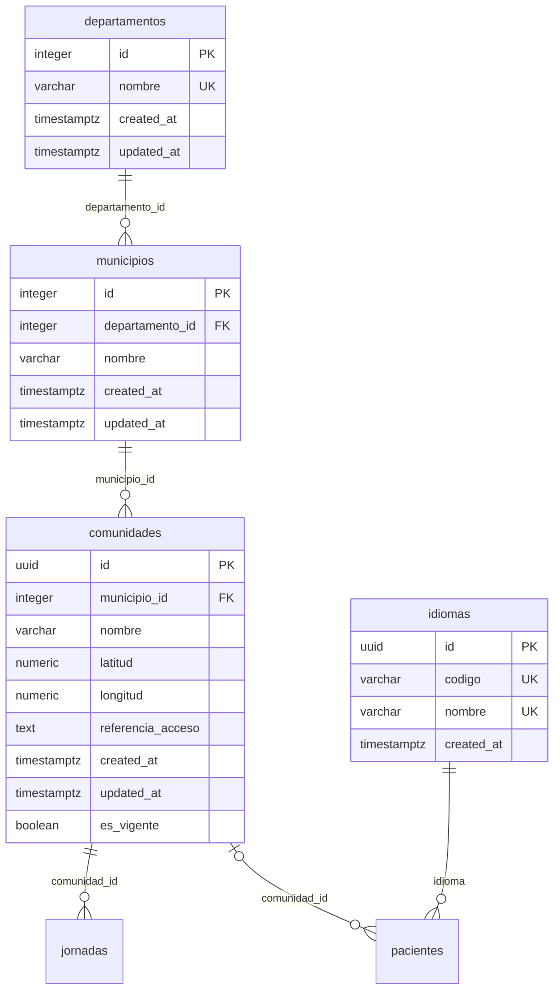
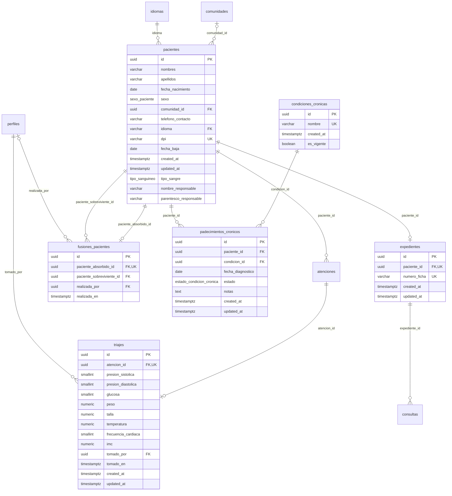
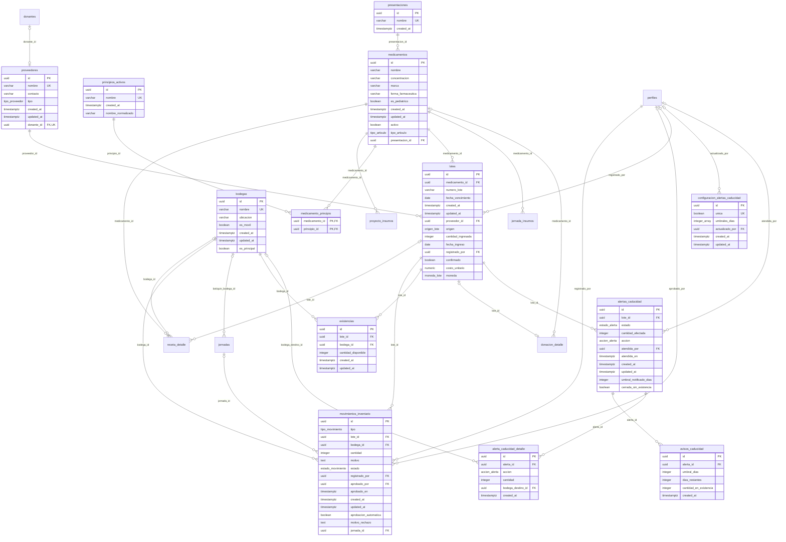
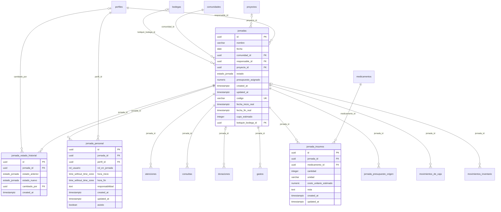
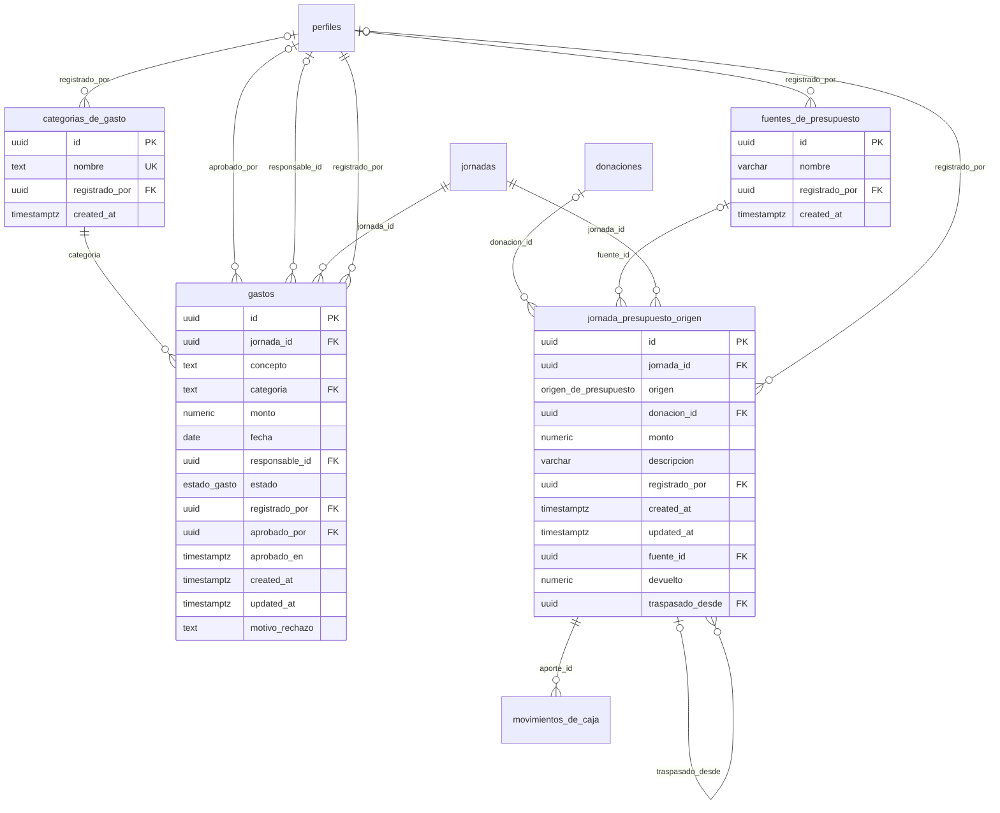
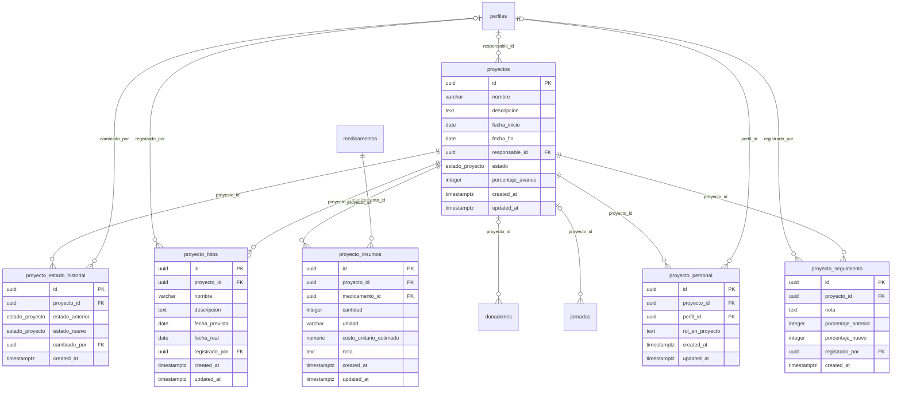
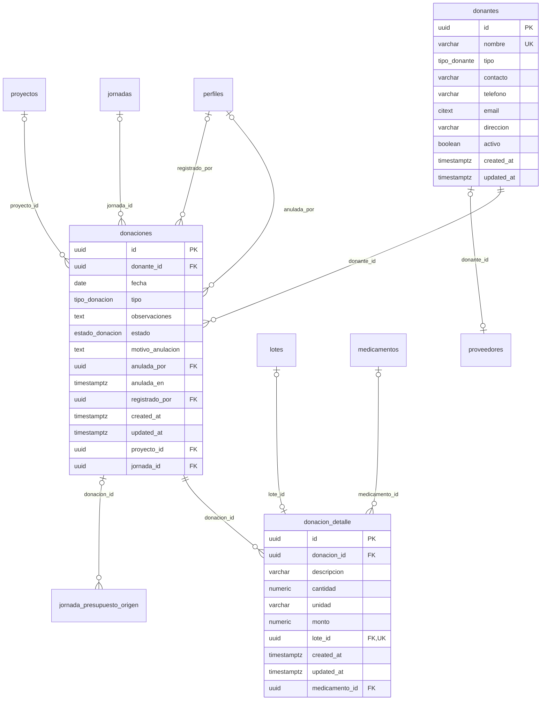
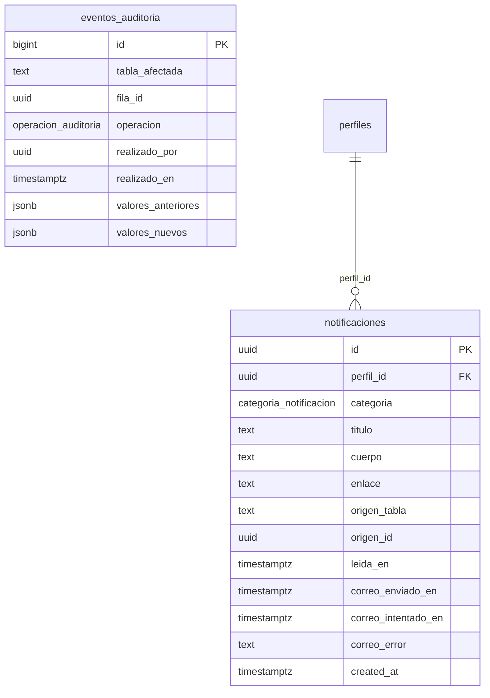
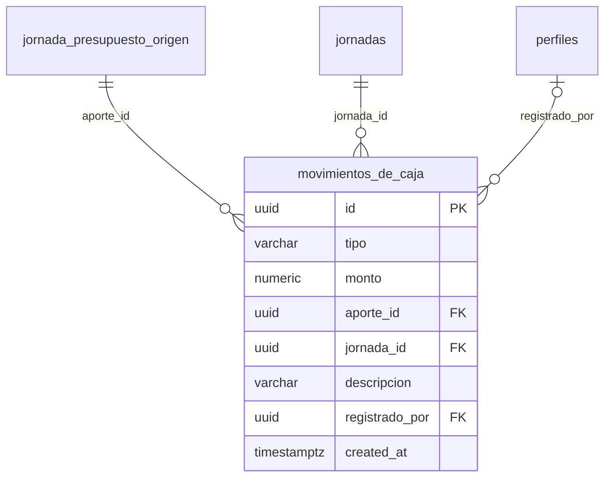

```mermaid
erDiagram
  perfiles {
    uuid id PK,FK
    varchar nombres
    varchar apellidos
    citext email UK
    varchar telefono
    rol_usuario rol
    boolean activo
    date fecha_ingreso
    timestamptz created_at
    timestamptz updated_at
    text direccion
    text notas
  }
  perfil_especialidad {
    uuid perfil_id PK,FK
    varchar nombre_especialidad PK
  }
  permisos {
    uuid id PK
    varchar clave UK
    varchar modulo
    text descripcion
  }
  rol_permiso {
    rol_usuario rol PK
    uuid permiso_id PK,FK
  }
  usuario_permiso {
    uuid perfil_id PK,FK
    uuid permiso_id PK,FK
    boolean concedido
    uuid otorgado_por FK
    text motivo
  }
  rol_modulo {
    uuid id PK
    rol_usuario rol
    varchar modulo
    uuid otorgado_por FK
    timestamptz otorgado_en
  }
  limites_de_uso {
    text recurso PK
    uuid actor_id PK
    integer contador
    timestamptz ventana_inicio
  }
  perfiles |o--o{ alertas_caducidad : "atendida_por"
  perfiles |o--o{ categorias_de_gasto : "registrado_por"
  perfiles |o--o{ configuracion_alertas_caducidad : "actualizado_por"
  perfiles ||--o{ consultas : "medico_id"
  perfiles |o--o{ donaciones : "anulada_por"
  perfiles |o--o{ donaciones : "registrado_por"
  perfiles |o--o{ fuentes_de_presupuesto : "registrado_por"
  perfiles |o--o{ fusiones_pacientes : "realizada_por"
  perfiles |o--o{ gastos : "aprobado_por"
  perfiles |o--o{ gastos : "responsable_id"
  perfiles ||--o{ gastos : "registrado_por"
  perfiles |o--o{ jornada_estado_historial : "cambiado_por"
  perfiles ||--o{ jornada_personal : "perfil_id"
  perfiles |o--o{ jornada_presupuesto_origen : "registrado_por"
  perfiles ||--o{ jornadas : "responsable_id"
  perfiles |o--o{ lotes : "registrado_por"
  perfiles |o--o{ movimientos_de_caja : "registrado_por"
  perfiles |o--o{ movimientos_inventario : "aprobado_por"
  perfiles ||--o{ movimientos_inventario : "registrado_por"
  perfiles ||--o{ notificaciones : "perfil_id"
  perfiles ||--o{ perfil_especialidad : "perfil_id"
  users ||--o| perfiles : "id"
  perfiles |o--o{ proyecto_estado_historial : "cambiado_por"
  perfiles |o--o{ proyecto_hitos : "registrado_por"
  perfiles ||--o{ proyecto_personal : "perfil_id"
  perfiles |o--o{ proyecto_seguimiento : "registrado_por"
  perfiles |o--o{ proyectos : "responsable_id"
  perfiles |o--o{ receta_detalle : "ajustada_por"
  perfiles |o--o{ recetas : "anulada_por"
  perfiles ||--o{ recetas : "medico_id"
  perfiles |o--o{ rol_modulo : "otorgado_por"
  permisos ||--o{ rol_permiso : "permiso_id"
  perfiles ||--o{ triajes : "tomado_por"
  perfiles |o--o{ usuario_permiso : "otorgado_por"
  perfiles ||--o{ usuario_permiso : "perfil_id"
  permisos ||--o{ usuario_permiso : "permiso_id"
```

# Diccionario de datos

> **Documento generado.** No se edita a mano: sale de `npm run docs:diccionario` (`scripts/generar-diccionario-de-datos.mjs`), que lee el catalogo de PostgreSQL de una base con todas las migraciones aplicadas, hasta la `00178_bodega_movil_obligatoria_y_carga_de_la_jornada.sql`. Las descripciones son los `COMMENT ON` de las migraciones: si falta una, se agrega con una migracion nueva y se regenera.

Complementa a [MODELO-DE-DATOS.md](MODELO-DE-DATOS.md), que explica el porque de cada decision, y a [PERMISOS.md](PERMISOS.md), que explica que puede hacer cada rol. Este documento es la referencia exhaustiva: cada tabla, cada campo, cada restriccion, cada politica y cada trigger.

## Resumen

| Objeto | Cantidad |
| --- | --- |
| Tablas | 56 |
| Tablas con RLS activo | 56 |
| Vistas | 9 |
| Tipos enumerados | 22 |
| Columnas (tablas y vistas) | 507 |
| Llaves foraneas | 100 |
| Restricciones CHECK | 65 |
| Politicas RLS | 144 |
| Triggers | 131 |
| Funciones (sin contar las de trigger) | 64 |
| Funciones de trigger | 53 |

### Como leer las tablas de este documento

- **Nulo**: `si` si la columna admite NULL.
- **Por defecto**: el valor que pone la base si el INSERT no lo manda (`auth.uid()` es quien esta conectado).
- **Llaves**: `PK` llave primaria, `FK` llave foranea (con la tabla a la que apunta y que pasa al borrar la fila referida), `UNIQUE` y `CHECK`.
- **Proteccion**: si la tabla tiene Row Level Security, que privilegios tienen los roles `authenticated` (sesion iniciada) y `anon` (sin sesion) y cada politica, con su condicion `USING` (que filas se ven o se tocan) y `WITH CHECK` (que filas se pueden dejar escritas).
- **Triggers**: la logica que corre la base sola al escribir, con la funcion que ejecuta.

## Indice por modulo

### Usuarios, roles y permisos

| Tabla | Descripcion |
| --- | --- |
| [`perfiles`](#perfiles) | Persona que usa el sistema. Una fila por cuenta de auth.users (mismo id), creada por trigger al invitarla. Su rol decide que modulos ve y que puede hacer. |
| [`perfil_especialidad`](#perfil_especialidad) | Especialidades clinicas de un perfil (medicina general, odontologia, ...). Una persona puede tener varias. |
| [`permisos`](#permisos) | Catalogo de permisos finos que se pueden delegar por rol (rol_permiso) o por persona (usuario_permiso). Ver docs/PERMISOS.md. |
| [`rol_permiso`](#rol_permiso) | Permisos finos que un rol tiene por defecto. |
| [`usuario_permiso`](#usuario_permiso) | Excepciones por persona sobre los permisos de su rol: conceder uno que el rol no trae o revocar uno que si trae. |
| [`rol_modulo`](#rol_modulo) | Modulos que la administradora abrio a un rol ademas de los suyos (matriz de acceso, web). Abrir es de solo lectura: las politicas de escritura no miran esta tabla. |
| [`limites_de_uso`](#limites_de_uso) | Contador de limite de peticiones (rate limiting) por recurso y actor, con ventana de tiempo fija que se reinicia sola al expirar (issue #761). recurso identifica que se limita ('invitar_usuario', 'buscar_pacientes'); actor_id es quien lo dispara. No expuesta a PostgREST ni a ningun rol de aplicacion: solo la tocan las funciones SECURITY DEFINER de esta migracion. |

### Territorio y catalogos generales

| Tabla | Descripcion |
| --- | --- |
| [`departamentos`](#departamentos) | Los 22 departamentos de Guatemala. Catalogo fijo, cargado por migracion. |
| [`municipios`](#municipios) | Municipios de Guatemala, cada uno en su departamento. Catalogo fijo, cargado por migracion. |
| [`comunidades`](#comunidades) | Aldeas, caserios y colonias donde se hacen jornadas y de donde vienen los pacientes. La organizacion las agrega; no es un catalogo oficial. |
| [`idiomas`](#idiomas) | Catalogo de idiomas del paciente (issue #663). Sustituye al enum idioma_preferido de la 00001, que obligaba a una migracion por cada idioma nuevo. pacientes.idioma referencia codigo, no id, para que las pruebas y las semillas que ya escriben el valor por su nombre sigan siendo validas. Agregar un idioma es un INSERT. |

### Pacientes y expediente

| Tabla | Descripcion |
| --- | --- |
| [`pacientes`](#pacientes) | Personas atendidas en las jornadas. Datos personales sensibles: solo los lee el personal que atiende (ver docs/PROTECCION-DE-DATOS.md). |
| [`expedientes`](#expedientes) | Expediente clinico de un paciente: uno por paciente, con su numero de ficha. Las consultas cuelgan de el. |
| [`fusiones_pacientes`](#fusiones_pacientes) | Registra que expediente absorbio a cual (issue #140). Se escribe solo por fn_fusionar_pacientes; sin politicas de escritura. |
| [`padecimientos_cronicos`](#padecimientos_cronicos) | Condiciones cronicas de un paciente, con su fecha de diagnostico y si siguen activas. |
| [`condiciones_cronicas`](#condiciones_cronicas) | Catalogo de condiciones cronicas que se registran en los pacientes (diabetes, hipertension, ...). |
| [`triajes`](#triajes) | Signos vitales tomados a un paciente en una atencion, antes de la consulta. |

### Atencion clinica: consultas, diagnosticos y recetas

| Tabla | Descripcion |
| --- | --- |
| [`atenciones`](#atenciones) | La visita de un paciente a una jornada: se abre al recibirlo y se cierra al terminar. Los signos vitales, la consulta y la receta cuelgan de ella. |
| [`consultas`](#consultas) | Consulta medica de una atencion: motivo, sintomas, exploracion, diagnosticos y tratamiento. |
| [`diagnosticos`](#diagnosticos) | Catalogo de diagnosticos que se eligen en la consulta. La organizacion lo amplia; un diagnostico se desactiva, no se borra. |
| [`consulta_diagnostico`](#consulta_diagnostico) | Diagnosticos de una consulta; uno puede marcarse como principal. |
| [`recetas`](#recetas) | Receta emitida en una consulta. Se anula, no se borra: queda con su motivo y quien la anulo. |
| [`receta_detalle`](#receta_detalle) | Renglones de una receta: cada medicamento, su dosis y cuanto se entrego, de que lote. |

### Inventario de medicamentos e insumos

| Tabla | Descripcion |
| --- | --- |
| [`medicamentos`](#medicamentos) | Catalogo de articulos del inventario: medicamentos e insumos. Un articulo se desactiva, no se borra. |
| [`principios_activos`](#principios_activos) | Catalogo de principios activos (paracetamol, amoxicilina, ...). |
| [`medicamento_principio`](#medicamento_principio) | Principios activos de cada medicamento (un medicamento puede tener varios). |
| [`presentaciones`](#presentaciones) | Catalogo de presentaciones de un articulo (caja, frasco, blister, ...). |
| [`bodegas`](#bodegas) | Lugares donde se guarda inventario: la bodega central y los botiquines moviles que viajan a las jornadas. |
| [`proveedores`](#proveedores) | Proveedores y donantes de los que entra inventario. |
| [`lotes`](#lotes) | Lote de un articulo: numero, vencimiento, de donde vino y cuanto entro. Lo disponible por bodega esta en existencias. |
| [`existencias`](#existencias) | Cuanto hay de cada lote en cada bodega. La mantienen los movimientos aprobados; nadie la escribe a mano. |
| [`movimientos_inventario`](#movimientos_inventario) | Ingresos y salidas de inventario. Un movimiento pendiente no cambia existencias; al aprobarse, si. |
| [`alertas_caducidad`](#alertas_caducidad) | Alerta de un lote vencido o por vencer. La genera la rutina diaria y se atiende donando, reubicando o descartando. |
| [`alerta_caducidad_detalle`](#alerta_caducidad_detalle) | Como se reparte la atencion de una alerta entre varias acciones (por ejemplo, parte donada y parte descartada). |
| [`avisos_caducidad`](#avisos_caducidad) | Cada aviso de vencimiento enviado: uno por alerta y por etapa (antelacion configurada o dia del vencimiento). Su INSERT genera la notificacion a la administracion (issue #899). |
| [`configuracion_alertas_caducidad`](#configuracion_alertas_caducidad) | Antelaciones con las que se avisa que un lote va a vencer (issue #899). Una sola fila. El aviso del dia del vencimiento no se configura: siempre se envia. La cambia la administracion, o quien tenga el permiso inventario.configurar_alertas, desde la web. |

### Jornadas

| Tabla | Descripcion |
| --- | --- |
| [`jornadas`](#jornadas) | Jornada medica o dental en una comunidad: su fecha, responsable, estado, presupuesto y, si lo tiene, el proyecto al que pertenece. |
| [`jornada_personal`](#jornada_personal) | Equipo de una jornada: quien va, con que rol, en que horario y si asistio. |
| [`jornada_estado_historial`](#jornada_estado_historial) | Cada cambio de estado de una jornada, con quien lo hizo. Lo escribe un trigger. |
| [`jornada_insumos`](#jornada_insumos) | Articulos del catalogo de inventario PREVISTOS para una jornada: cantidad, unidad y costo unitario estimado. Lista de planificacion: no descuenta ni reserva existencias (mismo criterio que proyecto_insumos, 00147). |

### Presupuestos y gastos

| Tabla | Descripcion |
| --- | --- |
| [`gastos`](#gastos) | Gasto de una jornada. Se registra pendiente y lo aprueba o rechaza quien administra presupuestos. |
| [`categorias_de_gasto`](#categorias_de_gasto) | Categorias de gasto (00158). Catalogo que crece desde el formulario de gasto ("Crear categoria nueva"); reemplaza al enum categoria_gasto. |
| [`fuentes_de_presupuesto`](#fuentes_de_presupuesto) | Quien aporta de fuera al presupuesto de una jornada (origen aporte_externo). Catalogo que crece desde "Registrar un aporte". |
| [`jornada_presupuesto_origen`](#jornada_presupuesto_origen) | De donde viene cada parte del presupuesto de una jornada (issue #840). jornadas.presupuesto_asignado es la suma de estas filas y la mantiene fn_sincronizar_presupuesto_de_jornada; nadie la escribe a mano. |

### Proyectos sociales

| Tabla | Descripcion |
| --- | --- |
| [`proyectos`](#proyectos) | Proyecto social que agrupa jornadas: su equipo, gastos e insumos salen de ellas. Uno cancelado ya no se modifica (00154). |
| [`proyecto_hitos`](#proyecto_hitos) | Hitos de un proyecto social. Un hito esta pendiente mientras fecha_real sea nula. |
| [`proyecto_seguimiento`](#proyecto_seguimiento) | Bitacora de un proyecto: notas escritas a mano y cambios de porcentaje de avance, estos ultimos anotados por trigger. No lleva updated_at ni politicas de UPDATE o DELETE porque una bitacora no se corrige, se anota encima. |
| [`proyecto_estado_historial`](#proyecto_estado_historial) | Cada cambio de estado de un proyecto, con quien lo hizo. Lo escribe un trigger. |
| [`proyecto_personal`](#proyecto_personal) | Equipo de un proyecto: quien participa en el, con una funcion opcional (rol_en_proyecto). No es jornada_personal (00012): aquel es el cuadro de turnos de una jornada y este es la gente del proyecto, este o no en el turno de alguna de sus jornadas. |
| [`proyecto_insumos`](#proyecto_insumos) | Articulos (medicamentos o insumos del catalogo de inventario) PREVISTOS para un proyecto: su cantidad, unidad y costo unitario estimado. Es una lista de planificacion: NO descuenta ni reserva existencias ni crea movimientos de inventario (ver la cabecera de la 00147). |

### Donaciones

| Tabla | Descripcion |
| --- | --- |
| [`donantes`](#donantes) | Personas u organizaciones que donan. Se dan de baja, no se borran. |
| [`donaciones`](#donaciones) | Donacion recibida: de quien, cuando, de que tipo y, opcionalmente, para que proyecto o jornada. Se anula, no se borra. |
| [`donacion_detalle`](#donacion_detalle) | Renglones de una donacion: que se dono y cuanto. Un renglon de medicamentos puede enlazarse al lote que se creo al ingresarlo a inventario. |

### Notificaciones y auditoria

| Tabla | Descripcion |
| --- | --- |
| [`notificaciones`](#notificaciones) | Buzon interno de cada perfil y bandeja de salida del correo (issue #755). Una fila por incidencia y por destinatario. Solo la escriben los triggers de esta migracion; cada perfil lee las suyas y solo puede cambiar leida_en. |
| [`eventos_auditoria`](#eventos_auditoria) | Bitacora de cambios sobre informacion sensible. Se escribe solo por trigger y solo la lee la administradora. Sin politicas de INSERT, UPDATE ni DELETE: con RLS habilitado, lo que no tiene politica esta prohibido. No se usa FORCE ROW LEVEL SECURITY porque el dueno debe seguir eximido para que los triggers SECURITY DEFINER puedan insertar. |

### Otras

| Tabla | Descripcion |
| --- | --- |
| [`movimientos_de_caja`](#movimientos_de_caja) | Libro de la caja (00168): entra el sobrante devuelto de los aportes que no son de una donacion y sale lo que se asigna a una jornada con origen caja. Lo escriben fn_liquidar_sobrante_de_jornada y un trigger de jornada_presupuesto_origen; nadie a mano. |

## Diagramas entidad-relacion

Un diagrama por modulo, con todas las columnas de sus tablas. Las tablas de otros modulos a las que apuntan aparecen solo con su nombre. `||` es obligatorio, `|o` opcional (FK que admite NULL); `o{` es "muchos" y `o|` "a lo sumo uno" (FK unica). GitHub dibuja los bloques `mermaid`.

### Usuarios, roles y permisos

### Territorio y catalogos generales

### Pacientes y expediente

### Atencion clinica: consultas, diagnosticos y recetas

### Inventario de medicamentos e insumos

### Jornadas

### Presupuestos y gastos

### Proyectos sociales

### Donaciones

### Notificaciones y auditoria

### Otras

## Tablas

### Modulo: Usuarios, roles y permisos

#### perfiles

Persona que usa el sistema. Una fila por cuenta de auth.users (mismo id), creada por trigger al invitarla. Su rol decide que modulos ve y que puede hacer.

| Campo | Tipo | Nulo | Por defecto | Llave | Descripcion |
| --- | --- | --- | --- | --- | --- |
| `id` | `uuid` | no |  | PK, FK -> `users` | Identificador de la fila. Lo genera la base. |
| `nombres` | `varchar(100)` | no |  |  | Nombres de la persona. |
| `apellidos` | `varchar(100)` | no |  |  | Apellidos de la persona. |
| `email` | `citext` | no |  |  | Correo con el que inicia sesion; unico, sin distinguir mayusculas (citext). |
| `telefono` | `varchar(20)` | si |  |  | Telefono de contacto. Solo lo ven la administradora y la propia persona (perfiles_directorio lo enmascara). |
| `rol` | `rol_usuario` | no | `'voluntario general'::rol_usuario` |  | Rol en el sistema (rol_usuario). Decide modulos y permisos por defecto. |
| `activo` | `boolean` | no | `true` |  | FALSE = cuenta desactivada: no inicia sesion ni tiene privilegios. Se desactiva, no se borra. |
| `fecha_ingreso` | `date` | si |  |  | Desde cuando colabora con la organizacion. |
| `created_at` | `timestamptz` | no | `now()` |  | Cuando se creo la fila. Lo pone la base. |
| `updated_at` | `timestamptz` | no | `now()` |  | Cuando se modifico la fila por ultima vez. Lo mantiene el trigger actualizar_timestamp_updated_at. |
| `direccion` | `text` | si |  |  | Direccion de contacto en texto libre (ej. "Zona 10, Guatemala"). Nulable: dato opcional, sin formulario que lo escriba todavia. |
| `notas` | `text` | si |  |  | Notas internas sobre la persona (ej. disponibilidad, rol dentro del equipo). Nulable: dato opcional, sin formulario que lo escriba todavia. |

**Llaves y restricciones**

| Nombre | Tipo | Definicion |
| --- | --- | --- |
| `perfiles_id_fkey` | FK | `FOREIGN KEY (id) REFERENCES auth.users(id) ON DELETE CASCADE` (al borrar: CASCADE) |
| `perfiles_pkey` | PK | `PRIMARY KEY (id)` |
| `perfiles_email_key` | UNIQUE | `UNIQUE (email)` |

**La referencian:** `alertas_caducidad.atendida_por` (RESTRICT), `categorias_de_gasto.registrado_por` (SET NULL), `configuracion_alertas_caducidad.actualizado_por` (SET NULL), `consultas.medico_id` (RESTRICT), `donaciones.anulada_por` (RESTRICT), `donaciones.registrado_por` (RESTRICT), `fuentes_de_presupuesto.registrado_por` (SET NULL), `fusiones_pacientes.realizada_por` (RESTRICT), `gastos.aprobado_por` (RESTRICT), `gastos.responsable_id` (SET NULL), `gastos.registrado_por` (RESTRICT), `jornada_estado_historial.cambiado_por` (RESTRICT), `jornada_personal.perfil_id` (CASCADE), `jornada_presupuesto_origen.registrado_por` (SET NULL), `jornadas.responsable_id` (RESTRICT), `lotes.registrado_por` (NO ACTION), `movimientos_de_caja.registrado_por` (SET NULL), `movimientos_inventario.aprobado_por` (RESTRICT), `movimientos_inventario.registrado_por` (RESTRICT), `notificaciones.perfil_id` (CASCADE), `perfil_especialidad.perfil_id` (CASCADE), `proyecto_estado_historial.cambiado_por` (RESTRICT), `proyecto_hitos.registrado_por` (SET NULL), `proyecto_personal.perfil_id` (CASCADE), `proyecto_seguimiento.registrado_por` (SET NULL), `proyectos.responsable_id` (SET NULL), `receta_detalle.ajustada_por` (RESTRICT), `recetas.anulada_por` (RESTRICT), `recetas.medico_id` (RESTRICT), `rol_modulo.otorgado_por` (SET NULL), `triajes.tomado_por` (RESTRICT), `usuario_permiso.otorgado_por` (NO ACTION), `usuario_permiso.perfil_id` (CASCADE).

**Proteccion.** RLS activo. Privilegios: `authenticated`: INSERT, SELECT, UPDATE; `anon`: ninguno.

| Politica | Operacion | Roles | USING | WITH CHECK |
| --- | --- | --- | --- | --- |
| Solo administrador crea perfiles | Crear | public |  | `es_administrador()` |
| Administrador o el propio perfil leen perfiles | Leer | public | `(es_administrador() OR (id = auth.uid()))` |  |
| Administrador, o el propio perfil si sigue activo, editan perfi | Editar | public | `(es_administrador() OR ((id = auth.uid()) AND activo))` | `(es_administrador() OR ((id = auth.uid()) AND activo))` |

**Triggers**

| Trigger | Cuando | Funcion |
| --- | --- | --- |
| `trg_perfiles_auditoria` | AFTER INSERT OR DELETE OR UPDATE | `registrar_evento_auditoria()` |
| `trg_perfiles_impedir_autodesactivacion` | BEFORE UPDATE | `impedir_autodesactivacion()` |
| `trg_perfiles_impedir_borrar_ultimo_administrador` | BEFORE DELETE | `impedir_borrar_ultimo_administrador()` |
| `trg_perfiles_impedir_cambio_de_rol_propio` | BEFORE UPDATE | `impedir_cambio_de_rol_propio()` |
| `trg_perfiles_impedir_ultimo_administrador` | BEFORE UPDATE | `impedir_dejar_sin_administrador_activo()` |
| `trg_perfiles_updated_at` | BEFORE UPDATE | `actualizar_timestamp_updated_at()` |

#### perfil_especialidad

Especialidades clinicas de un perfil (medicina general, odontologia, ...). Una persona puede tener varias.

| Campo | Tipo | Nulo | Por defecto | Llave | Descripcion |
| --- | --- | --- | --- | --- | --- |
| `perfil_id` | `uuid` | no |  | PK, FK -> `perfiles` | Perfil al que pertenece la especialidad. |
| `nombre_especialidad` | `varchar(100)` | no |  | PK | Nombre de la especialidad. |

**Llaves y restricciones**

| Nombre | Tipo | Definicion |
| --- | --- | --- |
| `perfil_especialidad_perfil_id_fkey` | FK | `FOREIGN KEY (perfil_id) REFERENCES perfiles(id) ON DELETE CASCADE` (al borrar: CASCADE) |
| `perfil_especialidad_pkey` | PK | `PRIMARY KEY (perfil_id, nombre_especialidad)` |

**Proteccion.** RLS activo. Privilegios: `authenticated`: DELETE, INSERT, SELECT; `anon`: ninguno.

| Politica | Operacion | Roles | USING | WITH CHECK |
| --- | --- | --- | --- | --- |
| Administrador o el propio perfil borran sus especialidades | Borrar | authenticated | `(es_administrador() OR (perfil_id = auth.uid()))` |  |
| Administrador o el propio perfil registran sus especialidades | Crear | authenticated |  | `(es_administrador() OR (perfil_id = auth.uid()))` |
| Administrador o el propio perfil leen sus especialidades | Leer | authenticated | `(es_administrador() OR (perfil_id = auth.uid()) OR accede_a_modulo_por_matriz('colaboradores'::text))` |  |

**Triggers**

| Trigger | Cuando | Funcion |
| --- | --- | --- |
| `trg_perfil_especialidad_auditoria` | AFTER INSERT OR DELETE OR UPDATE | `registrar_evento_auditoria()` |

#### permisos

Catalogo de permisos finos que se pueden delegar por rol (rol_permiso) o por persona (usuario_permiso). Ver docs/PERMISOS.md.

| Campo | Tipo | Nulo | Por defecto | Llave | Descripcion |
| --- | --- | --- | --- | --- | --- |
| `id` | `uuid` | no | `extensions.gen_random_uuid()` | PK | Identificador de la fila. Lo genera la base. |
| `clave` | `varchar(100)` | no |  |  | Clave estable del permiso, con la forma modulo.accion (por ejemplo proyectos.gestionar). La usa tiene_permiso(). |
| `modulo` | `varchar(50)` | no |  |  | Modulo al que pertenece el permiso. |
| `descripcion` | `text` | si |  |  | Que habilita el permiso, en palabras de la organizacion. |

**Llaves y restricciones**

| Nombre | Tipo | Definicion |
| --- | --- | --- |
| `permisos_pkey` | PK | `PRIMARY KEY (id)` |
| `permisos_clave_key` | UNIQUE | `UNIQUE (clave)` |

**La referencian:** `rol_permiso.permiso_id` (CASCADE), `usuario_permiso.permiso_id` (CASCADE).

**Proteccion.** RLS activo. Privilegios: `authenticated`: SELECT; `anon`: ninguno.

| Politica | Operacion | Roles | USING | WITH CHECK |
| --- | --- | --- | --- | --- |
| Sesion activa lee permisos | Leer | authenticated | `(rol_actual() IS NOT NULL)` |  |

#### rol_permiso

Permisos finos que un rol tiene por defecto.

| Campo | Tipo | Nulo | Por defecto | Llave | Descripcion |
| --- | --- | --- | --- | --- | --- |
| `rol` | `rol_usuario` | no |  | PK | Rol que recibe el permiso. |
| `permiso_id` | `uuid` | no |  | PK, FK -> `permisos` | Permiso que recibe. |

**Llaves y restricciones**

| Nombre | Tipo | Definicion |
| --- | --- | --- |
| `rol_permiso_permiso_id_fkey` | FK | `FOREIGN KEY (permiso_id) REFERENCES permisos(id) ON DELETE CASCADE` (al borrar: CASCADE) |
| `rol_permiso_pkey` | PK | `PRIMARY KEY (rol, permiso_id)` |

**Proteccion.** RLS activo. Privilegios: `authenticated`: SELECT; `anon`: ninguno.

| Politica | Operacion | Roles | USING | WITH CHECK |
| --- | --- | --- | --- | --- |
| Sesion activa lee rol_permiso | Leer | authenticated | `(rol_actual() IS NOT NULL)` |  |

**Triggers**

| Trigger | Cuando | Funcion |
| --- | --- | --- |
| `trg_rol_permiso_auditoria` | AFTER INSERT OR DELETE | `registrar_evento_auditoria_rol_permiso()` |

#### usuario_permiso

Excepciones por persona sobre los permisos de su rol: conceder uno que el rol no trae o revocar uno que si trae.

| Campo | Tipo | Nulo | Por defecto | Llave | Descripcion |
| --- | --- | --- | --- | --- | --- |
| `perfil_id` | `uuid` | no |  | PK, FK -> `perfiles` | Persona a la que se le hace la excepcion. |
| `permiso_id` | `uuid` | no |  | PK, FK -> `permisos` | Permiso concedido o revocado. |
| `concedido` | `boolean` | no |  |  | TRUE concede el permiso; FALSE lo revoca de forma explicita aunque el rol lo traiga. |
| `otorgado_por` | `uuid` | si |  | FK -> `perfiles` | Quien hizo la excepcion. |
| `motivo` | `text` | si |  |  | Por que se hizo, opcional. |

**Llaves y restricciones**

| Nombre | Tipo | Definicion |
| --- | --- | --- |
| `usuario_permiso_otorgado_por_fkey` | FK | `FOREIGN KEY (otorgado_por) REFERENCES perfiles(id)` (al borrar: NO ACTION) |
| `usuario_permiso_perfil_id_fkey` | FK | `FOREIGN KEY (perfil_id) REFERENCES perfiles(id) ON DELETE CASCADE` (al borrar: CASCADE) |
| `usuario_permiso_permiso_id_fkey` | FK | `FOREIGN KEY (permiso_id) REFERENCES permisos(id) ON DELETE CASCADE` (al borrar: CASCADE) |
| `usuario_permiso_pkey` | PK | `PRIMARY KEY (perfil_id, permiso_id)` |

**Proteccion.** RLS activo. Privilegios: `authenticated`: DELETE, INSERT, SELECT, UPDATE; `anon`: ninguno.

| Politica | Operacion | Roles | USING | WITH CHECK |
| --- | --- | --- | --- | --- |
| Solo administrador borra usuario_permiso | Borrar | public | `(es_administrador() OR (tiene_permiso('usuarios.gestionar_permisos'::text) AND (perfil_id <> auth.uid())))` |  |
| Solo administrador escribe usuario_permiso | Crear | public |  | `(es_administrador() OR (tiene_permiso('usuarios.gestionar_permisos'::text) AND (perfil_id <> auth.uid())))` |
| Administrador o el propio perfil leen usuario_permiso | Leer | public | `(es_administrador() OR (perfil_id = auth.uid()) OR tiene_permiso('usuarios.gestionar_permisos'::text))` |  |
| Solo administrador actualiza usuario_permiso | Editar | public | `(es_administrador() OR (tiene_permiso('usuarios.gestionar_permisos'::text) AND (perfil_id <> auth.uid())))` | `(es_administrador() OR (tiene_permiso('usuarios.gestionar_permisos'::text) AND (perfil_id <> auth.uid())))` |

**Triggers**

| Trigger | Cuando | Funcion |
| --- | --- | --- |
| `trg_usuario_permiso_auditoria` | AFTER INSERT OR DELETE OR UPDATE | `registrar_evento_auditoria_usuario_permiso()` |
| `trg_usuario_permiso_impedir_escalada_consultivo` | BEFORE INSERT OR UPDATE | `impedir_permiso_escritura_a_consultivo()` |

#### rol_modulo

Modulos que la administradora abrio a un rol ademas de los suyos (matriz de acceso, web). Abrir es de solo lectura: las politicas de escritura no miran esta tabla.

| Campo | Tipo | Nulo | Por defecto | Llave | Descripcion |
| --- | --- | --- | --- | --- | --- |
| `id` | `uuid` | no | `extensions.gen_random_uuid()` | PK | Identificador de la fila. Lo genera la base. |
| `rol` | `rol_usuario` | no |  |  | Rol al que se le abre el modulo. |
| `modulo` | `varchar(50)` | no |  |  | Modulo de la navegacion que se abre (id de MODULOS en packages/shared/navegacion.js). |
| `otorgado_por` | `uuid` | si | `auth.uid()` | FK -> `perfiles` | Quien lo abrio. |
| `otorgado_en` | `timestamptz` | no | `now()` |  | Cuando se abrio. |

**Llaves y restricciones**

| Nombre | Tipo | Definicion |
| --- | --- | --- |
| `chk_rol_modulo_modulo` | CHECK | `CHECK (((modulo)::text = ANY ((ARRAY['pacientes'::character varying, 'inventario'::character varying, 'jornadas'::character varying, 'proyectos'::character varying, 'presupuestos'::character varying, 'donaciones'::character varying, 'reportes'::character varying, 'colaboradores'::character varying])::text[])))` |
| `chk_rol_modulo_no_por_defecto` | CHECK | `CHECK ((NOT modulo_por_defecto(rol, (modulo)::text)))` |
| `rol_modulo_otorgado_por_fkey` | FK | `FOREIGN KEY (otorgado_por) REFERENCES perfiles(id) ON DELETE SET NULL` (al borrar: SET NULL) |
| `rol_modulo_pkey` | PK | `PRIMARY KEY (id)` |
| `uq_rol_modulo` | UNIQUE | `UNIQUE (rol, modulo)` |

**Proteccion.** RLS activo. Privilegios: `authenticated`: DELETE, INSERT, SELECT; `anon`: ninguno.

| Politica | Operacion | Roles | USING | WITH CHECK |
| --- | --- | --- | --- | --- |
| Solo administrador retira modulos | Borrar | public | `es_administrador()` |  |
| Solo administrador concede modulos | Crear | public |  | `es_administrador()` |
| Sesion activa lee rol_modulo | Leer | public | `(rol_actual() IS NOT NULL)` |  |

**Triggers**

| Trigger | Cuando | Funcion |
| --- | --- | --- |
| `trg_rol_modulo_auditoria` | AFTER INSERT OR DELETE | `registrar_evento_auditoria()` |

#### limites_de_uso

Contador de limite de peticiones (rate limiting) por recurso y actor, con ventana de tiempo fija que se reinicia sola al expirar (issue #761). recurso identifica que se limita ('invitar_usuario', 'buscar_pacientes'); actor_id es quien lo dispara. No expuesta a PostgREST ni a ningun rol de aplicacion: solo la tocan las funciones SECURITY DEFINER de esta migracion.

| Campo | Tipo | Nulo | Por defecto | Llave | Descripcion |
| --- | --- | --- | --- | --- | --- |
| `recurso` | `text` | no |  | PK | Que se limita (por ejemplo invitaciones o busqueda de pacientes). |
| `actor_id` | `uuid` | no |  | PK | Perfil al que se le cuentan las peticiones. |
| `contador` | `integer` | no | `1` |  | Peticiones hechas dentro de la ventana actual. |
| `ventana_inicio` | `timestamptz` | no | `now()` |  | Cuando empezo la ventana de tiempo que se esta contando. |

**Llaves y restricciones**

| Nombre | Tipo | Definicion |
| --- | --- | --- |
| `limites_de_uso_pkey` | PK | `PRIMARY KEY (recurso, actor_id)` |

**Proteccion.** RLS activo. Privilegios: `authenticated`: ninguno; `anon`: ninguno.

Sin politicas: con RLS activo y ninguna politica, nadie la lee ni la escribe directamente; solo funciones SECURITY DEFINER.

### Modulo: Territorio y catalogos generales

#### departamentos

Los 22 departamentos de Guatemala. Catalogo fijo, cargado por migracion.

| Campo | Tipo | Nulo | Por defecto | Llave | Descripcion |
| --- | --- | --- | --- | --- | --- |
| `id` | `integer` | no |  | PK | Identificador de la fila. Lo genera la base. |
| `nombre` | `varchar(100)` | no |  |  | Nombre del departamento. |
| `created_at` | `timestamptz` | no | `now()` |  | Cuando se creo la fila. Lo pone la base. |
| `updated_at` | `timestamptz` | no | `now()` |  | Cuando se modifico la fila por ultima vez. Lo mantiene el trigger actualizar_timestamp_updated_at. |

**Llaves y restricciones**

| Nombre | Tipo | Definicion |
| --- | --- | --- |
| `departamentos_pkey` | PK | `PRIMARY KEY (id)` |
| `departamentos_nombre_key` | UNIQUE | `UNIQUE (nombre)` |

**La referencian:** `municipios.departamento_id` (CASCADE).

**Proteccion.** RLS activo. Privilegios: `authenticated`: SELECT; `anon`: ninguno.

| Politica | Operacion | Roles | USING | WITH CHECK |
| --- | --- | --- | --- | --- |
| Sesion activa lee departamentos | Leer | public | `(rol_actual() IS NOT NULL)` |  |

**Triggers**

| Trigger | Cuando | Funcion |
| --- | --- | --- |
| `trg_departamentos_updated_at` | BEFORE UPDATE | `actualizar_timestamp_updated_at()` |

#### municipios

Municipios de Guatemala, cada uno en su departamento. Catalogo fijo, cargado por migracion.

| Campo | Tipo | Nulo | Por defecto | Llave | Descripcion |
| --- | --- | --- | --- | --- | --- |
| `id` | `integer` | no |  | PK | Identificador de la fila. Lo genera la base. |
| `departamento_id` | `integer` | no |  | FK -> `departamentos` | Departamento al que pertenece. |
| `nombre` | `varchar(100)` | no |  |  | Nombre del municipio. |
| `created_at` | `timestamptz` | no | `now()` |  | Cuando se creo la fila. Lo pone la base. |
| `updated_at` | `timestamptz` | no | `now()` |  | Cuando se modifico la fila por ultima vez. Lo mantiene el trigger actualizar_timestamp_updated_at. |

**Llaves y restricciones**

| Nombre | Tipo | Definicion |
| --- | --- | --- |
| `fk_departamentos` | FK | `FOREIGN KEY (departamento_id) REFERENCES departamentos(id) ON DELETE CASCADE` (al borrar: CASCADE) |
| `municipios_pkey` | PK | `PRIMARY KEY (id)` |
| `municipios_departamento_id_nombre_key` | UNIQUE | `UNIQUE (departamento_id, nombre)` |

**La referencian:** `comunidades.municipio_id` (CASCADE).

**Proteccion.** RLS activo. Privilegios: `authenticated`: SELECT; `anon`: ninguno.

| Politica | Operacion | Roles | USING | WITH CHECK |
| --- | --- | --- | --- | --- |
| Sesion activa lee municipios | Leer | public | `(rol_actual() IS NOT NULL)` |  |

**Triggers**

| Trigger | Cuando | Funcion |
| --- | --- | --- |
| `trg_municipios_updated_at` | BEFORE UPDATE | `actualizar_timestamp_updated_at()` |

#### comunidades

Aldeas, caserios y colonias donde se hacen jornadas y de donde vienen los pacientes. La organizacion las agrega; no es un catalogo oficial.

| Campo | Tipo | Nulo | Por defecto | Llave | Descripcion |
| --- | --- | --- | --- | --- | --- |
| `id` | `uuid` | no | `extensions.gen_random_uuid()` | PK | Identificador de la fila. Lo genera la base. |
| `municipio_id` | `integer` | no |  | FK -> `municipios` | Municipio en el que esta la comunidad. |
| `nombre` | `varchar(100)` | no |  |  | Nombre de la comunidad. |
| `latitud` | `numeric(9,6)` | si |  |  | Latitud para ubicarla en el mapa, opcional. |
| `longitud` | `numeric(9,6)` | si |  |  | Longitud para ubicarla en el mapa, opcional. |
| `referencia_acceso` | `text` | si |  |  | Como llegar, en texto libre: una comunidad rural no siempre tiene direccion. |
| `created_at` | `timestamptz` | no | `now()` |  | Cuando se creo la fila. Lo pone la base. |
| `updated_at` | `timestamptz` | no | `now()` |  | Cuando se modifico la fila por ultima vez. Lo mantiene el trigger actualizar_timestamp_updated_at. |
| `es_vigente` | `boolean` | no | `true` |  | FALSE = retirada (borrado logico): ya no se ofrece al elegir, pero conserva su historial. |

**Llaves y restricciones**

| Nombre | Tipo | Definicion |
| --- | --- | --- |
| `comunidades_municipio_id_fkey` | FK | `FOREIGN KEY (municipio_id) REFERENCES municipios(id) ON DELETE CASCADE` (al borrar: CASCADE) |
| `comunidades_pkey` | PK | `PRIMARY KEY (id)` |
| `comunidades_municipio_id_nombre_key` | UNIQUE | `UNIQUE (municipio_id, nombre)` |

**La referencian:** `jornadas.comunidad_id` (RESTRICT), `pacientes.comunidad_id` (RESTRICT).

**Proteccion.** RLS activo. Privilegios: `authenticated`: INSERT, SELECT, UPDATE; `anon`: ninguno.

| Politica | Operacion | Roles | USING | WITH CHECK |
| --- | --- | --- | --- | --- |
| Administrador y personal de campo crean comunidades | Crear | authenticated |  | `(es_administrador() OR es_personal_de_campo())` |
| Sesion activa lee comunidades | Leer | public | `(rol_actual() IS NOT NULL)` |  |
| Administrador y personal de campo actualizan comunidades | Editar | authenticated | `(es_administrador() OR es_personal_de_campo())` | `(es_administrador() OR es_personal_de_campo())` |

**Triggers**

| Trigger | Cuando | Funcion |
| --- | --- | --- |
| `trg_comunidades_auditoria` | AFTER INSERT OR DELETE OR UPDATE | `registrar_evento_auditoria()` |
| `trg_comunidades_updated_at` | BEFORE UPDATE | `actualizar_timestamp_updated_at()` |
| `trg_impedir_retirar_comunidad` | BEFORE UPDATE OF es_vigente | `impedir_retirar_sin_ser_administrador()` |

#### idiomas

Catalogo de idiomas del paciente (issue #663). Sustituye al enum idioma_preferido de la 00001, que obligaba a una migracion por cada idioma nuevo. pacientes.idioma referencia codigo, no id, para que las pruebas y las semillas que ya escriben el valor por su nombre sigan siendo validas. Agregar un idioma es un INSERT.

| Campo | Tipo | Nulo | Por defecto | Llave | Descripcion |
| --- | --- | --- | --- | --- | --- |
| `id` | `uuid` | no | `extensions.gen_random_uuid()` | PK | Identificador de la fila. Lo genera la base. |
| `codigo` | `varchar(30)` | no |  |  | Clave del idioma; la guarda pacientes.idioma. |
| `nombre` | `varchar(100)` | no |  |  | Nombre del idioma para mostrar. |
| `created_at` | `timestamptz` | no | `now()` |  | Cuando se creo la fila. Lo pone la base. |

**Llaves y restricciones**

| Nombre | Tipo | Definicion |
| --- | --- | --- |
| `idiomas_pkey` | PK | `PRIMARY KEY (id)` |
| `idiomas_codigo_key` | UNIQUE | `UNIQUE (codigo)` |
| `idiomas_nombre_key` | UNIQUE | `UNIQUE (nombre)` |

**La referencian:** `pacientes.idioma` (RESTRICT).

**Proteccion.** RLS activo. Privilegios: `authenticated`: SELECT; `anon`: ninguno.

| Politica | Operacion | Roles | USING | WITH CHECK |
| --- | --- | --- | --- | --- |
| Sesion activa lee idiomas | Leer | authenticated | `true` |  |

### Modulo: Pacientes y expediente

#### pacientes

Personas atendidas en las jornadas. Datos personales sensibles: solo los lee el personal que atiende (ver docs/PROTECCION-DE-DATOS.md).

| Campo | Tipo | Nulo | Por defecto | Llave | Descripcion |
| --- | --- | --- | --- | --- | --- |
| `id` | `uuid` | no | `extensions.gen_random_uuid()` | PK | Identificador de la fila. Lo genera la base. |
| `nombres` | `varchar(100)` | no |  |  | Nombres del paciente. |
| `apellidos` | `varchar(100)` | no |  |  | Apellidos del paciente. |
| `fecha_nacimiento` | `date` | no |  |  | Fecha de nacimiento; de ella sale la edad a la fecha de cada jornada. |
| `sexo` | `sexo_paciente` | no |  |  | Sexo del paciente, enum sexo_paciente desde la 00132 (issue #699). Hasta entonces era un VARCHAR(20) sin CHECK y cada pantalla podia escribir lo que quisiera. |
| `comunidad_id` | `uuid` | si |  | FK -> `comunidades` | Comunidad del paciente. Opcional desde la issue #657: en jornada no siempre se sabe, y obligarla llevaba a inventar una comunidad o a no registrar a la persona. fn_buscar_pacientes la une con LEFT JOIN para que un paciente sin comunidad siga apareciendo en el listado. |
| `telefono_contacto` | `varchar(20)` | si |  |  | Telefono para contactar sobre este paciente: puede ser el suyo o el de un tutor/familiar (comun en comunidades rurales con pacientes menores o adultos mayores sin telefono propio). Se llama distinto a perfiles.telefono/donantes.telefono a proposito -esas si son siempre el telefono de la persona duena del registro- y se documenta en vez de unificarse (issue #412). OPCIONAL desde la issue #838: en muchas comunidades no hay ningun numero al que llamar, y exigirlo llevaba a inventar uno o a no registrar al paciente. |
| `idioma` | `varchar(30)` | no |  | FK -> `idiomas` | Idioma en que se le atiende (idiomas.codigo). |
| `dpi` | `varchar(20)` | si |  |  | Documento Personal de Identificacion, opcional (un menor o una persona sin documento no lo tiene). Unico cuando existe. |
| `fecha_baja` | `date` | si |  |  | Fecha en que se dio de baja al paciente (fallecimiento, fusion u otro motivo). NULL = activo. |
| `created_at` | `timestamptz` | no | `now()` |  | Cuando se creo la fila. Lo pone la base. |
| `updated_at` | `timestamptz` | no | `now()` |  | Cuando se modifico la fila por ultima vez. Lo mantiene el trigger actualizar_timestamp_updated_at. |
| `tipo_sangre` | `tipo_sanguineo` | si |  |  | Grupo sanguineo, si se conoce. |
| `nombre_responsable` | `varchar(150)` | si |  |  | Persona responsable (de un menor o de quien no puede responder por si mismo). |
| `parentesco_responsable` | `varchar(50)` | si |  |  | Parentesco de la persona responsable con el paciente. |

**Llaves y restricciones**

| Nombre | Tipo | Definicion |
| --- | --- | --- |
| `chk_pacientes_dpi_13_digitos` | CHECK | `CHECK (((dpi IS NULL) OR ((dpi)::text ~ '^[0-9]{13}$'::text)))` El DPI guatemalteco tiene exactamente 13 digitos (issue #699). Espejo de REGEX_DPI en packages/shared/pacientes/validaciones.js. NULL sigue permitido: el DPI es opcional. Validado sobre las filas anteriores en la 00137 (issue #847): las que solo tenian separadores se limpiaron, el resto quedo en NULL, y el DPI anterior de cada una esta en eventos_auditoria. |
| `pacientes_comunidad_id_fkey` | FK | `FOREIGN KEY (comunidad_id) REFERENCES comunidades(id) ON DELETE RESTRICT` (al borrar: RESTRICT) |
| `pacientes_idioma_fkey` | FK | `FOREIGN KEY (idioma) REFERENCES idiomas(codigo) ON UPDATE CASCADE ON DELETE RESTRICT` (al borrar: RESTRICT) |
| `pacientes_pkey` | PK | `PRIMARY KEY (id)` |
| `pacientes_dpi_key` | UNIQUE | `UNIQUE (dpi)` |

**La referencian:** `atenciones.paciente_id` (RESTRICT), `expedientes.paciente_id` (RESTRICT), `fusiones_pacientes.paciente_absorbido_id` (RESTRICT), `fusiones_pacientes.paciente_sobreviviente_id` (RESTRICT), `padecimientos_cronicos.paciente_id` (RESTRICT).

**Proteccion.** RLS activo. Privilegios: `authenticated`: INSERT, SELECT, UPDATE; `anon`: ninguno.

| Politica | Operacion | Roles | USING | WITH CHECK |
| --- | --- | --- | --- | --- |
| Administrador, medico y voluntario registran pacientes | Crear | public |  | `(es_administrador() OR (rol_actual() = 'medico'::rol_usuario) OR (rol_actual() = 'voluntario general'::rol_usuario))` |
| Administrador, medico y voluntario leen pacientes | Leer | public | `(es_administrador() OR es_personal_de_campo() OR accede_a_modulo_por_matriz('pacientes'::text))` |  |
| Administrador y medico editan pacientes | Editar | public | `(es_administrador() OR tiene_permiso('pacientes.editar'::text))` | `(es_administrador() OR tiene_permiso('pacientes.editar'::text))` |

**Triggers**

| Trigger | Cuando | Funcion |
| --- | --- | --- |
| `trg_impedir_baja_de_paciente` | BEFORE UPDATE OF fecha_baja | `impedir_baja_de_paciente_sin_ser_administrador()` |
| `trg_pacientes_auditoria` | AFTER INSERT OR DELETE OR UPDATE | `registrar_evento_auditoria()` |
| `trg_pacientes_impedir_borrado_fisico` | BEFORE DELETE | `impedir_borrado_fisico_paciente()` |
| `trg_pacientes_updated_at` | BEFORE UPDATE | `actualizar_timestamp_updated_at()` |

#### expedientes

Expediente clinico de un paciente: uno por paciente, con su numero de ficha. Las consultas cuelgan de el.

| Campo | Tipo | Nulo | Por defecto | Llave | Descripcion |
| --- | --- | --- | --- | --- | --- |
| `id` | `uuid` | no | `extensions.gen_random_uuid()` | PK | Identificador de la fila. Lo genera la base. |
| `paciente_id` | `uuid` | no |  | FK -> `pacientes` | Paciente dueno del expediente (unico). |
| `numero_ficha` | `varchar(30)` | no | `lpad((nextval('expedientes_numero_ficha_seq'::regclass))::text, 6, '0'::text)` |  | Numero de ficha que ve el personal. Lo genera la base con una secuencia (00081). |
| `created_at` | `timestamptz` | no | `now()` |  | Cuando se creo la fila. Lo pone la base. |
| `updated_at` | `timestamptz` | no | `now()` |  | Cuando se modifico la fila por ultima vez. Lo mantiene el trigger actualizar_timestamp_updated_at. |

**Llaves y restricciones**

| Nombre | Tipo | Definicion |
| --- | --- | --- |
| `expedientes_paciente_id_fkey` | FK | `FOREIGN KEY (paciente_id) REFERENCES pacientes(id) ON DELETE RESTRICT` (al borrar: RESTRICT) |
| `expedientes_pkey` | PK | `PRIMARY KEY (id)` |
| `expedientes_numero_ficha_key` | UNIQUE | `UNIQUE (numero_ficha)` |
| `expedientes_paciente_id_key` | UNIQUE | `UNIQUE (paciente_id)` |

**La referencian:** `consultas.expediente_id` (CASCADE).

**Proteccion.** RLS activo. Privilegios: `authenticated`: INSERT, SELECT, UPDATE; `anon`: ninguno.

| Politica | Operacion | Roles | USING | WITH CHECK |
| --- | --- | --- | --- | --- |
| Administrador, medico y voluntario crean expedientes | Crear | public |  | `(es_administrador() OR (rol_actual() = 'medico'::rol_usuario) OR (rol_actual() = 'voluntario general'::rol_usuario))` |
| Administrador, medico y voluntario leen expedientes | Leer | public | `(es_administrador() OR es_personal_de_campo() OR accede_a_modulo_por_matriz('pacientes'::text))` |  |
| Administrador y medico editan expedientes | Editar | public | `(es_administrador() OR tiene_permiso('pacientes.editar'::text))` | `(es_administrador() OR tiene_permiso('pacientes.editar'::text))` |

**Triggers**

| Trigger | Cuando | Funcion |
| --- | --- | --- |
| `trg_expedientes_auditoria` | AFTER INSERT OR DELETE OR UPDATE | `registrar_evento_auditoria()` |
| `trg_expedientes_updated_at` | BEFORE UPDATE | `actualizar_timestamp_updated_at()` |

#### fusiones_pacientes

Registra que expediente absorbio a cual (issue #140). Se escribe solo por fn_fusionar_pacientes; sin politicas de escritura.

| Campo | Tipo | Nulo | Por defecto | Llave | Descripcion |
| --- | --- | --- | --- | --- | --- |
| `id` | `uuid` | no | `extensions.gen_random_uuid()` | PK | Identificador de la fila. Lo genera la base. |
| `paciente_absorbido_id` | `uuid` | no |  | FK -> `pacientes` | Paciente duplicado que se dio de baja al fusionar. |
| `paciente_sobreviviente_id` | `uuid` | no |  | FK -> `pacientes` | Paciente que conserva el historial de los dos. |
| `realizada_por` | `uuid` | si |  | FK -> `perfiles` | Quien hizo la fusion. |
| `realizada_en` | `timestamptz` | no | `now()` |  | Cuando se hizo. |

**Llaves y restricciones**

| Nombre | Tipo | Definicion |
| --- | --- | --- |
| `chk_fusiones_pacientes_no_autofusion` | CHECK | `CHECK ((paciente_absorbido_id <> paciente_sobreviviente_id))` |
| `fusiones_pacientes_paciente_absorbido_id_fkey` | FK | `FOREIGN KEY (paciente_absorbido_id) REFERENCES pacientes(id) ON DELETE RESTRICT` (al borrar: RESTRICT) |
| `fusiones_pacientes_paciente_sobreviviente_id_fkey` | FK | `FOREIGN KEY (paciente_sobreviviente_id) REFERENCES pacientes(id) ON DELETE RESTRICT` (al borrar: RESTRICT) |
| `fusiones_pacientes_realizada_por_fkey` | FK | `FOREIGN KEY (realizada_por) REFERENCES perfiles(id) ON DELETE RESTRICT` (al borrar: RESTRICT) |
| `fusiones_pacientes_pkey` | PK | `PRIMARY KEY (id)` |
| `fusiones_pacientes_paciente_absorbido_id_key` | UNIQUE | `UNIQUE (paciente_absorbido_id)` |

**Proteccion.** RLS activo. Privilegios: `authenticated`: SELECT; `anon`: ninguno.

| Politica | Operacion | Roles | USING | WITH CHECK |
| --- | --- | --- | --- | --- |
| Solo administrador lee fusiones_pacientes | Leer | authenticated | `es_administrador()` |  |

**Triggers**

| Trigger | Cuando | Funcion |
| --- | --- | --- |
| `trg_fusiones_pacientes_auditoria` | AFTER INSERT OR DELETE OR UPDATE | `registrar_evento_auditoria()` |

#### padecimientos_cronicos

Condiciones cronicas de un paciente, con su fecha de diagnostico y si siguen activas.

| Campo | Tipo | Nulo | Por defecto | Llave | Descripcion |
| --- | --- | --- | --- | --- | --- |
| `id` | `uuid` | no | `extensions.gen_random_uuid()` | PK | Identificador de la fila. Lo genera la base. |
| `paciente_id` | `uuid` | no |  | FK -> `pacientes` | Paciente que tiene la condicion. |
| `condicion_id` | `uuid` | no |  | FK -> `condiciones_cronicas` | Condicion del catalogo. |
| `fecha_diagnostico` | `date` | no |  |  | Cuando se diagnostico, si se sabe; no puede ser futura. |
| `estado` | `estado_condicion_cronica` | no | `'activa'::estado_condicion_cronica` |  | Si la condicion sigue activa o ya se controlo o resolvio. |
| `notas` | `text` | si |  |  | Observaciones de quien la registro. |
| `created_at` | `timestamptz` | no | `now()` |  | Cuando se creo la fila. Lo pone la base. |
| `updated_at` | `timestamptz` | no | `now()` |  | Cuando se modifico la fila por ultima vez. Lo mantiene el trigger actualizar_timestamp_updated_at. |

**Llaves y restricciones**

| Nombre | Tipo | Definicion |
| --- | --- | --- |
| `padecimientos_cronicos_condicion_id_fkey` | FK | `FOREIGN KEY (condicion_id) REFERENCES condiciones_cronicas(id) ON DELETE RESTRICT` (al borrar: RESTRICT) |
| `padecimientos_cronicos_paciente_id_fkey` | FK | `FOREIGN KEY (paciente_id) REFERENCES pacientes(id) ON DELETE RESTRICT` (al borrar: RESTRICT) |
| `padecimientos_cronicos_pkey` | PK | `PRIMARY KEY (id)` |
| `padecimientos_cronicos_paciente_id_condicion_id_key` | UNIQUE | `UNIQUE (paciente_id, condicion_id)` |

**Proteccion.** RLS activo. Privilegios: `authenticated`: DELETE, INSERT, SELECT, UPDATE; `anon`: ninguno.

| Politica | Operacion | Roles | USING | WITH CHECK |
| --- | --- | --- | --- | --- |
| Solo administrador borra padecimientos_cronicos | Borrar | public | `es_administrador()` |  |
| Administrador y personal de campo registran padecimientos | Crear | public |  | `(es_administrador() OR es_personal_de_campo())` |
| Administrador y personal de campo leen padecimientos_cronicos | Leer | public | `(es_administrador() OR es_personal_de_campo() OR accede_a_modulo_por_matriz('pacientes'::text))` |  |
| Administrador y personal de campo actualizan padecimientos | Editar | public | `(es_administrador() OR es_personal_de_campo())` | `(es_administrador() OR es_personal_de_campo())` |

**Triggers**

| Trigger | Cuando | Funcion |
| --- | --- | --- |
| `trg_padecimientos_cronicos_auditoria` | AFTER INSERT OR DELETE OR UPDATE | `registrar_evento_auditoria()` |
| `trg_padecimientos_cronicos_updated_at` | BEFORE UPDATE | `actualizar_timestamp_updated_at()` |

#### condiciones_cronicas

Catalogo de condiciones cronicas que se registran en los pacientes (diabetes, hipertension, ...).

| Campo | Tipo | Nulo | Por defecto | Llave | Descripcion |
| --- | --- | --- | --- | --- | --- |
| `id` | `uuid` | no | `extensions.gen_random_uuid()` | PK | Identificador de la fila. Lo genera la base. |
| `nombre` | `varchar(100)` | no |  |  | Nombre de la condicion; unico. |
| `created_at` | `timestamptz` | no | `now()` |  | Cuando se creo la fila. Lo pone la base. |
| `es_vigente` | `boolean` | no | `true` |  | Retiro logico del catalogo (00115): FALSE deja de ofrecerla al asignar una condicion nueva, sin romper las fichas que ya la citan. Solo el administrador la cambia (00140). |

**Llaves y restricciones**

| Nombre | Tipo | Definicion |
| --- | --- | --- |
| `condiciones_cronicas_pkey` | PK | `PRIMARY KEY (id)` |
| `condiciones_cronicas_nombre_key` | UNIQUE | `UNIQUE (nombre)` |

**La referencian:** `padecimientos_cronicos.condicion_id` (RESTRICT).

**Proteccion.** RLS activo. Privilegios: `authenticated`: INSERT, SELECT, UPDATE; `anon`: ninguno.

| Politica | Operacion | Roles | USING | WITH CHECK |
| --- | --- | --- | --- | --- |
| Quien atiende crea condiciones cronicas | Crear | authenticated |  | `(es_administrador() OR (rol_actual() = ANY (ARRAY['medico'::rol_usuario, 'voluntario general'::rol_usuario])))` |
| Sesion activa lee condiciones_cronicas | Leer | public | `(rol_actual() IS NOT NULL)` |  |
| Administrador y personal de campo mantienen condiciones | Editar | authenticated | `(es_administrador() OR es_personal_de_campo())` | `(es_administrador() OR es_personal_de_campo())` |

**Triggers**

| Trigger | Cuando | Funcion |
| --- | --- | --- |
| `trg_condiciones_cronicas_auditoria` | AFTER INSERT OR DELETE OR UPDATE | `registrar_evento_auditoria()` |
| `trg_impedir_retirar_condicion` | BEFORE UPDATE OF es_vigente | `impedir_retirar_sin_ser_administrador()` |

#### triajes

Signos vitales tomados a un paciente en una atencion, antes de la consulta.

| Campo | Tipo | Nulo | Por defecto | Llave | Descripcion |
| --- | --- | --- | --- | --- | --- |
| `id` | `uuid` | no | `extensions.gen_random_uuid()` | PK | Identificador de la fila. Lo genera la base. |
| `atencion_id` | `uuid` | no |  | FK -> `atenciones` | Atencion en la que se tomaron. |
| `presion_sistolica` | `smallint` | si |  |  | mmHg. Opcional desde la 00136 (issue #840): va junto con la diastolica o no va ninguna. |
| `presion_diastolica` | `smallint` | si |  |  | Presion arterial diastolica, en mmHg. |
| `glucosa` | `smallint` | si |  |  | Glucosa capilar, en mg/dL. |
| `peso` | `numeric(5,2)` | si |  |  | Peso, en kilogramos. |
| `talla` | `numeric(5,2)` | si |  |  | Talla, en centimetros. Con el peso da el IMC (columna generada). |
| `temperatura` | `numeric(4,1)` | si |  |  | Temperatura, en grados Celsius. |
| `frecuencia_cardiaca` | `smallint` | si |  |  | Latidos por minuto. Opcional desde la 00136 (issue #840). |
| `imc` | `numeric(6,1)` | si | generada: `round((peso / power((talla / 100.0), (2)::numeric)), 1)` |  | Indice de masa corporal, columna generada desde la 00013: ROUND(peso / (talla/100)^2, 1). Nunca se envia desde el cliente. NUMERIC(6,1) desde la 00133 (issue #699): con NUMERIC(4,1) una talla tecleada en metros desbordaba el INSERT con 22003 en vez de avisar. |
| `tomado_por` | `uuid` | no |  | FK -> `perfiles` | Quien tomo los signos. Lo pone la base con auth.uid(). |
| `tomado_en` | `timestamptz` | no | `now()` |  | Cuando se tomaron. |
| `created_at` | `timestamptz` | no | `now()` |  | Cuando se creo la fila. Lo pone la base. |
| `updated_at` | `timestamptz` | no | `now()` |  | Cuando se modifico la fila por ultima vez. Lo mantiene el trigger actualizar_timestamp_updated_at. |

**Llaves y restricciones**

| Nombre | Tipo | Definicion |
| --- | --- | --- |
| `chk_triajes_al_menos_un_signo` | CHECK | `CHECK (((presion_sistolica IS NOT NULL) OR (frecuencia_cardiaca IS NOT NULL) OR (glucosa IS NOT NULL) OR (peso IS NOT NULL) OR (talla IS NOT NULL) OR (temperatura IS NOT NULL)))` |
| `chk_triajes_frecuencia_cardiaca_rango` | CHECK | `CHECK (((frecuencia_cardiaca >= 20) AND (frecuencia_cardiaca <= 250)))` |
| `chk_triajes_glucosa_rango` | CHECK | `CHECK (((glucosa >= 20) AND (glucosa <= 800)))` |
| `chk_triajes_imc_rango` | CHECK | `CHECK (((imc IS NULL) OR ((imc >= (5)::numeric) AND (imc <= (200)::numeric))))` Acota el IMC a un rango humano posible (issue #699). Fuera de el, lo que hay casi siempre es una talla en metros o un peso en libras, y un 23514 con nombre permite decir que campo revisar. El espejo en el cliente es validarTriaje() en packages/shared/pacientes/triaje.validaciones.js, que lo avisa antes de viajar a la base. |
| `chk_triajes_peso_rango` | CHECK | `CHECK (((peso >= (1)::numeric) AND (peso <= (400)::numeric)))` |
| `chk_triajes_presion_coherente` | CHECK | `CHECK ((presion_sistolica > presion_diastolica))` |
| `chk_triajes_presion_completa` | CHECK | `CHECK (((presion_sistolica IS NULL) = (presion_diastolica IS NULL)))` |
| `chk_triajes_presion_diastolica_rango` | CHECK | `CHECK (((presion_diastolica >= 20) AND (presion_diastolica <= 200)))` |
| `chk_triajes_presion_sistolica_rango` | CHECK | `CHECK (((presion_sistolica >= 40) AND (presion_sistolica <= 300)))` |
| `chk_triajes_talla_rango` | CHECK | `CHECK (((talla >= (30)::numeric) AND (talla <= (250)::numeric)))` |
| `chk_triajes_temperatura_rango` | CHECK | `CHECK (((temperatura >= (25)::numeric) AND (temperatura <= (45)::numeric)))` |
| `triajes_atencion_id_fkey` | FK | `FOREIGN KEY (atencion_id) REFERENCES atenciones(id) ON DELETE CASCADE` (al borrar: CASCADE) |
| `triajes_tomado_por_fkey` | FK | `FOREIGN KEY (tomado_por) REFERENCES perfiles(id) ON DELETE RESTRICT` (al borrar: RESTRICT) |
| `triajes_pkey` | PK | `PRIMARY KEY (id)` |
| `triajes_atencion_id_key` | UNIQUE | `UNIQUE (atencion_id)` |

**Proteccion.** RLS activo. Privilegios: `authenticated`: INSERT, SELECT, UPDATE; `anon`: ninguno.

| Politica | Operacion | Roles | USING | WITH CHECK |
| --- | --- | --- | --- | --- |
| Administrador registra cualquier triaje; medico y voluntario so | Crear | public |  | `(es_administrador() OR (((rol_actual() = 'medico'::rol_usuario) OR (rol_actual() = 'voluntario general'::rol_usuario)) AND (tomado_por = auth.uid())))` |
| Administrador, medico y voluntario leen triajes | Leer | public | `(es_administrador() OR es_personal_de_campo() OR accede_a_modulo_por_matriz('pacientes'::text))` |  |
| Administrador y personal de campo editan triajes | Editar | public | `(es_administrador() OR es_personal_de_campo())` | `(es_administrador() OR es_personal_de_campo())` |

**Triggers**

| Trigger | Cuando | Funcion |
| --- | --- | --- |
| `trg_triajes_auditoria` | AFTER INSERT OR DELETE OR UPDATE | `registrar_evento_auditoria()` |
| `trg_triajes_updated_at` | BEFORE UPDATE | `actualizar_timestamp_updated_at()` |

### Modulo: Atencion clinica: consultas, diagnosticos y recetas

#### atenciones

La visita de un paciente a una jornada: se abre al recibirlo y se cierra al terminar. Los signos vitales, la consulta y la receta cuelgan de ella.

| Campo | Tipo | Nulo | Por defecto | Llave | Descripcion |
| --- | --- | --- | --- | --- | --- |
| `id` | `uuid` | no | `extensions.gen_random_uuid()` | PK | Identificador de la fila. Lo genera la base. |
| `paciente_id` | `uuid` | no |  | FK -> `pacientes` | Paciente atendido. |
| `jornada_id` | `uuid` | no |  | FK -> `jornadas` | Jornada en la que se le atendio; tiene que estar en curso. |
| `created_at` | `timestamptz` | no | `now()` |  | Cuando se creo la fila. Lo pone la base. |
| `updated_at` | `timestamptz` | no | `now()` |  | Cuando se modifico la fila por ultima vez. Lo mantiene el trigger actualizar_timestamp_updated_at. |
| `cerrada_en` | `timestamptz` | si |  |  | Cuando se retiro la atencion de la cola de la jornada. NULL = sigue abierta. La escribe cerrarAtencion() de packages/shared/atenciones/api.js (issue #173). |
| `motivo_cierre` | `text` | si |  |  | Por que se cerro: entrega completada, el paciente se retiro, se refirio a otro nivel. Texto libre y opcional; sirve para entender una cola que se vacio sin consultas. |

**Llaves y restricciones**

| Nombre | Tipo | Definicion |
| --- | --- | --- |
| `atenciones_jornada_id_fkey` | FK | `FOREIGN KEY (jornada_id) REFERENCES jornadas(id) ON DELETE RESTRICT` (al borrar: RESTRICT) |
| `atenciones_paciente_id_fkey` | FK | `FOREIGN KEY (paciente_id) REFERENCES pacientes(id) ON DELETE RESTRICT` (al borrar: RESTRICT) |
| `atenciones_pkey` | PK | `PRIMARY KEY (id)` |
| `atenciones_paciente_id_jornada_id_key` | UNIQUE | `UNIQUE (paciente_id, jornada_id)` |

**La referencian:** `consultas.atencion_id` (RESTRICT), `triajes.atencion_id` (CASCADE).

**Proteccion.** RLS activo. Privilegios: `authenticated`: INSERT, SELECT, UPDATE; `anon`: ninguno.

| Politica | Operacion | Roles | USING | WITH CHECK |
| --- | --- | --- | --- | --- |
| Administrador, medico y voluntario registran atenciones | Crear | public |  | `(es_administrador() OR (rol_actual() = 'medico'::rol_usuario) OR (rol_actual() = 'voluntario general'::rol_usuario))` |
| Administrador, medico y voluntario leen atenciones | Leer | public | `(es_administrador() OR es_personal_de_campo() OR accede_a_modulo_por_matriz('pacientes'::text))` |  |
| Administrador y medico editan atenciones | Editar | public | `(es_administrador() OR (rol_actual() = 'medico'::rol_usuario))` | `(es_administrador() OR (rol_actual() = 'medico'::rol_usuario))` |

**Triggers**

| Trigger | Cuando | Funcion |
| --- | --- | --- |
| `trg_atenciones_auditoria` | AFTER INSERT OR DELETE OR UPDATE | `registrar_evento_auditoria()` |
| `trg_atenciones_updated_at` | BEFORE UPDATE | `actualizar_timestamp_updated_at()` |
| `trg_validar_jornada_en_curso_atenciones` | BEFORE INSERT OR UPDATE | `validar_jornada_en_curso_atenciones()` |

#### consultas

Consulta medica de una atencion: motivo, sintomas, exploracion, diagnosticos y tratamiento.

| Campo | Tipo | Nulo | Por defecto | Llave | Descripcion |
| --- | --- | --- | --- | --- | --- |
| `id` | `uuid` | no | `extensions.gen_random_uuid()` | PK | Identificador de la fila. Lo genera la base. |
| `expediente_id` | `uuid` | no |  | FK -> `expedientes` | Expediente del paciente. |
| `atencion_id` | `uuid` | no |  | FK -> `atenciones` | Atencion a la que pertenece la consulta. |
| `medico_id` | `uuid` | no |  | FK -> `perfiles` | Medico que atendio. |
| `jornada_id` | `uuid` | no |  | FK -> `jornadas` | Jornada en la que se hizo; la misma de la atencion. |
| `motivo_consulta` | `text` | no |  |  | Por que viene el paciente, en sus palabras. |
| `antecedentes` | `text` | si |  |  | Antecedentes relevantes. |
| `sintomas` | `text` | si |  |  | Sintomas que refiere. |
| `exploracion` | `text` | si |  |  | Hallazgos de la exploracion fisica. |
| `tratamiento` | `text` | si |  |  | Tratamiento indicado. |
| `observaciones` | `text` | si |  |  | Otras observaciones del medico. |
| `plan_seguimiento` | `text` | si |  |  | Que sigue: control, referencia, examenes. |
| `created_at` | `timestamptz` | no | `now()` |  | Cuando se creo la fila. Lo pone la base. |
| `updated_at` | `timestamptz` | no | `now()` |  | Cuando se modifico la fila por ultima vez. Lo mantiene el trigger actualizar_timestamp_updated_at. |

**Llaves y restricciones**

| Nombre | Tipo | Definicion |
| --- | --- | --- |
| `consultas_atencion_id_fkey` | FK | `FOREIGN KEY (atencion_id) REFERENCES atenciones(id) ON DELETE RESTRICT` (al borrar: RESTRICT) |
| `consultas_expediente_id_fkey` | FK | `FOREIGN KEY (expediente_id) REFERENCES expedientes(id) ON DELETE CASCADE` (al borrar: CASCADE) |
| `consultas_jornada_id_fkey` | FK | `FOREIGN KEY (jornada_id) REFERENCES jornadas(id) ON DELETE RESTRICT` (al borrar: RESTRICT) |
| `consultas_medico_id_fkey` | FK | `FOREIGN KEY (medico_id) REFERENCES perfiles(id) ON DELETE RESTRICT` (al borrar: RESTRICT) |
| `consultas_pkey` | PK | `PRIMARY KEY (id)` |

**La referencian:** `consulta_diagnostico.consulta_id` (CASCADE), `recetas.consulta_id` (CASCADE).

**Proteccion.** RLS activo. Privilegios: `authenticated`: INSERT, SELECT, UPDATE; `anon`: ninguno.

| Politica | Operacion | Roles | USING | WITH CHECK |
| --- | --- | --- | --- | --- |
| Medico registra consultas en su jornada asignada; administrador | Crear | public |  | `(es_administrador() OR ((rol_actual() = 'medico'::rol_usuario) AND (medico_id = auth.uid()) AND participa_en_jornada(jornada_id)))` |
| Administrador y personal de campo leen consultas | Leer | public | `(es_administrador() OR es_personal_de_campo() OR accede_a_modulo_por_matriz('pacientes'::text))` |  |
| El medico que creo la consulta la edita; administrador cualquie | Editar | public | `(es_administrador() OR (medico_id = auth.uid()))` | `(es_administrador() OR (medico_id = auth.uid()))` |

**Triggers**

| Trigger | Cuando | Funcion |
| --- | --- | --- |
| `trg_consultas_auditoria` | AFTER INSERT OR DELETE OR UPDATE | `registrar_evento_auditoria()` |
| `trg_consultas_updated_at` | BEFORE UPDATE | `actualizar_timestamp_updated_at()` |
| `trg_validar_jornada_en_curso` | BEFORE INSERT OR UPDATE | `validar_jornada_en_curso()` |

#### diagnosticos

Catalogo de diagnosticos que se eligen en la consulta. La organizacion lo amplia; un diagnostico se desactiva, no se borra.

| Campo | Tipo | Nulo | Por defecto | Llave | Descripcion |
| --- | --- | --- | --- | --- | --- |
| `id` | `uuid` | no | `extensions.gen_random_uuid()` | PK | Identificador de la fila. Lo genera la base. |
| `codigo` | `varchar(20)` | si |  |  | Codigo CIE-10. Unico entre las filas que lo tienen (idx_diagnosticos_codigo_unico, 00105). Nullable a proposito: un diagnostico local sin equivalente CIE-10 es valido. |
| `nombre` | `varchar(255)` | no |  |  | Nombre del diagnostico. |
| `descripcion` | `text` | si |  |  | Descripcion o criterios, opcional. |
| `created_at` | `timestamptz` | no | `now()` |  | Cuando se creo la fila. Lo pone la base. |
| `updated_at` | `timestamptz` | no | `now()` |  | Cuando se modifico la fila por ultima vez. Lo mantiene el trigger actualizar_timestamp_updated_at. |
| `activo` | `boolean` | no | `true` |  | FALSE retira el diagnostico del selector de la consulta medica (issue #639) sin borrarlo: consulta_diagnostico lo referencia ON DELETE RESTRICT (00018) y las consultas que ya lo citan no cambian. Mismo patron que medicamentos.activo (00050). |

**Llaves y restricciones**

| Nombre | Tipo | Definicion |
| --- | --- | --- |
| `diagnosticos_pkey` | PK | `PRIMARY KEY (id)` |

**La referencian:** `consulta_diagnostico.diagnostico_id` (RESTRICT).

**Proteccion.** RLS activo. Privilegios: `authenticated`: INSERT, SELECT, UPDATE; `anon`: ninguno.

| Politica | Operacion | Roles | USING | WITH CHECK |
| --- | --- | --- | --- | --- |
| Administrador y personal de campo crean diagnosticos | Crear | authenticated |  | `(es_administrador() OR es_personal_de_campo())` |
| Administrador y personal de campo leen diagnosticos | Leer | public | `(es_administrador() OR es_personal_de_campo() OR accede_a_modulo_por_matriz('pacientes'::text))` |  |
| Administrador y personal de campo editan diagnosticos | Editar | authenticated | `(es_administrador() OR es_personal_de_campo())` | `(es_administrador() OR es_personal_de_campo())` |

**Triggers**

| Trigger | Cuando | Funcion |
| --- | --- | --- |
| `trg_diagnosticos_auditoria` | AFTER INSERT OR DELETE OR UPDATE | `registrar_evento_auditoria()` |
| `trg_diagnosticos_updated_at` | BEFORE UPDATE | `actualizar_timestamp_updated_at()` |
| `trg_impedir_desactivar_diagnostico` | BEFORE UPDATE OF activo | `impedir_desactivar_sin_ser_administrador()` |

#### consulta_diagnostico

Diagnosticos de una consulta; uno puede marcarse como principal.

| Campo | Tipo | Nulo | Por defecto | Llave | Descripcion |
| --- | --- | --- | --- | --- | --- |
| `id` | `uuid` | no | `extensions.gen_random_uuid()` | PK | Identificador de la fila. Lo genera la base. |
| `consulta_id` | `uuid` | no |  | FK -> `consultas` | Consulta diagnosticada. |
| `diagnostico_id` | `uuid` | no |  | FK -> `diagnosticos` | Diagnostico del catalogo. |
| `es_principal` | `boolean` | no | `false` |  | TRUE en el diagnostico principal de la consulta. |
| `created_at` | `timestamptz` | no | `now()` |  | Cuando se creo la fila. Lo pone la base. |

**Llaves y restricciones**

| Nombre | Tipo | Definicion |
| --- | --- | --- |
| `consulta_diagnostico_consulta_id_fkey` | FK | `FOREIGN KEY (consulta_id) REFERENCES consultas(id) ON DELETE CASCADE` (al borrar: CASCADE) |
| `consulta_diagnostico_diagnostico_id_fkey` | FK | `FOREIGN KEY (diagnostico_id) REFERENCES diagnosticos(id) ON DELETE RESTRICT` (al borrar: RESTRICT) |
| `consulta_diagnostico_pkey` | PK | `PRIMARY KEY (id)` |
| `uq_consulta_diagnostico` | UNIQUE | `UNIQUE (consulta_id, diagnostico_id)` |

**Proteccion.** RLS activo. Privilegios: `authenticated`: DELETE, INSERT, SELECT; `anon`: ninguno.

| Politica | Operacion | Roles | USING | WITH CHECK |
| --- | --- | --- | --- | --- |
| Administrador quita cualquier diagnostico; medico solo el de su | Borrar | public | `(es_administrador() OR ((rol_actual() = 'medico'::rol_usuario) AND (EXISTS ( SELECT 1 FROM consultas c WHERE ((c.id = consulta_diagnostico.consulta_id) AND (c.medico_id = auth.uid()))))))` |  |
| Administrador registra en cualquier consulta; medico solo en la | Crear | public |  | `(es_administrador() OR ((rol_actual() = 'medico'::rol_usuario) AND (EXISTS ( SELECT 1 FROM consultas c WHERE ((c.id = consulta_diagnostico.consulta_id) AND (c.medico_id = auth.uid()))))))` |
| Administrador y personal de campo leen consulta_diagnostico | Leer | public | `(es_administrador() OR es_personal_de_campo() OR accede_a_modulo_por_matriz('pacientes'::text))` |  |

**Triggers**

| Trigger | Cuando | Funcion |
| --- | --- | --- |
| `trg_consulta_diagnostico_auditoria` | AFTER INSERT OR DELETE OR UPDATE | `registrar_evento_auditoria()` |

#### recetas

Receta emitida en una consulta. Se anula, no se borra: queda con su motivo y quien la anulo.

| Campo | Tipo | Nulo | Por defecto | Llave | Descripcion |
| --- | --- | --- | --- | --- | --- |
| `id` | `uuid` | no | `extensions.gen_random_uuid()` | PK | Identificador de la fila. Lo genera la base. |
| `consulta_id` | `uuid` | no |  | FK -> `consultas` | Consulta en la que se emitio. |
| `medico_id` | `uuid` | no |  | FK -> `perfiles` | Medico que la emitio. |
| `folio` | `varchar(50)` | no | `('REC-'::text \|\| upper(SUBSTRING((extensions.gen_random_uuid())::text FROM 1 FOR 8)))` |  | Folio que se imprime en la receta. Lo genera la base. |
| `indicaciones_generales` | `text` | si |  |  | Indicaciones para el paciente que no son de un medicamento en particular. |
| `created_at` | `timestamptz` | no | `now()` |  | Cuando se creo la fila. Lo pone la base. |
| `updated_at` | `timestamptz` | no | `now()` |  | Cuando se modifico la fila por ultima vez. Lo mantiene el trigger actualizar_timestamp_updated_at. |
| `estado` | `estado_receta` | no | `'emitida'::estado_receta` |  | Una receta emitida no se edita: se anula indicando el motivo (issue #120, RF-11). El CHECK chk_recetas_anulacion_coherente obliga a que motivo_anulacion, anulada_por y anulada_en viajen juntos con el estado anulada, y a que esten en NULL mientras siga emitida. |
| `motivo_anulacion` | `text` | si |  |  | Por que se anulo; obligatorio al anular. |
| `anulada_por` | `uuid` | si |  | FK -> `perfiles` | Quien anulo la receta. Desde la 00075, la politica de UPDATE exige que coincida con la sesion cuando quien anula es el medico: solo la administradora puede registrar a un tercero. |
| `anulada_en` | `timestamptz` | si |  |  | Cuando se anulo. NULL mientras siga emitida. |

**Llaves y restricciones**

| Nombre | Tipo | Definicion |
| --- | --- | --- |
| `chk_recetas_anulacion_coherente` | CHECK | `CHECK ((((estado = 'emitida'::estado_receta) AND (motivo_anulacion IS NULL) AND (anulada_por IS NULL) AND (anulada_en IS NULL)) OR ((estado = 'anulada'::estado_receta) AND (motivo_anulacion IS NOT NULL) AND (anulada_por IS NOT NULL) AND (anulada_en IS NOT NULL))))` |
| `recetas_anulada_por_fkey` | FK | `FOREIGN KEY (anulada_por) REFERENCES perfiles(id) ON DELETE RESTRICT` (al borrar: RESTRICT) |
| `recetas_consulta_id_fkey` | FK | `FOREIGN KEY (consulta_id) REFERENCES consultas(id) ON DELETE CASCADE` (al borrar: CASCADE) |
| `recetas_medico_id_fkey` | FK | `FOREIGN KEY (medico_id) REFERENCES perfiles(id) ON DELETE RESTRICT` (al borrar: RESTRICT) |
| `recetas_pkey` | PK | `PRIMARY KEY (id)` |
| `recetas_folio_key` | UNIQUE | `UNIQUE (folio)` |

**La referencian:** `receta_detalle.receta_id` (CASCADE).

**Proteccion.** RLS activo. Privilegios: `authenticated`: INSERT, SELECT, UPDATE; `anon`: ninguno.

| Politica | Operacion | Roles | USING | WITH CHECK |
| --- | --- | --- | --- | --- |
| Medico emite recetas como si mismo; administrador cualquiera | Crear | public |  | `(es_administrador() OR ((rol_actual() = 'medico'::rol_usuario) AND (medico_id = auth.uid())))` |
| Administrador y personal de campo leen recetas | Leer | public | `(es_administrador() OR es_personal_de_campo() OR accede_a_modulo_por_matriz('pacientes'::text))` |  |
| El medico anula su receta emitida; administrador cualquiera | Editar | public | `(es_administrador() OR ((medico_id = auth.uid()) AND (estado = 'emitida'::estado_receta)))` | `(es_administrador() OR ((medico_id = auth.uid()) AND (anulada_por = auth.uid())))` |

**Triggers**

| Trigger | Cuando | Funcion |
| --- | --- | --- |
| `trg_recetas_auditoria` | AFTER INSERT OR DELETE OR UPDATE | `registrar_evento_auditoria()` |
| `trg_recetas_updated_at` | BEFORE UPDATE | `actualizar_timestamp_updated_at()` |

#### receta_detalle

Renglones de una receta: cada medicamento, su dosis y cuanto se entrego, de que lote.

| Campo | Tipo | Nulo | Por defecto | Llave | Descripcion |
| --- | --- | --- | --- | --- | --- |
| `id` | `uuid` | no | `extensions.gen_random_uuid()` | PK | Identificador de la fila. Lo genera la base. |
| `receta_id` | `uuid` | no |  | FK -> `recetas` | Receta a la que pertenece el renglon. |
| `medicamento_id` | `uuid` | no |  | FK -> `medicamentos` | Medicamento recetado. |
| `lote_id` | `uuid` | si |  | FK -> `lotes` | Lote del que salio lo entregado. |
| `dosis` | `varchar(100)` | no |  |  | Dosis indicada (por ejemplo 1 tableta). |
| `frecuencia` | `varchar(100)` | no |  |  | Cada cuanto (por ejemplo cada 8 horas). |
| `duracion` | `varchar(100)` | no |  |  | Por cuanto tiempo (por ejemplo 5 dias). |
| `cantidad_entregada` | `integer` | no |  |  | Unidades entregadas; salen del inventario de la bodega de la jornada. |
| `created_at` | `timestamptz` | no | `now()` |  | Cuando se creo la fila. Lo pone la base. |
| `bodega_id` | `uuid` | si |  | FK -> `bodegas` | Bodega de la que salio este renglon (issue #764). NULL cuando el renglon no tiene lote (receta sin lote especifico, 00019): sin lote no hay bodega de la que descontar. |
| `cantidad_ajustada` | `integer` | si |  |  | Ultima cantidad confirmada como realmente entregada, si difiere de cantidad_entregada (issue #764). NULL mientras nadie la corrija: en ese caso cantidad_entregada sigue siendo la cifra vigente. Solo fn_ajustar_entrega_receta() escribe esta columna. |
| `ajustada_por` | `uuid` | si |  | FK -> `perfiles` | Quien confirmo la ultima correccion de cantidad_ajustada (issue #764). |
| `ajustada_en` | `timestamptz` | si |  |  | Cuando se confirmo la ultima correccion de cantidad_ajustada (issue #764). |

**Llaves y restricciones**

| Nombre | Tipo | Definicion |
| --- | --- | --- |
| `chk_receta_detalle_ajuste_coherente` | CHECK | `CHECK ((((cantidad_ajustada IS NULL) AND (ajustada_por IS NULL) AND (ajustada_en IS NULL)) OR ((cantidad_ajustada IS NOT NULL) AND (ajustada_por IS NOT NULL) AND (ajustada_en IS NOT NULL))))` |
| `chk_receta_detalle_cantidad_ajustada_positiva` | CHECK | `CHECK (((cantidad_ajustada IS NULL) OR (cantidad_ajustada > 0)))` |
| `chk_receta_detalle_cantidad_positiva` | CHECK | `CHECK ((cantidad_entregada > 0))` |
| `receta_detalle_ajustada_por_fkey` | FK | `FOREIGN KEY (ajustada_por) REFERENCES perfiles(id) ON DELETE RESTRICT` (al borrar: RESTRICT) |
| `receta_detalle_bodega_id_fkey` | FK | `FOREIGN KEY (bodega_id) REFERENCES bodegas(id) ON DELETE SET NULL` (al borrar: SET NULL) |
| `receta_detalle_lote_id_fkey` | FK | `FOREIGN KEY (lote_id) REFERENCES lotes(id) ON DELETE SET NULL` (al borrar: SET NULL) |
| `receta_detalle_medicamento_id_fkey` | FK | `FOREIGN KEY (medicamento_id) REFERENCES medicamentos(id) ON DELETE RESTRICT` (al borrar: RESTRICT) |
| `receta_detalle_receta_id_fkey` | FK | `FOREIGN KEY (receta_id) REFERENCES recetas(id) ON DELETE CASCADE` (al borrar: CASCADE) |
| `receta_detalle_pkey` | PK | `PRIMARY KEY (id)` |

**Proteccion.** RLS activo. Privilegios: `authenticated`: INSERT, SELECT; `anon`: ninguno.

| Politica | Operacion | Roles | USING | WITH CHECK |
| --- | --- | --- | --- | --- |
| Administrador registra en cualquier receta; medico solo en la s | Crear | public |  | `(es_administrador() OR ((rol_actual() = 'medico'::rol_usuario) AND (EXISTS ( SELECT 1 FROM recetas r WHERE ((r.id = receta_detalle.receta_id) AND (r.medico_id = auth.uid()) AND (r.estado = 'emitida'::estado_receta))))))` |
| Administrador y personal de campo leen receta_detalle | Leer | public | `(es_administrador() OR es_personal_de_campo() OR accede_a_modulo_por_matriz('pacientes'::text))` |  |

**Triggers**

| Trigger | Cuando | Funcion |
| --- | --- | --- |
| `trg_receta_detalle_auditoria` | AFTER INSERT OR DELETE OR UPDATE | `registrar_evento_auditoria()` |

### Modulo: Inventario de medicamentos e insumos

#### medicamentos

Catalogo de articulos del inventario: medicamentos e insumos. Un articulo se desactiva, no se borra.

| Campo | Tipo | Nulo | Por defecto | Llave | Descripcion |
| --- | --- | --- | --- | --- | --- |
| `id` | `uuid` | no | `extensions.gen_random_uuid()` | PK | Identificador de la fila. Lo genera la base. |
| `nombre` | `varchar(150)` | no |  |  | Nombre del articulo. |
| `concentracion` | `varchar(100)` | si |  |  | Concentracion del medicamento (500 mg). Obligatoria para un medicamento; un insumo no la tiene y queda en NULL (00164). |
| `marca` | `varchar(100)` | no |  |  | Marca o laboratorio. |
| `forma_farmaceutica` | `varchar(100)` | si |  |  | Forma farmaceutica (tableta, jarabe, ...). Se captura pero la presentacion la da presentacion_id. |
| `es_pediatrico` | `boolean` | no | `false` |  | TRUE si es de uso pediatrico. |
| `created_at` | `timestamptz` | no | `now()` |  | Cuando se creo la fila. Lo pone la base. |
| `updated_at` | `timestamptz` | no | `now()` |  | Cuando se modifico la fila por ultima vez. Lo mantiene el trigger actualizar_timestamp_updated_at. |
| `activo` | `boolean` | no | `true` |  | FALSE = desactivado: ya no se ofrece al registrar, pero conserva su historial. |
| `tipo_articulo` | `tipo_articulo` | no | `'medicamento'::tipo_articulo` |  | Medicamento o insumo. |
| `presentacion_id` | `uuid` | no |  | FK -> `presentaciones` | Presentacion (caja, frasco, sobre, ...), del catalogo presentaciones. |

**Llaves y restricciones**

| Nombre | Tipo | Definicion |
| --- | --- | --- |
| `chk_medicamentos_concentracion_de_medicamento` | CHECK | `CHECK (((tipo_articulo <> 'medicamento'::tipo_articulo) OR (length(btrim((COALESCE(concentracion, ''::character varying))::text)) > 0))) NOT VALID` |
| `medicamentos_presentacion_id_fkey` | FK | `FOREIGN KEY (presentacion_id) REFERENCES presentaciones(id) ON DELETE RESTRICT` (al borrar: RESTRICT) |
| `medicamentos_pkey` | PK | `PRIMARY KEY (id)` |

**La referencian:** `donacion_detalle.medicamento_id` (RESTRICT), `jornada_insumos.medicamento_id` (RESTRICT), `lotes.medicamento_id` (CASCADE), `medicamento_principio.medicamento_id` (CASCADE), `proyecto_insumos.medicamento_id` (RESTRICT), `receta_detalle.medicamento_id` (RESTRICT).

**Proteccion.** RLS activo. Privilegios: `authenticated`: INSERT, SELECT, UPDATE; `anon`: ninguno.

| Politica | Operacion | Roles | USING | WITH CHECK |
| --- | --- | --- | --- | --- |
| Administrador y personal de campo crean medicamentos | Crear | public |  | `(es_administrador() OR es_personal_de_campo())` |
| Sesion activa lee medicamentos | Leer | authenticated | `(rol_actual() IS NOT NULL)` |  |
| Administrador y personal de campo editan medicamentos | Editar | public | `(es_administrador() OR es_personal_de_campo())` | `(es_administrador() OR es_personal_de_campo())` |

**Triggers**

| Trigger | Cuando | Funcion |
| --- | --- | --- |
| `trg_impedir_desactivar_medicamento` | BEFORE UPDATE OF activo | `impedir_desactivar_sin_ser_administrador()` |
| `trg_medicamentos_auditoria` | AFTER INSERT OR DELETE OR UPDATE | `registrar_evento_auditoria()` |
| `trg_medicamentos_updated_at` | BEFORE UPDATE | `actualizar_timestamp_updated_at()` |

#### principios_activos

Catalogo de principios activos (paracetamol, amoxicilina, ...).

| Campo | Tipo | Nulo | Por defecto | Llave | Descripcion |
| --- | --- | --- | --- | --- | --- |
| `id` | `uuid` | no | `extensions.gen_random_uuid()` | PK | Identificador de la fila. Lo genera la base. |
| `nombre` | `varchar(100)` | no |  |  | Nombre del principio activo. |
| `created_at` | `timestamptz` | no | `now()` |  | Cuando se creo la fila. Lo pone la base. |
| `nombre_normalizado` | `varchar(100)` | si | generada: `lower(f_unaccent((nombre)::text))` |  | nombre en minusculas y sin acentos, calculado por la base de datos. Garantiza que dos nombres que solo difieren en acentos o mayusculas no coexistan, y es lo que packages/shared/inventario/principios-activos.api.js usa con .ilike() para buscar sin depender de como la persona haya escrito los acentos. |

**Llaves y restricciones**

| Nombre | Tipo | Definicion |
| --- | --- | --- |
| `principios_activos_pkey` | PK | `PRIMARY KEY (id)` |
| `principios_activos_nombre_key` | UNIQUE | `UNIQUE (nombre)` |

**La referencian:** `medicamento_principio.principio_id` (RESTRICT).

**Proteccion.** RLS activo. Privilegios: `authenticated`: DELETE, INSERT, SELECT, UPDATE; `anon`: ninguno.

| Politica | Operacion | Roles | USING | WITH CHECK |
| --- | --- | --- | --- | --- |
| Solo administrador elimina principios_activos | Borrar | authenticated | `es_administrador()` |  |
| Administrador y personal de campo crean principios_activos | Crear | public |  | `(es_administrador() OR es_personal_de_campo())` |
| Sesion activa lee principios_activos | Leer | authenticated | `(rol_actual() IS NOT NULL)` |  |
| Administrador y personal de campo editan principios_activos | Editar | authenticated | `(es_administrador() OR es_personal_de_campo())` | `(es_administrador() OR es_personal_de_campo())` |

**Triggers**

| Trigger | Cuando | Funcion |
| --- | --- | --- |
| `trg_principios_activos_auditoria` | AFTER INSERT OR DELETE OR UPDATE | `registrar_evento_auditoria()` |

#### medicamento_principio

Principios activos de cada medicamento (un medicamento puede tener varios).

| Campo | Tipo | Nulo | Por defecto | Llave | Descripcion |
| --- | --- | --- | --- | --- | --- |
| `medicamento_id` | `uuid` | no |  | PK, FK -> `medicamentos` | Medicamento. |
| `principio_id` | `uuid` | no |  | PK, FK -> `principios_activos` | Principio activo que contiene. |

**Llaves y restricciones**

| Nombre | Tipo | Definicion |
| --- | --- | --- |
| `medicamento_principio_medicamento_id_fkey` | FK | `FOREIGN KEY (medicamento_id) REFERENCES medicamentos(id) ON DELETE CASCADE` (al borrar: CASCADE) |
| `medicamento_principio_principio_id_fkey` | FK | `FOREIGN KEY (principio_id) REFERENCES principios_activos(id) ON DELETE RESTRICT` (al borrar: RESTRICT) |
| `medicamento_principio_pkey` | PK | `PRIMARY KEY (medicamento_id, principio_id)` |

**Proteccion.** RLS activo. Privilegios: `authenticated`: DELETE, INSERT, SELECT; `anon`: ninguno.

| Politica | Operacion | Roles | USING | WITH CHECK |
| --- | --- | --- | --- | --- |
| Administrador y personal de campo quitan principios | Borrar | authenticated | `(es_administrador() OR es_personal_de_campo())` |  |
| Administrador y personal de campo asocian principios | Crear | public |  | `(es_administrador() OR es_personal_de_campo())` |
| Sesion activa lee medicamento_principio | Leer | authenticated | `(rol_actual() IS NOT NULL)` |  |

**Triggers**

| Trigger | Cuando | Funcion |
| --- | --- | --- |
| `trg_medicamento_principio_auditoria` | AFTER INSERT OR DELETE OR UPDATE | `registrar_evento_auditoria()` |

#### presentaciones

Catalogo de presentaciones de un articulo (caja, frasco, blister, ...).

| Campo | Tipo | Nulo | Por defecto | Llave | Descripcion |
| --- | --- | --- | --- | --- | --- |
| `id` | `uuid` | no | `extensions.gen_random_uuid()` | PK | Identificador de la fila. Lo genera la base. |
| `nombre` | `varchar(100)` | no |  |  | Nombre de la presentacion; unico. |
| `created_at` | `timestamptz` | no | `now()` |  | Cuando se creo la fila. Lo pone la base. |

**Llaves y restricciones**

| Nombre | Tipo | Definicion |
| --- | --- | --- |
| `presentaciones_pkey` | PK | `PRIMARY KEY (id)` |
| `presentaciones_nombre_key` | UNIQUE | `UNIQUE (nombre)` |

**La referencian:** `medicamentos.presentacion_id` (RESTRICT).

**Proteccion.** RLS activo. Privilegios: `authenticated`: DELETE, INSERT, SELECT, UPDATE; `anon`: ninguno.

| Politica | Operacion | Roles | USING | WITH CHECK |
| --- | --- | --- | --- | --- |
| Solo administrador elimina presentaciones | Borrar | authenticated | `es_administrador()` |  |
| Administrador y personal de campo crean presentaciones | Crear | authenticated |  | `(es_administrador() OR es_personal_de_campo())` |
| Autenticados leen presentaciones | Leer | authenticated | `true` |  |
| Administrador y personal de campo editan presentaciones | Editar | authenticated | `(es_administrador() OR es_personal_de_campo())` | `(es_administrador() OR es_personal_de_campo())` |

**Triggers**

| Trigger | Cuando | Funcion |
| --- | --- | --- |
| `trg_presentaciones_auditoria` | AFTER INSERT OR DELETE OR UPDATE | `registrar_evento_auditoria()` |

#### bodegas

Lugares donde se guarda inventario: la bodega central y los botiquines moviles que viajan a las jornadas.

| Campo | Tipo | Nulo | Por defecto | Llave | Descripcion |
| --- | --- | --- | --- | --- | --- |
| `id` | `uuid` | no | `extensions.gen_random_uuid()` | PK | Identificador de la fila. Lo genera la base. |
| `nombre` | `varchar(100)` | no |  |  | Nombre de la bodega; unico. |
| `ubicacion` | `varchar(200)` | si |  |  | Donde esta, en texto libre. |
| `es_movil` | `boolean` | no | `false` |  | TRUE si es un botiquin que viaja a las jornadas. |
| `created_at` | `timestamptz` | no | `now()` |  | Cuando se creo la fila. Lo pone la base. |
| `updated_at` | `timestamptz` | no | `now()` |  | Cuando se modifico la fila por ultima vez. Lo mantiene el trigger actualizar_timestamp_updated_at. |
| `es_principal` | `boolean` | no | `false` |  | TRUE en la bodega principal: de ella sale lo que se receta en una jornada sin bodega de botiquin (00176). Hay una sola. |

**Llaves y restricciones**

| Nombre | Tipo | Definicion |
| --- | --- | --- |
| `bodegas_pkey` | PK | `PRIMARY KEY (id)` |
| `bodegas_nombre_key` | UNIQUE | `UNIQUE (nombre)` |

**La referencian:** `alerta_caducidad_detalle.bodega_destino_id` (RESTRICT), `existencias.bodega_id` (RESTRICT), `jornadas.botiquin_bodega_id` (RESTRICT), `movimientos_inventario.bodega_id` (RESTRICT), `receta_detalle.bodega_id` (SET NULL).

**Proteccion.** RLS activo. Privilegios: `authenticated`: INSERT, SELECT, UPDATE; `anon`: ninguno.

| Politica | Operacion | Roles | USING | WITH CHECK |
| --- | --- | --- | --- | --- |
| Administrador y personal de campo crean bodegas | Crear | public |  | `(es_administrador() OR es_personal_de_campo())` |
| Sesion activa lee bodegas | Leer | authenticated | `(rol_actual() IS NOT NULL)` |  |
| Administrador y personal de campo editan bodegas | Editar | public | `(es_administrador() OR es_personal_de_campo())` | `(es_administrador() OR es_personal_de_campo())` |

**Triggers**

| Trigger | Cuando | Funcion |
| --- | --- | --- |
| `trg_bodegas_auditoria` | AFTER INSERT OR DELETE OR UPDATE | `registrar_evento_auditoria()` |
| `trg_bodegas_updated_at` | BEFORE UPDATE | `actualizar_timestamp_updated_at()` |

#### proveedores

Proveedores y donantes de los que entra inventario.

| Campo | Tipo | Nulo | Por defecto | Llave | Descripcion |
| --- | --- | --- | --- | --- | --- |
| `id` | `uuid` | no | `extensions.gen_random_uuid()` | PK | Identificador de la fila. Lo genera la base. |
| `nombre` | `varchar(150)` | no |  |  | Nombre del proveedor. |
| `contacto` | `varchar(150)` | si |  |  | Persona o dato de contacto. |
| `tipo` | `tipo_proveedor` | no |  |  | Si es un proveedor comercial o un donante. |
| `created_at` | `timestamptz` | no | `now()` |  | Cuando se creo la fila. Lo pone la base. |
| `updated_at` | `timestamptz` | no | `now()` |  | Cuando se modifico la fila por ultima vez. Lo mantiene el trigger actualizar_timestamp_updated_at. |
| `donante_id` | `uuid` | si |  | FK -> `donantes` | Donante del que sale este proveedor (00175). Lo mantiene un trigger sobre donantes: el nombre y el contacto se editan en el donante, no aqui. |

**Llaves y restricciones**

| Nombre | Tipo | Definicion |
| --- | --- | --- |
| `chk_proveedores_donante_solo_en_tipo_donante` | CHECK | `CHECK (((donante_id IS NULL) OR (tipo = 'donante'::tipo_proveedor)))` |
| `proveedores_donante_id_fkey` | FK | `FOREIGN KEY (donante_id) REFERENCES donantes(id) ON DELETE RESTRICT` (al borrar: RESTRICT) |
| `proveedores_pkey` | PK | `PRIMARY KEY (id)` |
| `proveedores_donante_id_key` | UNIQUE | `UNIQUE (donante_id)` |
| `proveedores_nombre_key` | UNIQUE | `UNIQUE (nombre)` |

**La referencian:** `lotes.proveedor_id` (RESTRICT).

**Proteccion.** RLS activo. Privilegios: `authenticated`: INSERT, SELECT, UPDATE; `anon`: ninguno.

| Politica | Operacion | Roles | USING | WITH CHECK |
| --- | --- | --- | --- | --- |
| Administrador y personal de campo crean proveedores | Crear | public |  | `(es_administrador() OR es_personal_de_campo())` |
| Sesion activa lee proveedores | Leer | authenticated | `(rol_actual() IS NOT NULL)` |  |
| Administrador y personal de campo editan proveedores | Editar | public | `(es_administrador() OR es_personal_de_campo())` | `(es_administrador() OR es_personal_de_campo())` |

**Triggers**

| Trigger | Cuando | Funcion |
| --- | --- | --- |
| `trg_proveedores_auditoria` | AFTER INSERT OR DELETE OR UPDATE | `registrar_evento_auditoria()` |
| `trg_proveedores_updated_at` | BEFORE UPDATE | `actualizar_timestamp_updated_at()` |

#### lotes

Lote de un articulo: numero, vencimiento, de donde vino y cuanto entro. Lo disponible por bodega esta en existencias.

| Campo | Tipo | Nulo | Por defecto | Llave | Descripcion |
| --- | --- | --- | --- | --- | --- |
| `id` | `uuid` | no | `extensions.gen_random_uuid()` | PK | Identificador de la fila. Lo genera la base. |
| `medicamento_id` | `uuid` | no |  | FK -> `medicamentos` | Articulo del lote. |
| `numero_lote` | `varchar(50)` | no |  |  | Numero de lote del fabricante. |
| `fecha_vencimiento` | `date` | si |  |  | Fecha de vencimiento; un lote vencido no se entrega. Obligatoria en un lote de medicamento; un lote de insumo puede no tenerla y entonces no vence (00171). |
| `created_at` | `timestamptz` | no | `now()` |  | Cuando se creo la fila. Lo pone la base. |
| `updated_at` | `timestamptz` | no | `now()` |  | Cuando se modifico la fila por ultima vez. Lo mantiene el trigger actualizar_timestamp_updated_at. |
| `proveedor_id` | `uuid` | no |  | FK -> `proveedores` | Proveedor o donante del que entro. |
| `origen` | `origen_lote` | no |  |  | Si entro por compra o por donacion. |
| `cantidad_ingresada` | `integer` | no |  |  | Unidades que entraron con el lote; no cambia al entregar. |
| `fecha_ingreso` | `date` | no | `CURRENT_DATE` |  | Cuando entro a bodega. |
| `registrado_por` | `uuid` | si |  | FK -> `perfiles` | Quien dio de alta el lote. NULL en los lotes anteriores a la 00107 y en los que siembra el seed. Es lo que permite que su autor lo corrija mientras siga provisional. |
| `confirmado` | `boolean` | no | `false` |  | FALSE mientras el lote sea la propuesta que acompania a un ingreso pendiente; TRUE cuando la administradora aprueba ese ingreso (fn_aplicar_ajuste_existencias, 00107). Un lote sin confirmar no tiene existencias, asi que no se puede dispensar ni recetar. |
| `costo_unitario` | `numeric(12,2)` | si |  |  | Costo por unidad al momento del ingreso. NULL significa "no se conoce el costo" -- un lote donado, o uno de compra cuyo precio no se capturo-, NUNCA "cero": forzar un cero mentiria en los reportes financieros tanto como forzar un precio inventado. La funcion de valorizacion (fn_valor_de_inventario_disponible) tiene que declarar cuanto del inventario queda sin valorizar, no sumarlo como cero en silencio. Issue #752. |
| `moneda` | `moneda_lote` | no | `'GTQ'::moneda_lote` |  | GTQ por defecto porque hoy es la unica moneda del sistema (moneda_lote). No tiene sentido como NULL aunque costo_unitario lo sea: la moneda de un lote es un hecho del sistema, no un dato que se capture por lote. Issue #752. |

**Llaves y restricciones**

| Nombre | Tipo | Definicion |
| --- | --- | --- |
| `chk_lotes_cantidad_positiva` | CHECK | `CHECK ((cantidad_ingresada > 0))` |
| `chk_lotes_vencimiento_posterior` | CHECK | `CHECK ((fecha_vencimiento >= fecha_ingreso))` Un lote no puede vencer antes de haber ingresado. El limite es inclusivo desde la 00096 (issue #597): que venza el mismo dia en que ingresa es valido, porque un lote que vence hoy se sigue considerando entregable en vista_lotes_disponibles, en fn_aplicar_ajuste_existencias y en esLoteEntregable(). Antes era estricto y la base se negaba a registrar un lote que el resto del sistema si sabia despachar. No compara contra CURRENT_DATE: un lote historico ya vencido se registra con su fecha_ingreso real. |
| `lotes_medicamento_id_fkey` | FK | `FOREIGN KEY (medicamento_id) REFERENCES medicamentos(id) ON DELETE CASCADE` (al borrar: CASCADE) |
| `lotes_proveedor_id_fkey` | FK | `FOREIGN KEY (proveedor_id) REFERENCES proveedores(id) ON DELETE RESTRICT` (al borrar: RESTRICT) |
| `lotes_registrado_por_fkey` | FK | `FOREIGN KEY (registrado_por) REFERENCES perfiles(id)` (al borrar: NO ACTION) |
| `lotes_pkey` | PK | `PRIMARY KEY (id)` |
| `uq_lotes_medicamento_proveedor_numero` | UNIQUE | `UNIQUE (medicamento_id, proveedor_id, numero_lote)` |

**La referencian:** `alertas_caducidad.lote_id` (CASCADE), `donacion_detalle.lote_id` (SET NULL), `existencias.lote_id` (CASCADE), `movimientos_inventario.lote_id` (RESTRICT), `receta_detalle.lote_id` (SET NULL).

**Proteccion.** RLS activo. Privilegios: `authenticated`: INSERT, SELECT, UPDATE; `anon`: ninguno.

| Politica | Operacion | Roles | USING | WITH CHECK |
| --- | --- | --- | --- | --- |
| Administrador crea lotes; medico y voluntario los proponen | Crear | authenticated |  | `(es_administrador() OR ((rol_actual() = ANY (ARRAY['medico'::rol_usuario, 'voluntario general'::rol_usuario])) AND (confirmado = false) AND (registrado_por = auth.uid())))` |
| Sesion activa lee lotes | Leer | authenticated | `(rol_actual() IS NOT NULL)` |  |
| Administrador edita lotes; su autor mientras sean provisionales | Editar | authenticated | `(es_administrador() OR ((registrado_por = auth.uid()) AND (confirmado = false)))` | `(es_administrador() OR ((registrado_por = auth.uid()) AND (confirmado = false)))` |

**Triggers**

| Trigger | Cuando | Funcion |
| --- | --- | --- |
| `trg_lotes_auditoria` | AFTER INSERT OR DELETE OR UPDATE | `registrar_evento_auditoria()` |
| `trg_lotes_medicamento_con_vencimiento` | BEFORE INSERT OR UPDATE OF fecha_vencimiento, medicamento_id | `fn_lote_de_medicamento_tiene_vencimiento()` |
| `trg_lotes_updated_at` | BEFORE UPDATE | `actualizar_timestamp_updated_at()` |

#### existencias

Cuanto hay de cada lote en cada bodega. La mantienen los movimientos aprobados; nadie la escribe a mano.

| Campo | Tipo | Nulo | Por defecto | Llave | Descripcion |
| --- | --- | --- | --- | --- | --- |
| `id` | `uuid` | no | `extensions.gen_random_uuid()` | PK | Identificador de la fila. Lo genera la base. |
| `lote_id` | `uuid` | no |  | FK -> `lotes` | Lote. |
| `bodega_id` | `uuid` | no |  | FK -> `bodegas` | Bodega. |
| `cantidad_disponible` | `integer` | no | `0` |  | Unidades disponibles ahora; nunca negativa. |
| `created_at` | `timestamptz` | no | `now()` |  | Cuando se creo la fila. Lo pone la base. |
| `updated_at` | `timestamptz` | no | `now()` |  | Cuando se modifico la fila por ultima vez. Lo mantiene el trigger actualizar_timestamp_updated_at. |

**Llaves y restricciones**

| Nombre | Tipo | Definicion |
| --- | --- | --- |
| `chk_existencias_cantidad_no_negativa` | CHECK | `CHECK ((cantidad_disponible >= 0))` |
| `existencias_bodega_id_fkey` | FK | `FOREIGN KEY (bodega_id) REFERENCES bodegas(id) ON DELETE RESTRICT` (al borrar: RESTRICT) |
| `existencias_lote_id_fkey` | FK | `FOREIGN KEY (lote_id) REFERENCES lotes(id) ON DELETE CASCADE` (al borrar: CASCADE) |
| `existencias_pkey` | PK | `PRIMARY KEY (id)` |
| `uq_existencias_lote_bodega` | UNIQUE | `UNIQUE (lote_id, bodega_id)` |

**Proteccion.** RLS activo. Privilegios: `authenticated`: INSERT, SELECT, UPDATE; `anon`: ninguno.

| Politica | Operacion | Roles | USING | WITH CHECK |
| --- | --- | --- | --- | --- |
| Solo administrador crea existencias | Crear | public |  | `es_administrador()` |
| Sesion activa lee existencias | Leer | authenticated | `(rol_actual() IS NOT NULL)` |  |
| Solo administrador edita existencias | Editar | public | `es_administrador()` | `es_administrador()` |

**Triggers**

| Trigger | Cuando | Funcion |
| --- | --- | --- |
| `trg_existencias_notificar_sin_stock` | AFTER UPDATE | `fn_notificar_medicamento_sin_stock()` |
| `trg_existencias_updated_at` | BEFORE UPDATE | `actualizar_timestamp_updated_at()` |

#### movimientos_inventario

Ingresos y salidas de inventario. Un movimiento pendiente no cambia existencias; al aprobarse, si.

| Campo | Tipo | Nulo | Por defecto | Llave | Descripcion |
| --- | --- | --- | --- | --- | --- |
| `id` | `uuid` | no | `extensions.gen_random_uuid()` | PK | Identificador de la fila. Lo genera la base. |
| `tipo` | `tipo_movimiento` | no |  |  | Ingreso o salida. |
| `lote_id` | `uuid` | no |  | FK -> `lotes` | Lote que se mueve. |
| `bodega_id` | `uuid` | no |  | FK -> `bodegas` | Bodega en la que entra o de la que sale. |
| `cantidad` | `integer` | no |  |  | Unidades que se mueven; mayor que cero. |
| `motivo` | `text` | no |  |  | Por que: numero de comprobante en un ingreso, o entrega, traslado, baja o donacion en una salida. |
| `estado` | `estado_movimiento` | no | `'pendiente'::estado_movimiento` |  | Pendiente, aprobado o rechazado. |
| `registrado_por` | `uuid` | no |  | FK -> `perfiles` | Quien lo registro. |
| `aprobado_por` | `uuid` | si |  | FK -> `perfiles` | Quien lo aprobo; la misma persona si se aprobo solo por su rol. |
| `aprobado_en` | `timestamptz` | si |  |  | Cuando se aprobo. |
| `created_at` | `timestamptz` | no | `now()` |  | Cuando se creo la fila. Lo pone la base. |
| `updated_at` | `timestamptz` | no | `now()` |  | Cuando se modifico la fila por ultima vez. Lo mantiene el trigger actualizar_timestamp_updated_at. |
| `aprobacion_automatica` | `boolean` | no | `false` |  | TRUE cuando el estado aprobado lo fijo el trigger tr_autoaprobar_movimiento_inventario al insertar (administrador). FALSE en el flujo manual de aprobacion de #80, incluido el caso en el que un administrador aprueba manualmente un movimiento pendiente ya existente. |
| `motivo_rechazo` | `text` | si |  |  | Motivo obligatorio al rechazar un movimiento (issue #491, mismo patron que gastos.motivo_rechazo de la 00071). El CHECK chk_movimientos_motivo_rechazo_coherente obliga a que viaje junto con estado = rechazado y a que este en NULL en cualquier otro estado. |
| `jornada_id` | `uuid` | si |  | FK -> `jornadas` | Jornada para la que se movio el inventario: la carga de su bodega movil (fn_cargar_insumo_a_bodega_de_jornada, 00178). NULL en cualquier otro movimiento. |

**Llaves y restricciones**

| Nombre | Tipo | Definicion |
| --- | --- | --- |
| `chk_movimientos_motivo_rechazo_coherente` | CHECK | `CHECK ((((estado = 'rechazado'::estado_movimiento) AND (motivo_rechazo IS NOT NULL) AND (length(TRIM(BOTH FROM motivo_rechazo)) > 0)) OR ((estado <> 'rechazado'::estado_movimiento) AND (motivo_rechazo IS NULL))))` |
| `movimientos_inventario_cantidad_check` | CHECK | `CHECK ((cantidad > 0))` |
| `movimientos_inventario_aprobado_por_fkey` | FK | `FOREIGN KEY (aprobado_por) REFERENCES perfiles(id) ON DELETE RESTRICT` (al borrar: RESTRICT) |
| `movimientos_inventario_bodega_id_fkey` | FK | `FOREIGN KEY (bodega_id) REFERENCES bodegas(id) ON DELETE RESTRICT` (al borrar: RESTRICT) |
| `movimientos_inventario_jornada_id_fkey` | FK | `FOREIGN KEY (jornada_id) REFERENCES jornadas(id) ON DELETE RESTRICT` (al borrar: RESTRICT) |
| `movimientos_inventario_lote_id_fkey` | FK | `FOREIGN KEY (lote_id) REFERENCES lotes(id) ON DELETE RESTRICT` (al borrar: RESTRICT) |
| `movimientos_inventario_registrado_por_fkey` | FK | `FOREIGN KEY (registrado_por) REFERENCES perfiles(id) ON DELETE RESTRICT` (al borrar: RESTRICT) |
| `movimientos_inventario_pkey` | PK | `PRIMARY KEY (id)` |

**Proteccion.** RLS activo. Privilegios: `authenticated`: INSERT, SELECT, UPDATE; `anon`: ninguno.

| Politica | Operacion | Roles | USING | WITH CHECK |
| --- | --- | --- | --- | --- |
| Medico y voluntario registran movimientos propios pendientes; a | Crear | public |  | `(es_administrador() OR (((rol_actual() = 'medico'::rol_usuario) OR (rol_actual() = 'voluntario general'::rol_usuario)) AND (estado = 'pendiente'::estado_movimiento) AND (registrado_por = auth.uid())))` |
| Sesion activa lee movimientos_inventario | Leer | authenticated | `(rol_actual() IS NOT NULL)` |  |
| Administrador aprueba o rechaza | Editar | public | `(es_administrador() OR tiene_permiso('inventario.aprobar'::text) OR ((registrado_por = auth.uid()) AND (estado = 'pendiente'::estado_movimiento)))` | `(es_administrador() OR tiene_permiso('inventario.aprobar'::text) OR ((registrado_por = auth.uid()) AND (estado = 'pendiente'::estado_movimiento)))` |

**Triggers**

| Trigger | Cuando | Funcion |
| --- | --- | --- |
| `tr_actualizar_existencias` | BEFORE UPDATE | `fn_actualizar_existencias()` |
| `tr_autoaprobar_movimiento_inventario` | BEFORE INSERT | `fn_autoaprobar_movimiento_inventario()` |
| `tr_bloquear_movimiento_finalizado` | BEFORE DELETE OR UPDATE | `fn_bloquear_movimiento_finalizado()` |
| `tr_proteger_decision_de_movimiento` | BEFORE UPDATE | `fn_proteger_decision_de_movimiento()` |
| `trg_movimientos_inventario_auditoria` | AFTER INSERT OR DELETE OR UPDATE | `registrar_evento_auditoria()` |
| `trg_movimientos_inventario_notificar` | AFTER INSERT cuando `(new.estado = 'pendiente'::estado_movimiento)` | `fn_notificar_movimiento_por_validar()` |

#### alertas_caducidad

Alerta de un lote vencido o por vencer. La genera la rutina diaria y se atiende donando, reubicando o descartando.

| Campo | Tipo | Nulo | Por defecto | Llave | Descripcion |
| --- | --- | --- | --- | --- | --- |
| `id` | `uuid` | no | `extensions.gen_random_uuid()` | PK | Identificador de la fila. Lo genera la base. |
| `lote_id` | `uuid` | no |  | FK -> `lotes` | Lote de la alerta. |
| `estado` | `estado_alerta` | no | `'pendiente'::estado_alerta` |  | Pendiente o atendida. |
| `cantidad_afectada` | `integer` | no |  |  | Unidades del lote en riesgo cuando se genero la alerta. |
| `accion` | `accion_alerta` | si |  |  | Accion principal con la que se atendio. |
| `atendida_por` | `uuid` | si |  | FK -> `perfiles` | Quien la atendio. |
| `atendida_en` | `timestamptz` | si |  |  | Cuando se atendio. |
| `created_at` | `timestamptz` | no | `now()` |  | Cuando se creo la fila. Lo pone la base. |
| `updated_at` | `timestamptz` | no | `now()` |  | Cuando se modifico la fila por ultima vez. Lo mantiene el trigger actualizar_timestamp_updated_at. |
| `umbral_notificado_dias` | `integer` | si |  |  | Etapa mas cercana ya avisada: la antelacion en dias, o 0 para el aviso del dia del vencimiento. NULL mientras no se ha avisado nada. Evita repetir un aviso y permite enviar el siguiente (issue #899). |
| `cerrada_sin_existencia` | `boolean` | no | `false` |  | TRUE si la rutina cerro la alerta porque el lote se quedo sin existencia por otra via. No tiene accion ni atendida_por: nadie la atendio (issue #899). |

**Llaves y restricciones**

| Nombre | Tipo | Definicion |
| --- | --- | --- |
| `chk_alertas_caducidad_cantidad_positiva` | CHECK | `CHECK ((cantidad_afectada > 0))` |
| `chk_alertas_caducidad_cierre_coherente` | CHECK | `CHECK ((((estado = 'pendiente'::estado_alerta) AND (accion IS NULL) AND (atendida_por IS NULL) AND (atendida_en IS NULL) AND (NOT cerrada_sin_existencia)) OR ((estado = 'atendida'::estado_alerta) AND (atendida_en IS NOT NULL) AND (((NOT cerrada_sin_existencia) AND (atendida_por IS NOT NULL)) OR (cerrada_sin_existencia AND (atendida_por IS NULL) AND (accion IS NULL))))))` |
| `chk_alertas_caducidad_umbral_no_negativo` | CHECK | `CHECK ((umbral_notificado_dias >= 0))` |
| `alertas_caducidad_atendida_por_fkey` | FK | `FOREIGN KEY (atendida_por) REFERENCES perfiles(id) ON DELETE RESTRICT` (al borrar: RESTRICT) |
| `alertas_caducidad_lote_id_fkey` | FK | `FOREIGN KEY (lote_id) REFERENCES lotes(id) ON DELETE CASCADE` (al borrar: CASCADE) |
| `alertas_caducidad_pkey` | PK | `PRIMARY KEY (id)` |

**La referencian:** `alerta_caducidad_detalle.alerta_id` (CASCADE), `avisos_caducidad.alerta_id` (CASCADE).

**Proteccion.** RLS activo. Privilegios: `authenticated`: SELECT; `anon`: ninguno.

| Politica | Operacion | Roles | USING | WITH CHECK |
| --- | --- | --- | --- | --- |
| Sesion activa lee alertas_caducidad | Leer | authenticated | `(rol_actual() IS NOT NULL)` |  |
| Solo administrador atiende alertas_caducidad | Editar | public | `es_administrador()` | `es_administrador()` |

**Triggers**

| Trigger | Cuando | Funcion |
| --- | --- | --- |
| `trg_alertas_caducidad_auditoria` | AFTER INSERT OR DELETE OR UPDATE | `registrar_evento_auditoria()` |
| `trg_alertas_caducidad_updated_at` | BEFORE UPDATE | `actualizar_timestamp_updated_at()` |

#### alerta_caducidad_detalle

Como se reparte la atencion de una alerta entre varias acciones (por ejemplo, parte donada y parte descartada).

| Campo | Tipo | Nulo | Por defecto | Llave | Descripcion |
| --- | --- | --- | --- | --- | --- |
| `id` | `uuid` | no | `extensions.gen_random_uuid()` | PK | Identificador de la fila. Lo genera la base. |
| `alerta_id` | `uuid` | no |  | FK -> `alertas_caducidad` | Alerta atendida. |
| `accion` | `accion_alerta` | no |  |  | Que se hizo con esta parte. |
| `cantidad` | `integer` | no |  |  | Unidades de esta parte. |
| `bodega_destino_id` | `uuid` | si |  | FK -> `bodegas` | Bodega a la que se reubico, si la accion es reubicado. |
| `created_at` | `timestamptz` | no | `now()` |  | Cuando se creo la fila. Lo pone la base. |

**Llaves y restricciones**

| Nombre | Tipo | Definicion |
| --- | --- | --- |
| `chk_alerta_caducidad_detalle_cantidad_positiva` | CHECK | `CHECK ((cantidad > 0))` |
| `alerta_caducidad_detalle_alerta_id_fkey` | FK | `FOREIGN KEY (alerta_id) REFERENCES alertas_caducidad(id) ON DELETE CASCADE` (al borrar: CASCADE) |
| `alerta_caducidad_detalle_bodega_destino_id_fkey` | FK | `FOREIGN KEY (bodega_destino_id) REFERENCES bodegas(id) ON DELETE RESTRICT` (al borrar: RESTRICT) |
| `alerta_caducidad_detalle_pkey` | PK | `PRIMARY KEY (id)` |

**Proteccion.** RLS activo. Privilegios: `authenticated`: SELECT; `anon`: ninguno.

| Politica | Operacion | Roles | USING | WITH CHECK |
| --- | --- | --- | --- | --- |
| Autenticados leen alerta_caducidad_detalle | Leer | authenticated | `true` |  |

#### avisos_caducidad

Cada aviso de vencimiento enviado: uno por alerta y por etapa (antelacion configurada o dia del vencimiento). Su INSERT genera la notificacion a la administracion (issue #899).

| Campo | Tipo | Nulo | Por defecto | Llave | Descripcion |
| --- | --- | --- | --- | --- | --- |
| `id` | `uuid` | no | `extensions.gen_random_uuid()` | PK | Identificador del aviso; es el origen_id de su notificacion. |
| `alerta_id` | `uuid` | no |  | FK -> `alertas_caducidad` | Alerta de caducidad a la que pertenece. |
| `umbral_dias` | `integer` | no |  |  | Etapa avisada: la antelacion en dias, o 0 para el dia del vencimiento. |
| `dias_restantes` | `integer` | no |  |  | Dias que faltaban para el vencimiento al avisar (negativo si ya habia vencido). |
| `cantidad_en_existencia` | `integer` | no |  |  | Unidades del lote en existencia al avisar. |
| `created_at` | `timestamptz` | no | `now()` |  | Momento del aviso. |

**Llaves y restricciones**

| Nombre | Tipo | Definicion |
| --- | --- | --- |
| `chk_avisos_caducidad_cantidad_positiva` | CHECK | `CHECK ((cantidad_en_existencia > 0))` |
| `chk_avisos_caducidad_umbral_no_negativo` | CHECK | `CHECK ((umbral_dias >= 0))` |
| `avisos_caducidad_alerta_id_fkey` | FK | `FOREIGN KEY (alerta_id) REFERENCES alertas_caducidad(id) ON DELETE CASCADE` (al borrar: CASCADE) |
| `avisos_caducidad_pkey` | PK | `PRIMARY KEY (id)` |
| `uq_avisos_caducidad_alerta_umbral` | UNIQUE | `UNIQUE (alerta_id, umbral_dias)` |

**Proteccion.** RLS activo. Privilegios: `authenticated`: SELECT; `anon`: ninguno.

| Politica | Operacion | Roles | USING | WITH CHECK |
| --- | --- | --- | --- | --- |
| Solo administrador lee avisos_caducidad | Leer | authenticated | `es_administrador()` |  |

**Triggers**

| Trigger | Cuando | Funcion |
| --- | --- | --- |
| `trg_avisos_caducidad_notificar` | AFTER INSERT | `fn_notificar_aviso_caducidad()` |

#### configuracion_alertas_caducidad

Antelaciones con las que se avisa que un lote va a vencer (issue #899). Una sola fila. El aviso del dia del vencimiento no se configura: siempre se envia. La cambia la administracion, o quien tenga el permiso inventario.configurar_alertas, desde la web.

| Campo | Tipo | Nulo | Por defecto | Llave | Descripcion |
| --- | --- | --- | --- | --- | --- |
| `id` | `uuid` | no | `extensions.gen_random_uuid()` | PK | Identificador de la fila. |
| `unica` | `boolean` | no | `true` |  | Siempre TRUE; con su UNIQUE garantiza que la tabla tenga una sola fila. |
| `umbrales_dias` | `integer[]` | no | `'{90}'::integer[]` |  | Dias antes del vencimiento en que se avisa, de mayor a menor. De 0 a 4 valores distintos entre 1 y 365. Por defecto {90}. La mayor es la ventana: un lote mas lejos no genera alerta. Vacio: solo se avisa el dia del vencimiento (la ventana es 0). |
| `actualizado_por` | `uuid` | si |  | FK -> `perfiles` | Perfil que guardo el ultimo cambio. Lo fija el trigger con auth.uid(). |
| `created_at` | `timestamptz` | no | `now()` |  | Fecha de creacion de la fila. |
| `updated_at` | `timestamptz` | no | `now()` |  | Fecha del ultimo cambio. |

**Llaves y restricciones**

| Nombre | Tipo | Definicion |
| --- | --- | --- |
| `chk_configuracion_alertas_caducidad_umbrales_validos` | CHECK | `CHECK (fn_umbrales_caducidad_validos(umbrales_dias))` |
| `chk_configuracion_alertas_caducidad_unica` | CHECK | `CHECK (unica)` |
| `configuracion_alertas_caducidad_actualizado_por_fkey` | FK | `FOREIGN KEY (actualizado_por) REFERENCES perfiles(id) ON DELETE SET NULL` (al borrar: SET NULL) |
| `configuracion_alertas_caducidad_pkey` | PK | `PRIMARY KEY (id)` |
| `uq_configuracion_alertas_caducidad_unica` | UNIQUE | `UNIQUE (unica)` |

**Proteccion.** RLS activo. Privilegios: `authenticated`: SELECT; `anon`: ninguno.

| Politica | Operacion | Roles | USING | WITH CHECK |
| --- | --- | --- | --- | --- |
| Sesion activa lee configuracion_alertas_caducidad | Leer | authenticated | `(rol_actual() IS NOT NULL)` |  |
| Administracion o permiso configura alertas de caducidad | Editar | authenticated | `(es_administrador() OR tiene_permiso('inventario.configurar_alertas'::text))` | `(es_administrador() OR tiene_permiso('inventario.configurar_alertas'::text))` |

**Triggers**

| Trigger | Cuando | Funcion |
| --- | --- | --- |
| `trg_configuracion_alertas_caducidad_auditoria` | AFTER INSERT OR DELETE OR UPDATE | `registrar_evento_auditoria()` |
| `trg_configuracion_alertas_caducidad_normalizar` | BEFORE INSERT OR UPDATE | `fn_normalizar_configuracion_alertas_caducidad()` |
| `trg_configuracion_alertas_caducidad_updated_at` | BEFORE UPDATE | `actualizar_timestamp_updated_at()` |

### Modulo: Jornadas

#### jornadas

Jornada medica o dental en una comunidad: su fecha, responsable, estado, presupuesto y, si lo tiene, el proyecto al que pertenece.

| Campo | Tipo | Nulo | Por defecto | Llave | Descripcion |
| --- | --- | --- | --- | --- | --- |
| `id` | `uuid` | no | `extensions.gen_random_uuid()` | PK | Identificador de la fila. Lo genera la base. |
| `nombre` | `varchar(150)` | no |  |  | Nombre de la jornada. |
| `fecha` | `date` | no |  |  | Fecha programada; no puede ser anterior a la creacion. |
| `comunidad_id` | `uuid` | no |  | FK -> `comunidades` | Comunidad donde se hace. |
| `responsable_id` | `uuid` | no |  | FK -> `perfiles` | Persona a cargo. |
| `proyecto_id` | `uuid` | si |  | FK -> `proyectos` | Proyecto social al que pertenece. Obligatorio al crear la jornada y no se puede quitar (00169); solo las jornadas anteriores a la 00169 pueden no tenerlo. |
| `estado` | `estado_jornada` | no | `'planificada'::estado_jornada` |  | Planificada, en curso, finalizada o cancelada. Las transiciones las valida un trigger. |
| `presupuesto_asignado` | `numeric(12,2)` | no | `0` |  | Presupuesto de la jornada: la suma de sus origenes en jornada_presupuesto_origen, que mantiene un trigger. No se escribe a mano (00135). |
| `created_at` | `timestamptz` | no | `now()` |  | Cuando se creo la fila. Lo pone la base. |
| `updated_at` | `timestamptz` | no | `now()` |  | Cuando se modifico la fila por ultima vez. Lo mantiene el trigger actualizar_timestamp_updated_at. |
| `codigo` | `varchar(30)` | no | `('JOR-'::text \|\| lpad((nextval('jornadas_codigo_seq'::regclass))::text, 6, '0'::text))` |  | Identificador legible generado por el servidor (issue #756), nunca por quien registra: el DEFAULT toma el siguiente valor de jornadas_codigo_seq, formateado "JOR-" + 6 digitos con ceros a la izquierda. No es un campo de formulario: packages/shared/jornadas/campos.js ya no lo declara en CAMPOS_JORNADA (antes lo hacia, pero CAMPOS_FORMULARIO_JORNADA -issue #179- lo excluia del formulario real de todos modos). |
| `fecha_inicio_real` | `timestamptz` | si |  |  | Cuando empezo de verdad: la fija un trigger al pasarla a en curso (00174). |
| `fecha_fin_real` | `timestamptz` | si |  |  | Cuando termino de verdad: la fija un trigger al finalizarla, y reabrirla la borra (00174). |
| `cupo_estimado` | `integer` | si |  |  | Cuantos pacientes se espera atender. |
| `botiquin_bodega_id` | `uuid` | si |  | FK -> `bodegas` | Bodega movil que viaja a la jornada: se carga desde la pestana Insumos y de ella salen las entregas. Obligatoria al crear la jornada y no se puede quitar (00178); solo las jornadas anteriores a la 00178 pueden no tenerla. |

**Llaves y restricciones**

| Nombre | Tipo | Definicion |
| --- | --- | --- |
| `chk_jornadas_cupo_estimado_no_negativo` | CHECK | `CHECK (((cupo_estimado IS NULL) OR (cupo_estimado >= 0)))` |
| `chk_jornadas_fecha_no_anterior_a_creacion` | CHECK | `CHECK ((fecha >= ((created_at AT TIME ZONE 'America/Guatemala'::text))::date))` |
| `chk_jornadas_presupuesto_no_negativo` | CHECK | `CHECK ((presupuesto_asignado >= (0)::numeric))` |
| `jornadas_botiquin_bodega_id_fkey` | FK | `FOREIGN KEY (botiquin_bodega_id) REFERENCES bodegas(id) ON DELETE RESTRICT` (al borrar: RESTRICT) |
| `jornadas_comunidad_id_fkey` | FK | `FOREIGN KEY (comunidad_id) REFERENCES comunidades(id) ON DELETE RESTRICT` (al borrar: RESTRICT) |
| `jornadas_proyecto_id_fkey` | FK | `FOREIGN KEY (proyecto_id) REFERENCES proyectos(id) ON DELETE RESTRICT` (al borrar: RESTRICT) |
| `jornadas_responsable_id_fkey` | FK | `FOREIGN KEY (responsable_id) REFERENCES perfiles(id) ON DELETE RESTRICT` (al borrar: RESTRICT) |
| `jornadas_pkey` | PK | `PRIMARY KEY (id)` |
| `jornadas_codigo_key` | UNIQUE | `UNIQUE (codigo)` |

**La referencian:** `atenciones.jornada_id` (RESTRICT), `consultas.jornada_id` (RESTRICT), `donaciones.jornada_id` (SET NULL), `gastos.jornada_id` (RESTRICT), `jornada_estado_historial.jornada_id` (CASCADE), `jornada_insumos.jornada_id` (CASCADE), `jornada_personal.jornada_id` (CASCADE), `jornada_presupuesto_origen.jornada_id` (CASCADE), `movimientos_de_caja.jornada_id` (CASCADE), `movimientos_inventario.jornada_id` (RESTRICT).

**Proteccion.** RLS activo. Privilegios: `authenticated`: INSERT, SELECT, UPDATE; `anon`: ninguno.

| Politica | Operacion | Roles | USING | WITH CHECK |
| --- | --- | --- | --- | --- |
| Solo administrador o quien tiene jornadas.gestionar crea jornad | Crear | authenticated |  | `(es_administrador() OR tiene_permiso('jornadas.gestionar'::text))` |
| Leen jornadas quien administra, gestiona o participa | Leer | authenticated | `(es_administrador() OR tiene_permiso('jornadas.gestionar'::text) OR pertenece_a_jornada(id) OR accede_a_modulo_por_matriz('jornadas'::text) OR accede_a_modulo_por_matriz('presupuestos'::text))` |  |
| Solo administrador o quien tiene jornadas.gestionar actualiza j | Editar | authenticated | `(es_administrador() OR tiene_permiso('jornadas.gestionar'::text))` | `(es_administrador() OR tiene_permiso('jornadas.gestionar'::text))` |

**Triggers**

| Trigger | Cuando | Funcion |
| --- | --- | --- |
| `tr_validar_transicion_estado_jornada` | BEFORE UPDATE OF estado cuando `(old.estado IS DISTINCT FROM new.estado)` | `fn_validar_transicion_estado_jornada()` |
| `trg_jornadas_auditoria` | AFTER INSERT OR DELETE OR UPDATE | `registrar_evento_auditoria()` |
| `trg_jornadas_estado_historial` | AFTER INSERT OR UPDATE OF estado | `registrar_cambio_estado_jornada()` |
| `trg_jornadas_fechas_reales` | BEFORE INSERT OR UPDATE OF estado | `fn_fechas_reales_de_jornada()` |
| `trg_jornadas_impedir_presupuesto_a_mano` | BEFORE UPDATE OF presupuesto_asignado | `fn_impedir_presupuesto_a_mano()` |
| `trg_jornadas_origen_del_presupuesto_inicial` | AFTER INSERT | `fn_origen_del_presupuesto_inicial()` |
| `trg_jornadas_proyecto_no_cancelado_al_asociar` | BEFORE UPDATE OF proyecto_id cuando `(old.proyecto_id IS DISTINCT FROM new.proyecto_id)` | `fn_proyecto_de_la_fila_no_esta_cancelado()` |
| `trg_jornadas_proyecto_no_cancelado_al_crear` | BEFORE INSERT cuando `(new.proyecto_id IS NOT NULL)` | `fn_proyecto_de_la_fila_no_esta_cancelado()` |
| `trg_jornadas_proyecto_obligatorio_al_cambiar` | BEFORE UPDATE OF proyecto_id cuando `(old.proyecto_id IS DISTINCT FROM new.proyecto_id)` | `fn_jornada_exige_proyecto()` |
| `trg_jornadas_proyecto_obligatorio_al_crear` | BEFORE INSERT | `fn_jornada_exige_proyecto()` |
| `trg_jornadas_requiere_bodega_movil_al_cambiar` | BEFORE UPDATE OF botiquin_bodega_id cuando `(old.botiquin_bodega_id IS DISTINCT FROM new.botiquin_bodega_id)` | `fn_jornada_exige_bodega_movil()` |
| `trg_jornadas_requiere_bodega_movil_al_crear` | BEFORE INSERT | `fn_jornada_exige_bodega_movil()` |
| `trg_jornadas_updated_at` | BEFORE UPDATE | `actualizar_timestamp_updated_at()` |

#### jornada_personal

Equipo de una jornada: quien va, con que rol, en que horario y si asistio.

| Campo | Tipo | Nulo | Por defecto | Llave | Descripcion |
| --- | --- | --- | --- | --- | --- |
| `id` | `uuid` | no | `extensions.gen_random_uuid()` | PK | Identificador de la fila. Lo genera la base. |
| `jornada_id` | `uuid` | no |  | FK -> `jornadas` | Jornada. |
| `perfil_id` | `uuid` | no |  | FK -> `perfiles` | Persona asignada. |
| `rol_en_jornada` | `rol_usuario` | no |  |  | Rol con el que participa. |
| `hora_inicio` | `time without time zone` | no |  |  | Hora en que empieza su turno. |
| `hora_fin` | `time without time zone` | no |  |  | Hora en que termina su turno. |
| `responsabilidad` | `text` | si |  |  | Que le toca hacer, en texto libre. |
| `created_at` | `timestamptz` | no | `now()` |  | Cuando se creo la fila. Lo pone la base. |
| `updated_at` | `timestamptz` | no | `now()` |  | Cuando se modifico la fila por ultima vez. Lo mantiene el trigger actualizar_timestamp_updated_at. |
| `asistio` | `boolean` | no | `false` |  | Si llego a la jornada; se marca al cerrarla. |

**Llaves y restricciones**

| Nombre | Tipo | Definicion |
| --- | --- | --- |
| `chk_jornada_personal_horario` | CHECK | `CHECK ((hora_fin > hora_inicio))` |
| `jornada_personal_jornada_id_fkey` | FK | `FOREIGN KEY (jornada_id) REFERENCES jornadas(id) ON DELETE CASCADE` (al borrar: CASCADE) |
| `jornada_personal_perfil_id_fkey` | FK | `FOREIGN KEY (perfil_id) REFERENCES perfiles(id) ON DELETE CASCADE` (al borrar: CASCADE) |
| `jornada_personal_pkey` | PK | `PRIMARY KEY (id)` |
| `jornada_personal_jornada_id_perfil_id_key` | UNIQUE | `UNIQUE (jornada_id, perfil_id)` |

**Proteccion.** RLS activo. Privilegios: `authenticated`: DELETE, INSERT, SELECT, UPDATE; `anon`: ninguno.

| Politica | Operacion | Roles | USING | WITH CHECK |
| --- | --- | --- | --- | --- |
| Administrador o jornadas.gestionar desasigna personal | Borrar | authenticated | `(es_administrador() OR tiene_permiso('jornadas.gestionar'::text))` |  |
| Administrador o jornadas.gestionar asigna personal | Crear | authenticated |  | `(es_administrador() OR tiene_permiso('jornadas.gestionar'::text))` |
| Leen asignaciones quien administra, gestiona o participa | Leer | authenticated | `(es_administrador() OR tiene_permiso('jornadas.gestionar'::text) OR pertenece_a_jornada(jornada_id) OR (perfil_id = auth.uid()) OR accede_a_modulo_por_matriz('jornadas'::text))` |  |
| Administrador o jornadas.gestionar actualiza asignaciones | Editar | authenticated | `(es_administrador() OR tiene_permiso('jornadas.gestionar'::text))` | `(es_administrador() OR tiene_permiso('jornadas.gestionar'::text))` |

**Triggers**

| Trigger | Cuando | Funcion |
| --- | --- | --- |
| `trg_jornada_personal_auditoria` | AFTER INSERT OR DELETE OR UPDATE | `registrar_evento_auditoria()` |
| `trg_jornada_personal_updated_at` | BEFORE UPDATE | `actualizar_timestamp_updated_at()` |

#### jornada_estado_historial

Cada cambio de estado de una jornada, con quien lo hizo. Lo escribe un trigger.

| Campo | Tipo | Nulo | Por defecto | Llave | Descripcion |
| --- | --- | --- | --- | --- | --- |
| `id` | `uuid` | no | `extensions.gen_random_uuid()` | PK | Identificador de la fila. Lo genera la base. |
| `jornada_id` | `uuid` | no |  | FK -> `jornadas` | Jornada. |
| `estado_anterior` | `estado_jornada` | si |  |  | Estado del que salio; NULL al crearse. |
| `estado_nuevo` | `estado_jornada` | no |  |  | Estado al que paso. |
| `cambiado_por` | `uuid` | si |  | FK -> `perfiles` | Quien hizo el cambio. |
| `created_at` | `timestamptz` | no | `now()` |  | Cuando se creo la fila. Lo pone la base. |

**Llaves y restricciones**

| Nombre | Tipo | Definicion |
| --- | --- | --- |
| `jornada_estado_historial_cambiado_por_fkey` | FK | `FOREIGN KEY (cambiado_por) REFERENCES perfiles(id) ON DELETE RESTRICT` (al borrar: RESTRICT) |
| `jornada_estado_historial_jornada_id_fkey` | FK | `FOREIGN KEY (jornada_id) REFERENCES jornadas(id) ON DELETE CASCADE` (al borrar: CASCADE) |
| `jornada_estado_historial_pkey` | PK | `PRIMARY KEY (id)` |

**Proteccion.** RLS activo. Privilegios: `authenticated`: SELECT; `anon`: ninguno.

| Politica | Operacion | Roles | USING | WITH CHECK |
| --- | --- | --- | --- | --- |
| Administrador o quien gestiona jornadas lee su historial | Leer | authenticated | `(es_administrador() OR tiene_permiso('jornadas.gestionar'::text) OR accede_a_modulo_por_matriz('jornadas'::text))` |  |

#### jornada_insumos

Articulos del catalogo de inventario PREVISTOS para una jornada: cantidad, unidad y costo unitario estimado. Lista de planificacion: no descuenta ni reserva existencias (mismo criterio que proyecto_insumos, 00147).

| Campo | Tipo | Nulo | Por defecto | Llave | Descripcion |
| --- | --- | --- | --- | --- | --- |
| `id` | `uuid` | no | `extensions.gen_random_uuid()` | PK | Identificador de la fila. Lo genera la base. |
| `jornada_id` | `uuid` | no |  | FK -> `jornadas` | Jornada para la que se preve el articulo. |
| `medicamento_id` | `uuid` | no |  | FK -> `medicamentos` | Articulo del catalogo de inventario. |
| `cantidad` | `integer` | no |  |  | Cantidad prevista; mayor que cero. |
| `unidad` | `varchar(30)` | no |  |  | Unidad de la cantidad (cajas, unidades, ...). |
| `costo_unitario_estimado` | `numeric(12,2)` | si |  |  | Costo estimado de UNA unidad, en quetzales. NULL cuando no se estimo. El total es cantidad x este valor y no se guarda. |
| `nota` | `text` | si |  |  | Observacion opcional. |
| `created_at` | `timestamptz` | no | `now()` |  | Cuando se creo la fila. Lo pone la base. |
| `updated_at` | `timestamptz` | no | `now()` |  | Cuando se modifico la fila por ultima vez. Lo mantiene el trigger actualizar_timestamp_updated_at. |

**Llaves y restricciones**

| Nombre | Tipo | Definicion |
| --- | --- | --- |
| `chk_jornada_insumos_cantidad` | CHECK | `CHECK ((cantidad > 0))` |
| `chk_jornada_insumos_costo` | CHECK | `CHECK (((costo_unitario_estimado IS NULL) OR (costo_unitario_estimado >= (0)::numeric)))` |
| `chk_jornada_insumos_nota` | CHECK | `CHECK (((nota IS NULL) OR ((length(btrim(nota)) > 0) AND (length(nota) <= 500))))` |
| `chk_jornada_insumos_unidad` | CHECK | `CHECK ((length(btrim((unidad)::text)) > 0))` |
| `jornada_insumos_jornada_id_fkey` | FK | `FOREIGN KEY (jornada_id) REFERENCES jornadas(id) ON DELETE CASCADE` (al borrar: CASCADE) |
| `jornada_insumos_medicamento_id_fkey` | FK | `FOREIGN KEY (medicamento_id) REFERENCES medicamentos(id) ON DELETE RESTRICT` (al borrar: RESTRICT) |
| `jornada_insumos_pkey` | PK | `PRIMARY KEY (id)` |
| `uq_jornada_insumos_articulo` | UNIQUE | `UNIQUE (jornada_id, medicamento_id)` |

**Proteccion.** RLS activo. Privilegios: `authenticated`: DELETE, INSERT, SELECT, UPDATE; `anon`: ninguno.

| Politica | Operacion | Roles | USING | WITH CHECK |
| --- | --- | --- | --- | --- |
| Administrador o jornadas.gestionar quitan insumos de jornadas | Borrar | authenticated | `(es_administrador() OR tiene_permiso('jornadas.gestionar'::text))` |  |
| Administrador o jornadas.gestionar agregan insumos a jornadas | Crear | authenticated |  | `(es_administrador() OR tiene_permiso('jornadas.gestionar'::text))` |
| Leen insumos de jornada quien administra o gestiona | Leer | authenticated | `(es_administrador() OR tiene_permiso('jornadas.gestionar'::text) OR tiene_permiso('proyectos.gestionar'::text) OR accede_a_modulo_por_matriz('jornadas'::text) OR accede_a_modulo_por_matriz('proyectos'::text))` |  |
| Administrador o jornadas.gestionar actualizan insumos de jornad | Editar | authenticated | `(es_administrador() OR tiene_permiso('jornadas.gestionar'::text))` | `(es_administrador() OR tiene_permiso('jornadas.gestionar'::text))` |

**Triggers**

| Trigger | Cuando | Funcion |
| --- | --- | --- |
| `trg_jornada_insumos_auditoria` | AFTER INSERT OR DELETE OR UPDATE | `registrar_evento_auditoria()` |
| `trg_jornada_insumos_updated_at` | BEFORE UPDATE | `actualizar_timestamp_updated_at()` |

### Modulo: Presupuestos y gastos

#### gastos

Gasto de una jornada. Se registra pendiente y lo aprueba o rechaza quien administra presupuestos.

| Campo | Tipo | Nulo | Por defecto | Llave | Descripcion |
| --- | --- | --- | --- | --- | --- |
| `id` | `uuid` | no | `extensions.gen_random_uuid()` | PK | Identificador de la fila. Lo genera la base. |
| `jornada_id` | `uuid` | no |  | FK -> `jornadas` | Jornada a la que se carga el gasto. |
| `concepto` | `text` | no |  |  | En que se gasto. |
| `categoria` | `text` | no |  | FK -> `categorias_de_gasto` | Categoria del gasto: el nombre de una fila de categorias_de_gasto (00158; antes el enum categoria_gasto). |
| `monto` | `numeric(12,2)` | no |  |  | Monto en quetzales; mayor que cero. |
| `fecha` | `date` | no | `CURRENT_DATE` |  | Fecha del gasto. |
| `responsable_id` | `uuid` | si |  | FK -> `perfiles` | Quien hizo el gasto. |
| `estado` | `estado_gasto` | no | `'pendiente'::estado_gasto` |  | Pendiente, aprobado o rechazado. |
| `registrado_por` | `uuid` | no |  | FK -> `perfiles` | Quien lo registro. |
| `aprobado_por` | `uuid` | si |  | FK -> `perfiles` | Quien lo aprobo o rechazo. |
| `aprobado_en` | `timestamptz` | si |  |  | Cuando se aprobo o rechazo. |
| `created_at` | `timestamptz` | no | `now()` |  | Cuando se creo la fila. Lo pone la base. |
| `updated_at` | `timestamptz` | no | `now()` |  | Cuando se modifico la fila por ultima vez. Lo mantiene el trigger actualizar_timestamp_updated_at. |
| `motivo_rechazo` | `text` | si |  |  | Motivo obligatorio al rechazar un gasto (issue #490). El CHECK chk_gastos_motivo_rechazo_coherente obliga a que viaje junto con estado = rechazado y a que este en NULL en cualquier otro estado. |

**Llaves y restricciones**

| Nombre | Tipo | Definicion |
| --- | --- | --- |
| `chk_gastos_motivo_rechazo_coherente` | CHECK | `CHECK ((((estado = 'rechazado'::estado_gasto) AND (motivo_rechazo IS NOT NULL) AND (length(TRIM(BOTH FROM motivo_rechazo)) > 0)) OR ((estado <> 'rechazado'::estado_gasto) AND (motivo_rechazo IS NULL))))` |
| `gastos_monto_check` | CHECK | `CHECK ((monto > (0)::numeric))` |
| `fk_gastos_categoria` | FK | `FOREIGN KEY (categoria) REFERENCES categorias_de_gasto(nombre) ON UPDATE CASCADE ON DELETE RESTRICT` (al borrar: RESTRICT) |
| `gastos_aprobado_por_fkey` | FK | `FOREIGN KEY (aprobado_por) REFERENCES perfiles(id) ON DELETE RESTRICT` (al borrar: RESTRICT) |
| `gastos_encargado_id_fkey` | FK | `FOREIGN KEY (responsable_id) REFERENCES perfiles(id) ON DELETE SET NULL` (al borrar: SET NULL) |
| `gastos_jornada_id_fkey` | FK | `FOREIGN KEY (jornada_id) REFERENCES jornadas(id) ON DELETE RESTRICT` (al borrar: RESTRICT) |
| `gastos_registrado_por_fkey` | FK | `FOREIGN KEY (registrado_por) REFERENCES perfiles(id) ON DELETE RESTRICT` (al borrar: RESTRICT) |
| `gastos_pkey` | PK | `PRIMARY KEY (id)` |

**Proteccion.** RLS activo. Privilegios: `authenticated`: INSERT, SELECT, UPDATE; `anon`: ninguno.

| Politica | Operacion | Roles | USING | WITH CHECK |
| --- | --- | --- | --- | --- |
| Administrador registra cualquier gasto; el personal asignado re | Crear | authenticated |  | `(es_administrador() OR tiene_permiso('presupuestos.registrar'::text) OR (participa_en_jornada(jornada_id) AND (estado = 'pendiente'::estado_gasto) AND (registrado_por = auth.uid())))` |
| Leen gastos quien administra, gestiona o participa | Leer | authenticated | `(es_administrador() OR tiene_permiso('presupuestos.aprobar'::text) OR tiene_permiso('presupuestos.registrar'::text) OR participa_en_jornada(jornada_id) OR accede_a_modulo_por_matriz('presupuestos'::text))` |  |
| Administrador o quien tiene presupuestos.aprobar aprueba o rech | Editar | authenticated | `(es_administrador() OR tiene_permiso('presupuestos.aprobar'::text))` | `(es_administrador() OR tiene_permiso('presupuestos.aprobar'::text))` |

**Triggers**

| Trigger | Cuando | Funcion |
| --- | --- | --- |
| `tr_autoaprobar_gasto_administrador` | BEFORE INSERT | `fn_autoaprobar_gasto_administrador()` |
| `tr_bloquear_gasto_finalizado` | BEFORE DELETE OR UPDATE | `fn_bloquear_gasto_finalizado()` |
| `tr_gastos_updated_at` | BEFORE UPDATE | `actualizar_timestamp_updated_at()` |
| `trg_gastos_auditoria` | AFTER INSERT OR DELETE OR UPDATE | `registrar_evento_auditoria()` |
| `trg_gastos_notificar` | AFTER INSERT cuando `(new.estado = 'pendiente'::estado_gasto)` | `fn_notificar_gasto_por_aprobar()` |
| `trg_gastos_validar_contra_presupuesto` | BEFORE INSERT OR UPDATE | `fn_validar_gasto_contra_presupuesto()` |

#### categorias_de_gasto

Categorias de gasto (00158). Catalogo que crece desde el formulario de gasto ("Crear categoria nueva"); reemplaza al enum categoria_gasto.

| Campo | Tipo | Nulo | Por defecto | Llave | Descripcion |
| --- | --- | --- | --- | --- | --- |
| `id` | `uuid` | no | `extensions.gen_random_uuid()` | PK | Identificador de la categoria. |
| `nombre` | `text` | no |  |  | Nombre de la categoria, tal como se muestra y como lo guarda gastos.categoria. Unico sin importar mayusculas. |
| `registrado_por` | `uuid` | si | `auth.uid()` | FK -> `perfiles` | Quien creo la categoria (auth.uid()). |
| `created_at` | `timestamptz` | no | `now()` |  | Cuando se creo la categoria. |

**Llaves y restricciones**

| Nombre | Tipo | Definicion |
| --- | --- | --- |
| `chk_categorias_de_gasto_nombre` | CHECK | `CHECK ((((length(btrim(nombre)) >= 1) AND (length(btrim(nombre)) <= 80)) AND (nombre = btrim(nombre))))` |
| `categorias_de_gasto_registrado_por_fkey` | FK | `FOREIGN KEY (registrado_por) REFERENCES perfiles(id) ON DELETE SET NULL` (al borrar: SET NULL) |
| `categorias_de_gasto_pkey` | PK | `PRIMARY KEY (id)` |
| `uq_categorias_de_gasto_nombre_exacto` | UNIQUE | `UNIQUE (nombre)` |

**La referencian:** `gastos.categoria` (RESTRICT).

**Proteccion.** RLS activo. Privilegios: `authenticated`: INSERT, SELECT; `anon`: ninguno.

| Politica | Operacion | Roles | USING | WITH CHECK |
| --- | --- | --- | --- | --- |
| Crean categorias de gasto quien registra o aprueba gastos | Crear | public |  | `(es_administrador() OR tiene_permiso('presupuestos.registrar'::text) OR tiene_permiso('presupuestos.aprobar'::text))` |
| Leen categorias de gasto las personas activas | Leer | public | `(rol_actual() IS NOT NULL)` |  |

**Triggers**

| Trigger | Cuando | Funcion |
| --- | --- | --- |
| `trg_categorias_de_gasto_auditoria` | AFTER INSERT | `registrar_evento_auditoria()` |

#### fuentes_de_presupuesto

Quien aporta de fuera al presupuesto de una jornada (origen aporte_externo). Catalogo que crece desde "Registrar un aporte".

| Campo | Tipo | Nulo | Por defecto | Llave | Descripcion |
| --- | --- | --- | --- | --- | --- |
| `id` | `uuid` | no | `extensions.gen_random_uuid()` | PK | Identificador de la fila. Lo genera la base. |
| `nombre` | `varchar(120)` | no |  |  | Nombre de quien aporta. |
| `registrado_por` | `uuid` | si | `auth.uid()` | FK -> `perfiles` | Quien la registro. |
| `created_at` | `timestamptz` | no | `now()` |  | Cuando se creo la fila. Lo pone la base. |

**Llaves y restricciones**

| Nombre | Tipo | Definicion |
| --- | --- | --- |
| `chk_fuentes_de_presupuesto_nombre` | CHECK | `CHECK ((length(btrim((nombre)::text)) > 0))` |
| `fuentes_de_presupuesto_registrado_por_fkey` | FK | `FOREIGN KEY (registrado_por) REFERENCES perfiles(id) ON DELETE SET NULL` (al borrar: SET NULL) |
| `fuentes_de_presupuesto_pkey` | PK | `PRIMARY KEY (id)` |

**La referencian:** `jornada_presupuesto_origen.fuente_id` (RESTRICT).

**Proteccion.** RLS activo. Privilegios: `authenticated`: INSERT, SELECT; `anon`: ninguno.

| Politica | Operacion | Roles | USING | WITH CHECK |
| --- | --- | --- | --- | --- |
| Registran fuentes de presupuesto quien registra aportes | Crear | public |  | `(es_administrador() OR tiene_permiso('jornadas.gestionar'::text))` |
| Leen fuentes de presupuesto quien lee los aportes | Leer | public | `(es_administrador() OR tiene_permiso('jornadas.gestionar'::text) OR accede_a_modulo_por_matriz('jornadas'::text) OR accede_a_modulo_por_matriz('presupuestos'::text))` |  |

**Triggers**

| Trigger | Cuando | Funcion |
| --- | --- | --- |
| `trg_fuentes_de_presupuesto_auditoria` | AFTER INSERT | `registrar_evento_auditoria()` |

#### jornada_presupuesto_origen

De donde viene cada parte del presupuesto de una jornada (issue #840). jornadas.presupuesto_asignado es la suma de estas filas y la mantiene fn_sincronizar_presupuesto_de_jornada; nadie la escribe a mano.

| Campo | Tipo | Nulo | Por defecto | Llave | Descripcion |
| --- | --- | --- | --- | --- | --- |
| `id` | `uuid` | no | `extensions.gen_random_uuid()` | PK | Identificador de la fila. Lo genera la base. |
| `jornada_id` | `uuid` | no |  | FK -> `jornadas` | Jornada cuyo presupuesto se explica. |
| `origen` | `origen_de_presupuesto` | no |  |  | donacion: sale de una donacion de dinero (donacion_id). fondos_propios: dinero de la organizacion. aporte_externo: otra fuente que no pasa por el registro de donaciones. sin_clasificar: el presupuesto que existia antes de la 00135, o el de un INSERT de jornada que traia el monto ya puesto. caja: sale de la caja, donde queda el sobrante que no vuelve a una donacion (00168). |
| `donacion_id` | `uuid` | si |  | FK -> `donaciones` | La donacion de dinero de la que sale el monto. Obligatoria si y solo si origen = donacion. |
| `monto` | `numeric(12,2)` | no |  |  | Parte del presupuesto que viene de este origen. |
| `descripcion` | `varchar(200)` | si |  |  | Detalle del aporte. |
| `registrado_por` | `uuid` | si | `auth.uid()` | FK -> `perfiles` | Quien lo registro. |
| `created_at` | `timestamptz` | no | `now()` |  | Cuando se creo la fila. Lo pone la base. |
| `updated_at` | `timestamptz` | no | `now()` |  | Cuando se modifico la fila por ultima vez. Lo mantiene el trigger actualizar_timestamp_updated_at. |
| `fuente_id` | `uuid` | si |  | FK -> `fuentes_de_presupuesto` | Quien hizo el aporte externo (fuentes_de_presupuesto). Opcional: el detalle libre sigue existiendo. |
| `devuelto` | `numeric(12,2)` | no | `0` |  | Lo que salio de la jornada al liquidar su sobrante: devuelto a su origen o traspasado a otra jornada (00160). Lo que cuenta del aporte es monto - devuelto. |
| `traspasado_desde` | `uuid` | si |  | FK -> `jornada_presupuesto_origen` | Si este aporte es el sobrante de otra jornada, el aporte del que salio (00160). |

**Llaves y restricciones**

| Nombre | Tipo | Definicion |
| --- | --- | --- |
| `chk_presupuesto_origen_devuelto` | CHECK | `CHECK (((devuelto >= (0)::numeric) AND (devuelto <= monto)))` |
| `chk_presupuesto_origen_donacion_coherente` | CHECK | `CHECK (((origen = 'donacion'::origen_de_presupuesto) = (donacion_id IS NOT NULL)))` |
| `chk_presupuesto_origen_fuente_solo_externo` | CHECK | `CHECK (((fuente_id IS NULL) OR (origen = 'aporte_externo'::origen_de_presupuesto)))` |
| `chk_presupuesto_origen_monto_positivo` | CHECK | `CHECK ((monto > (0)::numeric))` |
| `jornada_presupuesto_origen_donacion_id_fkey` | FK | `FOREIGN KEY (donacion_id) REFERENCES donaciones(id) ON DELETE RESTRICT` (al borrar: RESTRICT) |
| `jornada_presupuesto_origen_fuente_id_fkey` | FK | `FOREIGN KEY (fuente_id) REFERENCES fuentes_de_presupuesto(id) ON DELETE RESTRICT` (al borrar: RESTRICT) |
| `jornada_presupuesto_origen_jornada_id_fkey` | FK | `FOREIGN KEY (jornada_id) REFERENCES jornadas(id) ON DELETE CASCADE` (al borrar: CASCADE) |
| `jornada_presupuesto_origen_registrado_por_fkey` | FK | `FOREIGN KEY (registrado_por) REFERENCES perfiles(id) ON DELETE SET NULL` (al borrar: SET NULL) |
| `jornada_presupuesto_origen_traspasado_desde_fkey` | FK | `FOREIGN KEY (traspasado_desde) REFERENCES jornada_presupuesto_origen(id) ON DELETE RESTRICT` (al borrar: RESTRICT) |
| `jornada_presupuesto_origen_pkey` | PK | `PRIMARY KEY (id)` |

**La referencian:** `jornada_presupuesto_origen.traspasado_desde` (RESTRICT), `movimientos_de_caja.aporte_id` (CASCADE).

**Proteccion.** RLS activo. Privilegios: `authenticated`: DELETE, INSERT, SELECT, UPDATE; `anon`: ninguno.

| Politica | Operacion | Roles | USING | WITH CHECK |
| --- | --- | --- | --- | --- |
| Administrador o quien gestiona jornadas quita origenes de presu | Borrar | authenticated | `(es_administrador() OR tiene_permiso('jornadas.gestionar'::text))` |  |
| Administrador o quien gestiona jornadas registra origenes de pr | Crear | authenticated |  | `(es_administrador() OR tiene_permiso('jornadas.gestionar'::text))` |
| Leen origenes de presupuesto quien administra o gestiona | Leer | authenticated | `(es_administrador() OR tiene_permiso('jornadas.gestionar'::text) OR accede_a_modulo_por_matriz('jornadas'::text) OR accede_a_modulo_por_matriz('presupuestos'::text))` |  |
| Administrador o quien gestiona jornadas corrige origenes de pre | Editar | authenticated | `(es_administrador() OR tiene_permiso('jornadas.gestionar'::text))` | `(es_administrador() OR tiene_permiso('jornadas.gestionar'::text))` |

**Triggers**

| Trigger | Cuando | Funcion |
| --- | --- | --- |
| `trg_jornada_presupuesto_origen_auditoria` | AFTER INSERT OR DELETE OR UPDATE | `registrar_evento_auditoria()` |
| `trg_presupuesto_origen_impedir_devuelto_a_mano` | BEFORE INSERT OR UPDATE | `fn_impedir_devuelto_a_mano()` |
| `trg_presupuesto_origen_impedir_quitar_liquidado` | BEFORE DELETE | `fn_impedir_quitar_aporte_liquidado()` |
| `trg_presupuesto_origen_proteger_comprometido` | BEFORE DELETE OR UPDATE | `fn_proteger_presupuesto_comprometido()` |
| `trg_presupuesto_origen_registrado_por` | BEFORE INSERT | `fn_fijar_registrado_por_origen_de_presupuesto()` |
| `trg_presupuesto_origen_salida_de_caja` | AFTER INSERT OR UPDATE | `fn_registrar_salida_de_caja()` |
| `trg_presupuesto_origen_sincronizar` | AFTER INSERT OR DELETE OR UPDATE | `fn_sincronizar_presupuesto_de_jornada()` |
| `trg_presupuesto_origen_updated_at` | BEFORE UPDATE | `actualizar_timestamp_updated_at()` |
| `trg_presupuesto_origen_validar` | BEFORE INSERT OR UPDATE | `fn_validar_origen_de_presupuesto()` |
| `trg_presupuesto_origen_validar_caja` | BEFORE INSERT OR UPDATE | `fn_validar_aporte_de_caja()` |

### Modulo: Proyectos sociales

#### proyectos

Proyecto social que agrupa jornadas: su equipo, gastos e insumos salen de ellas. Uno cancelado ya no se modifica (00154).

| Campo | Tipo | Nulo | Por defecto | Llave | Descripcion |
| --- | --- | --- | --- | --- | --- |
| `id` | `uuid` | no | `extensions.gen_random_uuid()` | PK | Identificador de la fila. Lo genera la base. |
| `nombre` | `varchar(150)` | no |  |  | Nombre del proyecto. |
| `descripcion` | `text` | si |  |  | De que trata. |
| `fecha_inicio` | `date` | si |  |  | Cuando empieza. |
| `fecha_fin` | `date` | si |  |  | Cuando termina; no antes del inicio. |
| `responsable_id` | `uuid` | si |  | FK -> `perfiles` | Persona a cargo. |
| `estado` | `estado_proyecto` | no | `'planificado'::estado_proyecto` |  | Planificado, en curso, finalizado o cancelado. Finalizado y cancelado son terminales. |
| `porcentaje_avance` | `integer` | no | `0` |  | Avance declarado, de 0 a 100. Cada cambio queda en proyecto_seguimiento. |
| `created_at` | `timestamptz` | no | `now()` |  | Cuando se creo la fila. Lo pone la base. |
| `updated_at` | `timestamptz` | no | `now()` |  | Cuando se modifico la fila por ultima vez. Lo mantiene el trigger actualizar_timestamp_updated_at. |

**Llaves y restricciones**

| Nombre | Tipo | Definicion |
| --- | --- | --- |
| `chk_proyectos_porcentaje_avance` | CHECK | `CHECK (((porcentaje_avance >= 0) AND (porcentaje_avance <= 100)))` |
| `proyectos_responsable_id_fkey` | FK | `FOREIGN KEY (responsable_id) REFERENCES perfiles(id) ON DELETE SET NULL` (al borrar: SET NULL) |
| `proyectos_pkey` | PK | `PRIMARY KEY (id)` |

**La referencian:** `donaciones.proyecto_id` (RESTRICT), `jornadas.proyecto_id` (RESTRICT), `proyecto_estado_historial.proyecto_id` (CASCADE), `proyecto_hitos.proyecto_id` (CASCADE), `proyecto_insumos.proyecto_id` (CASCADE), `proyecto_personal.proyecto_id` (CASCADE), `proyecto_seguimiento.proyecto_id` (CASCADE).

**Proteccion.** RLS activo. Privilegios: `authenticated`: INSERT, SELECT, UPDATE; `anon`: ninguno.

| Politica | Operacion | Roles | USING | WITH CHECK |
| --- | --- | --- | --- | --- |
| Solo administrador crea proyectos | Crear | authenticated |  | `(es_administrador() OR tiene_permiso('proyectos.gestionar'::text))` |
| Leen proyectos quien administra, gestiona o pertenece | Leer | authenticated | `(es_administrador() OR tiene_permiso('proyectos.gestionar'::text) OR pertenece_a_proyecto(id) OR accede_a_modulo_por_matriz('proyectos'::text) OR accede_a_modulo_por_matriz('presupuestos'::text))` |  |
| Solo administrador actualiza proyectos | Editar | authenticated | `(es_administrador() OR tiene_permiso('proyectos.gestionar'::text))` | `(es_administrador() OR tiene_permiso('proyectos.gestionar'::text))` |

**Triggers**

| Trigger | Cuando | Funcion |
| --- | --- | --- |
| `tr_validar_transicion_estado_proyecto` | BEFORE UPDATE OF estado cuando `(old.estado IS DISTINCT FROM new.estado)` | `fn_validar_transicion_estado_proyecto()` |
| `trg_proyectos_auditoria` | AFTER INSERT OR DELETE OR UPDATE | `registrar_evento_auditoria()` |
| `trg_proyectos_avance_seguimiento` | AFTER UPDATE OF porcentaje_avance | `registrar_avance_de_proyecto()` |
| `trg_proyectos_cancelado_no_se_modifica` | BEFORE UPDATE | `fn_proyecto_cancelado_no_se_modifica()` |
| `trg_proyectos_estado_historial` | AFTER INSERT OR UPDATE OF estado | `registrar_cambio_estado_proyecto()` |
| `trg_proyectos_updated_at` | BEFORE UPDATE | `actualizar_timestamp_updated_at()` |

#### proyecto_hitos

Hitos de un proyecto social. Un hito esta pendiente mientras fecha_real sea nula.

| Campo | Tipo | Nulo | Por defecto | Llave | Descripcion |
| --- | --- | --- | --- | --- | --- |
| `id` | `uuid` | no | `extensions.gen_random_uuid()` | PK | Identificador de la fila. Lo genera la base. |
| `proyecto_id` | `uuid` | no |  | FK -> `proyectos` | Proyecto. |
| `nombre` | `varchar(150)` | no |  |  | Nombre del hito. |
| `descripcion` | `text` | si |  |  | Detalle del hito, opcional. |
| `fecha_prevista` | `date` | no |  |  | Cuando se espera cumplir. |
| `fecha_real` | `date` | si |  |  | Fecha en que el hito se cumplio. Nula mientras siga pendiente. No se compara con fecha_prevista: cumplir antes de lo previsto es valido. |
| `registrado_por` | `uuid` | si | `auth.uid()` | FK -> `perfiles` | Quien creo el hito. El valor por defecto lo toma de auth.uid() para que la aplicacion no tenga que enviarlo ni pueda falsearlo. |
| `created_at` | `timestamptz` | no | `now()` |  | Cuando se creo la fila. Lo pone la base. |
| `updated_at` | `timestamptz` | no | `now()` |  | Cuando se modifico la fila por ultima vez. Lo mantiene el trigger actualizar_timestamp_updated_at. |

**Llaves y restricciones**

| Nombre | Tipo | Definicion |
| --- | --- | --- |
| `proyecto_hitos_proyecto_id_fkey` | FK | `FOREIGN KEY (proyecto_id) REFERENCES proyectos(id) ON DELETE CASCADE` (al borrar: CASCADE) |
| `proyecto_hitos_registrado_por_fkey` | FK | `FOREIGN KEY (registrado_por) REFERENCES perfiles(id) ON DELETE SET NULL` (al borrar: SET NULL) |
| `proyecto_hitos_pkey` | PK | `PRIMARY KEY (id)` |

**Proteccion.** RLS activo. Privilegios: `authenticated`: DELETE, INSERT, SELECT, UPDATE; `anon`: ninguno.

| Politica | Operacion | Roles | USING | WITH CHECK |
| --- | --- | --- | --- | --- |
| Administrador o proyectos.gestionar borra hitos | Borrar | authenticated | `(es_administrador() OR tiene_permiso('proyectos.gestionar'::text))` |  |
| Administrador o proyectos.gestionar crea hitos | Crear | authenticated |  | `(es_administrador() OR tiene_permiso('proyectos.gestionar'::text))` |
| Administrador o quien gestiona proyectos lee los hitos | Leer | authenticated | `(es_administrador() OR tiene_permiso('proyectos.gestionar'::text) OR accede_a_modulo_por_matriz('proyectos'::text))` |  |
| Administrador o proyectos.gestionar actualiza hitos | Editar | authenticated | `(es_administrador() OR tiene_permiso('proyectos.gestionar'::text))` | `(es_administrador() OR tiene_permiso('proyectos.gestionar'::text))` |

**Triggers**

| Trigger | Cuando | Funcion |
| --- | --- | --- |
| `trg_proyecto_hitos_auditoria` | AFTER INSERT OR DELETE OR UPDATE | `registrar_evento_auditoria()` |
| `trg_proyecto_hitos_proyecto_no_cancelado` | BEFORE INSERT OR DELETE OR UPDATE | `fn_proyecto_de_la_fila_no_esta_cancelado()` |
| `trg_proyecto_hitos_updated_at` | BEFORE UPDATE | `actualizar_timestamp_updated_at()` |

#### proyecto_seguimiento

Bitacora de un proyecto: notas escritas a mano y cambios de porcentaje de avance, estos ultimos anotados por trigger. No lleva updated_at ni politicas de UPDATE o DELETE porque una bitacora no se corrige, se anota encima.

| Campo | Tipo | Nulo | Por defecto | Llave | Descripcion |
| --- | --- | --- | --- | --- | --- |
| `id` | `uuid` | no | `extensions.gen_random_uuid()` | PK | Identificador de la fila. Lo genera la base. |
| `proyecto_id` | `uuid` | no |  | FK -> `proyectos` | Proyecto. |
| `nota` | `text` | si |  |  | Nota escrita a mano, opcional si hay cambio de porcentaje. |
| `porcentaje_anterior` | `integer` | si |  |  | Avance antes del cambio. |
| `porcentaje_nuevo` | `integer` | si |  |  | Avance despues del cambio. |
| `registrado_por` | `uuid` | si | `auth.uid()` | FK -> `perfiles` | Quien anoto. |
| `created_at` | `timestamptz` | no | `now()` |  | Cuando se creo la fila. Lo pone la base. |

**Llaves y restricciones**

| Nombre | Tipo | Definicion |
| --- | --- | --- |
| `chk_proyecto_seguimiento_contenido` | CHECK | `CHECK (((nota IS NOT NULL) OR (porcentaje_nuevo IS NOT NULL)))` Una entrada sin nota y sin cambio de porcentaje no dice nada, asi que no se guarda. |
| `chk_proyecto_seguimiento_porcentajes` | CHECK | `CHECK ((((porcentaje_anterior IS NULL) OR ((porcentaje_anterior >= 0) AND (porcentaje_anterior <= 100))) AND ((porcentaje_nuevo IS NULL) OR ((porcentaje_nuevo >= 0) AND (porcentaje_nuevo <= 100)))))` |
| `proyecto_seguimiento_proyecto_id_fkey` | FK | `FOREIGN KEY (proyecto_id) REFERENCES proyectos(id) ON DELETE CASCADE` (al borrar: CASCADE) |
| `proyecto_seguimiento_registrado_por_fkey` | FK | `FOREIGN KEY (registrado_por) REFERENCES perfiles(id) ON DELETE SET NULL` (al borrar: SET NULL) |
| `proyecto_seguimiento_pkey` | PK | `PRIMARY KEY (id)` |

**Proteccion.** RLS activo. Privilegios: `authenticated`: INSERT, SELECT; `anon`: ninguno.

| Politica | Operacion | Roles | USING | WITH CHECK |
| --- | --- | --- | --- | --- |
| Administrador o proyectos.gestionar anota en la bitacora | Crear | authenticated |  | `(es_administrador() OR tiene_permiso('proyectos.gestionar'::text))` |
| Administrador o quien gestiona proyectos lee la bitacora | Leer | authenticated | `(es_administrador() OR tiene_permiso('proyectos.gestionar'::text) OR accede_a_modulo_por_matriz('proyectos'::text))` |  |

**Triggers**

| Trigger | Cuando | Funcion |
| --- | --- | --- |
| `trg_proyecto_seguimiento_auditoria` | AFTER INSERT OR DELETE OR UPDATE | `registrar_evento_auditoria()` |
| `trg_proyecto_seguimiento_proyecto_no_cancelado` | BEFORE INSERT | `fn_proyecto_de_la_fila_no_esta_cancelado()` |

#### proyecto_estado_historial

Cada cambio de estado de un proyecto, con quien lo hizo. Lo escribe un trigger.

| Campo | Tipo | Nulo | Por defecto | Llave | Descripcion |
| --- | --- | --- | --- | --- | --- |
| `id` | `uuid` | no | `extensions.gen_random_uuid()` | PK | Identificador de la fila. Lo genera la base. |
| `proyecto_id` | `uuid` | no |  | FK -> `proyectos` | Proyecto. |
| `estado_anterior` | `estado_proyecto` | si |  |  | Estado del que salio; NULL al crearse. |
| `estado_nuevo` | `estado_proyecto` | no |  |  | Estado al que paso. |
| `cambiado_por` | `uuid` | si |  | FK -> `perfiles` | Quien hizo el cambio. |
| `created_at` | `timestamptz` | no | `now()` |  | Cuando se creo la fila. Lo pone la base. |

**Llaves y restricciones**

| Nombre | Tipo | Definicion |
| --- | --- | --- |
| `proyecto_estado_historial_cambiado_por_fkey` | FK | `FOREIGN KEY (cambiado_por) REFERENCES perfiles(id) ON DELETE RESTRICT` (al borrar: RESTRICT) |
| `proyecto_estado_historial_proyecto_id_fkey` | FK | `FOREIGN KEY (proyecto_id) REFERENCES proyectos(id) ON DELETE CASCADE` (al borrar: CASCADE) |
| `proyecto_estado_historial_pkey` | PK | `PRIMARY KEY (id)` |

**Proteccion.** RLS activo. Privilegios: `authenticated`: SELECT; `anon`: ninguno.

| Politica | Operacion | Roles | USING | WITH CHECK |
| --- | --- | --- | --- | --- |
| Administrador o quien gestiona proyectos lee su historial | Leer | authenticated | `(es_administrador() OR tiene_permiso('proyectos.gestionar'::text) OR accede_a_modulo_por_matriz('proyectos'::text))` |  |

#### proyecto_personal

Equipo de un proyecto: quien participa en el, con una funcion opcional (rol_en_proyecto). No es jornada_personal (00012): aquel es el cuadro de turnos de una jornada y este es la gente del proyecto, este o no en el turno de alguna de sus jornadas.

| Campo | Tipo | Nulo | Por defecto | Llave | Descripcion |
| --- | --- | --- | --- | --- | --- |
| `id` | `uuid` | no | `extensions.gen_random_uuid()` | PK | Identificador de la fila. Lo genera la base. |
| `proyecto_id` | `uuid` | no |  | FK -> `proyectos` | Proyecto. |
| `perfil_id` | `uuid` | no |  | FK -> `perfiles` | Persona que participa. |
| `rol_en_proyecto` | `text` | si |  |  | Funcion de la persona dentro de ESTE proyecto, en texto libre. No es perfiles.rol (el rol de sistema) ni jornada_personal.rol_en_jornada (el rol clinico de un turno). NULL cuando no se anoto ninguno. |
| `created_at` | `timestamptz` | no | `now()` |  | Cuando se creo la fila. Lo pone la base. |
| `updated_at` | `timestamptz` | no | `now()` |  | Cuando se modifico la fila por ultima vez. Lo mantiene el trigger actualizar_timestamp_updated_at. |

**Llaves y restricciones**

| Nombre | Tipo | Definicion |
| --- | --- | --- |
| `chk_proyecto_personal_rol` | CHECK | `CHECK (((rol_en_proyecto IS NULL) OR ((length(btrim(rol_en_proyecto)) > 0) AND (length(rol_en_proyecto) <= 100))))` |
| `proyecto_personal_perfil_id_fkey` | FK | `FOREIGN KEY (perfil_id) REFERENCES perfiles(id) ON DELETE CASCADE` (al borrar: CASCADE) |
| `proyecto_personal_proyecto_id_fkey` | FK | `FOREIGN KEY (proyecto_id) REFERENCES proyectos(id) ON DELETE CASCADE` (al borrar: CASCADE) |
| `proyecto_personal_pkey` | PK | `PRIMARY KEY (id)` |
| `proyecto_personal_proyecto_id_perfil_id_key` | UNIQUE | `UNIQUE (proyecto_id, perfil_id)` |

**Proteccion.** RLS activo. Privilegios: `authenticated`: DELETE, INSERT, SELECT, UPDATE; `anon`: ninguno.

| Politica | Operacion | Roles | USING | WITH CHECK |
| --- | --- | --- | --- | --- |
| Administrador o proyectos.gestionar desasigna equipo de proyect | Borrar | authenticated | `(es_administrador() OR tiene_permiso('proyectos.gestionar'::text))` |  |
| Administrador o proyectos.gestionar asigna equipo de proyectos | Crear | authenticated |  | `(es_administrador() OR tiene_permiso('proyectos.gestionar'::text))` |
| Quien ve el proyecto ve su equipo; cada quien lee su asignacion | Leer | authenticated | `(es_administrador() OR (perfil_id = auth.uid()) OR (EXISTS ( SELECT 1 FROM proyectos p WHERE (p.id = proyecto_personal.proyecto_id))))` |  |
| Administrador o proyectos.gestionar actualiza equipo de proyect | Editar | authenticated | `(es_administrador() OR tiene_permiso('proyectos.gestionar'::text))` | `(es_administrador() OR tiene_permiso('proyectos.gestionar'::text))` |

**Triggers**

| Trigger | Cuando | Funcion |
| --- | --- | --- |
| `trg_proyecto_personal_auditoria` | AFTER INSERT OR DELETE OR UPDATE | `registrar_evento_auditoria()` |
| `trg_proyecto_personal_proyecto_no_cancelado` | BEFORE INSERT OR DELETE OR UPDATE | `fn_proyecto_de_la_fila_no_esta_cancelado()` |
| `trg_proyecto_personal_updated_at` | BEFORE UPDATE | `actualizar_timestamp_updated_at()` |

#### proyecto_insumos

Articulos (medicamentos o insumos del catalogo de inventario) PREVISTOS para un proyecto: su cantidad, unidad y costo unitario estimado. Es una lista de planificacion: NO descuenta ni reserva existencias ni crea movimientos de inventario (ver la cabecera de la 00147).

| Campo | Tipo | Nulo | Por defecto | Llave | Descripcion |
| --- | --- | --- | --- | --- | --- |
| `id` | `uuid` | no | `extensions.gen_random_uuid()` | PK | Identificador de la fila. Lo genera la base. |
| `proyecto_id` | `uuid` | no |  | FK -> `proyectos` | Proyecto para el que se previo el articulo. |
| `medicamento_id` | `uuid` | no |  | FK -> `medicamentos` | Articulo del catalogo de inventario. |
| `cantidad` | `integer` | no |  |  | Cantidad prevista; mayor que cero. |
| `unidad` | `varchar(30)` | no |  |  | Unidad de la cantidad. |
| `costo_unitario_estimado` | `numeric(12,2)` | si |  |  | Costo estimado de UNA unidad, en quetzales. NULL cuando no se estimo; 0 es un costo estimado de cero, no la ausencia de estimacion. El total de la fila es cantidad x este valor y no se guarda. |
| `nota` | `text` | si |  |  | Observacion opcional. |
| `created_at` | `timestamptz` | no | `now()` |  | Cuando se creo la fila. Lo pone la base. |
| `updated_at` | `timestamptz` | no | `now()` |  | Cuando se modifico la fila por ultima vez. Lo mantiene el trigger actualizar_timestamp_updated_at. |

**Llaves y restricciones**

| Nombre | Tipo | Definicion |
| --- | --- | --- |
| `chk_proyecto_insumos_cantidad` | CHECK | `CHECK ((cantidad > 0))` |
| `chk_proyecto_insumos_costo` | CHECK | `CHECK (((costo_unitario_estimado IS NULL) OR (costo_unitario_estimado >= (0)::numeric)))` |
| `chk_proyecto_insumos_nota` | CHECK | `CHECK (((nota IS NULL) OR ((length(btrim(nota)) > 0) AND (length(nota) <= 500))))` |
| `chk_proyecto_insumos_unidad` | CHECK | `CHECK ((length(btrim((unidad)::text)) > 0))` |
| `proyecto_insumos_medicamento_id_fkey` | FK | `FOREIGN KEY (medicamento_id) REFERENCES medicamentos(id) ON DELETE RESTRICT` (al borrar: RESTRICT) |
| `proyecto_insumos_proyecto_id_fkey` | FK | `FOREIGN KEY (proyecto_id) REFERENCES proyectos(id) ON DELETE CASCADE` (al borrar: CASCADE) |
| `proyecto_insumos_pkey` | PK | `PRIMARY KEY (id)` |
| `proyecto_insumos_proyecto_id_medicamento_id_key` | UNIQUE | `UNIQUE (proyecto_id, medicamento_id)` |

**Proteccion.** RLS activo. Privilegios: `authenticated`: DELETE, INSERT, SELECT, UPDATE; `anon`: ninguno.

| Politica | Operacion | Roles | USING | WITH CHECK |
| --- | --- | --- | --- | --- |
| Administrador o proyectos.gestionar quitan insumos de proyectos | Borrar | authenticated | `(es_administrador() OR tiene_permiso('proyectos.gestionar'::text))` |  |
| Administrador o proyectos.gestionar agregan insumos a proyectos | Crear | authenticated |  | `(es_administrador() OR tiene_permiso('proyectos.gestionar'::text))` |
| Administrador o proyectos.gestionar leen insumos de proyectos | Leer | authenticated | `(es_administrador() OR tiene_permiso('proyectos.gestionar'::text) OR accede_a_modulo_por_matriz('proyectos'::text))` |  |
| Administrador o proyectos.gestionar actualizan insumos de proye | Editar | authenticated | `(es_administrador() OR tiene_permiso('proyectos.gestionar'::text))` | `(es_administrador() OR tiene_permiso('proyectos.gestionar'::text))` |

**Triggers**

| Trigger | Cuando | Funcion |
| --- | --- | --- |
| `trg_proyecto_insumos_auditoria` | AFTER INSERT OR DELETE OR UPDATE | `registrar_evento_auditoria()` |
| `trg_proyecto_insumos_proyecto_no_cancelado` | BEFORE INSERT OR DELETE OR UPDATE | `fn_proyecto_de_la_fila_no_esta_cancelado()` |
| `trg_proyecto_insumos_updated_at` | BEFORE UPDATE | `actualizar_timestamp_updated_at()` |

### Modulo: Donaciones

#### donantes

Personas u organizaciones que donan. Se dan de baja, no se borran.

| Campo | Tipo | Nulo | Por defecto | Llave | Descripcion |
| --- | --- | --- | --- | --- | --- |
| `id` | `uuid` | no | `extensions.gen_random_uuid()` | PK | Identificador de la fila. Lo genera la base. |
| `nombre` | `varchar(150)` | no |  |  | Nombre del donante. |
| `tipo` | `tipo_donante` | no |  |  | Persona u organizacion. |
| `contacto` | `varchar(150)` | si |  |  | Persona de contacto. |
| `telefono` | `varchar(20)` | si |  |  | Telefono de contacto. |
| `email` | `citext` | si |  |  | Correo de contacto. |
| `direccion` | `varchar(200)` | si |  |  | Direccion. |
| `activo` | `boolean` | no | `true` |  | FALSE = dado de baja. |
| `created_at` | `timestamptz` | no | `now()` |  | Cuando se creo la fila. Lo pone la base. |
| `updated_at` | `timestamptz` | no | `now()` |  | Cuando se modifico la fila por ultima vez. Lo mantiene el trigger actualizar_timestamp_updated_at. |

**Llaves y restricciones**

| Nombre | Tipo | Definicion |
| --- | --- | --- |
| `donantes_pkey` | PK | `PRIMARY KEY (id)` |
| `donantes_nombre_key` | UNIQUE | `UNIQUE (nombre)` |

**La referencian:** `donaciones.donante_id` (RESTRICT), `proveedores.donante_id` (RESTRICT).

**Proteccion.** RLS activo. Privilegios: `authenticated`: INSERT, SELECT, UPDATE; `anon`: ninguno.

| Politica | Operacion | Roles | USING | WITH CHECK |
| --- | --- | --- | --- | --- |
| Solo administrador registra donantes | Crear | authenticated |  | `(es_administrador() OR tiene_permiso('donaciones.registrar'::text))` |
| Leen donantes quien administra o registra donaciones | Leer | authenticated | `(es_administrador() OR tiene_permiso('donaciones.registrar'::text) OR accede_a_modulo_por_matriz('donaciones'::text))` |  |
| Solo administrador actualiza donantes | Editar | authenticated | `es_administrador()` | `es_administrador()` |

**Triggers**

| Trigger | Cuando | Funcion |
| --- | --- | --- |
| `trg_donantes_auditoria` | AFTER INSERT OR DELETE OR UPDATE | `registrar_evento_auditoria()` |
| `trg_donantes_proveedor` | AFTER INSERT OR UPDATE OF nombre, contacto, telefono, email | `fn_proveedor_sigue_al_donante()` |
| `trg_donantes_updated_at` | BEFORE UPDATE | `actualizar_timestamp_updated_at()` |

#### donaciones

Donacion recibida: de quien, cuando, de que tipo y, opcionalmente, para que proyecto o jornada. Se anula, no se borra.

| Campo | Tipo | Nulo | Por defecto | Llave | Descripcion |
| --- | --- | --- | --- | --- | --- |
| `id` | `uuid` | no | `extensions.gen_random_uuid()` | PK | Identificador de la fila. Lo genera la base. |
| `donante_id` | `uuid` | no |  | FK -> `donantes` | Quien dono. |
| `fecha` | `date` | no | `CURRENT_DATE` |  | Cuando se recibio. |
| `tipo` | `tipo_donacion` | no |  |  | Dinero, medicamentos, insumos o servicios. |
| `observaciones` | `text` | si |  |  | Observaciones. |
| `estado` | `estado_donacion` | no | `'registrada'::estado_donacion` |  | Registrada o anulada. Desde la 00173 una donacion ya no se anula: solo las anuladas antes conservan ese estado. |
| `motivo_anulacion` | `text` | si |  |  | Por que se anulo; obligatorio al anular. |
| `anulada_por` | `uuid` | si |  | FK -> `perfiles` | Quien la anulo. |
| `anulada_en` | `timestamptz` | si |  |  | Cuando se anulo. |
| `registrado_por` | `uuid` | si |  | FK -> `perfiles` | Quien la registro. |
| `created_at` | `timestamptz` | no | `now()` |  | Cuando se creo la fila. Lo pone la base. |
| `updated_at` | `timestamptz` | no | `now()` |  | Cuando se modifico la fila por ultima vez. Lo mantiene el trigger actualizar_timestamp_updated_at. |
| `proyecto_id` | `uuid` | si |  | FK -> `proyectos` | Proyecto al que se destina, si alguno. Si hay jornada, es el de la jornada (00153). |
| `jornada_id` | `uuid` | si |  | FK -> `jornadas` | Jornada para la que se recibio la donacion (00153). Si esta puesta, proyecto_id es el de la jornada. |

**Llaves y restricciones**

| Nombre | Tipo | Definicion |
| --- | --- | --- |
| `chk_donaciones_anulacion_coherente` | CHECK | `CHECK ((((estado = 'registrada'::estado_donacion) AND (motivo_anulacion IS NULL) AND (anulada_por IS NULL) AND (anulada_en IS NULL)) OR ((estado = 'anulada'::estado_donacion) AND (motivo_anulacion IS NOT NULL) AND (anulada_por IS NOT NULL) AND (anulada_en IS NOT NULL))))` |
| `donaciones_anulada_por_fkey` | FK | `FOREIGN KEY (anulada_por) REFERENCES perfiles(id) ON DELETE RESTRICT` (al borrar: RESTRICT) |
| `donaciones_donante_id_fkey` | FK | `FOREIGN KEY (donante_id) REFERENCES donantes(id) ON DELETE RESTRICT` (al borrar: RESTRICT) |
| `donaciones_jornada_id_fkey` | FK | `FOREIGN KEY (jornada_id) REFERENCES jornadas(id) ON DELETE SET NULL` (al borrar: SET NULL) |
| `donaciones_proyecto_id_fkey` | FK | `FOREIGN KEY (proyecto_id) REFERENCES proyectos(id) ON DELETE RESTRICT` (al borrar: RESTRICT) |
| `donaciones_registrada_por_fkey` | FK | `FOREIGN KEY (registrado_por) REFERENCES perfiles(id) ON DELETE RESTRICT` (al borrar: RESTRICT) |
| `donaciones_pkey` | PK | `PRIMARY KEY (id)` |

**La referencian:** `donacion_detalle.donacion_id` (CASCADE), `jornada_presupuesto_origen.donacion_id` (RESTRICT).

**Proteccion.** RLS activo. Privilegios: `authenticated`: INSERT, SELECT, UPDATE; `anon`: ninguno.

| Politica | Operacion | Roles | USING | WITH CHECK |
| --- | --- | --- | --- | --- |
| Solo administrador registra donaciones | Crear | authenticated |  | `(es_administrador() OR tiene_permiso('donaciones.registrar'::text))` |
| Leen donaciones quien administra o registra donaciones | Leer | authenticated | `(es_administrador() OR tiene_permiso('donaciones.registrar'::text) OR accede_a_modulo_por_matriz('donaciones'::text))` |  |

**Triggers**

| Trigger | Cuando | Funcion |
| --- | --- | --- |
| `trg_donaciones_auditoria` | AFTER INSERT OR DELETE OR UPDATE | `registrar_evento_auditoria()` |
| `trg_donaciones_proyecto_de_la_jornada` | BEFORE INSERT OR UPDATE OF jornada_id, proyecto_id | `fn_proyecto_de_la_jornada_de_la_donacion()` |
| `trg_donaciones_updated_at` | BEFORE UPDATE | `actualizar_timestamp_updated_at()` |

#### donacion_detalle

Renglones de una donacion: que se dono y cuanto. Un renglon de medicamentos puede enlazarse al lote que se creo al ingresarlo a inventario.

| Campo | Tipo | Nulo | Por defecto | Llave | Descripcion |
| --- | --- | --- | --- | --- | --- |
| `id` | `uuid` | no | `extensions.gen_random_uuid()` | PK | Identificador de la fila. Lo genera la base. |
| `donacion_id` | `uuid` | no |  | FK -> `donaciones` | Donacion a la que pertenece. |
| `descripcion` | `varchar(200)` | no |  |  | Que se dono. |
| `cantidad` | `numeric(12,2)` | si |  |  | Cantidad, en articulos donados. |
| `unidad` | `varchar(50)` | si |  |  | Unidad de la cantidad. |
| `monto` | `numeric(12,2)` | si |  |  | Monto en quetzales, en una donacion de dinero o de servicios. |
| `lote_id` | `uuid` | si |  | FK -> `lotes` | Lote que se creo al ingresar este renglon a inventario; unico. |
| `created_at` | `timestamptz` | no | `now()` |  | Cuando se creo la fila. Lo pone la base. |
| `updated_at` | `timestamptz` | no | `now()` |  | Cuando se modifico la fila por ultima vez. Lo mantiene el trigger actualizar_timestamp_updated_at. |
| `medicamento_id` | `uuid` | si |  | FK -> `medicamentos` | Articulo del catalogo del renglon: un medicamento en una donacion de medicamentos, un insumo en una de insumos (00135, 00170). NULL en dinero y servicios, y en los insumos registrados antes de la 00170. |

**Llaves y restricciones**

| Nombre | Tipo | Definicion |
| --- | --- | --- |
| `chk_donacion_detalle_cantidad_positiva` | CHECK | `CHECK (((cantidad IS NULL) OR (cantidad > (0)::numeric)))` |
| `chk_donacion_detalle_monto_no_negativo` | CHECK | `CHECK (((monto IS NULL) OR (monto >= (0)::numeric)))` |
| `donacion_detalle_donacion_id_fkey` | FK | `FOREIGN KEY (donacion_id) REFERENCES donaciones(id) ON DELETE CASCADE` (al borrar: CASCADE) |
| `donacion_detalle_lote_id_fkey` | FK | `FOREIGN KEY (lote_id) REFERENCES lotes(id) ON DELETE SET NULL` (al borrar: SET NULL) |
| `donacion_detalle_medicamento_id_fkey` | FK | `FOREIGN KEY (medicamento_id) REFERENCES medicamentos(id) ON DELETE RESTRICT` (al borrar: RESTRICT) |
| `donacion_detalle_pkey` | PK | `PRIMARY KEY (id)` |
| `donacion_detalle_lote_id_key` | UNIQUE | `UNIQUE (lote_id)` |

**Proteccion.** RLS activo. Privilegios: `authenticated`: INSERT, SELECT; `anon`: ninguno.

| Politica | Operacion | Roles | USING | WITH CHECK |
| --- | --- | --- | --- | --- |
| Solo administrador registra donacion_detalle | Crear | authenticated |  | `(es_administrador() OR tiene_permiso('donaciones.registrar'::text))` |
| Leen donacion_detalle quien administra o registra donaciones | Leer | authenticated | `(es_administrador() OR tiene_permiso('donaciones.registrar'::text) OR accede_a_modulo_por_matriz('donaciones'::text))` |  |
| Quien registra donaciones enlaza el lote de un renglon | Editar | authenticated | `((es_administrador() OR tiene_permiso('donaciones.registrar'::text)) AND (lote_id IS NULL))` | `(es_administrador() OR tiene_permiso('donaciones.registrar'::text))` |

**Triggers**

| Trigger | Cuando | Funcion |
| --- | --- | --- |
| `trg_donacion_detalle_auditoria` | AFTER INSERT OR DELETE OR UPDATE | `registrar_evento_auditoria()` |
| `trg_donacion_detalle_updated_at` | BEFORE UPDATE | `actualizar_timestamp_updated_at()` |
| `trg_donacion_detalle_validar_lote` | BEFORE INSERT OR UPDATE OF lote_id | `fn_validar_lote_de_renglon_de_donacion()` |

### Modulo: Notificaciones y auditoria

#### notificaciones

Buzon interno de cada perfil y bandeja de salida del correo (issue #755). Una fila por incidencia y por destinatario. Solo la escriben los triggers de esta migracion; cada perfil lee las suyas y solo puede cambiar leida_en.

| Campo | Tipo | Nulo | Por defecto | Llave | Descripcion |
| --- | --- | --- | --- | --- | --- |
| `id` | `uuid` | no | `extensions.gen_random_uuid()` | PK | Identificador de la fila. Lo genera la base. |
| `perfil_id` | `uuid` | no |  | FK -> `perfiles` | Persona que recibe la notificacion. |
| `categoria` | `categoria_notificacion` | no |  |  | De que trata: caducidad, stock, validacion o presupuestos. |
| `titulo` | `text` | no |  |  | Titulo corto. |
| `cuerpo` | `text` | no |  |  | Texto de la notificacion. |
| `enlace` | `text` | no |  |  | Ruta de la web donde se resuelve la incidencia (p. ej. /inventario?tab=alertas). La app movil no la usa tal cual: traduce la categoria a su propia pantalla (packages/shared/notificaciones/categorias.js). |
| `origen_tabla` | `text` | no |  |  | Tabla de la incidencia que produjo la notificacion: avisos_caducidad (desde la 00162; antes alertas_caducidad), movimientos_inventario, gastos o medicamentos. Con origen_id identifica la incidencia sin FK, porque apunta a tablas distintas segun la categoria. |
| `origen_id` | `uuid` | no |  |  | Fila que la origino, en la tabla que dice origen_tabla. Sin llave foranea: apunta a tablas distintas. |
| `leida_en` | `timestamptz` | si |  |  | Cuando la leyo. NULL = sin leer. |
| `correo_enviado_en` | `timestamptz` | si |  |  | NULL mientras el correo no salio. La Edge Function enviar-notificaciones lo fija solo cuando el servidor SMTP acepto el mensaje, asi que un envio fallido se reintenta y uno exitoso no se repite. |
| `correo_intentado_en` | `timestamptz` | si |  |  | Cuando una corrida de enviar-notificaciones reclamo esta fila. Evita que dos corridas simultaneas (el webhook y la rutina diaria) manden el mismo correo dos veces; si la corrida murio sin terminar, la fila se vuelve a reclamar pasados 15 minutos. |
| `correo_error` | `text` | si |  |  | Error del ultimo intento de enviarla por correo, si fallo. |
| `created_at` | `timestamptz` | no | `now()` |  | Cuando se creo la fila. Lo pone la base. |

**Llaves y restricciones**

| Nombre | Tipo | Definicion |
| --- | --- | --- |
| `chk_notificaciones_enlace_es_ruta` | CHECK | `CHECK ((enlace ~~ '/%'::text))` |
| `chk_notificaciones_titulo_no_vacio` | CHECK | `CHECK ((length(TRIM(BOTH FROM titulo)) > 0))` |
| `notificaciones_perfil_id_fkey` | FK | `FOREIGN KEY (perfil_id) REFERENCES perfiles(id) ON DELETE CASCADE` (al borrar: CASCADE) |
| `notificaciones_pkey` | PK | `PRIMARY KEY (id)` |

**Proteccion.** RLS activo. Privilegios: `authenticated`: SELECT; `anon`: ninguno.

| Politica | Operacion | Roles | USING | WITH CHECK |
| --- | --- | --- | --- | --- |
| Cada perfil activo lee sus notificaciones | Leer | authenticated | `((perfil_id = auth.uid()) AND (rol_actual() IS NOT NULL))` |  |
| La administracion lee el envio de todas las notificaciones | Leer | public | `es_administrador()` |  |
| Cada perfil activo marca sus notificaciones | Editar | authenticated | `((perfil_id = auth.uid()) AND (rol_actual() IS NOT NULL))` | `((perfil_id = auth.uid()) AND (rol_actual() IS NOT NULL))` |

**Triggers**

| Trigger | Cuando | Funcion |
| --- | --- | --- |
| `trg_notificaciones_disparar_correo` | AFTER INSERT | `fn_disparar_correo_de_notificaciones()` |

#### eventos_auditoria

Bitacora de cambios sobre informacion sensible. Se escribe solo por trigger y solo la lee la administradora. Sin politicas de INSERT, UPDATE ni DELETE: con RLS habilitado, lo que no tiene politica esta prohibido. No se usa FORCE ROW LEVEL SECURITY porque el dueno debe seguir eximido para que los triggers SECURITY DEFINER puedan insertar.

| Campo | Tipo | Nulo | Por defecto | Llave | Descripcion |
| --- | --- | --- | --- | --- | --- |
| `id` | `bigint` | no |  | PK | Identificador de la fila. Lo genera la base. |
| `tabla_afectada` | `text` | no |  |  | Tabla en la que ocurrio el cambio. |
| `fila_id` | `uuid` | no |  |  | Llave primaria de la fila auditada. UUID porque las seis tablas auditadas la usan. |
| `operacion` | `operacion_auditoria` | no |  |  | La baja se distingue de una actualizacion cualquiera: es el UPDATE que estrena fecha_baja. |
| `realizado_por` | `uuid` | si |  |  | Perfil que origino el cambio. Sin llave foranea para que el registro sobreviva al borrado del perfil. NULL si la operacion no viene de una sesion. |
| `realizado_en` | `timestamptz` | no | `now()` |  | Cuando ocurrio. |
| `valores_anteriores` | `jsonb` | si |  |  | Fila completa antes del cambio. Incluye datos de pacientes, y por eso la tabla es de lectura exclusiva de la administradora. |
| `valores_nuevos` | `jsonb` | si |  |  | La fila despues del cambio (to_jsonb(NEW)); NULL en un borrado. |

**Llaves y restricciones**

| Nombre | Tipo | Definicion |
| --- | --- | --- |
| `eventos_auditoria_pkey` | PK | `PRIMARY KEY (id)` |

**Proteccion.** RLS activo. Privilegios: `authenticated`: SELECT; `anon`: ninguno.

| Politica | Operacion | Roles | USING | WITH CHECK |
| --- | --- | --- | --- | --- |
| Solo administrador lee eventos_auditoria | Leer | public | `es_administrador()` |  |

### Modulo: Otras

#### movimientos_de_caja

Libro de la caja (00168): entra el sobrante devuelto de los aportes que no son de una donacion y sale lo que se asigna a una jornada con origen caja. Lo escriben fn_liquidar_sobrante_de_jornada y un trigger de jornada_presupuesto_origen; nadie a mano.

| Campo | Tipo | Nulo | Por defecto | Llave | Descripcion |
| --- | --- | --- | --- | --- | --- |
| `id` | `uuid` | no | `extensions.gen_random_uuid()` | PK | Identificador del movimiento. |
| `tipo` | `varchar(10)` | no |  |  | entrada: sobrante devuelto a la caja. salida: aporte a una jornada que sale de la caja. |
| `monto` | `numeric(12,2)` | no |  |  | Cuanto entra o sale, en quetzales. |
| `aporte_id` | `uuid` | no |  | FK -> `jornada_presupuesto_origen` | En una entrada, el aporte cuyo sobrante se devolvio; en una salida, el aporte con origen caja. |
| `jornada_id` | `uuid` | no |  | FK -> `jornadas` | La jornada de ese aporte: de la que viene el sobrante o la que recibe el dinero. |
| `descripcion` | `varchar(200)` | si |  |  | Que fue, en palabras. |
| `registrado_por` | `uuid` | si | `auth.uid()` | FK -> `perfiles` | Quien hizo la operacion. |
| `created_at` | `timestamptz` | no | `now()` |  | Cuando entro o salio el dinero. |

**Llaves y restricciones**

| Nombre | Tipo | Definicion |
| --- | --- | --- |
| `chk_movimientos_de_caja_monto_positivo` | CHECK | `CHECK ((monto > (0)::numeric))` |
| `chk_movimientos_de_caja_tipo` | CHECK | `CHECK (((tipo)::text = ANY ((ARRAY['entrada'::character varying, 'salida'::character varying])::text[])))` |
| `movimientos_de_caja_aporte_id_fkey` | FK | `FOREIGN KEY (aporte_id) REFERENCES jornada_presupuesto_origen(id) ON DELETE CASCADE` (al borrar: CASCADE) |
| `movimientos_de_caja_jornada_id_fkey` | FK | `FOREIGN KEY (jornada_id) REFERENCES jornadas(id) ON DELETE CASCADE` (al borrar: CASCADE) |
| `movimientos_de_caja_registrado_por_fkey` | FK | `FOREIGN KEY (registrado_por) REFERENCES perfiles(id) ON DELETE SET NULL` (al borrar: SET NULL) |
| `movimientos_de_caja_pkey` | PK | `PRIMARY KEY (id)` |

**Proteccion.** RLS activo. Privilegios: `authenticated`: SELECT; `anon`: ninguno.

| Politica | Operacion | Roles | USING | WITH CHECK |
| --- | --- | --- | --- | --- |
| Leen la caja quien ve los aportes | Leer | authenticated | `(es_administrador() OR tiene_permiso('jornadas.gestionar'::text) OR accede_a_modulo_por_matriz('jornadas'::text) OR accede_a_modulo_por_matriz('presupuestos'::text))` |  |

## Vistas

### nombres_de_perfiles

Nombre de cada persona (id, nombres, apellidos, activo), sin datos de contacto, para toda persona activa (00161). Pone nombre a los ids que el RLS de cada tabla ya deja ver.

Seguridad: corre con los permisos de su dueno; filtra con su propio WHERE. Privilegios: `authenticated`: SELECT; `anon`: ninguno.

| Campo | Tipo |
| --- | --- |
| `id` | `uuid` |
| `nombres` | `varchar(100)` |
| `apellidos` | `varchar(100)` |
| `activo` | `boolean` |

### pacientes_reporte

Subconjunto no identificable de pacientes (id, comunidad_id) para reportes agregados. SECURITY DEFINER: el owner lee la tabla base pacientes (sin politica para los roles consultivos, 00032); el WHERE de la vista restringe filas a administrador, a los dos roles consultivos y a quien tenga el permiso fino reportes.exportar (issue #409). Acceso controlado por GRANT (las vistas no soportan RLS).

Seguridad: corre con los permisos de su dueno; filtra con su propio WHERE. Privilegios: `authenticated`: SELECT; `anon`: ninguno.

| Campo | Tipo |
| --- | --- |
| `id` | `uuid` |
| `comunidad_id` | `uuid` |

### perfiles_directorio

Perfiles sin datos de contacto sensibles (telefono, email) salvo para administrador y para el propio perfil. Junta directiva leia por aqui hasta la 00141 (issue #864), que la deja con Reportes como unica pantalla; la vista se conserva porque sigue siendo el unico camino enmascarado a perfiles ajenos y porque cada quien lee su propia fila por ella.

Seguridad: corre con los permisos de su dueno; filtra con su propio WHERE. Privilegios: `authenticated`: SELECT; `anon`: ninguno.

| Campo | Tipo |
| --- | --- |
| `id` | `uuid` |
| `nombres` | `varchar(100)` |
| `apellidos` | `varchar(100)` |
| `rol` | `rol_usuario` |
| `activo` | `boolean` |
| `fecha_ingreso` | `date` |
| `created_at` | `timestamptz` |
| `updated_at` | `timestamptz` |
| `telefono` | `varchar` |
| `email` | `citext` |

### privilegios_de_anon

Verificacion de la issue #435: debe devolver cero filas. Lista cualquier privilegio que el rol anon tenga sobre una tabla o vista del schema public. En este proyecto anon no necesita acceso a ninguna, porque el inicio de sesion no pasa por PostgREST. La prueba supabase/tests/database/privilegios_anon.sql lo automatiza y el CI la corre en cada PR.

Seguridad: corre con los permisos de su dueno; filtra con su propio WHERE. Privilegios: `authenticated`: ninguno; `anon`: ninguno.

| Campo | Tipo |
| --- | --- |
| `table_name` | `information_schema.sql_identifier` |
| `privilege_type` | `information_schema.character_data` |

### tablas_sin_rls

Verificacion de RLS: debe devolver cero filas. Lista las tablas del schema public sin row level security habilitado.

Seguridad: corre con los permisos de su dueno; filtra con su propio WHERE. Privilegios: `authenticated`: ninguno; `anon`: ninguno.

| Campo | Tipo |
| --- | --- |
| `tablename` | `name` |

### vista_cola_jornada

Cola de pacientes de una jornada, por etapa del flujo (issue #173, RF-24). Solo atenciones abiertas (cerrada_en IS NULL). Desde la 00136 (issue #840) la etapa se decide de lo mas avanzado a lo menos, porque los signos vitales son opcionales: una consulta sin triaje ya no deja al paciente en "espera triaje". SECURITY DEFINER a proposito: un voluntario general no puede leer consultas ni recetas (00033), asi que con security_invoker veria a todo paciente ya atendido como si siguiera esperando consulta. El owner lee las tablas base y el WHERE restringe las filas a quien participa en la jornada, mas la administradora. No expone ningun dato clinico: se ve QUE hubo consulta, no lo que dice.

Seguridad: corre con los permisos de su dueno; filtra con su propio WHERE. Privilegios: `authenticated`: SELECT; `anon`: ninguno.

| Campo | Tipo |
| --- | --- |
| `atencion_id` | `uuid` |
| `jornada_id` | `uuid` |
| `paciente_id` | `uuid` |
| `nombres` | `varchar(100)` |
| `apellidos` | `varchar(100)` |
| `iniciada_en` | `timestamptz` |
| `etapa` | `text` |
| `esperando_desde` | `timestamptz` |

### vista_lotes_disponibles

Muestra las combinaciones (lote, bodega) con stock positivo cuyo lote no ha alcanzado su fecha de vencimiento, o no tiene (un insumo, 00171). security_invoker = TRUE hace que respete las politicas RLS de existencias, lotes, medicamentos y bodegas (00034). Issue #369: reconstruida sobre lotes/existencias (antes lotes_existencias); una fila por bodega en vez de una fila por lote, porque existencias trackea cantidad por bodega.

Seguridad: `security_invoker = true` (aplica la RLS de quien consulta). Privilegios: `authenticated`: SELECT; `anon`: ninguno.

| Campo | Tipo |
| --- | --- |
| `lote_id` | `uuid` |
| `medicamento_id` | `uuid` |
| `medicamento_nombre` | `varchar(150)` |
| `numero_lote` | `varchar(50)` |
| `fecha_vencimiento` | `date` |
| `cantidad_disponible` | `integer` |
| `created_at` | `timestamptz` |
| `updated_at` | `timestamptz` |
| `bodega_id` | `uuid` |
| `bodega_nombre` | `varchar(100)` |

### vista_reporte_impacto

Indicadores de impacto por jornada, agrupables por jornada, comunidad y rango de fechas. DECISION (issue #407): los roles consultivos ven agregados, nunca filas clinicas. Las politicas de lectura que la 00041 abrio sobre atenciones, consultas, recetas y receta_detalle se eliminaron aqui: RLS filtra filas, no columnas, y una politica FOR SELECT entrega la fila entera, incluido el texto clinico libre de consultas. La vista no lleva security_invoker: el dueno lee las tablas base y el WHERE de aqui abajo restringe quien obtiene filas, el mismo patron de perfiles_directorio (00038) y pacientes_reporte (00041). Las vistas no soportan RLS, asi que el acceso se gobierna con GRANT. La proxima issue de reportes NO debe volver a abrir las tablas base: si un reporte necesita mas datos, se amplia esta vista o se crea otra con el mismo patron.

Seguridad: corre con los permisos de su dueno; filtra con su propio WHERE. Privilegios: `authenticated`: SELECT; `anon`: ninguno.

| Campo | Tipo |
| --- | --- |
| `jornada_id` | `uuid` |
| `jornada` | `varchar(150)` |
| `fecha` | `date` |
| `estado_jornada` | `estado_jornada` |
| `comunidad_id` | `uuid` |
| `comunidad` | `varchar(100)` |
| `pacientes_atendidos` | `bigint` |
| `consultas_realizadas` | `bigint` |
| `tratamientos_entregados` | `bigint` |
| `medicamentos_utilizados` | `bigint` |
| `proyecto_id` | `uuid` |
| `proyecto` | `varchar(150)` |

### vista_reporte_impacto_por_comunidad

Indicadores de impacto por jornada y por comunidad de origen del paciente (la de la jornada si el paciente no tiene). Una jornada puede tener varias filas; sumadas dan lo mismo que vista_reporte_impacto (00155).

Seguridad: corre con los permisos de su dueno; filtra con su propio WHERE. Privilegios: `authenticated`: SELECT; `anon`: ninguno.

| Campo | Tipo |
| --- | --- |
| `jornada_id` | `uuid` |
| `jornada` | `varchar(150)` |
| `fecha` | `date` |
| `estado_jornada` | `estado_jornada` |
| `comunidad_id` | `uuid` |
| `comunidad` | `varchar(100)` |
| `pacientes_atendidos` | `bigint` |
| `consultas_realizadas` | `bigint` |
| `tratamientos_entregados` | `bigint` |
| `medicamentos_utilizados` | `bigint` |
| `proyecto_id` | `uuid` |
| `proyecto` | `varchar(150)` |

## Tipos enumerados

| Tipo | Valores | Descripcion |
| --- | --- | --- |
| `accion_alerta` | `donado`, `reubicado`, `descartado` | Que se hace con un lote vencido o por vencer: donarlo, reubicarlo en otra bodega o descartarlo. |
| `categoria_notificacion` | `caducidad`, `stock`, `validacion`, `presupuestos` | De que trata una notificacion (issue #755). Es tambien el criterio por el que el buzon las agrupa. packages/shared/enums.js (CATEGORIAS_NOTIFICACION) replica estos valores. |
| `estado_alerta` | `pendiente`, `atendida` | Estado de una alerta de caducidad. |
| `estado_condicion_cronica` | `activa`, `controlada`, `resuelta` | Si una condicion cronica de un paciente sigue activa. |
| `estado_donacion` | `registrada`, `anulada` | Estado de una donacion: registrada o anulada. |
| `estado_gasto` | `pendiente`, `aprobado`, `rechazado` | Estados del flujo de aprobacion de un gasto. Vocabulario propio de gastos, separado de estado_movimiento (issue #412): antes del desacople, gastos.estado reutilizaba ese enum pensado para movimientos_inventario, y un cambio en el flujo de inventario podia alterar sin querer los valores permitidos aqui. |
| `estado_jornada` | `planificada`, `en curso`, `finalizada`, `cancelada` | Estado de una jornada. Las transiciones las valida un trigger. |
| `estado_movimiento` | `pendiente`, `aprobado`, `rechazado` | Estado de un movimiento de inventario: pendiente, aprobado o rechazado. |
| `estado_proyecto` | `planificado`, `en curso`, `finalizado`, `cancelado` | Estado de un proyecto. Finalizado y cancelado son terminales. |
| `estado_receta` | `emitida`, `anulada` | Estado de una receta: emitida o anulada. |
| `moneda_lote` | `GTQ` | Un solo valor a proposito: todo el sistema opera en quetzales (packages/shared/formato/moneda.js, MONEDA). Anadir una moneda nueva el dia que haga falta es ALTER TYPE ... ADD VALUE, no una migracion de esquema. Issue #752. |
| `operacion_auditoria` | `insercion`, `actualizacion`, `baja`, `eliminacion` | Operacion registrada en la bitacora de auditoria. |
| `origen_de_presupuesto` | `donacion`, `fondos_propios`, `aporte_externo`, `sin_clasificar`, `caja` | De donde viene una parte del presupuesto de una jornada. |
| `origen_lote` | `compra`, `donacion` | Como se adquirio un lote: compra o donacion. Mismo eje del negocio que tipo_proveedor (comercial/donante, 00017), con vocabulario propio porque describe la transaccion (un lote) y no la entidad (un proveedor); se documenta la relacion en vez de unificar el vocabulario (issue #412). Sin CHECK que ate esto al tipo del proveedor referenciado. |
| `rol_usuario` | `administrador`, `junta directiva`, `socio fundador`, `medico`, `voluntario general` | Roles del sistema. Lo replica packages/shared/usuarios/roles.js; ver docs/PERMISOS.md. |
| `sexo_paciente` | `Femenino`, `Masculino` | Sexo del paciente (issue #699). Los dos valores son los que la aplicacion ya escribia desde OPCIONES_SEXO y los unicos que hay en la base. Espejo de SEXOS en packages/shared/enums.js. Agregar un valor es ALTER TYPE ... ADD VALUE, y exige actualizar ese archivo en el mismo PR. |
| `tipo_articulo` | `medicamento`, `insumo` | Si un articulo del inventario es medicamento o insumo. |
| `tipo_donacion` | `medicamentos`, `insumos`, `dinero`, `servicios` | Que se dono: dinero, medicamentos, insumos o servicios. |
| `tipo_donante` | `persona`, `organizacion` | Tipo de donante: persona u organizacion. |
| `tipo_movimiento` | `ingreso`, `salida` | Ingreso o salida de inventario. |
| `tipo_proveedor` | `comercial`, `donante` | Naturaleza de un proveedor: comercial (se le compra) o donante (dona). Mismo eje del negocio que origen_lote (compra/donacion, 00020), con vocabulario propio porque describe la entidad (un proveedor) y no la transaccion (un lote); se documenta la relacion en vez de unificar el vocabulario (issue #412). Sin CHECK que ate esto al origen de los lotes de ese proveedor. |
| `tipo_sanguineo` | `A+`, `A-`, `B+`, `B-`, `AB+`, `AB-`, `O+`, `O-` | Grupo sanguineo de un paciente. |

## Funciones

`DEFINER` corre con los permisos de su dueno y salta la RLS: por eso cada una valida por dentro quien la llama. `INVOKER` corre con los de quien la llama. **Ejecuta** dice si una sesion (`authenticated`) o un visitante sin sesion (`anon`) puede llamarla directamente.

| Funcion | Devuelve | Seguridad | Ejecuta | Descripcion |
| --- | --- | --- | --- | --- |
| `accede_a_modulo_por_matriz(p_modulo text)` | `boolean` | DEFINER | authenticated | Si la matriz de acceso le abrio este modulo al rol de la sesion. Solo se usa en politicas de LECTURA: abrir un modulo no da escritura. |
| `alta_de_cuenta_permitida(p_usuario_de_sesion text, p_app_meta jsonb)` | `boolean` | INVOKER | nadie | Decide si un alta en auth.users puede continuar. Recibe el usuario de sesion en vez de leerlo para que sea comprobable desde pgTAP: postgres no puede hacer SET SESSION AUTHORIZATION en el stack local. |
| `comprometido_de_jornada(p_jornada_id uuid, p_sin_gasto uuid)` | `numeric` | DEFINER | nadie | Suma de los gastos pendientes y aprobados de una jornada, sin contar p_sin_gasto (el que se esta revisando). SECURITY DEFINER para ver todos los gastos (00159). |
| `equipo_de_proyecto(p_proyecto_id uuid)` | `TABLE(id uuid, proyecto_id uuid, perfil_id uuid, rol_en_proyecto text, created_at timestamp with time zone, nombres character varying, apellidos character varying, en_equipo_del_proyecto boolean, jornadas text[])` | DEFINER | authenticated | Equipo de un proyecto: la union de proyecto_personal, del cuadro de turnos de sus jornadas y de sus responsables, una fila por persona, con sus nombres (00150, 00157). |
| `es_administrador()` | `boolean` | INVOKER | authenticated | TRUE si quien esta conectado tiene rol administrador y su cuenta esta activa. La usan las politicas RLS. |
| `es_consultivo()` | `boolean` | INVOKER | authenticated | TRUE si el usuario autenticado es junta directiva o socio fundador: los dos roles de gobernanza de solo lectura, con permisos identicos (issue #404). Reemplaza las comparaciones a mano contra 'junta directiva' que dejaban fuera a socio fundador. |
| `es_personal_de_campo()` | `boolean` | INVOKER | authenticated | Si la sesion es medico o voluntario general (y esta activa: rol_actual() es NULL para un perfil desactivado). |
| `existencias_totales_por_bodega(p_bodega_ids uuid[])` | `TABLE(bodega_id uuid, total_disponible bigint)` | INVOKER | authenticated | Suma cantidad_disponible por bodega (issue #773). Una bodega sin existencias, o cuyas existencias RLS no deja ver, no genera fila -- quien llama trata "bodega ausente en el resultado" como total cero. SECURITY INVOKER: respeta la politica de SELECT de existencias (00034), abierta a cualquier sesion autenticada. |
| `f_unaccent(texto text)` | `text` | INVOKER | authenticated | Wrapper IMMUTABLE de extensions.unaccent, necesario para usar unaccent dentro de un indice. |
| `fn_ajustar_entrega_receta(p_receta_detalle_id uuid, p_cantidad_real integer)` | `void` | DEFINER | authenticated | Corrige la cantidad realmente entregada de un renglon de receta (issue #764) sin reescribir cantidad_entregada ni descontar el inventario dos veces: calcula la diferencia contra el ultimo valor confirmado (cantidad_ajustada si ya existia, si no cantidad_entregada) y registra un movimiento nuevo solo por esa diferencia -salida si se entrego mas, ingreso si se entrego menos-, con el mismo flujo de aprobacion que cualquier otro movimiento (administrador autoaprueba, medico y voluntario dejan pendiente). SECURITY DEFINER porque cantidad_ajustada, ajustada_por y ajustada_en no tienen policy ni GRANT de UPDATE para ningun rol -mismo candado que ya protegia cantidad_entregada (00033)-, asi que la funcion valida el rol a mano (solo medico o administrador, igual que las politicas de receta_detalle) en vez de depender de RLS, que aqui no se evalua. |
| `fn_aplicar_ajuste_existencias(p_lote_id uuid, p_bodega_id uuid, p_tipo tipo_movimiento, p_cantidad integer)` | `void` | DEFINER | authenticated | Ajusta existencias.cantidad_disponible para la fila (lote_id, bodega_id). En salida exige stock suficiente y lote vigente (fecha_vencimiento contra lotes); en ingreso hace upsert porque puede no existir aun fila de existencias para esa combinacion, y ademas confirma el lote si venia provisional (issue #625). Issue #369: reemplaza el ajuste sobre lotes_existencias (00028). |
| `fn_atenciones_de_persona_por_jornada(p_perfil_id uuid)` | `TABLE(jornada_id uuid, consultas integer, triajes integer, pacientes integer)` | INVOKER | authenticated | Cuenta, por jornada, las consultas (consultas.medico_id), los triajes (triajes.tomado_por) y los pacientes distintos alcanzados por cualquiera de las dos vias, para un perfil dado. Solo devuelve una fila por jornada donde hubo al menos un evento visible para quien llama; una jornada sin actividad clinica de esa persona, o cuya actividad RLS no deja ver, simplemente no aparece en el resultado -- son el mismo caso para esta funcion. Quien la consume (obtenerJornadasDePersona() de packages/shared/jornadas/api.js) le asigna { consultas: 0, triajes: 0, pacientes: 0 } a toda jornada ausente. Issue #175, criterio 4. No es SECURITY DEFINER: respeta las politicas de SELECT de consultas, triajes y atenciones (00033), igual que personal_registro_atenciones (00044) y fn_contar_atenciones_incompletas (00051). Junta directiva y socio fundador no tienen SELECT sobre ninguna de las tres tablas: para ellos esta funcion no devuelve ninguna fila, para ninguna jornada, sin importar la actividad real. Voluntario general lee triajes y atenciones pero no consultas: para ese rol el conteo de pacientes tambien queda incompleto (solo cuenta los alcanzados por triaje), sin que nada lo distinga de un conteo completo -- limite conocido de RLS, no de esta funcion. |
| `fn_atender_alerta_caducidad(p_alerta_id uuid, p_acciones jsonb)` | `uuid` | DEFINER | authenticated | Cierra una alerta de caducidad y ejecuta una o mas acciones sobre el stock, en una transaccion (issue de division de alertas, PLAN.md punto 5): p_acciones es un arreglo de { accion, cantidad, bodegaDestinoId? } cuyas cantidades tienen que sumar exactamente el disponible vivo del lote (todas las bodegas) al momento de atender, no cantidad_afectada (el numero congelado al generar la alerta). descartado/donado dan de baja esa cantidad con salidas aprobadas; reubicado la traslada a bodegaDestinoId (exige que el lote no haya vencido). Cada accion aplicada queda en alerta_caducidad_detalle; alertas_caducidad.accion solo se llena cuando hubo una unica accion. Solo administracion; lanza 42501 a cualquier otro rol. |
| `fn_bodega_de_entrega_de_consulta(p_consulta_id uuid)` | `uuid` | DEFINER | authenticated | Bodega de la que sale lo que se receta en una consulta: la de botiquin de su jornada o, si no tiene, la principal (00176). |
| `fn_buscar_pacientes(p_termino text, p_comunidad_id uuid, p_pagina integer, p_por_pagina integer, p_condicion_cronica_id uuid, p_sexo text, p_edad_min integer, p_edad_max integer)` | `TABLE(paciente_id uuid, nombres character varying, apellidos character varying, fecha_nacimiento date, sexo character varying, comunidad_id uuid, comunidad_nombre character varying, numero_ficha character varying, ultima_atencion date, condiciones text[], relevancia real, pagina integer, por_pagina integer, total bigint)` | INVOKER | authenticated | Busca pacientes por nombre (tolerando acentos y errores de tipeo, via el indice de trigramas de 00011 y el operador <% de word_similarity), filtrando opcionalmente por comunidad y por condicion cronica vigente, con resultados paginados y ordenados por relevancia. Si la pagina pedida cae despues del final, devuelve la ultima pagina real (columna pagina) en vez de una lista vacia con el total perdido. Excluye pacientes con fecha_baja. La usa buscarPacientes() de packages/shared/pacientes/api.js. Existe como funcion porque PostgREST no puede reproducir la expresion indexada ni ordenar por similarity(). SECURITY INVOKER: respeta las politicas de SELECT de 00032/00008, incluida la de padecimientos_cronicos, que solo deja leer a medico y administrador; para el resto de roles la columna condiciones llega vacia, que es lo correcto. Issue #535: se agrego la columna condiciones, que la tabla del listado dibuja como chips desde el PR #311. El dato se resuelve aqui y no con una segunda consulta desde el cliente porque la funcion ya recorre padecimientos_cronicos para el filtro, asi que no cuesta ningun viaje de red adicional; esa era la objecion que dejo escrita el PR #482 al omitirlas. Vigente significa estado <> resuelta, o sea activa y controlada, misma definicion que soloVigentes en obtenerCondicionesDelPaciente() (#122): una condicion controlada se sigue padeciendo. La 00076 usaba estado = activa tanto aqui como en el filtro, asi que un diabetico controlado ni salia al filtrar por Diabetes ni mostraba su chip; las dos cosas se corrigen en esta migracion para que columna y filtro no se contradigan. Issue #761: ahora exige fn_verificar_limite_busqueda_pacientes() (60 busquedas por usuario cada minuto) via la CTE _limite, referenciada con CROSS JOIN para que el planner no la elimine por no estar correlacionada con pacientes. |
| `fn_cambiar_principio_de_medicamento(p_medicamento_id uuid, p_principio_id uuid)` | `void` | INVOKER | authenticated | Deja al medicamento con este principio activo y ningun otro, en una transaccion (00166). A un insumo le quita los que tenga. No es SECURITY DEFINER: la deciden las politicas de medicamento_principio. |
| `fn_cargar_insumo_a_bodega_de_jornada(p_jornada_id uuid, p_lote_id uuid, p_bodega_origen_id uuid, p_cantidad integer)` | `uuid` | INVOKER | authenticated | Traslada p_cantidad de un lote desde p_bodega_origen_id a la bodega movil de la jornada: un ingreso y una salida aprobados, con jornada_id (00178). Solo la administradora. Devuelve el id del ingreso. |
| `fn_consumo_de_insumos_de_jornada(p_jornada_id uuid)` | `TABLE(lote_id uuid, medicamento_id uuid, articulo text, concentracion text, numero_lote text, fecha_vencimiento date, costo_unitario numeric, cargado bigint, entregado bigint, en_bodega bigint)` | DEFINER | authenticated | Por lote: lo cargado a la bodega movil de la jornada, lo entregado en sus recetas emitidas y lo que queda en la bodega, con el costo unitario del lote (00178). Lo ve quien ve los insumos de la jornada. |
| `fn_contar_atenciones_incompletas(p_jornada_id uuid)` | `integer` | INVOKER | authenticated | Cuenta las atenciones de una jornada que todavia no tienen consulta asociada. jornadas/api.js la consulta antes de finalizar una jornada para advertir -sin bloquear- si hay atenciones incompletas (issue #171, criterio de aceptacion 4). No es SECURITY DEFINER: respeta las politicas de SELECT de atenciones/consultas (00033). |
| `fn_crear_usuario_administrativo(p_correo text, p_nombres text, p_apellidos text, p_rol rol_usuario)` | `uuid` | DEFINER | nadie | Da de alta a una persona con el rol indicado, sin contrasena: la establece con "olvide mi contrasena". Es el camino administrativo mientras no exista la Edge Function invitar-usuario. No se concede a ningun rol de la aplicacion: se ejecuta desde el SQL editor del Dashboard. |
| `fn_detectar_pacientes_duplicados()` | `TABLE(paciente_a_id uuid, nombres_a character varying, apellidos_a character varying, numero_ficha_a character varying, paciente_b_id uuid, nombres_b character varying, apellidos_b character varying, numero_ficha_b character varying, fecha_nacimiento date, similitud real)` | INVOKER | authenticated | Posibles pacientes duplicados: misma fecha de nacimiento y nombre similar (pg_trgm), ordenados por similitud. SECURITY INVOKER: la ve quien ya puede leer pacientes (00032). |
| `fn_etapa_caducidad(p_dias integer, p_umbrales integer[])` | `integer` | INVOKER | authenticated | Etapa de aviso de un lote a p_dias de vencer: 0 si vence hoy o ya vencio (aviso obligatorio), si no la antelacion mas corta que ya alcanzo, o NULL si todavia esta fuera de la ventana. packages/shared/inventario/configuracionAlertas.validaciones.js (etapaDeVencimiento) la replica. |
| `fn_existencias_disponibles(p_bodega_id uuid, p_busqueda text, p_limite integer, p_desplazamiento integer)` | `TABLE(medicamento_id uuid, medicamento text, concentracion text, presentacion text, marca text, componentes text[], cantidad_disponible integer, fecha_vencimiento_proxima date, lotes_disponibles integer, total_medicamentos bigint)` | INVOKER | authenticated | Inventario disponible agregado por medicamento: cantidad total, fecha de vencimiento mas proxima y numero de lotes con existencia. Se apoya en vista_lotes_disponibles (00047), que ya excluye lo vencido y lo que tiene cantidad cero, asi que la exclusion de vencidos no se repite aqui. p_bodega_id nulo suma todas las bodegas; con valor, agrupa despues de filtrar, que es el motivo por el que esto es una funcion y no una vista de granularidad fija. p_busqueda compara sin acentos contra nombre, marca, concentracion y los principios activos del medicamento. total_medicamentos repite en cada fila el total sin paginar, para que quien consume sepa cuantas paginas hay sin una segunda consulta. SECURITY INVOKER: respeta las politicas RLS de existencias, lotes, medicamentos y bodegas (00034), igual que la vista. Issue #145 (RF-18). |
| `fn_fusionar_pacientes(p_sobreviviente_id uuid, p_absorbido_id uuid)` | `fusiones_pacientes` | DEFINER | authenticated | Fusiona dos expedientes: reasigna atenciones/condiciones/consultas sin violar sus UNIQUE, da de baja al absorbido y registra la fusion. Solo administrador (issue #140). Aborta si a alguno de los dos les falta el expediente, en vez de fusionar a medias (issue #637). |
| `fn_generar_alertas_caducidad()` | `integer` | DEFINER | nadie | Rutina de vencimientos (issue #899). Con la fecha de Guatemala y las antelaciones de configuracion_alertas_caducidad: cierra las alertas pendientes sin existencia, crea una alerta por lote con existencia dentro de la ventana (incluidos los vencidos) que no tenga una pendiente ni una atendida en la misma etapa, y registra un aviso -con su notificacion- cada vez que una alerta pendiente llega a una etapa mas cercana: cada antelacion y el dia del vencimiento. Idempotente. Devuelve cuantas alertas nuevas creo. SECURITY DEFINER; la invocan la Edge Function programada y fn_sincronizar_alertas_caducidad(). |
| `fn_generar_receta(p_consulta_id uuid, p_medico_id uuid, p_indicaciones_generales text, p_detalle jsonb)` | `uuid` | INVOKER | authenticated | Crea una receta con todos sus renglones Y registra la salida de inventario correspondiente, todo en una sola transaccion (issues #120 y #711): si un renglon o una salida falla, no queda ni la receta ni el movimiento. Antes de insertar cada renglon con lote comprueba que el lote no este vencido, que la existencia alcance y que venga la bodega de la que sale. Los renglones sin lote no se comprueban ni generan movimiento: recetar sin especificar lote es valido (receta_detalle.lote_id es nullable en la 00019) y ahi el control ocurre al despachar. Los movimientos se agrupan por (lote, bodega), asi que dos renglones del mismo lote dan una sola salida. Desde la issue #764 tambien persiste bodega_id en receta_detalle, que fn_ajustar_entrega_receta() necesita para corregir la cantidad entregada mas adelante sin descontar el inventario dos veces. SECURITY INVOKER: quien puede crear la receta y quien puede registrar el movimiento lo deciden las politicas de la 00033 y la 00034, no esta funcion; el flujo de aprobacion no cambia (administrador autoaprueba por la 00028, medico y voluntario dejan el movimiento pendiente). |
| `fn_hoy_guatemala(p_instante timestamp with time zone)` | `date` | INVOKER | authenticated | Fecha calendario de Guatemala en el instante dado (por defecto, ahora). La base corre en UTC, asi que CURRENT_DATE se adelanta un dia entre las 18:00 y las 23:59 de Guatemala (issue #899). |
| `fn_liquidar_sobrante_de_jornada(p_jornada_id uuid, p_decisiones jsonb)` | `integer` | DEFINER | authenticated | Liquida el sobrante de una jornada finalizada sin gastos pendientes: por cada aporte elegido, lo devuelve a su origen o lo traspasa a otra jornada planificada o en curso del mismo proyecto (00160). Lo devuelto que no es de una donacion entra a la caja (00168). Administradora o jornadas.gestionar. |
| `fn_lotes_en_ventana_de_caducidad(p_hoy date, p_umbrales integer[])` | `TABLE(lote_id uuid, dias integer, etapa integer, cantidad integer)` | INVOKER | nadie | Lotes con existencia total mayor que cero que vencen dentro de la antelacion mas larga, incluidos los ya vencidos, con sus dias restantes y su etapa de aviso. Uso interno de fn_generar_alertas_caducidad(). |
| `fn_medicamento_tiene_existencias(p_medicamento_id uuid)` | `boolean` | INVOKER | authenticated | TRUE si el medicamento tiene stock positivo no vencido (existencias.cantidad_disponible > 0 y lote con fecha_vencimiento >= hoy, o sin fecha, 00171) en algun lote. medicamentos.api.js la consulta antes de desactivar un medicamento (issue #142); un medicamento con lotes historicos ya agotados o vencidos si se puede desactivar. |
| `fn_notificar_administradores(p_categoria categoria_notificacion, p_titulo text, p_cuerpo text, p_enlace text, p_origen_tabla text, p_origen_id uuid)` | `integer` | DEFINER | nadie | Crea la misma notificacion para cada administrador activo (un perfil desactivado no recibe nada, mismo criterio que la 00079). Devuelve cuantas creo. Solo la llaman los triggers de la 00138: sin EXECUTE para ningun rol de aplicacion. |
| `fn_opciones_reporte_enfermedades()` | `jsonb` | DEFINER | authenticated | Jornadas y diagnosticos con casos, y proyectos con jornadas, para los selectores del reporte de enfermedades. Existe porque los roles consultivos no leen esas tablas por RLS (issue #916, 00177). |
| `fn_pasar_insumo_de_proyecto_a_jornada(p_insumo_id uuid, p_jornada_id uuid)` | `uuid` | INVOKER | authenticated | Pasa un insumo previsto a nivel proyecto (proyecto_insumos) a una jornada de ese proyecto (jornada_insumos), en una sola transaccion (00151). |
| `fn_reclamar_correos_de_notificaciones(p_limite integer)` | `TABLE(id uuid, email text, nombres text, categoria categoria_notificacion, titulo text, cuerpo text, enlace text, created_at timestamp with time zone)` | DEFINER | nadie | Marca como en curso hasta p_limite notificaciones sin correo enviado, en orden de llegada, y las devuelve con el correo de su destinatario (issue #755). Solo service_role. |
| `fn_registrar_donacion(p_donante_id uuid, p_tipo tipo_donacion, p_fecha date, p_detalle jsonb, p_proyecto_id uuid, p_observaciones text, p_jornada_id uuid)` | `jsonb` | INVOKER | authenticated | Registra una donacion con sus renglones en una transaccion. En medicamentos e insumos cada renglon elige un articulo del catalogo de su mismo tipo, y la descripcion y la unidad salen de el (00135, 00170). |
| `fn_registrar_medicamento(p_nombre character varying, p_concentracion character varying, p_presentacion_id uuid, p_marca character varying, p_principios_ids uuid[], p_forma_farmaceutica character varying, p_es_pediatrico boolean, p_tipo_articulo tipo_articulo)` | `medicamentos` | INVOKER | authenticated | Registra un articulo del catalogo en una transaccion. Un medicamento exige al menos un principio activo y su concentracion; un insumo no guarda principio, concentracion, forma farmaceutica ni uso pediatrico (00164). |
| `fn_registrar_paciente(p_nombres character varying, p_apellidos character varying, p_fecha_nacimiento date, p_sexo character varying, p_comunidad_id uuid, p_telefono_contacto character varying, p_idioma character varying, p_dpi character varying, p_tipo_sangre tipo_sanguineo, p_nombre_responsable character varying, p_parentesco_responsable character varying)` | `TABLE(id uuid, nombres character varying, apellidos character varying, fecha_nacimiento date, sexo character varying, comunidad_id uuid, telefono_contacto character varying, idioma character varying, dpi character varying, tipo_sangre tipo_sanguineo, nombre_responsable character varying, parentesco_responsable character varying, fecha_baja date, created_at timestamp with time zone, updated_at timestamp with time zone, numero_ficha character varying)` | INVOKER | authenticated | Inserta un paciente y su expediente en una sola transaccion. numero_ficha ya no es un parametro: lo genera el DEFAULT de expedientes (nextval de expedientes_numero_ficha_seq, 00081), formateado a 6 digitos con ceros a la izquierda. nextval() es atomico y nunca repite valor entre sesiones concurrentes, asi que dos dispositivos registrando a la vez en la misma jornada no pueden colisionar. No es SECURITY DEFINER: las politicas de INSERT de pacientes y expedientes (00032) siguen decidiendo quien puede llamarla. Issue #663: p_idioma pasa de idioma_preferido a VARCHAR. El idioma ya no es un enum sino un codigo del catalogo idiomas, con clave foranea, para poder agregar idiomas sin desplegar. |
| `fn_reporte_enfermedades(p_agrupar_por text, p_desde date, p_hasta date, p_jornada_ids uuid[], p_comunidad_ids uuid[], p_municipio_id integer, p_departamento_id integer, p_proyecto_id uuid, p_diagnostico_id uuid, p_solo_principales boolean, p_comunidad_de text)` | `TABLE(grupo_id text, grupo text, grupo_fecha date, diagnostico_id uuid, codigo text, diagnostico text, orden_diagnostico integer, casos integer, suprimido boolean, hombres integer, mujeres integer, menores integer, adultos integer, adultos_mayores integer)` | DEFINER | authenticated | Casos por diagnostico del catalogo, agrupados por nada, jornada, comunidad (de la jornada o del paciente) o mes, con desglose por sexo y edad. Cifras de 1 a 4 salen NULL (suprimido), y con ellas el desglose entero: nada identifica a un paciente (issue #916, 00177). |
| `fn_reporte_jornada(p_jornada_id uuid)` | `jsonb` | DEFINER | authenticated | Reporte de resultados de una jornada, ya agregado: totales, diagnosticos, medicamentos y personal. Sin filas de paciente. NULL si la jornada no existe. |
| `fn_reporte_pacientes_atendidos(p_agrupar_por text, p_jornada_id uuid, p_comunidad_id uuid, p_desde date, p_hasta date)` | `TABLE(grupo_id text, grupo text, pacientes integer, nuevos integer, recurrentes integer, hombres integer, mujeres integer, menores integer, adultos integer, adultos_mayores integer)` | DEFINER | authenticated | Pacientes atendidos agregados por jornada, comunidad o mes, con el desglose por sexo y por rango de edad y la distincion entre pacientes nuevos y recurrentes (issue #202, RF-31). Cuenta pacientes distintos, no atenciones: dos atenciones del mismo paciente en la misma jornada son un solo paciente atendido. La edad se calcula a la fecha de la jornada, no a la de hoy, para que un reporte de hace tres anios no envejezca con el tiempo. SECURITY DEFINER con guarda de rol explicita: los roles consultivos no tienen politica de SELECT sobre pacientes (00032) y esta funcion necesita sexo y fecha_nacimiento para los desgloses. Devuelve UNICAMENTE agregados: ninguna fila del resultado identifica a un paciente, que es la regla que fija la 00054 (issue #407). La 00095 corrigio dos errores de calculo (issue #596): el sexo se comparaba contra la inicial cuando la columna guardaba la palabra completa, asi que hombres y mujeres salian en cero; y un paciente recurrente contaba como nuevo en todos sus grupos. La 00132 (issue #699) retira el parche que dejo la 00095: con sexo convertido en el enum sexo_paciente, el desglose vuelve a compararse por igualdad y no por la inicial con LIKE. |
| `fn_saldo_de_caja_sin_filtro()` | `numeric` | DEFINER | nadie | Saldo de la caja sin pasar por RLS (00168). Solo la usan los triggers; la pantalla lee saldo_de_caja(). |
| `fn_sincronizar_alertas_caducidad()` | `integer` | DEFINER | authenticated | Ejecuta fn_generar_alertas_caducidad() a peticion de la administracion o de quien tenga inventario.configurar_alertas, para no depender de cuando corrio la rutina programada (issues #838 y #899). Devuelve cuantas alertas nuevas creo. Sin ese rol o permiso lanza 42501. |
| `fn_sincronizar_proveedor_de_donante(p_donante_id uuid)` | `uuid` | DEFINER | nadie | Crea o actualiza el proveedor de tipo donante de un donante, con su mismo nombre y su contacto (00175). |
| `fn_umbrales_caducidad_validos(p_umbrales integer[])` | `boolean` | INVOKER | authenticated | Regla de las antelaciones de aviso de vencimiento: de 0 a 4 valores, distintos, entre 1 y 365 dias. La usa el CHECK de configuracion_alertas_caducidad; packages/shared/inventario/configuracionAlertas.validaciones.js replica la misma regla. |
| `fn_valor_de_inventario_disponible(p_bodega_id uuid)` | `TABLE(bodega_id uuid, bodega text, medicamento_id uuid, medicamento text, origen origen_lote, cantidad_disponible bigint, valor_disponible numeric, unidades_sin_costo bigint, lotes_sin_costo bigint)` | DEFINER | authenticated | Valor monetario del inventario disponible (existencias.cantidad_disponible, no lotes.cantidad_ingresada), agregado por bodega, medicamento y origen. p_bodega_id nulo suma todas las bodegas. valor_disponible solo suma lotes con costo_unitario conocido; unidades_sin_costo y lotes_sin_costo cuentan aparte lo que no tiene costo capturado, para que el reporte declare cuanto del inventario queda sin valorizar en vez de contarlo como cero. SECURITY DEFINER: solo administrador y los roles consultivos (junta directiva, socio fundador) reciben resultado, por la misma razon que protege presupuesto_de_jornada/proyecto/sistema (00080) y obtenerIndicadoresImpacto (reportes/api.js) -- costo_unitario es informacion financiera que la 00121 no pudo restringir a nivel de columna. Issue #752. |
| `fn_verificar_limite_busqueda_pacientes()` | `void` | DEFINER | authenticated | Limite de busquedas por usuario (issue #761): 60 cada minuto. La llama fn_buscar_pacientes() en una CTE al inicio, antes de la busqueda real. SECURITY DEFINER para poder escribir en limites_de_uso, que authenticated no puede tocar directamente; se concede EXECUTE a authenticated porque fn_buscar_pacientes corre SECURITY INVOKER y necesita poder llamarla. |
| `fn_verificar_limite_invitaciones(p_administrador_id uuid)` | `void` | DEFINER | nadie | Limite de invitaciones por administrador (issue #761): 20 cada hora. La llama supabase/functions/invitar-usuario/index.ts antes de fn_crear_usuario_administrativo(), con la llave de servicio. No se concede a ningun rol de la aplicacion, solo a service_role. |
| `fn_verificar_y_contar_limite(p_recurso text, p_actor_id uuid, p_maximo integer, p_ventana interval)` | `void` | DEFINER | nadie | Incrementa atomicamente el contador de (recurso, actor_id) y falla con SQLSTATE 53400 (configuration_limit_exceeded) si supera p_maximo dentro de la ventana p_ventana. Reinicia la ventana sola cuando expiro. Nucleo compartido; llamarla siempre a traves de una funcion companera con el recurso y el umbral ya fijos (issue #761). |
| `mis_accesos()` | `jsonb` | DEFINER | authenticated | Modulos abiertos por la matriz al rol de la sesion y sus permisos finos efectivos. Solo describe a quien llama. |
| `modulo_por_defecto(p_rol rol_usuario, p_modulo text)` | `boolean` | INVOKER | authenticated | Modulos que un rol ve por defecto, espejo de MODULOS[].roles (packages/shared/navegacion.js). La matriz de acceso (rol_modulo) solo concede modulos fuera de esta lista. |
| `participa_en_jornada(p_jornada_id uuid)` | `boolean` | DEFINER | authenticated | TRUE si quien esta conectado, con la cuenta activa, esta en el equipo de la jornada (jornada_personal). La usan las politicas RLS. |
| `personal_registro_atenciones(p_jornada_id uuid, p_perfil_id uuid)` | `boolean` | INVOKER | authenticated | Indica si un perfil ya registro trabajo clinico (una consulta o un triaje) en una jornada. La usa desasignarPersonal() de packages/shared/jornadas/api.js antes de borrar una fila de jornada_personal, para cumplir el criterio de aceptacion de la issue #174 que RLS no puede expresar por si solo. SECURITY INVOKER porque el unico llamador real es la administradora (la politica de DELETE de jornada_personal ya lo exige), que tiene SELECT sobre consultas y triajes. |
| `pertenece_a_jornada(p_jornada_id uuid)` | `boolean` | DEFINER | authenticated | La jornada es de esta persona: o esta en su cuadro de turnos (participa_en_jornada, 00079) o figura como su responsable_id. SECURITY DEFINER y search_path fijo por el mismo motivo que su companera. Exige perfiles.activo tambien en la rama del responsable, para no reabrir por aqui lo que cerro la 00079. |
| `pertenece_a_proyecto(p_proyecto_id uuid)` | `boolean` | DEFINER | authenticated | Si la sesion esta en el equipo del proyecto o participa en alguna de sus jornadas. |
| `presupuesto_de_jornada(p_jornada_id uuid)` | `TABLE(asignado numeric, gastado numeric, disponible numeric, pendiente numeric)` | INVOKER | authenticated | Presupuesto de una jornada con el disponible ya restado. gastado suma solo los gastos aprobados; los que esperan aprobacion van en pendiente para que la pantalla pueda avisar de lo comprometido sin mezclarlo con el gasto real. SECURITY INVOKER para que las politicas RLS de jornadas y gastos se apliquen con la identidad de quien consulta. Devuelve cero filas si la jornada no existe o si RLS no la deja ver. |
| `presupuesto_de_proyecto(p_proyecto_id uuid)` | `TABLE(asignado numeric, gastado numeric, disponible numeric, pendiente numeric)` | INVOKER | authenticated | Presupuesto de un proyecto como sumatoria del de sus jornadas. La suma ocurre en la base de datos: el cliente nunca recibe la lista de jornadas. Un proyecto sin jornadas devuelve una fila en ceros, no cero filas. |
| `presupuesto_del_sistema()` | `TABLE(asignado numeric, gastado numeric, disponible numeric, pendiente numeric)` | INVOKER | authenticated | Presupuesto total del sistema, sumatoria de todas las jornadas visibles para quien consulta. Al ser SECURITY INVOKER, dos roles distintos pueden obtener totales distintos: cada uno ve lo que sus politicas RLS le permiten. |
| `presupuestos_de_jornadas(p_jornada_ids uuid[])` | `TABLE(jornada_id uuid, asignado numeric, gastado numeric, disponible numeric, pendiente numeric)` | INVOKER | authenticated | Version en lote de presupuesto_de_jornada(): un id por fila en vez de una RPC por jornada (issue #771). Una jornada que no existe o que RLS no deja ver no genera fila. |
| `presupuestos_de_proyectos(p_proyecto_ids uuid[])` | `TABLE(proyecto_id uuid, asignado numeric, gastado numeric, disponible numeric, pendiente numeric)` | INVOKER | authenticated | Version en lote de presupuesto_de_proyecto(): un id por fila en vez de una RPC por proyecto (issue #771). Un proyecto sin jornadas visibles no genera fila -- a diferencia de presupuesto_de_proyecto(), que siempre devuelve una fila en ceros -- porque agrupa por proyecto_id y no hay nada que agrupar. Quien llama trata "id ausente en el resultado" igual que un presupuesto en ceros. |
| `puede_consultar_reportes()` | `boolean` | INVOKER | authenticated | Administradora, roles consultivos, quien tiene reportes.exportar o el rol al que la matriz le abrio Reportes. |
| `rol_actual()` | `rol_usuario` | DEFINER | authenticated | Rol del perfil de la sesion, o NULL si no hay sesion o el perfil esta desactivado (issue #529). De esta funcion cuelga casi toda la matriz RLS. |
| `saldo_de_caja()` | `numeric` | DEFINER | authenticated | Lo que hay en la caja: entradas menos salidas (00168). NULL para quien no ve los aportes. |
| `sobrante_de_jornada(p_jornada_id uuid)` | `TABLE(origen_id uuid, origen origen_de_presupuesto, monto numeric, devuelto numeric, usado numeric, sobrante numeric)` | DEFINER | authenticated | Por cada aporte de una jornada: lo que cuenta, lo usado por los gastos pendientes y aprobados (primero donaciones y aportes externos, al final fondos propios) y lo que sobra (00160). La ve quien ve los aportes. |
| `tiene_permiso(p_codigo text)` | `boolean` | DEFINER | authenticated | TRUE si quien esta conectado tiene el permiso fino p_codigo: por su rol (rol_permiso) salvo que se le revoque, o concedido a el (usuario_permiso). La usan las politicas RLS. |

### Funciones de trigger

| Funcion | Seguridad | Descripcion |
| --- | --- | --- |
| `actualizar_timestamp_updated_at()` | INVOKER | Actualiza automaticamente updated_at antes de cada UPDATE; usada por los triggers BEFORE UPDATE de las tablas con esa columna. |
| `crear_perfil_nuevo_usuario()` | DEFINER | Crea el perfil correspondiente cada vez que se inserta un usuario en auth.users, y rechaza el alta si viene del registro publico de GoTrue sin la marca administrativa (issue #508). |
| `fn_actualizar_existencias()` | INVOKER | Aplica el ajuste de existencias cuando un movimiento pasa a aprobado (00023, sobre existencias desde la 00047). Desde la 00112 lleva SET search_path = '' y llama calificado, por el mismo motivo que fn_autoaprobar_movimiento_inventario. |
| `fn_autoaprobar_gasto_administrador()` | INVOKER | Si quien inserta es administrador (es_administrador(), leido del rol en perfiles via auth.uid(), nunca de un campo del cliente), hace nacer el gasto en estado aprobado, con aprobado_por y aprobado_en fijados automaticamente. Espejo de fn_autoaprobar_movimiento_inventario (00094), sin ajuste de existencias: un gasto no mueve inventario (00089). Cualquier otro rol conserva el DEFAULT 'pendiente' de la columna estado (00025), sin cambios. |
| `fn_autoaprobar_movimiento_inventario()` | INVOKER | Si quien inserta es administrador (es_administrador(), leido del rol en perfiles via auth.uid(), nunca de un campo del cliente), hace nacer el movimiento en estado aprobado, con aprobado_por, aprobado_en y aprobacion_automatica fijados automaticamente, y aplica el ajuste de existencias correspondiente. Cualquier otro rol conserva el DEFAULT 'pendiente' de la columna estado (00023), sin cambios. Desde la 00112 lleva SET search_path = '' y llama calificado: antes dependia de que quien disparara el trigger tuviera public en su search_path, y fallaba al insertarse desde una funcion endurecida. |
| `fn_bloquear_gasto_finalizado()` | INVOKER | Trigger: un gasto aprobado o rechazado ya no se modifica ni se borra. |
| `fn_bloquear_movimiento_finalizado()` | DEFINER | Un movimiento aprobado o rechazado no lo edita quien lo registro, y ni siquiera la administradora puede cambiar lo que movio stock (tipo, lote, bodega, cantidad, estado, registrado_por): eso se corrige con un movimiento compensatorio. Ella si puede corregir el texto -motivo, motivo_rechazo-, que antes tambien quedaba congelado sin que eso protegiera ninguna integridad (issue #625). El DELETE sigue prohibido para todos. |
| `fn_disparar_correo_de_notificaciones()` | DEFINER | Trigger: pide a la Edge Function de correo (pg_net) que envie por correo la notificacion recien creada (00138). |
| `fn_fechas_reales_de_jornada()` | INVOKER | Fija fecha_inicio_real al pasar una jornada a en curso y fecha_fin_real al finalizarla; reabrirla borra el cierre (00174). |
| `fn_fijar_registrado_por_origen_de_presupuesto()` | INVOKER | Trigger: pone registrado_por con auth.uid() en un origen de presupuesto; el cliente no lo manda ni lo puede falsear. |
| `fn_impedir_devuelto_a_mano()` | INVOKER | Trigger de jornada_presupuesto_origen (00160): devuelto y traspasado_desde solo los escribe fn_liquidar_sobrante_de_jornada(). |
| `fn_impedir_presupuesto_a_mano()` | INVOKER | Trigger: rechaza un UPDATE que cambie jornadas.presupuesto_asignado fuera de la sincronizacion con jornada_presupuesto_origen (00135). |
| `fn_impedir_quitar_aporte_liquidado()` | INVOKER | Trigger de jornada_presupuesto_origen (00160): un aporte con sobrante liquidado no se borra. |
| `fn_jornada_exige_bodega_movil()` | DEFINER | Rechaza crear una jornada sin bodega de botiquin, quitarsela, o darle una que no es movil (00178). |
| `fn_jornada_exige_proyecto()` | INVOKER | Rechaza crear una jornada sin proyecto o quitarle el que tiene (00169). |
| `fn_lote_de_medicamento_tiene_vencimiento()` | DEFINER | Rechaza un lote de medicamento sin fecha de vencimiento; un lote de insumo puede no tenerla (00171). |
| `fn_normalizar_configuracion_alertas_caducidad()` | INVOKER | Trigger: ordena las antelaciones de mayor a menor y registra quien guardo el cambio. |
| `fn_notificar_aviso_caducidad()` | DEFINER | Trigger: avisa en el buzon (y por correo) de la administracion cada vez que se registra un aviso de vencimiento: "Lote por vencer en N dias", "Lote vence hoy" o "Lote vencido" (issue #899). Reemplaza a fn_notificar_alerta_caducidad (00138), que avisaba una sola vez por alerta. |
| `fn_notificar_gasto_por_aprobar()` | DEFINER | Trigger: avisa a quien aprueba gastos cuando se registra uno pendiente (00138). |
| `fn_notificar_medicamento_sin_stock()` | DEFINER | Trigger: avisa cuando un medicamento se queda sin existencias en todas las bodegas (00138). |
| `fn_notificar_movimiento_por_validar()` | DEFINER | Trigger: avisa a quien valida movimientos cuando se registra uno pendiente (00138). |
| `fn_origen_del_presupuesto_inicial()` | DEFINER | Trigger: una jornada que se crea con presupuesto_asignado mayor que cero registra ese monto como un origen sin_clasificar, para que el asignado siga siendo la suma de sus origenes (00135). |
| `fn_proteger_decision_de_movimiento()` | DEFINER | Impide que quien registro un movimiento escriba las columnas que documentan la decision de quien lo aprueba o lo rechaza (issue #625). La politica RLS ya le impide cambiar estado; esto cubre las cuatro columnas que la acompanian, que WITH CHECK no puede vigilar porque lo que importa es el cambio y no el valor final. |
| `fn_proteger_presupuesto_comprometido()` | DEFINER | Trigger de jornada_presupuesto_origen (00159): quitar o rebajar un aporte no puede dejar la jornada con menos presupuesto que lo comprometido en gastos. |
| `fn_proveedor_sigue_al_donante()` | DEFINER | Al registrar un donante o cambiar su nombre o contacto, crea o actualiza su proveedor (00175). |
| `fn_proyecto_cancelado_no_se_modifica()` | INVOKER | Rechaza cualquier UPDATE de un proyecto cuyo estado ya es cancelado (00154) o finalizado (00172). |
| `fn_proyecto_de_la_fila_no_esta_cancelado()` | DEFINER | Rechaza escribir una fila que cuelga de un proyecto cancelado (00154) o finalizado (00172): hitos, seguimiento, equipo, insumos previstos y la asociacion de una jornada. |
| `fn_proyecto_de_la_jornada_de_la_donacion()` | DEFINER | Trigger: si una donacion es para una jornada, su proyecto es el de esa jornada (00153). |
| `fn_registrar_salida_de_caja()` | DEFINER | Trigger de jornada_presupuesto_origen (00168): un aporte con origen caja deja su salida en movimientos_de_caja. |
| `fn_sincronizar_presupuesto_de_jornada()` | DEFINER | Mantiene jornadas.presupuesto_asignado igual a la suma de sus filas de jornada_presupuesto_origen (issue #840). Es la unica via que escribe esa columna. |
| `fn_validar_aporte_de_caja()` | DEFINER | Trigger de jornada_presupuesto_origen (00168): un aporte con origen caja no saca mas de lo que hay en ella. |
| `fn_validar_gasto_contra_presupuesto()` | DEFINER | Trigger de gastos (00159): una jornada finalizada no admite gastos nuevos, la fecha llega hasta el dia de la jornada o hasta hoy, y un gasto que compromete mas dinero no deja lo comprometido (pendiente + aprobado) por encima del presupuesto asignado. |
| `fn_validar_lote_de_renglon_de_donacion()` | INVOKER | Trigger: el lote que se enlaza a un renglon de donacion tiene que ser del mismo medicamento que se dono (00135). |
| `fn_validar_origen_de_presupuesto()` | DEFINER | Un origen de tipo donacion tiene que apuntar a una donacion de dinero registrada, y lo asignado desde ella en todas las jornadas no puede pasar de su monto (issue #840). |
| `fn_validar_transicion_estado_jornada()` | INVOKER | Bloquea cambios de estado de jornadas que no esten en la lista de transiciones permitidas (planificada->en curso, en curso->finalizada, finalizada->en curso). La reapertura (finalizada->en curso) exige ademas es_administrador(). No es SECURITY DEFINER: evalua con los privilegios de quien hace el UPDATE. Issue #171. |
| `fn_validar_transicion_estado_proyecto()` | INVOKER | Bloquea cambios de estado de proyectos que no esten en la lista de transiciones permitidas. |
| `impedir_autodesactivacion()` | INVOKER | Bloquea que un perfil se desactive a si mismo (issue #107, criterio 4). No distingue rol: aplica a cualquier fila que coincida con auth.uid(), no solo a administrador. |
| `impedir_baja_de_paciente_sin_ser_administrador()` | INVOKER | Trigger: dar de baja a un paciente (fecha_baja) es solo de la administracion. |
| `impedir_borrado_fisico_paciente()` | INVOKER | Bloquea el borrado fisico de pacientes: la baja se registra con fecha_baja y queda auditada. Falla en voz alta en lugar de convertir el DELETE en una baja silenciosa. |
| `impedir_borrar_ultimo_administrador()` | DEFINER | Bloquea borrar al ultimo administrador activo (issue #511), incluido el borrado en cascada desde auth.users que el Dashboard de Supabase o la Admin API de GoTrue disparan sin pasar por ningun BEFORE UPDATE. Mismo advisory lock que impedir_dejar_sin_administrador_activo (00072): las dos protegen el mismo invariante por caminos distintos (UPDATE y DELETE) y tienen que competir por el mismo mutex para que una desactivacion y un borrado concurrentes no se dejen pasar el uno al otro. |
| `impedir_cambio_de_rol_propio()` | INVOKER | Bloquea que un perfil se auto-asigne o auto-revoque un rol distinto al que tiene. Solo administrador puede cambiar rol. |
| `impedir_dejar_sin_administrador_activo()` | DEFINER | Bloquea desactivar o cambiarle el rol al ultimo administrador activo (issue #107, criterio 5). Usa un advisory lock transaccional para que dos desactivaciones concurrentes no dejen el sistema sin ningun administrador activo. |
| `impedir_desactivar_sin_ser_administrador()` | INVOKER | Trigger: desactivar un articulo o un diagnostico del catalogo es solo de la administracion. |
| `impedir_permiso_escritura_a_consultivo()` | INVOKER | Bloquea conceder (usuario_permiso.concedido = true) cualquier permiso fino distinto de reportes.exportar a un perfil junta directiva o socio fundador: son consultivos por definicion (00037, 00080) y ningun permiso fino los debe convertir en escritores (issue #409). |
| `impedir_retirar_sin_ser_administrador()` | INVOKER | Trigger: retirar (es_vigente) una condicion cronica o una comunidad es solo de la administracion (00148). |
| `registrar_avance_de_proyecto()` | DEFINER | Anota en proyecto_seguimiento cada cambio del porcentaje de avance, con quien lo hizo y cuando. Mismo criterio que registrar_cambio_estado_proyecto() de la 00029: el rastro lo deja la base de datos, no la aplicacion, para que no dependa de que el cliente se acuerde. |
| `registrar_cambio_estado_jornada()` | DEFINER | Registra en jornada_estado_historial la creacion y cada cambio de estado de una jornada. |
| `registrar_cambio_estado_proyecto()` | DEFINER | Registra en proyecto_estado_historial la creacion y cada cambio de estado de un proyecto. |
| `registrar_evento_auditoria()` | DEFINER | Escribe una fila en eventos_auditoria por cada INSERT, UPDATE o DELETE de las tablas sensibles. Opera sobre to_jsonb(OLD) y to_jsonb(NEW) en lugar de sobre los campos, lo que le permite servir a tablas con columnas distintas sin conocerlas. |
| `registrar_evento_auditoria_rol_permiso()` | DEFINER | Como registrar_evento_auditoria_usuario_permiso() (00045), pero para rol_permiso: usa permiso_id como fila_id -no rol, que es un enum, no un UUID- porque esta tabla no identifica una persona sino que permiso cambio de disponibilidad para un rol. rol y permiso_id quedan en valores_anteriores/valores_nuevos. Solo INSERT/DELETE: rol_permiso nunca recibe UPDATE. |
| `registrar_evento_auditoria_usuario_permiso()` | DEFINER | Como registrar_evento_auditoria() (00026), pero para usuario_permiso: usa perfil_id como fila_id porque esta tabla no tiene columna id (su PK es compuesta perfil_id+permiso_id). permiso_id, concedido, otorgado_por y motivo quedan en valores_anteriores/valores_nuevos igual que en los triggers genericos. |
| `validar_jornada_en_curso()` | DEFINER | Valida que la jornada asociada a la consulta se encuentre en estado en curso antes de guardar. |
| `validar_jornada_en_curso_atenciones()` | DEFINER | Valida que la jornada de la atencion este en curso antes de guardar (issue #172, RF-24). Es el equivalente para atenciones de validar_jornada_en_curso(), que la 00018 aplica a consultas. |

