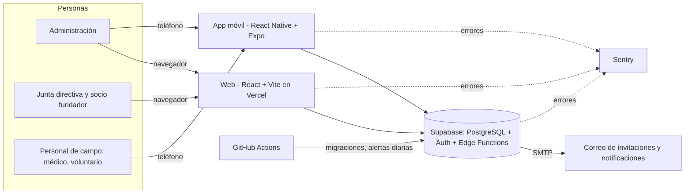
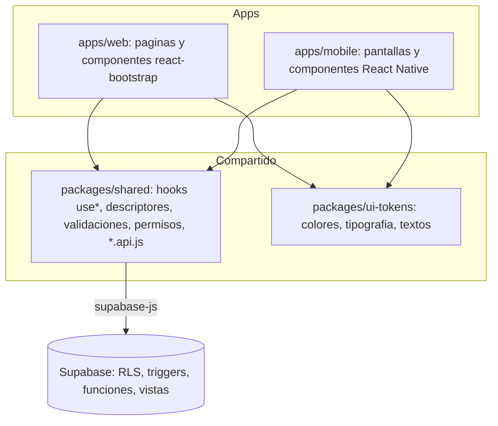
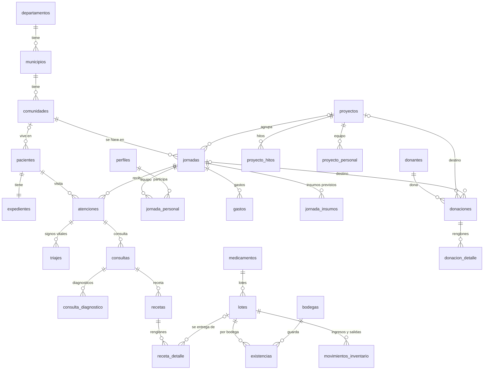

# Manual técnico de Ecopac Digital

Este es el documento de entrada para quien tenga que **retomar, operar o ampliar** el sistema sin
haber estado en su construcción. Dice con qué está hecho, qué hay que instalar y configurar, qué
claves hacen falta y dónde se consiguen, cómo está organizado el código y la base de datos, y qué
convenciones se siguieron. Cada tema remite al documento que lo desarrolla; los documentos marcados
como **generados** salen del código y de la base, y se vuelven a generar con un comando.

## Contenido

1. [Qué es el sistema](#1-qué-es-el-sistema)
2. [Herramientas y tecnologías](#2-herramientas-y-tecnologías)
3. [Qué se necesita para trabajar](#3-qué-se-necesita-para-trabajar)
4. [Puesta en marcha en local, paso a paso](#4-puesta-en-marcha-en-local-paso-a-paso)
5. [Configuración y claves de acceso](#5-configuración-y-claves-de-acceso)
6. [Arquitectura](#6-arquitectura)
7. [Código compartido entre web y móvil](#7-código-compartido-entre-web-y-móvil)
8. [Buenas prácticas de interfaz](#8-buenas-prácticas-de-interfaz)
9. [Base de datos](#9-base-de-datos)
10. [Pantallas](#10-pantallas)
11. [Calidad: pruebas y guardas](#11-calidad-pruebas-y-guardas)
12. [Ambientes y despliegue](#12-ambientes-y-despliegue)
13. [Cómo hacer un cambio típico](#13-cómo-hacer-un-cambio-típico)
14. [Mapa de la documentación](#14-mapa-de-la-documentación)

---

## 1. Qué es el sistema

Ecopac Guatemala es una ONG que hace jornadas médicas y dentales gratuitas en comunidades rurales.
Ecopac Digital reemplaza el papel y los grupos de WhatsApp con los que se organizaba:

- **Web** (`apps/web`): el panel de administración. Pacientes, jornadas, inventario, presupuestos,
  proyectos sociales, donaciones, reportes, colaboradores, permisos y bitácora.
- **Móvil** (`apps/mobile`): la operación en campo, el día de la jornada. Buscar y registrar
  pacientes, signos vitales, consulta, receta, entrega de medicamentos e inventario de la bodega
  que viaja. Solo entran el personal de campo y la administración.
- **Supabase**: la base de datos PostgreSQL, la autenticación, las Edge Functions (correo y
  alertas) y el control de acceso fila por fila (Row Level Security).



La visión completa, con las decisiones de arquitectura y sus razones, está en
[ARQUITECTURA.md](ARQUITECTURA.md).

## 2. Herramientas y tecnologías

| Capa | Herramienta | Versión | Para qué |
| --- | --- | --- | --- |
| Entorno | Node.js | 22.x (`engines` de `package.json`) | Correr todo: apps, pruebas, scripts |
| Entorno | npm workspaces | la de Node 22 | Monorepo: un `npm install` para las cuatro partes |
| Web | React | 19 | Interfaz |
| Web | Vite | 8 | Servidor de desarrollo y compilación |
| Web | React Router | 7 | Rutas de la web |
| Web | React Bootstrap / Bootstrap | 2 / 5 | Componentes y rejilla de la web |
| Web | lucide-react | 1 | Iconos de la web |
| Web | Leaflet | 1.9 | Mapa de ubicación de comunidades |
| Web | html2pdf.js | 0.14 | Imprimir o guardar en PDF (receta, constancias, reportes) |
| Móvil | Expo SDK | 57 | Plataforma de la app móvil (documentación versionada: <https://docs.expo.dev/versions/v57.0.0/>) |
| Móvil | React Native | 0.86 | Interfaz móvil |
| Móvil | React Navigation | 7 | Pestañas y pilas de pantallas |
| Móvil | @expo/vector-icons (Ionicons) | 15 | Iconos del móvil |
| Móvil | expo-secure-store, AsyncStorage | 57 / 2 | Sesión y borradores en el teléfono |
| Móvil | expo-print, expo-sharing | 57 | Imprimir o compartir la receta |
| Móvil | expo-notifications, NetInfo | 57 / 12 | Avisos y detección de "sin conexión" |
| Datos | Supabase (supabase-js) | 2.112 | Cliente de la base, autenticación y funciones |
| Datos | PostgreSQL | 15 (`supabase/config.toml`) | Base de datos |
| Datos | Supabase CLI | fija en los workflows (ver [CI-CD.md](CI-CD.md)) | Base local, migraciones, pruebas de la base |
| Datos | pgTAP | la del stack de Supabase | Pruebas de la base (`supabase/tests/database`) |
| Datos | Deno (Edge Functions) | el runtime de Supabase | `supabase/functions`: invitar usuarios, enviar notificaciones, alertas de vencimiento |
| Pruebas | Vitest | 4 | Pruebas de `packages/shared`, `ui-tokens` y web |
| Pruebas | Testing Library | React 16 / RN 13 | Pruebas de componentes y pantallas |
| Pruebas | Jest + jest-expo | 30 / 57 | Pruebas de la app móvil |
| Calidad | ESLint | 9 | Reglas de código, incluidas las de arquitectura |
| Calidad | Prettier | 3 | Formato |
| Operación | Docker / Docker Compose | cualquiera reciente | Stack local de Supabase; web en contenedor opcional |
| Operación | GitHub Actions | — | CI, migraciones, alertas diarias, mantener activa la base |
| Operación | Vercel | — | Hospedaje de la web (`vercel.json`) |
| Operación | Sentry | — | Registro de errores (opcional: vacío = solo consola) |
| Operación | Mailpit | la del stack de Supabase | Bandeja de correo local (<http://localhost:54424>) |

La lista de dependencias con su razón de ser está en [DEPENDENCIES.md](DEPENDENCIES.md).

## 3. Qué se necesita para trabajar

**En la máquina:**

- Node.js 22 y npm.
- Docker Desktop (o Docker Engine) corriendo: el stack local de Supabase son contenedores.
- Git.
- Para el móvil: la app **Expo Go** en un teléfono, o un emulador de Android o simulador de iOS.

La CLI de Supabase no se instala aparte: se usa con `npx supabase`.

**Cuentas y accesos** (los administra la organización; ver [CONFIGURACION-SUPABASE.md](CONFIGURACION-SUPABASE.md)):

| Servicio | Para qué | Quién necesita acceso |
| --- | --- | --- |
| GitHub (`URL-ECOPAC/Ecopac-Digital`) | Código, PRs, secrets de los workflows | Todo el equipo; secrets solo quien administra |
| Supabase: proyectos `ecopac-dev` y `ecopac-prod` | Base de datos, Auth, Edge Functions | Quien administra; el resto trabaja en local |
| Vercel | Despliegue de la web (preview por PR, producción desde `main`) | Quien administra |
| Sentry | Errores de web, móvil y Edge Functions | Quien da soporte |
| Proveedor SMTP | Correo de invitaciones y notificaciones | Quien administra |
| Expo (EAS) | Compilar la app móvil para tiendas o APK | Quien publica la app |

## 4. Puesta en marcha en local, paso a paso

```bash
# 1. Código y dependencias
git clone https://github.com/URL-ECOPAC/Ecopac-Digital.git
cd Ecopac-Digital
git checkout develop
npm install

# 2. Base de datos local (Docker tiene que estar corriendo)
npx supabase start          # levanta Postgres, Auth, Storage, Studio y Mailpit
npx supabase db reset --local   # aplica TODAS las migraciones y los datos de demostracion

# 3. Variables de entorno
cp .env.example .env.development
# Pegar en .env.development la URL y la llave anonima que imprimio `supabase start`
# (tambien las muestra `npx supabase status`): VITE_SUPABASE_URL / VITE_SUPABASE_ANON_KEY y
# EXPO_PUBLIC_SUPABASE_URL / EXPO_PUBLIC_SUPABASE_ANON_KEY.

# 4. Web: http://localhost:5173
npm run dev:web

# 5. Movil: escanear el QR con Expo Go (o `npm run dev:mobilet` para usar un tunel)
npm run dev:mobile

# 6. (Opcional) Edge Functions en local, con su propio archivo de variables
npx supabase functions serve --env-file supabase/functions/.env
```

- **Usuarios de prueba**: los crea el seed de demostración; los correos, contraseñas y roles están en
  [DATOS-DEMO.md](DATOS-DEMO.md). Son datos inventados: nunca se usan datos reales de pacientes.
- **Studio** (el panel de la base local): <http://localhost:54423>. La API local queda en el
  puerto 54421 (los puertos están en `supabase/config.toml`).
- **Correo local**: todo lo que "se envía" en local cae en Mailpit, <http://localhost:54424>.
- Con Docker también se puede levantar la web en un contenedor: `npm run docker:dev`.

La guía corta equivalente es [QUICKSTART.md](QUICKSTART.md).

## 5. Configuración y claves de acceso

> **Regla:** ninguna llave real se sube al repositorio. `.env.development`, `.env.production` y
> `supabase/functions/.env` están en `.gitignore`. Los nombres de las variables sí están
> documentados; los valores, nunca.

### 5.1 Variables de las apps (`.env.development` / `.env.production`)

| Variable | La lee | Qué es | Dónde se obtiene | ¿Secreta? |
| --- | --- | --- | --- | --- |
| `VITE_SUPABASE_URL` | web | URL del proyecto de Supabase | `supabase status` (local) o Dashboard > Project Settings > API | No |
| `VITE_SUPABASE_ANON_KEY` | web | Llave anónima (publishable): solo permite lo que RLS deja | Igual que la anterior | No, es pública por diseño |
| `EXPO_PUBLIC_SUPABASE_URL` | móvil | Igual que `VITE_SUPABASE_URL` | Igual | No |
| `EXPO_PUBLIC_SUPABASE_ANON_KEY` | móvil | Igual que `VITE_SUPABASE_ANON_KEY` | Igual | No |
| `VITE_SENTRY_DSN` | web | DSN de Sentry; vacío = los errores quedan en la consola | Sentry > Project Settings > Client Keys | No (solo envía eventos) |
| `EXPO_PUBLIC_SENTRY_DSN` | móvil | Igual para el móvil | Igual | No |

La llave anónima es pública a propósito: quien protege los datos es Row Level Security, no el
secreto de la llave (ver [SEGURIDAD.md](SEGURIDAD.md)). La **service role key** salta RLS y
**jamás** va en una app ni en un archivo `VITE_*` / `EXPO_PUBLIC_*`.

### 5.2 Secrets de las Edge Functions

Se configuran en Supabase (Dashboard > Edge Functions > Secrets) en cada ambiente, y en local en
`supabase/functions/.env`:

| Secret | Qué es |
| --- | --- |
| `SMTP_HOST`, `SMTP_PORT`, `SMTP_USER`, `SMTP_PASS`, `SMTP_FROM` | Servidor de correo para invitaciones y notificaciones (en local, Mailpit: `inbucket:1025`) |
| `WEB_URL` | URL pública de la web; con ella se arman los enlaces de los correos y el destino de la invitación (`/nueva-contrasena`) |
| `SENTRY_DSN` | DSN de Sentry de las funciones (opcional) |
| `SUPABASE_URL`, `SUPABASE_SERVICE_ROLE_KEY` | Los inyecta Supabase solo; no se configuran a mano |

Las Edge Functions son tres: `invitar-usuario` (alta de colaboradores),
`enviar-notificaciones` (correo de las notificaciones internas) y `alertas-vencimiento` (rutina
diaria de lotes por vencer).

### 5.3 Secrets de GitHub Actions

GitHub > Settings > Secrets and variables > Actions. Mientras falten, los workflows de Supabase
avisan en el resumen de la corrida sin fallar.

| Secret | Lo usa | Qué es |
| --- | --- | --- |
| `SUPABASE_ACCESS_TOKEN` | workflow Supabase | Token personal de la CLI para aplicar migraciones |
| `SUPABASE_DB_PASSWORD` | workflow Supabase | Contraseña de la base remota |
| `SUPABASE_PROJECT_REF_DEV`, `SUPABASE_PROJECT_REF_PROD` | workflow Supabase | Identificador de cada proyecto |
| `SUPABASE_URL_DEV`, `SUPABASE_SERVICE_ROLE_KEY_DEV` | alertas de vencimiento, verificar despliegue | Para correr la rutina diaria contra `ecopac-dev` |
| `VITE_SUPABASE_URL_DEV`, `VITE_SUPABASE_ANON_KEY_DEV` | CI, mantener activo | URL y llave anónima de `ecopac-dev` |
| `VITE_SUPABASE_URL_PROD`, `VITE_SUPABASE_ANON_KEY_PROD` | CI, mantener activo | URL y llave anónima de `ecopac-prod` |

El detalle de cada workflow y de cada secret está en [CI-CD.md](CI-CD.md).

### 5.4 Configuración de Supabase por ambiente

URLs de redirección de Auth, plantillas de correo, longitud mínima de contraseña, duración de la
sesión, SMTP y límites del plan: [CONFIGURACION-SUPABASE.md](CONFIGURACION-SUPABASE.md). En local
todo eso sale de `supabase/config.toml`.

## 6. Arquitectura

### 6.1 El monorepo

```
apps/
  web/            React + Vite: el panel de administracion
    src/pages/      una pagina por pantalla (y sus modales)
    src/components/ el catalogo de componentes de la web
    src/theme.js    publica los tokens como variables CSS (--color-*)
  mobile/         React Native + Expo: la operacion en campo
    src/screens/    una pantalla por archivo
    src/components/ el catalogo de componentes del movil (mismos nombres y props)
    src/navigation/ pestañas, pilas y guardas de rol
packages/
  shared/         la logica: API, validaciones, descriptores, permisos, hooks. Sin JSX.
  ui-tokens/      colores, tipografia, espaciados y textos comunes
supabase/
  migrations/     el esquema, en migraciones numeradas (00001 ... )
  tests/database/ pruebas pgTAP
  functions/      Edge Functions (Deno)
  seed*.sql       datos de demostracion
scripts/          guardas de CI y generadores de documentacion
docs/             documentacion
.github/          workflows, plantillas de issues y de PR
```

### 6.2 Las capas



**La regla central** ([ARQUITECTURA-FRONTEND.md](ARQUITECTURA-FRONTEND.md)): *una pantalla es un
hook y unos descriptores en `packages/shared`, más un componente por app.* Lo que la pantalla sabe
-qué consultar, cómo validar, qué columnas y filtros tiene, qué puede hacer cada rol- vive una sola
vez en shared; cada app solo lo dibuja.

Lo que se prohíbe, y lo comprueban ESLint y las guardas de CI:

- `packages/shared` no importa `react-dom`, `react-native` ni `react-bootstrap`, ni usa `window`,
  `document`, `localStorage` o `AsyncStorage`, ni devuelve JSX.
- Las apps no importan `@supabase/supabase-js`, ni escriben validaciones, formato o reglas de
  permisos dentro de un componente.
- Ningún color, espaciado o tamaño de letra se escribe a mano.
- Un contrato de API que cambia tiene que romper algo, no devolver una lista vacía
  (`npm run verificar:contratos`).

### 6.3 Recorrido de una petición

1. La pantalla llama al hook de shared (por ejemplo `useProyectosSociales`).
2. El hook llama a una función de `*.api.js` (`listarProyectos`).
3. La función usa el cliente de Supabase (`obtenerSupabase()`), que lleva la sesión del usuario.
4. PostgREST aplica **RLS**: la base decide qué filas ve y qué puede escribir esa persona.
5. Los triggers de la base validan reglas de negocio (transiciones de estado, inventario,
   proyectos cancelados, auditoría) y pueden rechazar la escritura.
6. El error, si lo hay, se normaliza en shared (`errores-de-supabase.js`) a un mensaje para la
   persona y un detalle saneado para el registro (sin datos de pacientes).

## 7. Código compartido entre web y móvil

### 7.1 Qué hay en `packages/shared`

| Carpeta | Contenido |
| --- | --- |
| `api/` | Cliente de Supabase, sesión, paginación, errores |
| `pacientes/` | Pacientes, expediente, triaje, consultas, recetas, condiciones crónicas, duplicados |
| `atenciones/` | Cola de la jornada y cierre de atenciones |
| `jornadas/` | Jornadas, equipo, insumos previstos, kanban, cierre |
| `inventario/` | Catálogo, lotes, existencias, movimientos, alertas de vencimiento, bodegas |
| `presupuestos/` | Presupuestos, orígenes del presupuesto, gastos y su aprobación |
| `proyectos/` | Proyectos sociales, equipo, hitos, seguimiento, insumos |
| `donaciones/` | Donantes, donaciones, constancias |
| `reportes/` | Indicadores de impacto, pacientes atendidos, inventario, vencimientos, jornada |
| `usuarios/` | Roles, permisos, acceso por módulo, perfil, inicio de sesión |
| `notificaciones/`, `auditoria/`, `territorio/` | Buzón, bitácora, departamentos/municipios/comunidades |
| `formato/`, `validations/` | Fechas en hora de Guatemala, moneda, opciones, tipo de acción de un botón; validadores |
| `navegacion.js`, `enums.js` | Módulos de la navegación por rol; valores y etiquetas de los enums |

Cada módulo sigue la misma estructura: `api.js` (consultas), `validaciones.js`, `campos.js`
(esquema de formulario), `columnas.js` (columnas de tabla y campos de tarjeta), `filtros.js`,
`permisos.js` y un `use<Pantalla>.js` por pantalla. `pacientes/` es el ejemplar de referencia.

Toda función exportada tiene JSDoc con parámetros y valor de retorno (lo exige
`npm run verificar:jsdoc -- --estricto`). El índice de la API está en [API-SHARED.md](API-SHARED.md).

### 7.2 El catálogo de componentes

Las dos apps implementan **los mismos componentes con las mismas props**, para que portar una
pantalla sea mecánico. Solo cambia el nombre del evento (`onClick` en la web, `onPress` en el
móvil) y la disposición en un teléfono.

| Componente | Web | Móvil | Para qué |
| --- | --- | --- | --- |
| `ScreenContainer`, `PageHeader`, `SectionHeader`, `Card` | si | si | Estructura de pantalla |
| `DataList` | tabla | tarjetas | Listas a partir de un descriptor de columnas |
| `FilterBar` | fila de filtros | buscador + panel lateral | Filtros a partir de un descriptor |
| `TextField`, `NumberField`, `DateField`, `PasswordField`, `Selector`, `MultiSelector`, `SelectorConAlta`, `CampoDeFormulario` | si | si | Campos de formulario |
| `PrimaryButton`, `SecondaryButton`, `BotonLimpiarFiltros` | si | si | Botones (ver 8.3) |
| `StatusChip`, `StatCard` | si | si | Estados e indicadores |
| `LoadingState`, `EmptyState`, `ErrorState` | si | si | Los tres estados de toda pantalla con datos |
| `Modal`, `Tabs`, `KanbanBoard` | si | si | Diálogos, pestañas y tableros |
| `FormularioSignosVitales`, `CascadaDeComunidad` | si | si | Piezas de formulario del dominio |
| `BotonExportarCSV`, `BotonImprimir`, `BotonesDeRango`, `GraficaDeBarras`, `Paginacion` | si | — | Reportes en la web |
| `MenuLateral`, `PanelLateral` | — | si | Opciones de una sección y filtros en un teléfono |

### 7.3 Archivos que usan las dos apps

- **`@ecopac/shared`**: toda la lógica (hooks, API, validaciones, descriptores, permisos,
  formato). Una pantalla web y su pantalla móvil llaman al mismo hook.
- **`@ecopac/ui-tokens`**: colores, tipografía, espaciados, sombras, acentos por módulo, colores de
  estado y textos comunes.
- **`navegacion.js`**: qué módulos ve cada rol, en la web y en las pestañas del móvil.

## 8. Buenas prácticas de interfaz

### 8.1 Colores, tipografía y espaciado: un solo archivo

Todo sale de `packages/ui-tokens/index.js`:

| Token | Valor | Uso |
| --- | --- | --- |
| `colors.primary` | `#3DB648` | Acción principal, marca (verde Ecopac) |
| `colors.primaryDark` | `#1E7A28` | Texto sobre fondos claros de marca |
| `colors.secondary` | `#4D4D4D` | Acciones neutras |
| `colors.danger` | `#E91E8C` | Error, borrado |
| `colors.warning` | `#F7941D` | Advertencia, por vencer |
| `colors.info` | `#29ABE2` | Información |
| `colors.background` / `surface` | `#F7F8FA` / `#FFFFFF` | Fondo de pantalla / de tarjeta |
| `colors.border` | `#E2E4E9` | Bordes |
| `colors.text` / `textMuted` | `#2D2D2D` / `#7A7A8A` | Texto / texto secundario |

Además: `typography` (familia, tamaños `xxs` a `xxl`, pesos), `spacing` (`xs` 4 a `xl` 32),
`radii`, `shadows`, `moduleAccents` (el color de cada módulo) y `statusColors` (el color de cada
estado: pendiente, aprobado, en curso, cancelado...).

- En la web se consumen como variables CSS `var(--color-*)`, que publica `apps/web/src/theme.js`.
- En el móvil se importan directo: `colors.primary`, `spacing.md`.
- **Nunca un color a mano.** `npm run verificar:paleta` compara los colores que usa cada archivo
  contra una línea base y falla si aparece uno nuevo sin explicación.

La paleta y el porqué de cada color: [DISENO.md](DISENO.md).

### 8.2 Textos en un solo lugar

- **Textos comunes** (estados, avisos, "Cargando..."): `labels` de `@ecopac/ui-tokens`.
- **Etiquetas de enums** (estados de jornada, tipos de donación, roles): `ETIQUETAS_*` en
  `packages/shared` (`enums.js` y cada módulo), derivadas del mismo enum de la base.
- **Etiquetas de campos, columnas y filtros**: en los descriptores de shared (`campos.js`,
  `columnas.js`, `filtros.js`), no en el componente. Una pantalla no escribe la etiqueta de un campo.
- **Fechas y moneda**: `formato/fechas.js` y `formato/moneda.js` (hora local de Guatemala, "Q").
- Sin emojis en código, textos, commits, issues ni PRs (`npm run verificar:sin-emojis`).

### 8.3 Botones

| Botón | Cuándo |
| --- | --- |
| `PrimaryButton` (verde) | La acción que resuelve la pantalla o confirma el formulario. **Una por pantalla.** |
| `SecondaryButton` (contorno o gris) | Lo demás: cancelar, volver, acciones secundarias |
| `BotonLimpiarFiltros` | Siempre visible en la barra de filtros; gris y deshabilitado sin filtros, verde con filtros |
| `BotonExportarCSV` ("Exportar CSV") | Descargar una tabla o reporte |
| `BotonImprimir` ("Imprimir / PDF") | Imprimir o guardar en PDF |

**El icono sale del verbo, no de quien escribe el botón.** `tipoDeAccion()`
(`packages/shared/formato/acciones.js`) clasifica el rótulo y cada app pone su icono:

| Empieza con | Tipo | Icono |
| --- | --- | --- |
| Nuevo, Crear, Agregar, Registrar, Alta de, o "+" | alta | "+" (dentro de un formulario, disquete: confirma) |
| Guardar, Confirmar | guardado | disquete |
| Cancelar | cancelar | X, en gris |
| Eliminar, Borrar, Quitar | borrado | basurero |
| Volver, Regresar, Atrás | retorno | flecha |
| Editar, Corregir, Modificar | edición | lápiz |
| Ver, Detalle, Abrir | detalle | ojo |

"Desactivar", "Anular" y "Rechazar" **no** son borrado: cambian un estado que queda registrado.

### 8.4 Estados y pantallas

- Toda pantalla con datos dibuja **cargando, vacío y error** (`LoadingState`, `EmptyState`,
  `ErrorState`); un error de red ofrece "Reintentar" y una lista vacía por filtros ofrece
  "Limpiar filtros".
- El estado de algo se dice con texto y color a la vez (`StatusChip` con su etiqueta y el color de
  `statusColors`).
- En el móvil: área táctil mínima de 48 dp, el texto se ajusta en vez de truncarse, filtros y
  opciones de sección en panel lateral, una acción principal por pantalla. Las reglas completas:
  [DISENO-MOVIL.md](DISENO-MOVIL.md).

## 9. Base de datos

### 9.1 En números

Al cierre de este documento (migración `00156`): **52 tablas, 8 vistas, 23 tipos enumerados,
472 columnas, 90 llaves foráneas, 138 políticas RLS, 114 triggers y 90 funciones.** Todas las
tablas tienen RLS activo y todas las tablas, columnas, vistas, enums y funciones tienen descripción
(lo exige la prueba `diccionario_de_datos.sql`).

- **Diccionario de datos completo** -cada tabla con sus campos, tipos, nulos, valores por defecto,
  llaves, restricciones, políticas y triggers, con diagramas entidad-relación por módulo-:
  [DICCIONARIO-DE-DATOS.md](DICCIONARIO-DE-DATOS.md) (**generado**).
- **Por qué es así cada tabla** y las decisiones de modelado: [MODELO-DE-DATOS.md](MODELO-DE-DATOS.md).

### 9.2 Diagrama general

Las relaciones principales entre módulos (el detalle, con todas las columnas, está en el
diccionario):



### 9.3 Cómo está protegida

- **Row Level Security en todas las tablas.** Quien protege los datos es la base, no la interfaz:
  un botón escondido no es seguridad. Cada política dice qué filas ve y escribe cada rol.
- **Roles** (enum `rol_usuario`): administrador, junta directiva, socio fundador, médico y
  voluntario general. **Permisos finos** delegables por rol o por persona (`permisos`,
  `rol_permiso`, `usuario_permiso`) y **módulos** que la administración abre a un rol
  (`rol_modulo`).
- Las políticas preguntan con funciones como `es_administrador()`, `tiene_permiso('clave')`,
  `participa_en_jornada(id)`, `pertenece_a_proyecto(id)` y `puede_consultar_reportes()`.
- **Sin sesión no se ve nada**: el rol `anon` no tiene privilegios sobre las tablas
  (`privilegios_anon.sql` lo prueba).
- **Funciones `SECURITY DEFINER`** solo cuando hace falta saltar RLS para una operación puntual, y
  validan por dentro quién las llama; las de trigger no se pueden llamar directamente.
- **Vistas agregadas** para los reportes: los roles consultivos ven totales, no filas clínicas.
- **Reglas de negocio en triggers**: transiciones de estado de jornadas y proyectos, proyecto
  cancelado de solo lectura, inventario que no queda negativo, gastos aprobados que no cambian.
- **Bitácora de auditoría** (`eventos_auditoria`): cada alta, cambio y baja de las tablas de
  negocio, con quién y cuándo.

La matriz completa de qué puede hacer cada rol, con la política que lo implementa:
[PERMISOS.md](PERMISOS.md). Protección de datos personales: [PROTECCION-DE-DATOS.md](PROTECCION-DE-DATOS.md).
Autenticación y endurecimiento: [SEGURIDAD.md](SEGURIDAD.md).

### 9.4 Migraciones

- El esquema **es** `supabase/migrations/`: cuando el código, la documentación y la base no
  coinciden, mandan las migraciones.
- **Una migración aplicada no se edita nunca**: se corrige con una nueva.
- Nombre `NNNNN_descripcion.sql`, cinco dígitos, **mayor que la última de `develop`**; el número se
  vuelve a revisar antes de mergear.
- **Nadie corre `supabase db push` a mano**: se mergea el PR y la aplica el workflow.
- Cada migración nueva lleva su prueba pgTAP y el `COMMENT ON` de lo que crea.

Todo el detalle, y qué hacer cuando falla un despliegue: [CI-CD.md](CI-CD.md).

## 10. Pantallas

**35 rutas en la web y 29 pantallas en el móvil.** Para cada una, qué tablas, vistas, funciones de
la base y Edge Functions usa, y a la inversa, qué pantallas usan cada tabla:
[PANTALLAS.md](PANTALLAS.md) (**generado**).

Por módulo, en la web: inicio, pacientes (listado, ficha, crónicos, condiciones, diagnósticos,
comunidades, duplicados), jornadas (tablero y detalle), inventario, presupuestos, proyectos
(listado y seguimiento), donaciones (resumen, registro, historial, constancia, donantes), reportes
(impacto, vencimientos, pacientes atendidos, inventario, reporte de jornada), colaboradores, matriz
de permisos, bitácora, perfil y notificaciones.

En el móvil, en cinco pestañas: Inicio, Pacientes (búsqueda, ficha, registro, historial, consulta,
receta, entrega, crónicos, condiciones, diagnósticos), Jornadas (asignadas, en curso, selección,
kanban, proyectos), Inventario (stock, ingreso, salida, existencias, alertas, movimientos, detalle
de lote, principios activos, por aprobar) y Ajustes (perfil y notificaciones).

Qué módulo ve cada rol lo decide `packages/shared/navegacion.js`; las pantallas del móvil además
llevan una guarda de rol (`conGuardaDeRol`), y la prueba `guardaDeRol.test.js` comprueba que
ninguna quede sin ella.

## 11. Calidad: pruebas y guardas

| Comando | Qué comprueba |
| --- | --- |
| `npm run lint` | ESLint en todo el monorepo, incluidas las reglas de arquitectura |
| `npm test` | Vitest (shared, ui-tokens, web) y Jest (móvil) |
| `npx supabase test db --local` | pgTAP: políticas RLS, triggers, funciones y reglas de la base |
| `npm run build` | Que la web compile |
| `npm run verificar:jsdoc -- --estricto` | Toda función exportada de shared con JSDoc completo |
| `npm run verificar:contratos` | Que las apps lean la clave que de verdad devuelve cada función de shared |
| `npm run verificar:shared-esquema` | Que shared no pida columnas o tablas que no existen en el esquema |
| `npm run verificar:paleta` | Que ningún archivo cambie de color sin que se note |
| `npm run verificar:sin-emojis` | Sin emojis en el repositorio |
| `npm run verificar:rewrite-vercel`, `verificar:cabeceras-http` | Configuración de Vercel: rutas y cabeceras de seguridad |
| `npm run verificar:redireccion` | Enlace de recuperación de contraseña contra un despliegue real |

El CI (`.github/workflows/ci.yml`) corre todo esto en cada PR. El plan y los casos de prueba:
[PLAN-DE-PRUEBAS.md](PLAN-DE-PRUEBAS.md) y [CASOS-DE-PRUEBA.md](CASOS-DE-PRUEBA.md).

## 12. Ambientes y despliegue

| Ambiente | Rama | Base | Web |
| --- | --- | --- | --- |
| Local | cualquiera | `supabase start` (Docker) | `npm run dev:web` |
| Desarrollo / staging | `develop` | Supabase `ecopac-dev` | Vercel Preview |
| Producción | `main` | Supabase `ecopac-prod` | Vercel (producción) |

- **Flujo de Git**: rama desde `develop` (`feature/...`, `fix/...`, `chore/...`), PR hacia
  `develop` con "Closes #X", commits con Conventional Commits, squash and merge. `main` solo recibe
  `develop` con PR aprobado. Ver [CONTRIBUTING.md](CONTRIBUTING.md).
- **Base**: al mergear, el workflow `supabase.yml` aplica las migraciones nuevas al ambiente de la
  rama.
- **Web**: Vercel compila `apps/web` en cada push; `vercel.json` define las rutas y las cabeceras.
  Alternativa autohospedada: `npm run docker:prod` (Nginx, `apps/web/Dockerfile`).
- **Móvil**: se prueba con Expo Go; para distribuirla se compila con EAS (`apps/mobile/app.config.js`,
  `slug: ecopac-digital`).
- **Tareas programadas** (GitHub Actions): alertas de vencimiento diarias, mantener activa la base
  del plan gratuito y verificar que el despliegue responde.
- **Respaldos y restauración**: [CI-CD.md](CI-CD.md), sección "Respaldos y restauración".
- **Costos y límites** del plan gratuito y cuánto crece la base: [COSTOS-Y-LIMITES.md](COSTOS-Y-LIMITES.md).

## 13. Cómo hacer un cambio típico

**Agregar un campo a una entidad** (por ejemplo, un dato nuevo del paciente):

1. Rama desde `develop`.
2. Migración nueva con el `ALTER TABLE`, su `COMMENT ON COLUMN` y, si cambia quién puede leerlo o
   escribirlo, la política. Prueba pgTAP en `supabase/tests/database/`.
3. `npx supabase db reset --local` y `npx supabase test db --local`.
4. En shared: la columna en `api.js`, el campo en `campos.js`, la columna en `columnas.js`, la
   validación en `validaciones.js`, con sus pruebas.
5. Las dos apps lo toman de los descriptores; si hace falta, se ajusta el componente.
6. Si cambió una política o un permiso: [PERMISOS.md](PERMISOS.md) en el mismo PR.
7. Regenerar la documentación generada: `npm run docs:diccionario` y `npm run docs:pantallas`.
8. `npm run lint`, `npm test`, las guardas y el PR hacia `develop`.

**Agregar una pantalla**: el hook y los descriptores en shared, la página web y la pantalla móvil
con el catálogo de componentes, la ruta (`App.jsx` / `AppNavigator.js`, con su guarda de rol) y un
acceso visible hacia ella. La receta completa: [ARQUITECTURA-FRONTEND.md](ARQUITECTURA-FRONTEND.md),
"Cómo construir una pantalla nueva".

## 14. Mapa de la documentación

| Documento | De qué trata |
| --- | --- |
| [QUICKSTART.md](QUICKSTART.md) | Arrancar en cinco minutos |
| [ARQUITECTURA.md](ARQUITECTURA.md) | Contexto, capas, decisiones y su porqué |
| [ARQUITECTURA-FRONTEND.md](ARQUITECTURA-FRONTEND.md) | La regla de shared + un componente por app |
| [API-SHARED.md](API-SHARED.md) | Índice de la API de `packages/shared` |
| [DICCIONARIO-DE-DATOS.md](DICCIONARIO-DE-DATOS.md) | **Generado.** Todas las tablas, campos, relaciones, políticas y triggers |
| [PANTALLAS.md](PANTALLAS.md) | **Generado.** Pantallas y los datos que usa cada una |
| [MODELO-DE-DATOS.md](MODELO-DE-DATOS.md) | El porqué del modelo de datos |
| [PERMISOS.md](PERMISOS.md) | Qué puede hacer cada rol y qué política lo implementa |
| [SEGURIDAD.md](SEGURIDAD.md), [PROTECCION-DE-DATOS.md](PROTECCION-DE-DATOS.md) | Autenticación, endurecimiento y datos personales |
| [CI-CD.md](CI-CD.md), [CONFIGURACION-SUPABASE.md](CONFIGURACION-SUPABASE.md) | Workflows, secrets, migraciones, ambientes |
| [DISENO.md](DISENO.md), [DISENO-MOVIL.md](DISENO-MOVIL.md) | Paleta, navegación y criterio de diseño móvil |
| [COSTOS-Y-LIMITES.md](COSTOS-Y-LIMITES.md) | Plan gratuito y crecimiento |
| [PLAN-DE-PRUEBAS.md](PLAN-DE-PRUEBAS.md), [CASOS-DE-PRUEBA.md](CASOS-DE-PRUEBA.md) | Estrategia y casos de prueba |
| [CUMPLIMIENTO-DE-REQUERIMIENTOS.md](CUMPLIMIENTO-DE-REQUERIMIENTOS.md) | Cada requerimiento y su estado |
| [CONTRIBUTING.md](CONTRIBUTING.md) | Flujo de trabajo del equipo |

**Mantener los generados al día:** con la base local actualizada (`npx supabase db reset --local`),
`npm run docs:diccionario` y `npm run docs:pantallas`. No se editan a mano.
