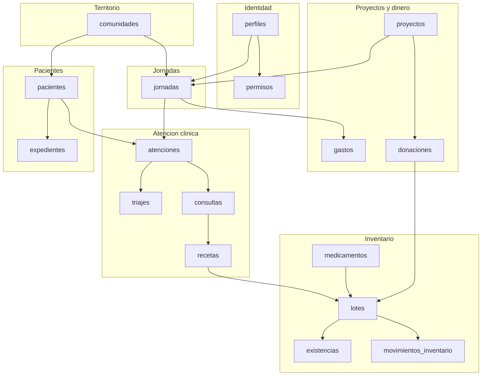
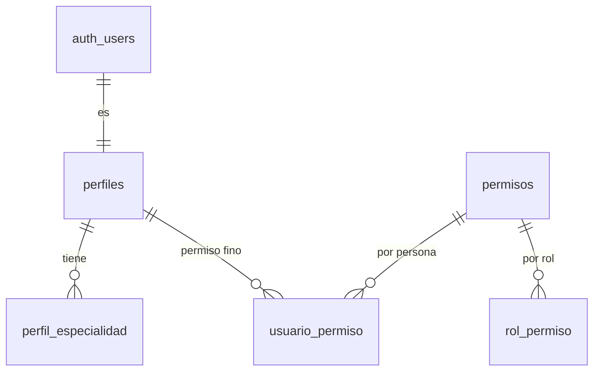
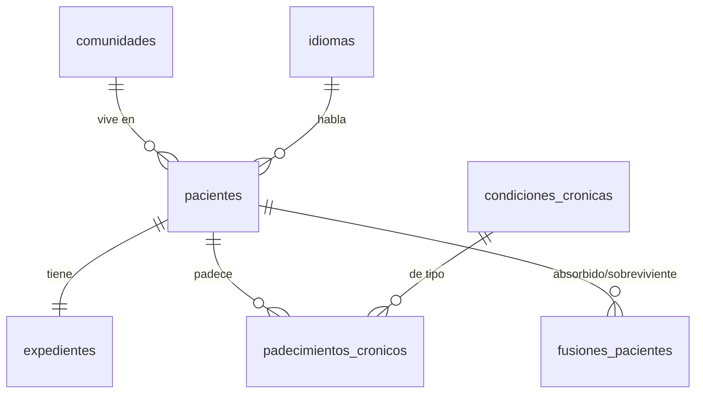
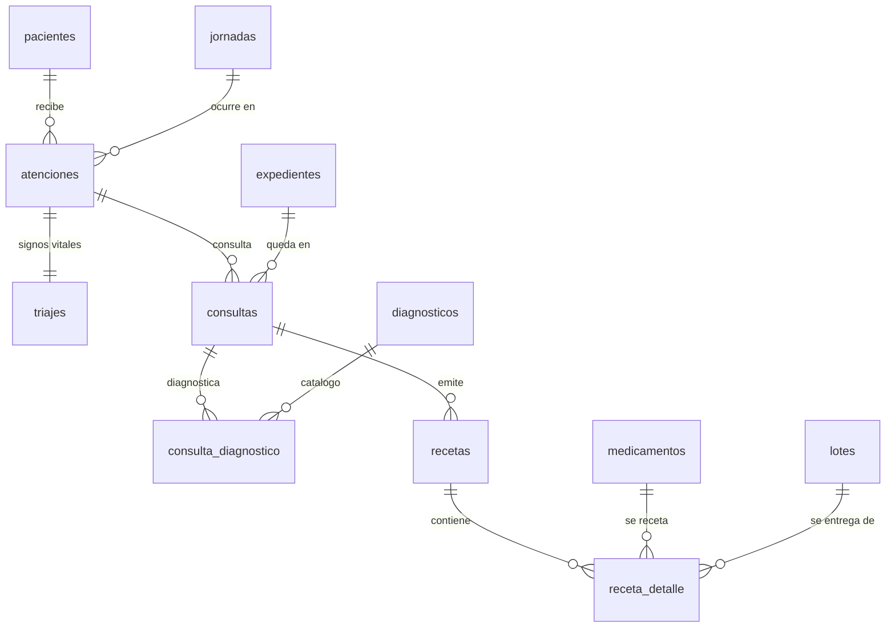
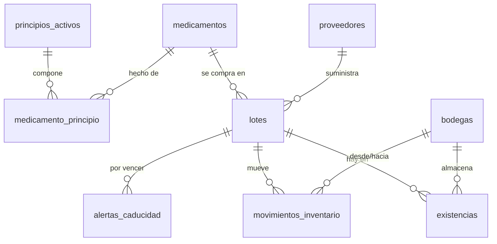
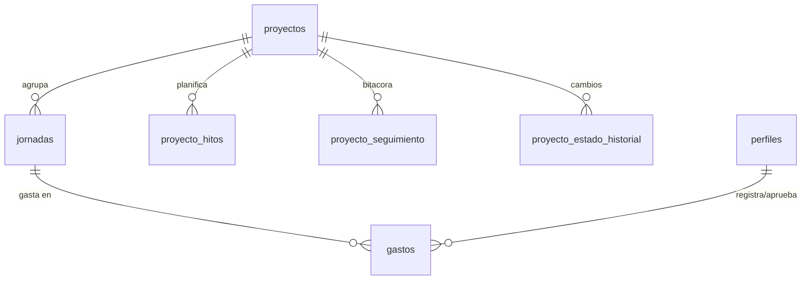

# Modelo de datos - Ecopac Digital

Referencia del esquema de PostgreSQL: que tablas existen, que guarda cada columna, que reglas
hace cumplir la base de datos por si misma, y donde esta escrito cada cosa.

**La fuente de verdad es `supabase/migrations/`.** Este documento la describe; cuando no
coincidan, manda el SQL. Cada tabla indica entre corchetes la migracion que la creo, y cada
columna anadida despues indica la migracion que la agrego.

Estado al 4 de septiembre de 2026, sobre `develop`.

| Elemento          | Cantidad |
| ----------------- | -------- |
| Migraciones       | 103      |
| Tablas            | 42       |
| Tipos enumerados  | 20       |
| Funciones         | 49       |
| Vistas            | 7        |
| Politicas RLS     | 107      |

---

## Indice

1. [Convenciones del esquema](#1-convenciones-del-esquema)
2. [Mapa general](#2-mapa-general)
3. [Identidad, roles y auditoria](#3-identidad-roles-y-auditoria)
4. [Territorio](#4-territorio)
5. [Pacientes y expediente](#5-pacientes-y-expediente)
6. [Jornadas](#6-jornadas)
7. [Atencion clinica](#7-atencion-clinica)
8. [Inventario](#8-inventario)
9. [Donaciones](#9-donaciones)
10. [Proyectos y presupuesto](#10-proyectos-y-presupuesto)
11. [Tipos enumerados](#11-tipos-enumerados)
12. [Funciones](#12-funciones)
13. [Vistas](#13-vistas)
14. [Reglas que hace cumplir la base de datos](#14-reglas-que-hace-cumplir-la-base-de-datos)
15. [Row Level Security](#15-row-level-security)
16. [Auditoria campo-a-vista (issue #756)](#16-auditoria-campo-a-vista-issue-756)

---

## 1. Convenciones del esquema

| Convencion                        | Regla                                                                     |
| --------------------------------- | ------------------------------------------------------------------------- |
| Nombres                           | `snake_case` en tablas y columnas                                         |
| Clave primaria                    | `UUID` con `DEFAULT extensions.gen_random_uuid()`, salvo catalogos geograficos (`INT`) y `eventos_auditoria` (`BIGINT IDENTITY`) |
| Marcas de tiempo de fila          | `created_at` y `updated_at`, ambas `TIMESTAMPTZ NOT NULL DEFAULT NOW()`   |
| `updated_at`                      | Lo mantiene el trigger `actualizar_timestamp_updated_at()`, no el cliente |
| Actor de una accion               | Sufijo `_por`: `registrado_por`, `aprobado_por`, `anulada_por`            |
| Momento de esa accion             | Misma raiz con sufijo `_en`: `aprobado_en`, `anulada_en`, `tomado_en`     |
| Responsable de una entidad        | `responsable_id`                                                          |
| Correo electronico                | `extensions.citext` (comparacion sin distinguir mayusculas)               |
| Dinero                            | `NUMERIC(12,2)`                                                           |
| Borrado                           | Logico donde hay historial clinico (`pacientes.fecha_baja`); fisico prohibido por trigger |

El prefijo `extensions.` no es decorativo: la migracion `00005` movio las extensiones fuera de
`public` a proposito, y omitirlo rompe la migracion.

**Divergencia abierta: la bandera de borrado logico en catalogos.** No hay un solo nombre. Los
catalogos usan `activo` (`medicamentos` en `00050`, `diagnosticos` en `00113`, `donantes` en
`00022`) o `es_vigente` (`condiciones_cronicas` en `00115`, `comunidades` en `00117`), y las dos
significan exactamente lo mismo: FALSE lo retira del selector sin borrar la fila. Las dos ultimas
se escribieron despues y no siguieron el nombre que ya existia. Queda anotado aqui porque una
migracion aplicada no se edita (ver `AGENTS.md`): unificarlo pide una migracion nueva que
renombre y actualice a quien las lee, no un cambio en los archivos de `00115` y `00117`.
`pacientes.fecha_baja` es otra cosa y no entra en esta comparacion: no es una bandera, es la
fecha en que se dio de baja.

---

## 2. Mapa general

Los tres ejes del sistema:

- **La persona atendida**: `pacientes` -> `expedientes` -> `atenciones` -> `triajes` / `consultas`
  -> `recetas`.
- **El medicamento**: `medicamentos` -> `lotes` -> `existencias` (por bodega), movido por
  `movimientos_inventario` y consumido por `receta_detalle`.
- **El dinero y la planificacion**: `proyectos` -> `jornadas` -> `gastos`, alimentados por
  `donaciones`.

Los tres se cruzan en la **jornada**: es la unidad de operacion. Casi todo lo clinico exige una
jornada `en curso` para poder escribirse.

---

## 3. Identidad, roles y auditoria

### `perfiles` [00002]

Extiende `auth.users` con los datos de la organizacion. Un perfil se crea automaticamente por el
trigger `crear_perfil_nuevo_usuario()` al aparecer el usuario de autenticacion.

| Columna         | Tipo                    | Notas                                        |
| --------------- | ----------------------- | -------------------------------------------- |
| `id`            | UUID PK                 | Referencia `auth.users(id)` ON DELETE CASCADE |
| `nombres`       | VARCHAR(100) NOT NULL   |                                              |
| `apellidos`     | VARCHAR(100) NOT NULL   |                                              |
| `email`         | citext UNIQUE NOT NULL  |                                              |
| `telefono`      | VARCHAR(20)             |                                              |
| `rol`           | `rol_usuario` NOT NULL  | Por defecto `voluntario general`             |
| `activo`        | BOOLEAN NOT NULL        | Por defecto TRUE. Inactivo = sin rol efectivo |
| `fecha_ingreso` | DATE                    |                                              |
| `direccion`     | TEXT                    | [+00108]                                     |
| `notas`         | TEXT                    | [+00108]                                     |

Reglas propias: no se puede cambiar el rol propio (`impedir_cambio_de_rol_propio`), no se puede
uno desactivar a si mismo (`impedir_autodesactivacion`), y no se puede dejar al sistema sin
administrador activo (`impedir_dejar_sin_administrador_activo`, `impedir_borrar_ultimo_administrador`).

### `perfil_especialidad` [00002]

`perfil_id` + `nombre_especialidad`. Clave primaria compuesta. Cada perfil administra las suyas
(`00085`).

### `permisos` [00003]

Catalogo de permisos finos: `clave` (unica), `modulo`, `descripcion`. La columna `modulo` coincide
con los identificadores de `packages/shared/navegacion.js`.

### `rol_permiso` [00003]

Que trae cada rol de fabrica: `rol` (`rol_usuario`) + `permiso_id`.

### `usuario_permiso` [00003]

Excepcion por persona sobre lo que da el rol.

| Columna        | Tipo             | Notas                                                        |
| -------------- | ---------------- | ------------------------------------------------------------ |
| `perfil_id`    | UUID             |                                                              |
| `permiso_id`   | UUID             |                                                              |
| `concedido`    | BOOLEAN NOT NULL | TRUE concede, FALSE revoca de forma explicita                 |
| `otorgado_por` | UUID             | Quien tomo la decision                                        |
| `motivo`       | TEXT             |                                                              |

Cada escritura queda auditada (`registrar_evento_auditoria_usuario_permiso`, `00045`), y no se le
puede conceder un permiso de escritura a un rol consultivo
(`impedir_permiso_escritura_a_consultivo`, `00086`).

### `eventos_auditoria` [00026]

Bitacora de escrituras sensibles. `tabla_afectada`, `fila_id`, `operacion`
(`insercion`/`actualizacion`/`baja`/`eliminacion`), `realizado_por`, `realizado_en`, y el antes y
el despues como `JSONB` (`valores_anteriores`, `valores_nuevos`). Solo la lee el administrador.

---

## 4. Territorio

Jerarquia de tres niveles. Los dos primeros son catalogo cerrado de Guatemala, con `id` entero
porque el dato viene del INE y no cambia.

| Tabla           | Migracion | Columnas                                                                          |
| --------------- | --------- | --------------------------------------------------------------------------------- |
| `departamentos` | 00006     | `id` INT PK, `nombre`                                                             |
| `municipios`    | 00006     | `id` INT PK, `departamento_id`, `nombre`                                          |
| `comunidades`   | 00008     | `id` UUID PK, `municipio_id`, `nombre`, `latitud`, `longitud`, `referencia_acceso`, `es_vigente` [+00117] |

**Los departamentos y los municipios los siembra la migracion `00125`** (issue #704), de forma
idempotente y con los mismos `id` de siempre. Hasta entonces solo estaban en `supabase/seed.sql`,
que no llega a ningun ambiente remoto porque `supabase db push` no ejecuta seeds: un proyecto de
Supabase nuevo nacia sin catalogo geografico y, sin municipios, tampoco podia tener comunidades ni
jornadas.

`referencia_acceso` es texto libre para llegar: la comunidad rural no siempre tiene direccion.
`latitud`/`longitud` son `NUMERIC(9,6)`.

`es_vigente` (BOOLEAN NOT NULL DEFAULT TRUE) es borrado logico: una comunidad que deja de
visitarse se retira de los selectores sin borrarla, porque `pacientes.comunidad_id` la
referencia. Desde `00111` esa referencia es opcional, asi que un paciente puede no tener
comunidad, pero las que ya la tienen no pueden quedarse colgadas.

---

## 5. Pacientes y expediente

### `pacientes` [00009]

| Columna                  | Tipo                    | Notas                                                       |
| ------------------------ | ----------------------- | ----------------------------------------------------------- |
| `id`                     | UUID PK                 |                                                             |
| `nombres`, `apellidos`   | VARCHAR(100) NOT NULL   |                                                             |
| `fecha_nacimiento`       | DATE NOT NULL           | La edad se calcula, no se guarda                            |
| `sexo`                   | VARCHAR(20) NOT NULL    | Palabra completa, no inicial (ver `00095`)                  |
| `comunidad_id`           | UUID                    | **Opcional desde [00111]**                                  |
| `telefono_contacto`      | VARCHAR(20) NOT NULL    | Telefono donde ubicar al paciente, no necesariamente suyo ([00093]) |
| `idioma`                 | VARCHAR(30) NOT NULL    | FK a `idiomas(codigo)` desde [00110]; antes era enum        |
| `dpi`                    | VARCHAR(20) UNIQUE      | Opcional: mucha poblacion rural no lo tiene                 |
| `tipo_sangre`            | `tipo_sanguineo`        | [+00035]                                                    |
| `nombre_responsable`     | VARCHAR(150)            | [+00035]                                                    |
| `parentesco_responsable` | VARCHAR(50)             | [+00035]                                                    |
| `fecha_baja`             | DATE                    | Borrado logico: el borrado fisico esta prohibido por trigger |

El alta pasa por `fn_registrar_paciente()` (`00057`), no por un INSERT directo: la funcion crea al
paciente y su expediente en la misma transaccion.

### `expedientes` [00009]

`paciente_id` (UNIQUE: uno por paciente) y `numero_ficha` (VARCHAR(30) UNIQUE). El numero lo genera
una secuencia (`00081`) precisamente para que dos registros simultaneos en campo no colisionen;
hay una prueba dedicada de concurrencia (`npm run verificar:concurrencia-ficha`).

### `idiomas` [00110]

Catalogo: `codigo` (UNIQUE), `nombre`. Sustituye al enum `idioma_preferido`, que quedo en el
esquema pero ya no lo usa `pacientes`. Se cambio a catalogo para poder agregar idiomas mayas sin
una migracion de tipo.

### `condiciones_cronicas` [00010] y `padecimientos_cronicos` [00010]

`condiciones_cronicas` es el catalogo (`nombre` unico, y `es_vigente` BOOLEAN NOT NULL
DEFAULT TRUE desde `00115`, que la retira del selector sin borrarla). `padecimientos_cronicos` es
lo que padece un paciente concreto: `paciente_id`, `condicion_id`, `fecha_diagnostico`, `estado`
(`activa`/`controlada`/`resuelta`) y `notas`. Auditada desde `00070`.

No confundir las dos banderas: `condiciones_cronicas.es_vigente` dice si la condicion sigue en el
catalogo que se le ofrece a quien atiende; `padecimientos_cronicos.estado` dice como va ese
padecimiento en ese paciente.

### `fusiones_pacientes` [00101]

Registro de deduplicacion. `paciente_absorbido_id` (UNIQUE: no se absorbe dos veces),
`paciente_sobreviviente_id`, `realizada_por`, `realizada_en`. La fusion la ejecuta
`fn_fusionar_pacientes()`; los candidatos los propone `fn_detectar_pacientes_duplicados()`.

---

## 6. Jornadas

### `jornadas` [00012]

| Columna                | Tipo                        | Notas                                     |
| ---------------------- | --------------------------- | ----------------------------------------- |
| `id`                   | UUID PK                     |                                           |
| `nombre`               | VARCHAR(150) NOT NULL       |                                           |
| `fecha`                | DATE NOT NULL               | Fecha planificada                         |
| `comunidad_id`         | UUID NOT NULL               |                                           |
| `responsable_id`       | UUID NOT NULL               | Perfil a cargo                            |
| `proyecto_id`          | UUID                        | Opcional                                  |
| `estado`               | `estado_jornada` NOT NULL   | `planificada`/`en curso`/`finalizada`/`cancelada` |
| `presupuesto_asignado` | NUMERIC(12,2) NOT NULL      |                                           |
| `codigo`               | VARCHAR(30) UNIQUE          | [+00036]                                  |
| `fecha_inicio_real`    | TIMESTAMPTZ                 | [+00036] Cuando de verdad empezo          |
| `fecha_fin_real`       | TIMESTAMPTZ                 | [+00036]                                  |
| `orden_kanban`         | INT                         | [+00036] Posicion en el tablero           |
| `cupo_estimado`        | INT                         | [+00036]                                  |
| `botiquin_bodega_id`   | UUID                        | [+00036] Bodega movil que viaja           |

El estado no cambia libremente: `fn_validar_transicion_estado_jornada()` (`00051`) hace cumplir la
maquina de estados, y `fn_contar_atenciones_incompletas()` impide finalizar una jornada con
atenciones abiertas. Cada cambio queda en `jornada_estado_historial`.

### `jornada_personal` [00012]

Quien va, con que rol y en que turno: `jornada_id`, `perfil_id`, `rol_en_jornada` (`rol_usuario`),
`hora_inicio`, `hora_fin`, `responsabilidad`, y `asistio` (BOOLEAN, [+00036]).

Esta tabla es la que decide, junto con RLS, si alguien puede escribir en una jornada: la funcion
`participa_en_jornada()` la consulta.

### `jornada_estado_historial` [00012]

`estado_anterior`, `estado_nuevo`, `cambiado_por`, `created_at`. Lo llena el trigger
`registrar_cambio_estado_jornada()`. Solo lo lee el administrador.

---

## 7. Atencion clinica

Este es el flujo de la jornada, en orden: **atencion** (el paciente entra a la cola) -> **triaje**
(signos vitales) -> **consulta** (el medico) -> **receta** (que se lleva) -> descuento del
inventario.

### `atenciones` [00013]

`paciente_id`, `jornada_id`, mas `cerrada_en` y `motivo_cierre` ([+00060]). Una atencion abierta es
una persona esperando; `vista_cola_jornada` la ordena.

Solo se pueden registrar atenciones en una jornada **`en curso`**
(`validar_jornada_en_curso_atenciones`, `00055`).

### `triajes` [00013]

Una fila por atencion (`atencion_id` UNIQUE).

| Columna                                    | Tipo               | Notas                                            |
| ------------------------------------------ | ------------------ | ------------------------------------------------ |
| `presion_sistolica`, `presion_diastolica`  | SMALLINT NOT NULL  |                                                  |
| `frecuencia_cardiaca`                      | SMALLINT NOT NULL  |                                                  |
| `glucosa`                                  | SMALLINT           | Opcional                                         |
| `peso`, `talla`                            | NUMERIC(5,2)       | Opcionales                                       |
| `temperatura`                              | NUMERIC(4,1)       | Opcional                                         |
| `imc`                                      | NUMERIC(4,1)       | **Columna generada**: `ROUND(peso / (talla/100)^2, 1)` |
| `tomado_por`, `tomado_en`                  | UUID / TIMESTAMPTZ |                                                  |

Es la tabla con mas restricciones del esquema (8 a nivel de tabla): rangos fisiologicos que
Postgres hace cumplir. El IMC lo calcula la base, no el cliente.

### `consultas` [00018]

`expediente_id`, `atencion_id`, `medico_id`, `jornada_id`, y el contenido clinico:
`motivo_consulta` (NOT NULL), `antecedentes`, `sintomas`, `exploracion`, `tratamiento`,
`observaciones`, `plan_seguimiento`.

Exige jornada `en curso` (`validar_jornada_en_curso`, `00018`). El medico que la creo es el unico
que la edita, aparte del administrador.

### `diagnosticos` [00018] y `consulta_diagnostico` [00018]

`diagnosticos` es catalogo (`codigo`, `nombre`, `descripcion`, `activo`), administrado solo por el
administrador desde `00105`. `consulta_diagnostico` los asocia a la consulta con
`es_principal` (BOOLEAN) para distinguir el diagnostico principal de los secundarios.

`activo` (BOOLEAN NOT NULL DEFAULT TRUE, `00113`) en FALSE retira el diagnostico del selector de
la consulta medica sin borrarlo: `consulta_diagnostico` lo referencia `ON DELETE RESTRICT`
(`00018`) y las consultas que ya lo citan no cambian. Mismo patron que `medicamentos.activo`
(`00050`).

### `recetas` [00019]

| Columna                  | Tipo                     | Notas                                                        |
| ------------------------ | ------------------------ | ------------------------------------------------------------ |
| `consulta_id`            | UUID NOT NULL            |                                                              |
| `medico_id`              | UUID NOT NULL            |                                                              |
| `folio`                  | VARCHAR(50) UNIQUE       | `REC-` + 8 caracteres, por defecto                           |
| `indicaciones_generales` | TEXT                     |                                                              |
| `estado`                 | `estado_receta` NOT NULL | `emitida` / `anulada` [+00066]                               |
| `motivo_anulacion`       | TEXT                     | [+00066]                                                     |
| `anulada_por`            | UUID                     | [+00066]                                                     |
| `anulada_en`             | TIMESTAMPTZ              | [+00066]                                                     |

Una receta no se emite con un INSERT: se emite con `fn_generar_receta()` (`00066`), que recibe el
detalle como JSONB y descuenta el inventario en la misma transaccion. Una receta no se borra, se
anula.

### `receta_detalle` [00019, +00128]

`receta_id`, `medicamento_id`, `lote_id` (de que lote salio), `bodega_id` (de que bodega salio,
`+00128`), `dosis`, `frecuencia`, `duracion`, `cantidad_entregada`. El `lote_id` es lo que hace
que un medicamento entregado sea rastreable hasta el lote y el proveedor.

`cantidad_entregada` no se reescribe: es lo que la receta pidio originalmente, un hecho clinico
que no se edita (issue #764). Si la cantidad realmente entregada difiere (por ejemplo, no
alcanzaba el lote al momento de entregar), la correccion se apila aparte con
`cantidad_ajustada`/`ajustada_por`/`ajustada_en` (`+00128`, todas NULL mientras nadie corrija el
renglon), y `fn_ajustar_entrega_receta()` es la unica forma de escribirlas: calcula la diferencia
contra el ultimo valor confirmado y registra un movimiento de inventario solo por esa diferencia,
para no descontar dos veces lo que `fn_generar_receta()` ya descuenta al emitir la receta.

---

## 8. Inventario

**Un modelo, no dos.** El esquema llego a tener dos modelos de stock en paralelo (`lotes` +
`existencias`, y una tabla `lotes_existencias` con cantidad global). La migracion `00047` elimino
`lotes_existencias` y dejo solo el primero, porque es el unico que lleva **cantidad por bodega**,
que es lo que necesita la clinica movil. Si se encuentra una referencia a `lotes_existencias` en
codigo o documentacion, es codigo muerto.

### `medicamentos` [00016]

`nombre`, `concentracion`, `presentacion` (`presentacion_medicamento`), `marca`,
`forma_farmaceutica`, `es_pediatrico`, y `activo` ([+00050], baja logica del catalogo). Se registra
con `fn_registrar_medicamento()`, que asocia los principios activos en la misma llamada.

### `principios_activos` [00016] y `medicamento_principio` [00016]

`principios_activos` tiene `nombre` unico y `nombre_normalizado`, **columna generada**
(`lower(f_unaccent(nombre))`, [+00046]) para que "ácido" y "acido" no entren dos veces.
`medicamento_principio` es la relacion muchos a muchos.

### `proveedores` [00017] y `bodegas` [00017]

- `proveedores`: `nombre` unico, `contacto`, `tipo` (`tipo_proveedor`: `comercial`/`donante`).
- `bodegas`: `nombre` unico, `ubicacion`, `es_movil` (el botiquin que viaja a la jornada).

### `lotes` [00019, ampliada en 00020, 00107 y 00121]

| Columna              | Tipo                    | Notas                                                |
| -------------------- | ----------------------- | ---------------------------------------------------- |
| `medicamento_id`     | UUID NOT NULL           |                                                      |
| `numero_lote`        | VARCHAR(50) NOT NULL    |                                                      |
| `fecha_vencimiento`  | DATE                    |                                                      |
| `proveedor_id`       | UUID NOT NULL           | [+00020]                                             |
| `origen`             | `origen_lote` NOT NULL  | [+00020] `compra` / `donacion`                       |
| `cantidad_ingresada` | INT NOT NULL            | [+00020] Cuanto entro; lo disponible esta en `existencias` |
| `fecha_ingreso`      | DATE NOT NULL           | [+00020]                                             |
| `registrado_por`     | UUID                    | [+00107]                                             |
| `confirmado`         | BOOLEAN NOT NULL        | [+00107] FALSE = lote **provisional**                |
| `costo_unitario`     | NUMERIC(12,2)           | [+00121] Costo por unidad al ingresar. **NULL = "no se conoce", nunca "cero"** -un lote donado, o uno de compra sin precio capturado-. Issue #752 |
| `moneda`             | `moneda_lote` NOT NULL  | [+00121] Un solo valor hoy (`GTQ`): el sistema no opera en mas de una moneda |

Los lotes provisionales (`00107`) resuelven un problema de campo: un medico o voluntario que recibe
medicamento en la comunidad puede proponer el lote sin esperar al administrador; queda sin
confirmar hasta que este lo valide.

**Valorizacion de stock (issue #752).** `fn_valor_de_inventario_disponible` [00122] cruza
`existencias.cantidad_disponible` (lo que hay ahora, no `cantidad_ingresada`) con
`costo_unitario`, agregado por bodega, medicamento y origen. Declara aparte cuantas unidades y
cuantos lotes quedan sin costo conocido (`unidades_sin_costo`, `lotes_sin_costo`) en vez de
sumarlos como cero. `SECURITY DEFINER`: solo administrador y los roles consultivos reciben
resultado (ver `docs/PERMISOS.md`, seccion Inventario, para por que la proteccion vive en la
funcion y no en una politica de columna).

Un lote **puede** vencer el mismo dia que ingresa (`00096` retiro la restriccion contraria: donaciones
de ultimo momento existen).

### `existencias` [00020]

`lote_id` + `bodega_id` (UNIQUE juntos) + `cantidad_disponible`. Una fila por combinacion de lote y
bodega. **Nadie escribe esta tabla a mano**: la mueve `fn_aplicar_ajuste_existencias()` desde el
trigger de `movimientos_inventario`.

### `movimientos_inventario` [00023]

| Columna                 | Tipo                          | Notas                                    |
| ----------------------- | ----------------------------- | ---------------------------------------- |
| `tipo`                  | `tipo_movimiento` NOT NULL    | `ingreso` / `salida`                     |
| `lote_id`               | UUID NOT NULL                 | Referencia `lotes` desde [00047]         |
| `bodega_id`             | UUID NOT NULL                 | NOT NULL desde [00047]                   |
| `cantidad`              | INT NOT NULL CHECK (> 0)      |                                          |
| `motivo`                | TEXT NOT NULL                 |                                          |
| `estado`                | `estado_movimiento` NOT NULL  | `pendiente`/`aprobado`/`rechazado`       |
| `registrado_por`        | UUID NOT NULL                 |                                          |
| `aprobado_por`          | UUID                          |                                          |
| `aprobado_en`           | TIMESTAMPTZ                   | Antes `fecha_aprobacion` [renombrada 00094] |
| `aprobacion_automatica` | BOOLEAN NOT NULL              | [+00028] TRUE si lo registro un administrador |
| `motivo_rechazo`        | TEXT                          | [+00084]                                 |

El flujo es de **aprobacion en dos pasos**: medico o voluntario registran el movimiento en estado
`pendiente`, y el administrador aprueba o rechaza. Solo al aprobar se toca `existencias`. Si el que
registra es administrador, el trigger `fn_autoaprobar_movimiento_inventario()` lo aprueba solo y
marca `aprobacion_automatica`.

Un movimiento ya decidido no se vuelve a tocar (`fn_bloquear_movimiento_finalizado`), y quien lo
registro no puede decidir sobre el suyo (`fn_proteger_decision_de_movimiento`, `00106`).

### `alertas_caducidad` [00021]

`lote_id`, `estado` (`pendiente`/`atendida`), `cantidad_afectada`, `accion`
(`donado`/`reubicado`/`descartado`), `atendida_por`, `atendida_en`.

Las genera `fn_generar_alertas_caducidad()` (`00088`) para lotes con existencia positiva que vencen
en 30 dias, sin duplicar las que ya existen. La dispara diariamente un workflow de GitHub Actions,
no `pg_cron`.

---

## 9. Donaciones

### `donantes` [00022]

`nombre` (unico), `tipo` (`persona`/`organizacion`), `contacto`, `telefono`, `email` (citext),
`direccion`, `activo`.

### `donaciones` [00022]

| Columna             | Tipo                        | Notas                                    |
| ------------------- | --------------------------- | ---------------------------------------- |
| `donante_id`        | UUID NOT NULL               |                                          |
| `fecha`             | DATE NOT NULL               |                                          |
| `tipo`              | `tipo_donacion` NOT NULL    | `medicamentos`/`insumos`/`dinero`/`servicios` |
| `estado`            | `estado_donacion` NOT NULL  | `registrada` / `anulada`                 |
| `observaciones`     | TEXT                        |                                          |
| `motivo_anulacion`  | TEXT                        |                                          |
| `anulada_por`       | UUID                        |                                          |
| `anulada_en`        | TIMESTAMPTZ                 |                                          |
| `registrado_por`    | UUID                        | Antes `registrada_por` [renombrada 00091] |
| `proyecto_id`       | UUID                        | [+00097] A que proyecto se destina       |

### `donacion_detalle` [00022]

`descripcion`, `cantidad`, `unidad`, `monto`, y `lote_id` **UNIQUE**: cuando la donacion es de
medicamentos, la linea del detalle apunta al lote que se creo en inventario. La unicidad es lo que
impide que dos donaciones reclamen el mismo lote.

---

## 10. Proyectos y presupuesto

### `proyectos` [00007]

`nombre`, `descripcion`, `fecha_inicio`, `fecha_fin`, `responsable_id`, `estado`
(`estado_proyecto`), `porcentaje_avance` (INTEGER), y `orden_columna` ([+00029], posicion en el
kanban). Las transiciones de estado las valida
`fn_validar_transicion_estado_proyecto()`, y quedan en `proyecto_estado_historial`.

### `proyecto_hitos` [00053]

`nombre`, `descripcion`, `fecha_prevista`, `fecha_real` (NULL = pendiente), `registrado_por`.

### `proyecto_seguimiento` [00053]

Bitacora de avance: `nota`, `porcentaje_anterior`, `porcentaje_nuevo`, `registrado_por`. La escribe
el trigger `registrar_avance_de_proyecto()`, de modo que ningun cambio de porcentaje quede sin
rastro.

### `gastos` [00025]

| Columna          | Tipo                        | Notas                                              |
| ---------------- | --------------------------- | -------------------------------------------------- |
| `jornada_id`     | UUID NOT NULL               |                                                    |
| `concepto`       | TEXT NOT NULL               |                                                    |
| `categoria`      | `categoria_gasto` NOT NULL  | Medicamentos, Logistica, Diagnostico, Honorarios, Educacion, Infraestructura |
| `monto`          | NUMERIC(12,2) CHECK (> 0)   |                                                    |
| `fecha`          | DATE NOT NULL               |                                                    |
| `responsable_id` | UUID                        | Antes `encargado_id` [renombrada 00092]            |
| `estado`         | `estado_gasto` NOT NULL     | Cambio de `estado_movimiento` a su propio enum en [00089] |
| `registrado_por` | UUID NOT NULL               |                                                    |
| `aprobado_por`   | UUID                        |                                                    |
| `aprobado_en`    | TIMESTAMPTZ                 | Antes `fecha_aprobacion` [renombrada 00094]        |
| `motivo_rechazo` | TEXT                        | [+00071]                                           |

Mismo patron de aprobacion que el inventario, con autoaprobacion para el administrador
(`fn_autoaprobar_gasto_administrador`, `00109`) y bloqueo de lo ya decidido
(`fn_bloquear_gasto_finalizado`).

La migracion `00089` **desacoplo gastos de inventario**: antes compartian el enum
`estado_movimiento`, lo que ataba dos flujos que no tienen por que evolucionar juntos.

Los totales no se guardan: los calculan `presupuesto_de_jornada()`, `presupuesto_de_proyecto()` y
`presupuesto_del_sistema()` (`00040`).

---

## 11. Tipos enumerados

| Enum                       | Valores                                                                        | Migracion |
| -------------------------- | ------------------------------------------------------------------------------ | --------- |
| `rol_usuario`              | administrador, junta directiva, socio fundador, medico, voluntario general      | 00001     |
| `estado_jornada`           | planificada, en curso, finalizada, cancelada                                   | 00001     |
| `presentacion_medicamento` | tableta, jarabe, capsula, inyectable, pomada, gotas ophthalmic, gotas otic     | 00001     |
| `idioma_preferido`         | espanol, quiche, mam, otros                                                    | 00001     |
| `estado_proyecto`          | planificado, en curso, finalizado, cancelado                                   | 00007     |
| `estado_condicion_cronica` | activa, controlada, resuelta                                                   | 00010     |
| `tipo_proveedor`           | comercial, donante                                                             | 00017     |
| `origen_lote`              | compra, donacion                                                               | 00020     |
| `estado_alerta`            | pendiente, atendida                                                            | 00021     |
| `accion_alerta`            | donado, reubicado, descartado                                                  | 00021     |
| `tipo_donante`             | persona, organizacion                                                          | 00022     |
| `tipo_donacion`            | medicamentos, insumos, dinero, servicios                                       | 00022     |
| `estado_donacion`          | registrada, anulada                                                            | 00022     |
| `tipo_movimiento`          | ingreso, salida                                                                | 00023     |
| `estado_movimiento`        | pendiente, aprobado, rechazado                                                 | 00023     |
| `categoria_gasto`          | Medicamentos, Logistica, Diagnostico, Honorarios, Educacion, Infraestructura   | 00025     |
| `operacion_auditoria`      | insercion, actualizacion, baja, eliminacion                                    | 00026     |
| `tipo_sanguineo`           | A+, A-, B+, B-, AB+, AB-, O+, O-                                               | 00035     |
| `estado_receta`            | emitida, anulada                                                               | 00066     |
| `estado_gasto`             | pendiente, aprobado, rechazado                                                 | 00089     |

Dos notas:

- `idioma_preferido` sigue existiendo pero **ya no lo usa nadie**: `pacientes.idioma` paso al
  catalogo `idiomas` en `00110`.
- `tipo_proveedor` y `origen_lote` tienen valores parecidos y son cosas distintas a proposito: uno
  describe **a quien le compras**, el otro **como llego el lote**. La razon esta documentada con
  `COMMENT ON` en `00090`.

Del lado del cliente, estos valores nacen una sola vez en `packages/shared/enums.js` y
`packages/shared/usuarios/roles.js`. Un rol escrito como string suelto es un error de revision.

---

## 12. Funciones

### Autorizacion (las usan las politicas RLS)

| Funcion                                          | Devuelve      | Que responde                                       |
| ------------------------------------------------ | ------------- | -------------------------------------------------- |
| `rol_actual()`                                   | `rol_usuario` | El rol efectivo; NULL si el perfil esta inactivo   |
| `es_administrador()`                             | BOOLEAN       |                                                    |
| `es_consultivo()`                                | BOOLEAN       | Junta directiva o socio fundador                   |
| `tiene_permiso(codigo)`                          | BOOLEAN       | Rol + excepciones de `usuario_permiso`             |
| `participa_en_jornada(jornada_id)`               | BOOLEAN       | Si esta asignado a esa jornada                     |
| `personal_registro_atenciones(jornada, perfil)`  | BOOLEAN       |                                                    |
| `alta_de_cuenta_permitida(usuario, app_meta)`    | BOOLEAN       | Cierra el registro publico (`00074`)               |

### Operaciones de negocio (se llaman por RPC)

| Funcion                                 | Que hace                                                          |
| --------------------------------------- | ----------------------------------------------------------------- |
| `fn_registrar_paciente(...)`            | Crea paciente y expediente en una transaccion                     |
| `fn_buscar_pacientes(...)`              | Busqueda paginada con filtros (termino, comunidad, sexo, edad, condicion) |
| `fn_detectar_pacientes_duplicados()`    | Propone candidatos a fusion                                       |
| `fn_fusionar_pacientes(sobrevive, absorbido)` | Ejecuta la fusion y la registra                             |
| `fn_registrar_medicamento(...)`         | Alta de medicamento con sus principios activos                    |
| `fn_generar_receta(...)`                | Emite la receta y descuenta inventario, atomicamente              |
| `fn_ajustar_entrega_receta(...)`        | Corrige la cantidad realmente entregada de un renglon, sin descontar el inventario dos veces |
| `fn_existencias_disponibles(...)`       | Stock consultable, filtrado y paginado                            |
| `fn_valor_de_inventario_disponible(...)` | [00122] Valoriza el stock por bodega, medicamento y origen; declara aparte lo que no tiene `costo_unitario` |
| `fn_aplicar_ajuste_existencias(...)`    | Suma o resta stock por (lote, bodega); lanza error si no alcanza   |
| `fn_registrar_donacion(...)`            | [00114] Crea la donacion y su detalle en una transaccion. Devuelve JSONB, no la fila: quien llama necesita el id real de cada renglon para poder generar despues el ingreso de inventario |
| `fn_anular_donacion(donacion, motivo)`  | [00114] Anula y sella `anulada_por` / `anulada_en`                 |
| `fn_generar_alertas_caducidad()`        | Genera alertas de lo que vence en 30 dias                         |
| `fn_crear_usuario_administrativo(...)`  | Alta de cuenta; SECURITY DEFINER, sin GRANT a PUBLIC              |
| `presupuesto_de_jornada / _de_proyecto / _del_sistema()` | Asignado, ejecutado y disponible             |
| `fn_reporte_pacientes_atendidos(...)`   | Reporte agregado con agrupacion configurable                      |
| `fn_atenciones_de_persona_por_jornada(perfil)` | Cuantas atendio cada quien                                 |
| `fn_contar_atenciones_incompletas(jornada)` | Bloquea el cierre de jornada                                  |
| `f_unaccent(texto)`                     | Normaliza acentos para busqueda                                   |

### Triggers

| Trigger                                    | Sobre                       | Que hace                                       |
| ------------------------------------------ | --------------------------- | ---------------------------------------------- |
| `actualizar_timestamp_updated_at`          | casi todas                  | Mantiene `updated_at`                          |
| `crear_perfil_nuevo_usuario`               | `auth.users`                | Crea el perfil                                 |
| `fn_actualizar_existencias`                | `movimientos_inventario`    | Aplica el ajuste al aprobar                    |
| `fn_autoaprobar_movimiento_inventario`     | `movimientos_inventario`    | Autoaprueba lo del administrador               |
| `fn_bloquear_movimiento_finalizado`        | `movimientos_inventario`    | Congela lo ya decidido                         |
| `fn_proteger_decision_de_movimiento`       | `movimientos_inventario`    | Nadie decide sobre el movimiento que registro  |
| `fn_autoaprobar_gasto_administrador`       | `gastos`                    | Autoaprueba lo del administrador               |
| `fn_bloquear_gasto_finalizado`             | `gastos`                    | Congela lo ya decidido                         |
| `fn_validar_transicion_estado_jornada`     | `jornadas`                  | Maquina de estados                             |
| `registrar_cambio_estado_jornada`          | `jornadas`                  | Historial                                      |
| `fn_validar_transicion_estado_proyecto`    | `proyectos`                 | Maquina de estados                             |
| `registrar_cambio_estado_proyecto`         | `proyectos`                 | Historial                                      |
| `registrar_avance_de_proyecto`             | `proyectos`                 | Bitacora de avance                             |
| `validar_jornada_en_curso`                 | `consultas`                 | Solo con jornada en curso                      |
| `validar_jornada_en_curso_atenciones`      | `atenciones`                | Solo con jornada en curso                      |
| `impedir_borrado_fisico_paciente`          | `pacientes`                 | Fuerza la baja logica                          |
| `impedir_cambio_de_rol_propio`             | `perfiles`                  |                                                |
| `impedir_autodesactivacion`                | `perfiles`                  |                                                |
| `impedir_dejar_sin_administrador_activo`   | `perfiles`                  |                                                |
| `impedir_borrar_ultimo_administrador`      | `perfiles`                  |                                                |
| `impedir_permiso_escritura_a_consultivo`   | `usuario_permiso`           |                                                |
| `registrar_evento_auditoria`               | tablas sensibles            | Escribe en `eventos_auditoria`                 |
| `registrar_evento_auditoria_usuario_permiso` | `usuario_permiso`         |                                                |

---

## 13. Vistas

| Vista                    | Para que sirve                                                            |
| ------------------------ | ------------------------------------------------------------------------- |
| `vista_reporte_impacto`  | Indicadores agregados de impacto, con proyecto desde `00064`              |
| `pacientes_reporte`      | Agregados de pacientes **sin filas identificables**, para roles consultivos |
| `vista_cola_jornada`     | Quien esta esperando en la jornada y desde hace cuanto                    |
| `vista_lotes_disponibles`| Lotes entregables (no vencidos, con existencia), por lote y bodega        |
| `perfiles_directorio`    | Directorio de personal sin exponer la tabla completa                      |
| `tablas_sin_rls`         | **Verificacion**: lista tablas sin RLS. Debe estar vacia                  |
| `privilegios_de_anon`    | **Verificacion**: lista privilegios de `anon`. Debe estar vacia           |

Las dos ultimas no son de producto: son afirmaciones de seguridad comprobables desde SQL, y las
pruebas pgTAP las consultan.

---

## 14. Reglas que hace cumplir la base de datos

Estas reglas se cumplen aunque el cliente este modificado. Es la lista corta de lo que **no depende
de que la interfaz se comporte bien**:

| Regla                                                              | Como                                              |
| ------------------------------------------------------------------ | ------------------------------------------------- |
| Un paciente no se borra fisicamente                                | Trigger `impedir_borrado_fisico_paciente`         |
| El IMC no se puede falsear                                         | Columna generada en `triajes`                     |
| Los signos vitales estan en rango fisiologico                       | 8 `CHECK` en `triajes`                            |
| No se registra atencion ni consulta fuera de jornada en curso       | Triggers `00055` y `00018`                        |
| Una jornada no se finaliza con atenciones abiertas                  | `fn_contar_atenciones_incompletas`                |
| Los estados de jornada y proyecto siguen su maquina de estados      | Triggers de validacion `00051` y `00029`          |
| No se entrega medicamento vencido                                   | `00024` y `vista_lotes_disponibles`               |
| El stock nunca queda negativo                                       | `fn_aplicar_ajuste_existencias` lanza "Existencia insuficiente" |
| Quien registra un movimiento no lo aprueba                          | `fn_proteger_decision_de_movimiento` (`00106`)    |
| Lo aprobado o rechazado no se vuelve a editar                       | `fn_bloquear_movimiento_finalizado`, `fn_bloquear_gasto_finalizado` |
| El sistema nunca se queda sin administrador activo                  | `00072` y `00103`                                 |
| Nadie cambia su propio rol ni se desactiva a si mismo               | `00038` y `00072`                                 |
| Un perfil inactivo no tiene rol efectivo                            | `rol_actual()` desde `00079`                      |
| Un rol consultivo no recibe permisos de escritura                   | `00086`                                           |
| No se crean cuentas por registro publico                            | `00074`                                           |
| `anon` no tiene privilegios                                         | `00049`, `00056`, vista `privilegios_de_anon`     |
| Una donacion no reclama un lote ya reclamado                        | `donacion_detalle.lote_id` UNIQUE                 |
| Dos registros simultaneos no colisionan en el numero de ficha       | Secuencia (`00081`) + prueba de concurrencia      |

---

## 15. Row Level Security

**Denegacion por defecto** (`00030`): una tabla sin politica no devuelve nada a nadie. La vista
`tablas_sin_rls` existe para comprobarlo.

Las 107 politicas vigentes siguen cuatro patrones:

| Patron                    | Ejemplo                                                        | Se lee como                                    |
| ------------------------- | -------------------------------------------------------------- | ---------------------------------------------- |
| Catalogo abierto a sesion | "Sesion activa lee comunidades"                                | Cualquiera conectado y activo lee              |
| Solo administrador        | "Solo administrador crea bodegas"                              | Escritura reservada                            |
| Por participacion         | "El personal asignado lee los de su jornada"                   | `participa_en_jornada()`                       |
| Por autoria               | "El medico que creo la consulta la edita"                      | Compara contra `auth.uid()`                    |

Politicas por tabla (numero de politicas vigentes):

| Tabla                       | Pol. | Tabla                      | Pol. | Tabla                      | Pol. |
| --------------------------- | ---- | -------------------------- | ---- | -------------------------- | ---- |
| `gastos`                    | 4    | `atenciones`               | 3    | `donacion_detalle`         | 2    |
| `jornada_personal`          | 4    | `bodegas`                  | 3    | `medicamento_principio`    | 2    |
| `padecimientos_cronicos`    | 4    | `consultas`                | 3    | `proyecto_seguimiento`     | 2    |
| `principios_activos`        | 4    | `diagnosticos`             | 3    | `receta_detalle`           | 2    |
| `proyecto_hitos`            | 4    | `donaciones`               | 3    | `alertas_caducidad`        | 2    |
| `usuario_permiso`           | 4    | `donantes`                 | 3    | `comunidades`              | 1    |
| `existencias`               | 3    | `expedientes`              | 3    | `condiciones_cronicas`     | 1    |
| `jornadas`                  | 3    | `lotes`                    | 3    | `departamentos`            | 1    |
| `medicamentos`              | 3    | `movimientos_inventario`   | 3    | `municipios`               | 1    |
| `pacientes`                 | 3    | `perfil_especialidad`      | 3    | `idiomas`                  | 1    |
| `perfiles`                  | 3    | `proveedores`              | 3    | `permisos`                 | 1    |
| `proyectos`                 | 3    | `recetas`                  | 3    | `rol_permiso`              | 1    |
| `triajes`                   | 3    | `consulta_diagnostico`     | 2    | `eventos_auditoria`        | 1    |
| `fusiones_pacientes`        | 1    | `jornada_estado_historial` | 1    | `proyecto_estado_historial`| 1    |

**Quien puede que, modulo por modulo, esta en [PERMISOS.md](./PERMISOS.md)**: ese documento es la
fuente de verdad del control de acceso, y un PR que cambia una politica o un GRANT lo actualiza en
el mismo PR.

Las politicas se comprueban con 27 archivos pgTAP en `supabase/tests/database/`, que corren en CI
sobre una base creada desde cero.

## 16. Auditoria campo-a-vista (issue #756)

Para las 42 tablas y 7 vistas del esquema, tres preguntas por columna: se **muestra** en alguna
pantalla, se **captura** desde alguna pantalla (al crear o al editar), se **corrige** despues.
Metodologia: se recorrio cada `api.js`/`campos.js`/`columnas.js` de `packages/shared` y se cruzo
contra las pantallas reales de `apps/web` y `apps/mobile` (llamadas de funcion, no solo
declaraciones de descriptor).

**Exclusiones declaradas** (no se auditan columna por columna, con su razon):

- `id`, `created_at`, `updated_at` de cualquier tabla: tecnicas, sin valor de negocio propio.
- `eventos_auditoria` (toda la tabla): bitacora de solo escritura por trigger
  (`registrar_evento_auditoria()`, `00026`), leida solo por `es_administrador()` via SQL directo
  cuando hace falta investigar algo. Ninguna pantalla la lista hoy, y es el mismo tipo de columna
  de auditoria que `registrado_por`/`aprobado_por` en las demas tablas, a escala de tabla
  completa: se declara excluida en vez de tratarse como un hueco a resolver.
- `privilegios_de_anon` y `tablas_sin_rls` (vistas): herramientas de auditoria de seguridad
  (`00030`, `00056`), con `REVOKE ALL` de `PUBLIC`, `anon` **y** `authenticated` -ni siquiera una
  sesion normal puede leerlas por la API que usan las apps-. Se consultan a mano durante una
  revision de seguridad, no desde una pantalla.
- `principios_activos.nombre_normalizado`: columna generada para busqueda insensible a acentos,
  documentada como deliberadamente no expuesta (`packages/shared/inventario/principios-activos.api.js`).
- `triajes.imc`: `GENERATED ALWAYS AS`, nunca se envia ni se corrige, se recalcula sola de
  peso/talla.
- `expedientes.numero_ficha`, `recetas.folio`: generados por el servidor (secuencia/formato fijo),
  nunca capturados a mano ni corregibles, por diseno (mismo criterio que se adopto ahora para
  `jornadas.codigo`, ver abajo).

Las columnas `_por`/`_en` (actor/marca de tiempo de una accion puntual: `registrado_por`,
`aprobado_por`/`aprobado_en`, `cambiado_por`, `anulada_por`/`anulada_en`...) **si** se auditan:
varias de ellas resultaron ser huecos reales (se capturan pero nunca se muestran a quien revisa
despues), y eso es precisamente el tipo de cosa que esta auditoria buscaba encontrar.

Cuando una columna tiene un hueco que implica trabajo de pantalla (no solo una migracion), la nota
enlaza la issue que lo trackea. Las tablas sin ninguna nota no tuvieron huecos.

### Territorio

**`departamentos`**, **`municipios`**: `nombre` (y `departamento_id` en municipios) se muestran
como opciones de un selector en cascada (registro de paciente, jornada). Catalogo sembrado por
`seed.sql` (22 departamentos, 340 municipios), sin `crearDepartamento`/`crearMunicipio` en el
repo: correcto, son division politica oficial, no algo que la ONG deba mantener.

**`idiomas`**: `codigo`/`nombre` son la opcion del selector de idioma del paciente. Mismo catalogo
de solo lectura.

**`comunidades`**. Resuelto (#756): el catalogo territorial no tenia pantalla propia -solo el alta
implicita desde `useRegistroPaciente.js`-, asi que ninguna de sus columnas se podia corregir una
vez creada la fila, y `latitud`/`longitud`/`referencia_acceso` llevaban sin usarse desde la 00008.
`CatalogoComunidadesPage.jsx` (web) y `ComunidadesScreen.js` (movil, solo administrador) agregan
alta, edicion y un mapa de seleccion de ubicacion (Leaflet + OpenStreetMap en web, el mismo Leaflet
dentro de un WebView en movil: sin llave de API ni cuenta de facturacion en ninguna de las dos). La
ubicacion es opcional -no toda comunidad rural tiene coordenadas capturadas todavia.

| Columna | Muestra | Captura | Corrige | Nota |
| --- | --- | --- | --- | --- |
| municipio_id | Si (columna Municipio/Departamento) | Si, al crear | Si | Resuelto (#756) |
| nombre | Si (columna principal) | Si, al crear | Si | Resuelto (#756) |
| latitud / longitud / referencia_acceso | Si (mapa + columna "Ubicacion en mapa") | Si, con el mapa | Si | Resuelto (#756) |
| es_vigente | Si (chip de estado) | Si, default `true` | Si (al editar) | Resuelto (#756) |

### Pacientes y expediente

**`pacientes`**: los 11 campos (`nombres`, `apellidos`, `fecha_nacimiento`, `sexo`, `comunidad_id`,
`telefono_contacto`, `idioma`, `dpi`, `tipo_sangre`, `nombre_responsable`,
`parentesco_responsable`) se muestran en la ficha, se capturan al registrar, y **en web** se
corrigen los 11 desde `ModalEdicionPaciente.jsx` -el ejemplo original de la issue #756 ("el
formulario de edicion cubre 5 de 11 campos") ya no aplica al codigo actual: `CAMPOS_EDICION_PACIENTE`
son ahora los mismos 11 de `CAMPOS_REGISTRO_PACIENTE`, resuelto por una issue posterior (#699).
`fecha_baja` se muestra (issue #656) pero solo la fija `fn_fusionar_pacientes()`: no hay alta ni
baja manual de paciente fuera del flujo de fusion de duplicados.

**En `apps/mobile` no existia ninguna pantalla de edicion de paciente** -> **resuelto en esta misma
issue #756**: `ModalEdicionPaciente.js` (movil), espejo exacto del `.jsx` de web -mismo hook
compartido `useEdicionPaciente`, los mismos 11 campos, el mismo aviso de "hay cambios sin guardar"
antes de cerrar-, con un boton "Editar datos" en `FichaPacienteScreen.js` gateado por
`permisos.puedeEditar`, igual que en web.

**`expedientes`**: `numero_ficha` se muestra, lo genera el servidor (secuencia, `00081`) y esta
explicitamente bloqueado en la edicion (`pacientes/api.js`: "El numero de ficha no se puede
modificar"). Por diseno, no es un hueco.

**`condiciones_cronicas`** (catalogo): CRUD completo desde `CatalogoCondicionesPage.jsx` (crear,
editar nombre, activar/desactivar). Sin huecos.

**`padecimientos_cronicos`**

| Columna | Muestra | Captura | Corrige | Nota |
| --- | --- | --- | --- | --- |
| condicion_id | Si | Si, al asociar | No | A proposito: cambiar a que condicion se refiere un registro no es una correccion de datos, es otro hecho clinico distinto (se borra y se vuelve a asociar) |
| fecha_diagnostico | Si | Si | Si | Resuelto (#756) |
| estado | Si (chip) | Si, default `activa` | Parcial: solo hay boton para pasar a `resuelta` | A proposito: reabrir un padecimiento resuelto no estaba en el objetivo de esta issue, mismo criterio de alcance que otros huecos de bajo impacto |
| notas | Si | Si | Si | Resuelto (#756) |

**Correccion de `fecha_diagnostico`/`notas` (issue #756)**: `actualizarCondicion()`
(`condiciones.api.js`) ya aceptaba corregir estos dos campos -y `estado`, que sigue teniendo su
propia accion dedicada, `marcarResuelta()`-, pero `ModalCondicionesPaciente.jsx` solo ofrecia
"Marcar resuelta" y "Borrar" por fila, sin ningun formulario que llamara a esa correccion. Se agrega
`corregir()` a `useCondicionesPaciente.js` y un boton "Corregir" por fila que abre un formulario en
linea con `CAMPOS_CORRECCION_CONDICION` (nuevo, en `condiciones.campos.js`: los mismos descriptores
de `CAMPOS_CONDICION_CRONICA` filtrados a `fechaDiagnostico`/`notas`). Solo web: no existe pantalla
de condiciones cronicas en `apps/mobile`, alcance ya decidido en la issue #122.

### Jornadas

**`jornadas`**

| Columna | Muestra | Captura | Corrige | Nota |
| --- | --- | --- | --- | --- |
| nombre / fecha / comunidad_id / responsable_id / proyecto_id | Si | Si (alta+edicion) | Si | — |
| estado | Si (chip/kanban) | Si, vía kanban y "Cerrar jornada" (no formulario) | Si | — |
| presupuesto_asignado | Si (`DetalleJornadaPage.jsx`) | Si (`asignarPresupuestoJornada()`) | Si | Resuelto (#756). Ver nota abajo |
| cupo_estimado | Si | Si (alta+edicion) | Si | Resuelto (#756) |
| botiquin_bodega_id | Si, resuelto a nombre | Si (alta+edicion), solo bodegas moviles | Si | Resuelto (#756) |
| codigo | Si (`DetalleJornadaPage.jsx`, antes siempre "—") | **Generado por el servidor**, migracion `00126` | n/a | Resuelto en esta misma issue: ver nota tecnica abajo |
| fecha_inicio_real / fecha_fin_real / orden_kanban | No | No | No | Se seleccionan pero ninguna pantalla los lee ni los escribe; el orden real del tablero es por `fecha`. Sin issue propia: bajo impacto, se resuelven si alguna vez se construye la accion que les da sentido ("iniciar jornada", reordenar tablero a mano) |

**Nota tecnica sobre `codigo`**: hasta la migracion `00126` la columna era `NOT NULL`... no, era
nullable + `UNIQUE` (`00036`) sin ningun `DEFAULT` ni trigger que la generara, y
`CAMPOS_FORMULARIO_JORNADA` la excluia a proposito del formulario (issue #179) sin que nadie
decidiera si algun dia se generaria. La migracion `00126` (issue #756) la generar por secuencia de
Postgres -mismo patron que `numero_ficha` (`00081`)-, con backfill de las jornadas existentes y
`NOT NULL` desde ahi en adelante. Ya no es un campo de formulario en `CAMPOS_JORNADA` (antes lo
era, sin usarse); simplemente aparece con un valor real donde `DetalleJornadaPage.jsx` ya lo
mostraba.

**`cupo_estimado`/`botiquin_bodega_id` (issue #756)**: los dos ya los aceptaba `actualizarJornada()`
(`aColumnasDeTabla()`, `jornadas/api.js`), pero `CAMPOS_FORMULARIO_JORNADA` los excluia a
proposito desde el `#179` ("ninguno esta en el objetivo del issue"). Ahora se agregan al mismo
formulario (`ModalJornada.jsx`): `cupoEstimado` con `NumberField`, `botiquinBodega` con el
`Selector` generico que ya resuelve cualquier `opcionesDesde` -filtrado a bodegas moviles
(`listarBodegas({ esMovil: true })`), porque la columna es "la bodega movil que viaja", no
cualquier bodega del catalogo-. `DetalleJornadaPage.jsx` ya mostraba `cupoEstimado`; se agrega
`botiquinBodega`, embebido por nombre en `obtenerJornada()` igual que `comunidad`/`responsable`.

**`presupuesto_asignado` (resuelto, issue #756)**: sigue A PROPOSITO fuera de
`CAMPOS_FORMULARIO_JORNADA`/`aColumnasDeTabla()` (jornadas/api.js): esa columna ya tenia una via de
escritura propia y mas estricta, `asignarPresupuestoJornada()` (`presupuestos/api.js`, valida el
monto con `aNumeroAEscribir()`), y meterla en el formulario generico habria duplicado el camino de
escritura de una columna financiera con dos reglas de validacion distintas. En vez de eso,
`useDetalleJornada.js` gana una accion dedicada (`asignarPresupuesto`) que llama directo a esa
funcion -mismo criterio que "Cerrar jornada": una accion propia, no un campo mas del formulario
generico-, y `DetalleJornadaPage.jsx` la expone como un control de edicion en linea junto al resto
de la ficha, gateado por `permisos.puedeEditar`. `asignarPresupuestoJornada()` ya tiene llamador.

**`jornada_personal`**: `perfil_id`/`hora_inicio`/`hora_fin`/`responsabilidad` completos (alta y
edicion, issue #185); `rol_en_jornada` se captura al asignar pero no se corrige despues (a
proposito: reasignar el rol de turno de alguien ya asignado no esta en el objetivo de esa issue).
`asistio` se guardaba y se mostraba (`COLUMNAS_PERSONAL_JORNADA`) pero no tenia forma de
capturarse -> **resuelto en esta misma issue #756**: se agrega como checkbox al mismo
`ModalEdicionTurno.jsx` que ya edita horario y responsabilidad de una fila existente.

**`jornada_estado_historial`**: tiene pantalla propia (pestana "Historial" de
`DetalleJornadaPage.jsx`), con `cambiado_por` resuelto a nombre. Sin huecos: es un historial de
solo lectura por diseno (lo escribe un trigger).

**`vista_cola_jornada`** (vista): consumida integra por la cola de atencion en curso
(`JornadaEnCursoScreen.js`, movil). Sin huecos; es de solo lectura por naturaleza.

### Atencion clinica

**`atenciones`**

| Columna | Muestra | Captura | Corrige | Nota |
| --- | --- | --- | --- | --- |
| paciente_id / jornada_id | Si, indirecto (cola, reporte) | Si (iniciar atencion) | n/a | — |
| cerrada_en | No | Si, automatico (`cerrarAtencion()`, solo movil) | n/a | Bajo impacto (timestamp de cierre, ya existe la accion que lo genera); sin issue propia |
| motivo_cierre | No | Si, pero un literal fijo ("Entrega completada"), no texto libre | No | Mismo caso, bajo impacto |

**`triajes`**: los siete signos vitales se capturan (solo desde movil, `TriajeScreen.js`; no existe
registro de triaje en web) y se muestran en el historial del paciente (web). `imc` es columna
generada (excluida arriba). **Resuelto en esta misma issue #756**: `actualizarTriaje()` y
`puedeCorregirTriaje()` ya existian, probados, sin pantalla; se agrega el boton "Corregir" al
evento de triaje en `PestaniaHistorialPaciente.jsx` (web), que abre `ModalCorreccionTriaje.jsx`
con los mismos siete campos de `CAMPOS_TRIAJE`.

**`consultas`**: los siete campos (`motivo_consulta`, `antecedentes`, `sintomas`, `exploracion`,
`tratamiento`, `observaciones`, `plan_seguimiento`) se capturan desde antes (solo movil,
`ConsultaScreen.js`). **Resuelto en esta misma issue #756** en dos partes:

- Mostrar: `antecedentes`/`sintomas`/`exploracion`/`observaciones` no llegaban al historial
  porque `COLUMNAS_DEL_HISTORIAL` (`historial.api.js`) no los pedia. Se agregan al `select` y a
  `aEventos()`, y `PestaniaHistorialPaciente.jsx`/`HistorialPacienteScreen.js` (movil) los
  muestran junto a los tres que ya se veian.
- Corregir: `actualizarConsulta()` ya existia, probada, sin pantalla. Se agrega
  `puedeCorregirConsulta(rol, consulta, perfilId)` (permisos.js, espejo de la politica de UPDATE
  de consultas, `00033`: el medico que la creo, o administrador) y el boton "Corregir" en el
  mismo evento, que abre `ModalCorreccionConsulta.jsx` con `CAMPOS_CORRECCION_CONSULTA` -los
  siete campos de texto, sin `diagnosticos`-.

**`consulta_diagnostico`**: `diagnostico_id` se muestra y se captura; `es_principal` se infiere del
orden de seleccion, no de una eleccion explicita (se deja asi: no es el hueco que esta issue
pedia cerrar). **Resuelto en esta misma issue #756**, con una migracion nueva y no solo una
pantalla: a diferencia de `triajes`/`consultas`, esta tabla no tenia ninguna funcion de escritura
de correccion, porque su politica RLS (`00033`) solo tenia SELECT e INSERT, sin UPDATE ni DELETE.
La migracion `00127` le agrega DELETE, con el mismo actor que ya protege el INSERT desde la `00082`
(issue #237: administrador cualquiera, medico solo en su propia consulta, `EXISTS` contra
`consultas.medico_id`) -no el actor mas laxo de la `00033` original, que la `00082` ya habia
cerrado como un agujero de IDOR. Igual que `padecimientos_cronicos.condicion_id`, corregir a que
diagnostico se refiere un vinculo no es un UPDATE -es otro hecho clinico distinto-, asi que la
correccion es DELETE (quitar el vinculo equivocado) + INSERT (agregar el correcto, via las nuevas
`quitarDiagnosticoDeConsulta()`/`agregarDiagnosticoAConsulta()`, `consultas.api.js`).
`ModalCorreccionConsulta.jsx` gana una seccion de diagnosticos (lista con "Quitar" por fila, mas
un selector para agregar uno). Se actualiza `docs/PERMISOS.md` en el mismo cambio (regla de
AGENTS.md: un PR que cambia una politica actualiza ese documento).

**`diagnosticos`** (catalogo): CRUD completo (`CatalogoDiagnosticosPage.jsx`), incluido
activar/desactivar y el filtro `soloActivos` que ya usa el selector de la consulta. Sin huecos.

**`recetas`**: `folio` generado por el servidor (excluido arriba); `indicaciones_generales` se
muestra y se captura. `estado`/`motivo_anulacion`/`anulada_en` se muestran, y ahora
`PestaniaRecetasPaciente.jsx` (web) tiene un boton "Anular" que llama a `anularReceta()` -visible
solo a quien puede anular segun `puedeAnularReceta()` (la administradora siempre; el medico solo
en la receta que el mismo firmo y mientras siga emitida)-. `anulada_por` se resuelve a nombre
(`anuladaPorPerfil`, columna nueva en la consulta) en vez de mostrarse crudo o no mostrarse.
Resuelto en esta misma issue #756. Sin pantalla equivalente en `apps/mobile`: no existe hoy ninguna
vista del historial de recetas de un paciente en movil (`useRecetasPaciente` no tiene consumidor
ahi), por lo que no hay boton que agregarle; es la misma decision de alcance que separa reportes
agregados (web) de consulta y registro de campo (movil).

**`receta_detalle`**: `medicamento_id`/`lote_id`/`dosis`/`frecuencia`/`duracion`/`cantidad_entregada`
completos (captura al recetar, sin correccion directa por diseno -ver `cantidad_ajustada` abajo).
`bodega_id` llega al cliente pero no se muestra en ninguna pantalla (bajo impacto, es un dato
tecnico de trazabilidad). `cantidad_ajustada`/`ajustada_por`/`ajustada_en` (migracion `00128`,
issue #764): `EntregaMedicamentosScreen.js` (movil) muestra `cantidadRealEntregada` (el valor
vigente, ajustado o no) por renglon, con un boton "Ajustar" para quien puede corregirla -medico o
administracion, `puedeAjustarEntregaReceta()`- que llama a `ajustarEntrega()`
(`useEntregaMedicamentos.js`) y por debajo a `fn_ajustar_entrega_receta()`. Un renglon sin lote ni
bodega no ofrece el boton: no genero movimiento de inventario que ajustar.

### Inventario

**`medicamentos`**: `nombre`/`concentracion`/`presentacion`/`marca` completos (CRUD desde
`ModalMedicamento.jsx`). `forma_farmaceutica` se captura y se corrige pero no se muestra en
ninguna tabla; `activo` no tiene ningun control (ni mostrar, ni alternar, pese a que
`desactivarMedicamento()` existe); `es_pediatrico` tiene un camino de captura roto (el payload
siempre manda `false`, no hay checkbox) -> **pendiente, esta misma issue #756**.

**`principios_activos`**: CRUD completo desde `CatalogoPrincipiosActivosPage.jsx`. Sin huecos
(`nombre_normalizado` excluido arriba).

**`medicamento_principio`**: se muestra y se captura al crear un medicamento; deliberadamente no
se puede corregir la asociacion desde la edicion (documentado en el propio `medicamentos.api.js`).
No es un hueco.

**`proveedores`**, **`bodegas`**: CRUD completo desde
`AdministracionBodegasProveedoresPage.jsx`. Sin huecos.

**`lotes`**

| Columna | Muestra | Captura | Corrige | Nota |
| --- | --- | --- | --- | --- |
| medicamento_id / numero_lote / fecha_vencimiento / proveedor_id / origen / cantidad_ingresada / fecha_ingreso | Si | Si, al crear (`ModalAltaLote.jsx`) | No | No existe edicion de lote en ninguna pantalla; bajo impacto -un lote mal capturado se corrige dando de baja y creando uno nuevo, patron ya usado en otras partes del esquema. Sin issue propia |
| registrado_por | No | Si, implicito | No | Bajo impacto, sin issue propia |
| confirmado | No como badge visible | Automatico (aprobar el ingreso lo confirma) | No aplica | Uso puramente interno de `fn_aplicar_ajuste_existencias` (`00107`/`00121`), por diseno |
| costo_unitario / moneda | Si, en la pestaña Lotes del inventario y en el reporte de inventario (valor total y por origen, solo administracion/consultivos) | Si, opcional, al dar de alta un lote (`ModalAltaLote.jsx`) o al registrar un ingreso (`ModalRegistroIngreso.jsx`, `RegistroIngresoScreen.js` en movil) | Si, `actualizarLote()` (`lotes.api.js`); quien puede corregir lo decide `puedeCorregirLote()` -espejo de la politica RLS de UPDATE, `00107`- | Issue #752, cerrada |

**`existencias`**: `cantidad_disponible` (por lote+bodega) se muestra; sin captura/correccion
directa por diseno -es un ledger derivado, solo lo mueve `fn_aplicar_ajuste_existencias` al
aprobar un movimiento.

**`movimientos_inventario`**: `tipo`/`lote_id`/`cantidad`/`estado` completos (kardex + bandeja de
validacion). `bodega_id` y `motivo_rechazo` ya se muestran en kardex y bandeja (resuelto en un
commit anterior de esta misma issue). `registrado_por`/`aprobado_por` se resuelven a nombre en
las dos pantallas -la nota anterior de "UUID crudo en la bandeja" ya no aplica al codigo actual-.
`aprobacion_automatica` (00028) tambien era una columna real que nunca llegaba a pantalla:
**resuelto en esta misma issue #756**, se muestra como "(automatico)" junto a "Aprobado por" en
el kardex. De paso se corrigen dos `dangerouslySetInnerHTML` en `KardexMovimientosPage.jsx` que
interpolaban `tipo`/`estado` como HTML sin escapar (bajo riesgo real -son enums de Postgres, no
texto libre- pero mal patron): ahora son componentes de React normales.

**Resuelto (#756)**: `editarMovimiento()` (permite a quien registro un movimiento corregirlo
mientras siga pendiente, issue #625) no tenia pantalla, y conectarlo no era solo agregar un
boton a una pantalla existente -`BandejaValidacionPage.jsx` es donde se aprueban/rechazan
movimientos (accion de administrador), no donde quien registro un movimiento ve los suyos para
corregirlos. Se decidio construir una pantalla nueva, "Mis movimientos" (web:
`MisMovimientosPage.jsx`, pestania embebida en `InventarioPage.jsx` -mismo patron que
`BandejaValidacionPage.jsx` para Validacion, no una ruta propia-; movil:
`MisMovimientosScreen.js`, enlazada desde el menu). Lista los movimientos de la persona en
cualquier estado (filtro "Estado"), y quien puede aprobar ademas elige "Ver: todos los
movimientos" (filtro "alcance") para supervisar los de cualquiera -RLS deja leer cualquier
movimiento igual (00034/00079), asi que es una decision de que muestra la interfaz, no un permiso
nuevo. Editar (cantidad y motivo unicamente; tipo/lote/bodega definen que ES el movimiento y no
se corrigen despues de registrado) solo esta disponible en una fila propia y pendiente
(`puedeEditar`, calculado igual que exige editarMovimiento() en el servidor); cualquier otra fila
se abre en solo lectura.

**`alertas_caducidad`**: resuelto en esta misma issue #756 (severidad alta). El panel
(`PanelAlertasVencimiento.jsx`) calculaba sus propias "alertas" derivando dias-hasta-vencimiento
de la lista de lotes en memoria, en vez de leer esta tabla; al reusar `id: lote.id` para cada
fila, el boton "Atender" llamaba a `atenderAlerta()` con el id de un LOTE, no de una alerta, asi
que el UPDATE nunca encontraba la fila y la accion fallaba siempre. Ahora `useAlertasVencimiento()`
consulta `listarAlertas()` directamente (mismo patron que `usePendientesValidacion()` con la
bandeja de movimientos) y `atenderAlerta()` recibe el id real. De paso se quitaron las columnas
"Bodega" y "Categoria" del panel: no tenian ningun dato real detras (`alertas_caducidad` no
distingue bodega -un lote puede repartirse en varias- y `medicamentos` no tiene columna
`categoria`); se muestra `cantidad_afectada`, que si es una columna real de la tabla.

**`vista_lotes_disponibles`**: consumida integra por el selector de lote al recetar y por
`StockScreen.js`. Sin huecos, de solo lectura por naturaleza.

### Donaciones

**`donantes`**: `nombre`/`tipo`/`contacto`/`telefono`/`email` completos (CRUD desde
`DonantesPage.jsx`). `direccion` se captura y se corrige pero nunca se muestra (bajo impacto, sin
issue propia). `activo`: `darDeBajaDonante()` existe en el hook pero la pantalla no le pone
boton -bajo impacto, agrupado con el hueco de `donaciones.estado` si se retoma ese modulo.

**`donaciones`**

| Columna | Muestra | Captura | Corrige | Nota |
| --- | --- | --- | --- | --- |
| donante_id / fecha / tipo | Si | Si, al registrar | No (no hay edicion de donacion) | Bajo impacto, sin issue propia |
| observaciones | Si (web y movil) | Si, ahora tambien en web | No | Resuelto (#756) |
| estado / motivo_anulacion / anulada_por / anulada_en | Si, con `anulada_por` resuelto a nombre | Si, boton "Anular donacion" | No | Resuelto (#756) |
| registrado_por | No | Si, automatico | No | Bajo impacto |
| proyecto_id | Si, `proyectoNombre` resuelto en la constancia | Si, al registrar | No | Resuelto (#756) |

**`donacion_detalle`**: `descripcion`/`cantidad`/`monto` completos al registrar; `unidad` se agrega
como campo en el formulario web de medicamentos e insumos (issue #756, resuelto). No hay campo de
`fechaVencimiento` en este formulario (se probo y se quito): no es una columna de la tabla y el
vencimiento real se captura mas abajo, al generar el ingreso -pedirlo aqui tambien era una nota
que nunca se guardaba en ningun lado. `lote_id` -el enlace real a un lote de farmacia-
**resuelto (#756)**: el boton "Si, ingresar a Inventario" abria un dialogo que solo se cerraba a
si mismo. La primera version conectaba un formulario nuevo, pero se descarto: un `<select>` en el
no respondia a un clic real en al menos un navegador -una prueba con Testing Library lo pasaba
igual, asi que no era un error de logica sino algo del render real que no se pudo aislar- mientras
que `ModalRegistroIngreso.jsx` (el formulario que ya usa Inventario para cualquier ingreso) si
funcionaba. La solucion final reutiliza ese mismo componente en vez de mantener uno paralelo:

- `useRegistroIngreso.js` (inventario/) acepta un `detallesDonacion` opcional que precarga la
  cantidad -y el medicamento, si ya se habia escrito- de cada renglon de la donacion en el
  formulario, uno a la vez según se van agregando; cada item guarda su `donacionDetalleId` para
  que `onGuardarExitoso(movimientos, items)` pueda enlazar el lote creado de vuelta al renglon
  (`enlazarLoteConDonacion()`, extraida de `generarIngresoDesdeDonacion()` para no duplicar el
  UPDATE).
- El proveedor ya no se vuelve a pedir: `proveedores` no enlaza con `donantes` (son catalogos
  distintos, `nombre` es la unica columna en comun), asi que `obtenerOCrearProveedorPorNombre()`
  (inventario/proveedores.api.js) busca un proveedor con el mismo nombre del donante -sin
  acentos ni mayusculas- y lo crea si no existe, en vez de dejar el campo vacio a la espera de
  que alguien adivine la coincidencia.
- La pregunta "Se ha registrado una donacion de medicamentos. Desea generar el ingreso?" se
  resuelve ANTES de abrir el formulario completo, no dentro de el: abrir `ModalRegistroIngreso.jsx`
  ya implica pedir el proveedor de forma asincrona (obtenerOCrearProveedorPorNombre hace una
  consulta), y `useRegistroIngreso.js` solo lee ese valor inicial en el primer render del modal.
- `guardarDonacion()` limpia el formulario de registro (donante, tipo, renglones, fecha,
  observaciones) apenas termina de guardar -antes no lo hacia, y con los mismos campos llenos en
  pantalla despues de guardar parecia que la donacion no se habia registrado. El nombre del
  donante para el paso de ingreso queda congelado en `resumenRegistro.donanteNombre` antes de esa
  limpieza, porque `donanteId` ya no sirve para leerlo despues.

Solo web: no existe pantalla de registro de donacion en movil (`DonacionesScreen.js` es de solo
consulta del historial), asi que no hay un lugar equivalente que conectar ahi.

### Proyectos y presupuesto

**`proyectos`**: `nombre`/`descripcion`/`fecha_inicio`/`fecha_fin`/`responsable_id` se mostraban,
pero **no existia ningun formulario de alta ni edicion** -el boton "+ Nuevo Proyecto" no tenia
`onClick`- pese a que toda la capa de datos ya existia (`crearProyecto()`/`actualizarProyecto()`,
`proyectos/api.js`). **Resuelto en esta misma issue #756**: `guardarProyecto()` (nuevo, en
`useProyectosSociales.js`) valida con `validarProyecto()` y elige crear o editar segun venga o no
un id, y `ModalProyecto.jsx`/`.js` (web y movil) es un formulario generico dirigido por
`CAMPOS_PROYECTO`, mismo patron que `ModalEdicionPaciente`. El boton "+ Nuevo Proyecto" y un boton
"Editar proyecto" en el detalle ya lo abren; movil suma el mismo formulario aunque su pantalla
sigue siendo solo kanban/lista (issue #688), sin ficha de detalle a la que conectar hitos o
seguimiento -ver nota de alcance movil, mas abajo. `estado` sigue moviendose solo desde el kanban
movil (la web no tiene ese control; fuera de alcance de este cambio). `porcentaje_avance` completo
(slider + boton "Guardar", web). `orden_columna` sigue sin uso: es el orden manual de las tarjetas
dentro de una columna del kanban, y ninguna pantalla ofrece reordenarlas a mano todavia. Bajo
impacto, sin issue propia (mismo criterio que `fecha_inicio_real`/`orden_kanban` de jornadas).

**`proyecto_hitos`**: `nombre`/`descripcion`/`fecha_prevista` se mostraban parcialmente pero no
tenian formulario de alta; `fecha_real` se marcaba/desmarcaba con un checkbox ("cumplido"), sin
poder escribir una fecha distinta a hoy/NULL. **Resuelto en esta misma issue #756**:
`guardarHito()` (nuevo, en `useSeguimientoProyecto.js`) llama a `registrarHito()`/`actualizarHito()`
(`avance.api.js`, ya existian sin llamador) y valida lo que `CAMPOS_HITO` declara requerido
(nombre, fecha prevista). `ModalHito.jsx` (solo web: la ficha de seguimiento de un proyecto no
tiene equivalente movil, ver nota de alcance abajo) es el mismo patron generico dirigido por
descriptores, con los cuatro campos de `CAMPOS_HITO` incluido `fechaReal` -ya se puede corregir a
mano, no solo hoy/NULL via el checkbox de cumplido, que sigue existiendo para el caso comun.
`SeguimientoProyectoPage.jsx` suma un boton "+ Agregar hito" y uno "Corregir" por fila.

**Nota tecnica, no un hueco de datos**: `useSeguimientoProyecto.js` no consultaba nada -recibia
`hitosIniciales`/`bitacoraInicial`/`jornadasIniciales` por prop, y `SeguimientoProyectoEnrutado`
(App.jsx) solo tenia el proyecto que ya traia el listado en `location.state`- asi que entrar por un
enlace directo o refrescar la pagina dejaba hitos, bitacora y jornadas siempre vacios pese a que
`obtenerProyecto()`/`listarHitos()`/`listarSeguimiento()`/`listarJornadasDelProyecto()` ya existian.
Se resuelve en el mismo cambio: el hook ahora recibe `proyectoId` y consulta el mismo, igual que
`useProyectosSociales()` hace con `listarProyectos()`. De paso, el indicador "Presupuesto Total" de
esta pantalla y de la del listado deja de sumar a mano `jornada.presupuesto`/`.beneficiarios` -dos
campos que nunca fueron columnas reales- y pasa a usar `obtenerPresupuestoProyecto()`
(`presupuestos/api.js`), que ya agrega `jornadas.presupuesto_asignado` en el servidor.

**`proyecto_seguimiento`**: `nota` completa (bitacora append-only, por diseno). `porcentaje_anterior`/
`porcentaje_nuevo` se capturan solos (trigger) pero la pantalla no los distingue de una nota de
texto -entradas sin `nota` se ven como un parrafo vacio en la bitacora. Bajo impacto, sin issue
propia.

**`proyecto_estado_historial`**: se escribe fielmente (trigger, `00029`) pero **no existe ninguna
funcion de lectura** en todo el repo -a diferencia de `jornada_estado_historial`, que si tiene
pantalla. Bajo impacto (rebajado a nota, no issue: nadie ha pedido ver el historial de estados de
un proyecto todavia), pero queda declarado como hueco, no omitido en silencio.

**`gastos`**: `jornada_id`/`concepto`/`categoria`/`monto`/`fecha`/`responsable_id` completos
(alta+edicion); `jornada_id` no se puede corregir despues de creado (bajo impacto). `estado` se
corrige via la bandeja de aprobacion. `aprobado_por`/`aprobado_en`/`motivo_rechazo` ya se
muestran en `ModalGasto.jsx` cuando el gasto ya se resolvio (resuelto en un commit anterior de
esta misma issue #756). `registrado_por` sigue sin mostrarse en ningun lado -bajo impacto, mismo
criterio que `donantes.direccion` o `atenciones.motivo_cierre`, sin issue propia-.

### Reportes, vistas agregadas y verificaciones puntuales del encargo

**`vista_reporte_impacto`**: sus doce columnas llegan a `packages/shared/reportes/api.js` y se
usan para agrupar el Dashboard de Impacto por jornada/comunidad/proyecto. `consultas_realizadas`
es el caso especifico que la issue #756 pedia verificar: **la premisa original ya no aplica** (la
issue #693 la corrigio: ya esta en `COLUMNAS_DEL_REPORTE`/`INDICADORES`, api.js). Donde SI faltaba
era un nivel mas arriba: `useDashboardMetricas.js` traduce `totales` (snake_case, de la vista) a
`indicadores` (camelCase, que lee la pantalla) a mano, campo por campo, y esa traduccion no incluia
`consultasRealizadas` -el dato ya llegaba correctamente calculado y se perdia en el ultimo paso.
**Resuelto en esta misma issue #756**: se agrega el campo que faltaba a `aIndicadoresDePantalla()`
y una quinta tarjeta "Consultas Realizadas" en `DashboardMetricasPage.jsx`, junto a las otras
cuatro. A nivel de jornada individual el mismo dato ya se veia en dos pantallas distintas por dos
caminos independientes, `DetalleJornadaPage.jsx` y `ReporteJornada.jsx`; lo que faltaba era
unicamente el agregado del dashboard.

**`pacientes_reporte`**: vista muerta a nivel de aplicacion -ningun archivo de `apps/` la
consulta; la reemplazo de facto `fn_reporte_pacientes_atendidos` (`00067`), que si expone sexo y
edad, algo que esta vista (solo `id`+`comunidad_id`) no puede. **Decision: no se retira en esta
issue.** Sigue viva y correctamente probada a nivel de base de datos
(`supabase/tests/database/politicas_rls_vistas_agregadas.sql`, 7 aserciones), y retirarla
implicaria tambien reescribir esa suite de pruebas -no es un cambio de una sola migracion. Se
declara el hueco (no se omite en silencio) y se deja para cuando se decida retirar de verdad esta
vista o se le encuentre un uso real.

**Los siete indicadores demograficos de `fn_reporte_pacientes_atendidos`** (`00067`, corregidos
por `00095`): `nuevos`, `recurrentes`, `hombres`, `mujeres`, `menores`, `adultos`,
`adultos_mayores` -verificado, los siete llegan a `ReportePacientesPage.jsx` (web). `nuevos` y
`recurrentes` tienen tarjeta de cifra destacada; los otros cinco (sexo/edad) se ven fila por fila
en la tabla de grupos, sin una tarjeta agregada propia -diferencia de enfasis visual, no un dato
perdido; no amerita issue, es una decision de diseño de la pantalla, no un hueco de datos. **No
existe una pantalla de reporte de pacientes en `apps/mobile`**: es una decision de alcance ya
documentada en otras issues (los reportes agregados son alcance web; movil cubre consulta y
registro de campo), no un hueco nuevo que resolver aqui.

**`perfiles_directorio`**: ver seccion de Identidad arriba (resuelto en esta misma issue #756).

### Decision: `MODULOS[].icono` (HomePage vacia)

`packages/shared/navegacion.js` declaraba un icono por modulo que ningun componente leia -causa
directa de que las tarjetas de la pagina de inicio se vieran con solo una palabra en un rectangulo
(en web, ni siquiera eso: `HomePage.jsx` leia `modulo.etiqueta`, un campo que `MODULOS` nunca
declaro -el campo real es `nombre`-, asi que la tarjeta se veia sin texto en absoluto).
**Decision: implementar** (no retirar el campo: los nombres ya coinciden con los iconos reales de
`lucide-react`/`lucide-react-native`, y la intencion de diseño es evidente). **Resuelto en esta
misma issue #756**, sin esperar Figma para este alcance puntual -el requisito quedo lo bastante
acotado (nueve nombres de icono ya fijos en los datos, un componente que los traduce a JSX) para no
necesitar una revision de diseño previa: se instalan `lucide-react` (web) y
`lucide-react-native`/`react-native-svg` (movil, via `expo install` para las versiones compatibles
con el SDK), y `IconoModulo.jsx`/`.js` (un componente nuevo por app, mismo patron de "una pantalla
es un hook y un componente por app" aplicado a un componente compartido) mapea el nombre de
`MODULOS[].icono` a su componente real. Se usa en el menu lateral y la pagina de inicio (web,
`MainLayout.jsx`/`HomePage.jsx`, esta ultima tambien corrige el `etiqueta`/`nombre` de arriba) y en
la pantalla de inicio movil (`InicioScreen.js`, reemplaza el punto de color que tenia cada tarjeta
de modulo). El menu lateral movil (`MenuDrawer.js`) no se toca: sus items no son modulos 1:1 -varios
subitems de un mismo modulo, como "Existencias"/"Alertas de vencimiento"/"Mis movimientos" bajo
Inventario- y decidir un icono por subitem si es una decision de diseño que no estaba en el alcance
de esta auditoria.

**Nota tecnica**: `lucide-react-native` declara la condicion `"react-native"` de `package.json`
`exports` apuntando a su build ESM (`.mjs`); `jest-expo` la respeta igual que lo haria Metro, pero
Jest corre en CommonJS y no puede cargar ESM sin flags experimentales. `apps/mobile/jest.config.js`
fuerza la resolucion a la build CJS del paquete (la misma que la condicion `"require"` ya declara
para cualquier consumidor que no sea un bundler de RN). Ademas, `IconoModulo.js` importa cada icono
de su propio archivo (`lucide-react-native/icons/<nombre-en-kebab>`) y no del paquete completo: ese
barril re-exporta mas de 1500 iconos, y construirlo entero en cada archivo de prueba -Jest no
comparte el registro de modulos entre test files- disparo la suite movil de unos segundos a mas de
un minuto por archivo la primera vez que se probo.

### Huecos grandes: se resuelven dentro de esta misma issue

Ninguno de los huecos que esta auditoria encontro sale como issue aparte: todos se resuelven
dentro de la propia issue #756, aunque eso signifique un PR grande. Lista de trabajo (se marca
cada uno al resolverse):

| Area | Que falta | Prioridad | Estado |
| --- | --- | --- | --- |
| Historial clinico | Varios campos de consulta invisibles; consultas/condiciones/triaje/diagnostico sin correccion | media | Resuelto (diagnostico de consulta necesito una migracion nueva, `00127`: ver nota de `consulta_diagnostico`) |
| Alertas de vencimiento | El panel visible y `alertas_caducidad` estan desconectados | **alta** | Resuelto |
| Movimientos de inventario | Bodega y motivo de rechazo no se ven; sin correccion de un pendiente | media | Resuelto (pantalla nueva "Mis movimientos") |
| Medicamentos y recetas | `desactivarMedicamento()`/`anularReceta()` sin boton; `es_pediatrico` roto | baja | Resuelto |
| Comunidades | Columnas geo sin uso (decidir mapa o retiro); sin edicion | baja | Resuelto (mapa con Leaflet/OpenStreetMap en web y movil) |
| Proyectos sociales | Sin alta/edicion de proyecto, hitos ni presupuesto asignado | media | Resuelto (alta/edicion en web y movil; hitos e ingreso de presupuesto de jornada solo web -movil sigue siendo kanban/lista, issue #688, sin ficha de detalle a la que conectarlos) |
| Gastos | Aprobado por/cuando y motivo de rechazo invisibles | baja | Resuelto (en un commit anterior de esta misma issue). `registrado_por` sigue sin mostrarse, bajo impacto |
| Donaciones | Sin anular; constancia imprime mal el proyecto; ingreso a inventario no se dispara | media | Resuelto (reutiliza `ModalRegistroIngreso.jsx` de Inventario con precarga por donacion, solo web -no existe registro de donacion en movil) |
| Directorio de colaboradores | Junta directiva consulta la tabla equivocada | media | Resuelto |
| Perfil de colaborador | fecha_ingreso/direccion/notas no capturables | baja | Resuelto |
| Permisos por usuario | Sin motivo ni quien concedio/revoco | baja | Resuelto |
| Movil: edicion de paciente | No existia la pantalla | media | Resuelto (`ModalEdicionPaciente.js`, espejo del de web) |
| Dashboard de Impacto | Consultas realizadas no llega a la tarjeta agregada | baja | Resuelto |
| Jornadas | cupo_estimado/botiquin_bodega_id/asistio sin captura | media | Resuelto (presupuesto_asignado tambien resuelto, con su propia accion dedicada -ver nota en la tabla de `jornadas`) |
| Icono de modulo en Inicio | Sin libreria de iconos instalada | baja | Resuelto (`lucide-react`/`lucide-react-native`) |

Resuelto dentro de esta misma issue: `jornadas.codigo` ahora se genera por secuencia (migracion
`00126`).

### Automatizar esta comprobacion en `verificar-shared-vs-esquema.mjs`

**No se automatiza, y la razon es de fondo, no de esfuerzo.** `verificar-shared-vs-esquema.mjs`
resuelve una pregunta de **existencia de nombres**: analisis de texto puro, sin necesidad de
correr nada, comparando si un identificador que `packages/shared` menciona existe en el esquema.
Esta auditoria resuelve una pregunta de **alcance de renderizado**: si una columna que si llega al
cliente se pinta de verdad en una pantalla. Eso no se puede resolver con la misma tecnica:

- Una columna llega a un componente generico (`DataList`, `Card`) a traves de un descriptor
  (`columnas.js`) que la referencia por nombre de propiedad, no por texto literal en el JSX -un
  grep de texto no distingue "esta columna se declara en el descriptor" (que ya se comprueba hoy)
  de "el descriptor con esta columna esta conectado a una pantalla que de verdad se renderiza"
  (que es la pregunta real, y exige seguir la cadena `pagina -> hook -> descriptor` con criterio,
  no con un patron de texto).
- La diferencia entre "captura" y "corrige" depende de CUAL formulario (alta o edicion) incluye el
  campo, algo que un analisis de texto no puede distinguir de forma confiable cuando los dos
  formularios comparten el mismo descriptor completo y cada pantalla filtra un subconjunto a mano
  (el patron que uso `CAMPOS_FORMULARIO_JORNADA`/`CAMPOS_EDICION_PACIENTE` en varios modulos).
- El caso mas comun de esta auditoria -una funcion de escritura (`actualizarX()`) que existe,
  esta bien probada, y no tiene NINGUN llamador en `apps/`- si se puede detectar por texto (un
  grep del nombre de la funcion contra `apps/`), y de hecho es la tecnica que se uso para
  encontrar la mayoria de los huecos de esta auditoria. Automatizar **esa** comprobacion especifica
  ("toda funcion exportada de un `api.js` tiene al menos un llamador en `apps/`, fuera de sus
  propias pruebas") es factible y se podria agregar como un chequeo nuevo, mas barato, en el mismo
  script o en uno aparte -pero es una pregunta mas estrecha que "llega a una pantalla": una funcion
  sin llamador siempre es sospechosa, pero una funcion CON llamador no garantiza que el dato que
  devuelve se pinte (ver `pacientes_reporte`, cuyas funciones de lectura si podrian tener
  llamador el dia que alguien la use, sin que eso diga nada de si se muestra algo util).

Conclusion: la version barata (funcion sin llamador) se puede automatizar y vale la pena
considerarla en una issue aparte; la version completa (esta auditoria) necesita criterio -leer la
pantalla y decidir si lo que se ve ahi responde la pregunta- y no es candidata a un chequeo de CI.

### Identidad, roles y auditoria

**`perfiles`**

| Columna | Muestra | Captura | Corrige | Nota |
| --- | --- | --- | --- | --- |
| nombres | Si | Si (alta+edicion) | Si | — |
| apellidos | Si | Si (alta+edicion) | Si | — |
| email | Si | Si, solo al alta | No | Vive en `auth.users`, no se edita desde el perfil (intencional) |
| telefono | Si | Si (alta+edicion) | Si | — |
| rol | Si | Si (alta+edicion) | Si | — |
| activo | Si | Default `true` al alta | Si, boton "Desactivar/Reactivar" aparte del form | — |
| fecha_ingreso | Si | Si, solo edicion | Si | Resuelto (#756). `actualizarUsuario()` ya la aceptaba; faltaba en el formulario |
| direccion | Si | Si, solo edicion | Si | Resuelto (#756). Migracion `00108` la dejo a proposito sin formulario "hasta que exista ese formulario" |
| notas | Si | Si, solo edicion | Si | Resuelto (#756), mismo caso que `direccion` |

**`perfiles_directorio`** (vista): mismas columnas que `perfiles` salvo `direccion`/`notas`, y con
`telefono`/`email` en NULL salvo para administrador o la propia fila. Vive para que junta
directiva vea el directorio sin acceso de fila a `perfiles` completo -socio fundador queda
excluido a proposito de esta vista, es el otro rol consultivo pero no el que la 00038/00080
autoriza aqui-. Resuelto en esta misma issue #756: `listarUsuarios()` (`usuarios/api.js`) ahora
recibe `rolConsultor` y lee `perfiles_directorio` cuando quien mira no es administrador (antes
consultaba siempre la tabla base, y junta directiva terminaba viendo solo su propia fila via
RLS, no el directorio). El embed de especialidades se resuelve aparte en ese caso
(`especialidadesPorPerfiles()`): PostgREST lo resuelve por la FK real hacia `perfiles`, que no
esta garantizada sobre una vista. Ademas, el guard de la ruta `/colaboradores`
(`packages/shared/navegacion.js`) solo dejaba pasar a administrador pese a que
`puedeVerListadoUsuarios()` ya declaraba que junta directiva tambien podia entrar: se agrega ese
rol a la ruta.

**`permisos`** (catalogo, sembrado por `00003`): `clave`/`modulo`/`descripcion` se muestran en
`ModalPermisosUsuario.jsx`; sin pantalla de mantenimiento (correcto, es catalogo de esquema).

**`rol_permiso`**: sin listado propio; su efecto se ve indirectamente como chip "Del rol" en
`ModalPermisosUsuario.jsx`. No es un hueco: es la matriz de permisos por defecto, se mantiene por
migracion.

**`usuario_permiso`**

| Columna | Muestra | Captura | Corrige | Nota |
| --- | --- | --- | --- | --- |
| perfil_id / permiso_id | Implicito (contexto del modal) | Si | n/a | — |
| concedido | Si (chip + botones) | Si (Conceder/Revocar) | Si (Restablecer) | — |
| otorgado_por | Si, resuelto a nombre | Automatico (sesion) | n/a | Resuelto (#756) |
| motivo | Si | Si, campo opcional junto a Conceder/Revocar | n/a | Resuelto (#756) |

**`perfil_especialidad`**: `nombre_especialidad` se muestra (chips en la ficha, filtro de
especialidad); sin captura/correccion por ninguna politica RLS de escritura (issue #405, catalogo
de solo lectura para la app). No es un hueco de esta auditoria, ya estaba decidido.

**`fusiones_pacientes`**: tiene pantalla propia -"Expedientes fusionados en este paciente" en
`FichaPacientePage.jsx` (web)-, con `paciente_absorbido_id`/`realizada_por`/`realizada_en`
resueltos a nombre y fecha. No existe en `apps/mobile`: `FichaPacienteScreen.js` (movil) ya gano
edicion de los 11 campos del paciente en esta misma issue #756 (ver seccion de Pacientes, arriba),
pero esta lista de fusiones es un dato secundario de la ficha que ese cambio no cubrio. Bajo
impacto, sin issue propia -queda declarado como hueco, no omitido en silencio.
