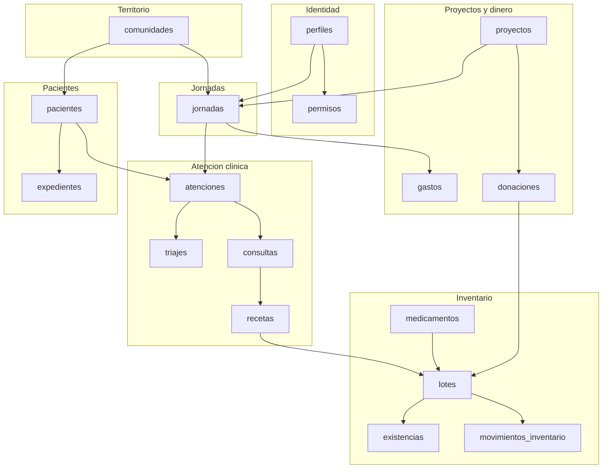
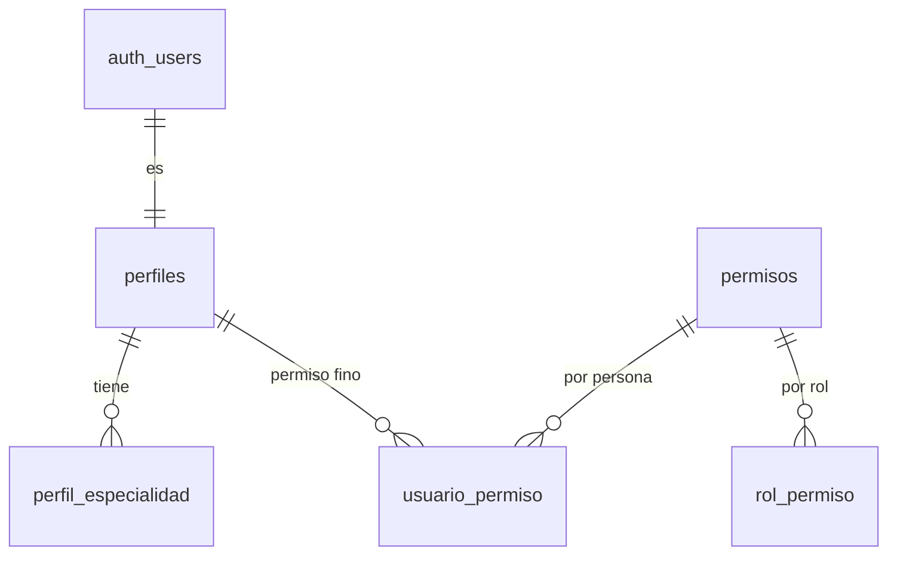
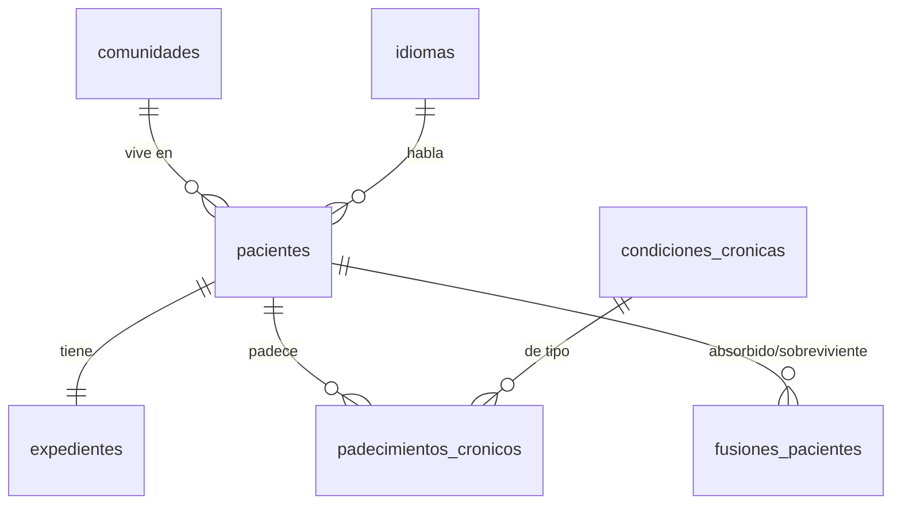
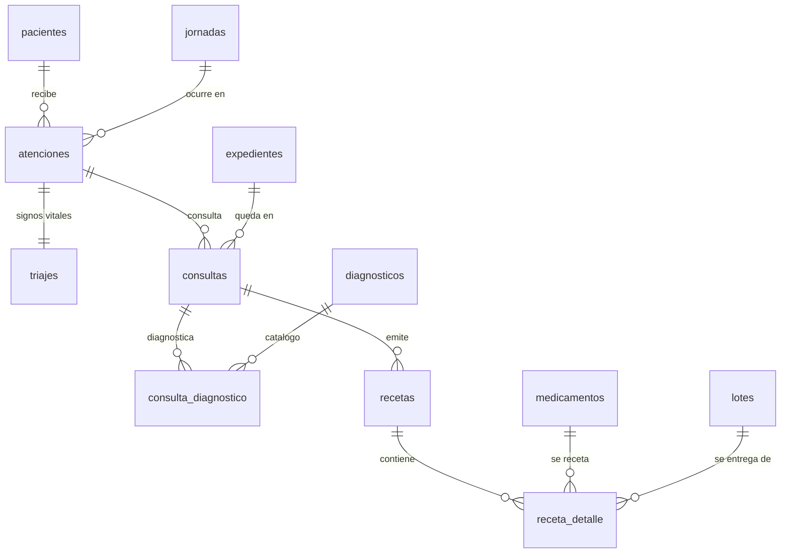
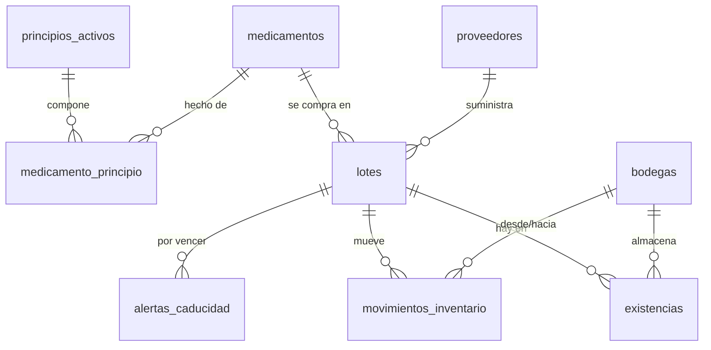
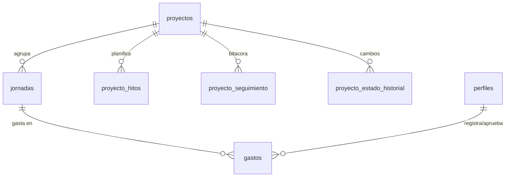

# Modelo de datos - Ecopac Digital

Referencia del esquema de PostgreSQL: que tablas existen, que guarda cada columna, que reglas
hace cumplir la base de datos por si misma, y donde esta escrito cada cosa.

**La fuente de verdad es `supabase/migrations/`.** Este documento la describe; cuando no
coincidan, manda el SQL. Cada tabla indica entre corchetes la migracion que la creo, y cada
columna anadida despues indica la migracion que la agrego.

Estado al 4 de septiembre de 2026, sobre `develop`.

| Elemento          | Cantidad |
| ----------------- | -------- |
| Migraciones       | 103      |
| Tablas            | 42       |
| Tipos enumerados  | 20       |
| Funciones         | 49       |
| Vistas            | 7        |
| Politicas RLS     | 107      |

---

## Indice

1. [Convenciones del esquema](#1-convenciones-del-esquema)
2. [Mapa general](#2-mapa-general)
3. [Identidad, roles y auditoria](#3-identidad-roles-y-auditoria)
4. [Territorio](#4-territorio)
5. [Pacientes y expediente](#5-pacientes-y-expediente)
6. [Jornadas](#6-jornadas)
7. [Atencion clinica](#7-atencion-clinica)
8. [Inventario](#8-inventario)
9. [Donaciones](#9-donaciones)
10. [Proyectos y presupuesto](#10-proyectos-y-presupuesto)
11. [Tipos enumerados](#11-tipos-enumerados)
12. [Funciones](#12-funciones)
13. [Vistas](#13-vistas)
14. [Reglas que hace cumplir la base de datos](#14-reglas-que-hace-cumplir-la-base-de-datos)
15. [Row Level Security](#15-row-level-security)

---

## 1. Convenciones del esquema

| Convencion                        | Regla                                                                     |
| --------------------------------- | ------------------------------------------------------------------------- |
| Nombres                           | `snake_case` en tablas y columnas                                         |
| Clave primaria                    | `UUID` con `DEFAULT extensions.gen_random_uuid()`, salvo catalogos geograficos (`INT`) y `eventos_auditoria` (`BIGINT IDENTITY`) |
| Marcas de tiempo de fila          | `created_at` y `updated_at`, ambas `TIMESTAMPTZ NOT NULL DEFAULT NOW()`   |
| `updated_at`                      | Lo mantiene el trigger `actualizar_timestamp_updated_at()`, no el cliente |
| Actor de una accion               | Sufijo `_por`: `registrado_por`, `aprobado_por`, `anulada_por`            |
| Momento de esa accion             | Misma raiz con sufijo `_en`: `aprobado_en`, `anulada_en`, `tomado_en`     |
| Responsable de una entidad        | `responsable_id`                                                          |
| Correo electronico                | `extensions.citext` (comparacion sin distinguir mayusculas)               |
| Dinero                            | `NUMERIC(12,2)`                                                           |
| Borrado                           | Logico donde hay historial clinico (`pacientes.fecha_baja`); fisico prohibido por trigger |

El prefijo `extensions.` no es decorativo: la migracion `00005` movio las extensiones fuera de
`public` a proposito, y omitirlo rompe la migracion.

---

## 2. Mapa general

Los tres ejes del sistema:

- **La persona atendida**: `pacientes` -> `expedientes` -> `atenciones` -> `triajes` / `consultas`
  -> `recetas`.
- **El medicamento**: `medicamentos` -> `lotes` -> `existencias` (por bodega), movido por
  `movimientos_inventario` y consumido por `receta_detalle`.
- **El dinero y la planificacion**: `proyectos` -> `jornadas` -> `gastos`, alimentados por
  `donaciones`.

Los tres se cruzan en la **jornada**: es la unidad de operacion. Casi todo lo clinico exige una
jornada `en curso` para poder escribirse.

---

## 3. Identidad, roles y auditoria

### `perfiles` [00002]

Extiende `auth.users` con los datos de la organizacion. Un perfil se crea automaticamente por el
trigger `crear_perfil_nuevo_usuario()` al aparecer el usuario de autenticacion.

| Columna         | Tipo                    | Notas                                        |
| --------------- | ----------------------- | -------------------------------------------- |
| `id`            | UUID PK                 | Referencia `auth.users(id)` ON DELETE CASCADE |
| `nombres`       | VARCHAR(100) NOT NULL   |                                              |
| `apellidos`     | VARCHAR(100) NOT NULL   |                                              |
| `email`         | citext UNIQUE NOT NULL  |                                              |
| `telefono`      | VARCHAR(20)             |                                              |
| `rol`           | `rol_usuario` NOT NULL  | Por defecto `voluntario general`             |
| `activo`        | BOOLEAN NOT NULL        | Por defecto TRUE. Inactivo = sin rol efectivo |
| `fecha_ingreso` | DATE                    |                                              |
| `direccion`     | TEXT                    | [+00108]                                     |
| `notas`         | TEXT                    | [+00108]                                     |

Reglas propias: no se puede cambiar el rol propio (`impedir_cambio_de_rol_propio`), no se puede
uno desactivar a si mismo (`impedir_autodesactivacion`), y no se puede dejar al sistema sin
administrador activo (`impedir_dejar_sin_administrador_activo`, `impedir_borrar_ultimo_administrador`).

### `perfil_especialidad` [00002]

`perfil_id` + `nombre_especialidad`. Clave primaria compuesta. Cada perfil administra las suyas
(`00085`).

### `permisos` [00003]

Catalogo de permisos finos: `clave` (unica), `modulo`, `descripcion`. La columna `modulo` coincide
con los identificadores de `packages/shared/navegacion.js`.

### `rol_permiso` [00003]

Que trae cada rol de fabrica: `rol` (`rol_usuario`) + `permiso_id`.

### `usuario_permiso` [00003]

Excepcion por persona sobre lo que da el rol.

| Columna        | Tipo             | Notas                                                        |
| -------------- | ---------------- | ------------------------------------------------------------ |
| `perfil_id`    | UUID             |                                                              |
| `permiso_id`   | UUID             |                                                              |
| `concedido`    | BOOLEAN NOT NULL | TRUE concede, FALSE revoca de forma explicita                 |
| `otorgado_por` | UUID             | Quien tomo la decision                                        |
| `motivo`       | TEXT             |                                                              |

Cada escritura queda auditada (`registrar_evento_auditoria_usuario_permiso`, `00045`), y no se le
puede conceder un permiso de escritura a un rol consultivo
(`impedir_permiso_escritura_a_consultivo`, `00086`).

### `eventos_auditoria` [00026]

Bitacora de escrituras sensibles. `tabla_afectada`, `fila_id`, `operacion`
(`insercion`/`actualizacion`/`baja`/`eliminacion`), `realizado_por`, `realizado_en`, y el antes y
el despues como `JSONB` (`valores_anteriores`, `valores_nuevos`). Solo la lee el administrador.

---

## 4. Territorio

Jerarquia de tres niveles. Los dos primeros son catalogo cerrado de Guatemala, con `id` entero
porque el dato viene del INE y no cambia.

| Tabla           | Migracion | Columnas                                                                          |
| --------------- | --------- | --------------------------------------------------------------------------------- |
| `departamentos` | 00006     | `id` INT PK, `nombre`                                                             |
| `municipios`    | 00006     | `id` INT PK, `departamento_id`, `nombre`                                          |
| `comunidades`   | 00008     | `id` UUID PK, `municipio_id`, `nombre`, `latitud`, `longitud`, `referencia_acceso` |

`referencia_acceso` es texto libre para llegar: la comunidad rural no siempre tiene direccion.
`latitud`/`longitud` son `NUMERIC(9,6)`.

---

## 5. Pacientes y expediente

### `pacientes` [00009]

| Columna                  | Tipo                    | Notas                                                       |
| ------------------------ | ----------------------- | ----------------------------------------------------------- |
| `id`                     | UUID PK                 |                                                             |
| `nombres`, `apellidos`   | VARCHAR(100) NOT NULL   |                                                             |
| `fecha_nacimiento`       | DATE NOT NULL           | La edad se calcula, no se guarda                            |
| `sexo`                   | VARCHAR(20) NOT NULL    | Palabra completa, no inicial (ver `00095`)                  |
| `comunidad_id`           | UUID                    | **Opcional desde [00111]**                                  |
| `telefono_contacto`      | VARCHAR(20) NOT NULL    | Telefono donde ubicar al paciente, no necesariamente suyo ([00093]) |
| `idioma`                 | VARCHAR(30) NOT NULL    | FK a `idiomas(codigo)` desde [00110]; antes era enum        |
| `dpi`                    | VARCHAR(20) UNIQUE      | Opcional: mucha poblacion rural no lo tiene                 |
| `tipo_sangre`            | `tipo_sanguineo`        | [+00035]                                                    |
| `nombre_responsable`     | VARCHAR(150)            | [+00035]                                                    |
| `parentesco_responsable` | VARCHAR(50)             | [+00035]                                                    |
| `fecha_baja`             | DATE                    | Borrado logico: el borrado fisico esta prohibido por trigger |

El alta pasa por `fn_registrar_paciente()` (`00057`), no por un INSERT directo: la funcion crea al
paciente y su expediente en la misma transaccion.

### `expedientes` [00009]

`paciente_id` (UNIQUE: uno por paciente) y `numero_ficha` (VARCHAR(30) UNIQUE). El numero lo genera
una secuencia (`00081`) precisamente para que dos registros simultaneos en campo no colisionen;
hay una prueba dedicada de concurrencia (`npm run verificar:concurrencia-ficha`).

### `idiomas` [00110]

Catalogo: `codigo` (UNIQUE), `nombre`. Sustituye al enum `idioma_preferido`, que quedo en el
esquema pero ya no lo usa `pacientes`. Se cambio a catalogo para poder agregar idiomas mayas sin
una migracion de tipo.

### `condiciones_cronicas` [00010] y `padecimientos_cronicos` [00010]

`condiciones_cronicas` es el catalogo (`nombre` unico). `padecimientos_cronicos` es lo que padece
un paciente concreto: `paciente_id`, `condicion_id`, `fecha_diagnostico`, `estado`
(`activa`/`controlada`/`resuelta`) y `notas`. Auditada desde `00070`.

### `fusiones_pacientes` [00101]

Registro de deduplicacion. `paciente_absorbido_id` (UNIQUE: no se absorbe dos veces),
`paciente_sobreviviente_id`, `realizada_por`, `realizada_en`. La fusion la ejecuta
`fn_fusionar_pacientes()`; los candidatos los propone `fn_detectar_pacientes_duplicados()`.

---

## 6. Jornadas

### `jornadas` [00012]

| Columna                | Tipo                        | Notas                                     |
| ---------------------- | --------------------------- | ----------------------------------------- |
| `id`                   | UUID PK                     |                                           |
| `nombre`               | VARCHAR(150) NOT NULL       |                                           |
| `fecha`                | DATE NOT NULL               | Fecha planificada                         |
| `comunidad_id`         | UUID NOT NULL               |                                           |
| `responsable_id`       | UUID NOT NULL               | Perfil a cargo                            |
| `proyecto_id`          | UUID                        | Opcional                                  |
| `estado`               | `estado_jornada` NOT NULL   | `planificada`/`en curso`/`finalizada`/`cancelada` |
| `presupuesto_asignado` | NUMERIC(12,2) NOT NULL      |                                           |
| `codigo`               | VARCHAR(30) UNIQUE          | [+00036]                                  |
| `fecha_inicio_real`    | TIMESTAMPTZ                 | [+00036] Cuando de verdad empezo          |
| `fecha_fin_real`       | TIMESTAMPTZ                 | [+00036]                                  |
| `orden_kanban`         | INT                         | [+00036] Posicion en el tablero           |
| `cupo_estimado`        | INT                         | [+00036]                                  |
| `botiquin_bodega_id`   | UUID                        | [+00036] Bodega movil que viaja           |

El estado no cambia libremente: `fn_validar_transicion_estado_jornada()` (`00051`) hace cumplir la
maquina de estados, y `fn_contar_atenciones_incompletas()` impide finalizar una jornada con
atenciones abiertas. Cada cambio queda en `jornada_estado_historial`.

### `jornada_personal` [00012]

Quien va, con que rol y en que turno: `jornada_id`, `perfil_id`, `rol_en_jornada` (`rol_usuario`),
`hora_inicio`, `hora_fin`, `responsabilidad`, y `asistio` (BOOLEAN, [+00036]).

Esta tabla es la que decide, junto con RLS, si alguien puede escribir en una jornada: la funcion
`participa_en_jornada()` la consulta.

### `jornada_estado_historial` [00012]

`estado_anterior`, `estado_nuevo`, `cambiado_por`, `created_at`. Lo llena el trigger
`registrar_cambio_estado_jornada()`. Solo lo lee el administrador.

---

## 7. Atencion clinica

Este es el flujo de la jornada, en orden: **atencion** (el paciente entra a la cola) -> **triaje**
(signos vitales) -> **consulta** (el medico) -> **receta** (que se lleva) -> descuento del
inventario.

### `atenciones` [00013]

`paciente_id`, `jornada_id`, mas `cerrada_en` y `motivo_cierre` ([+00060]). Una atencion abierta es
una persona esperando; `vista_cola_jornada` la ordena.

Solo se pueden registrar atenciones en una jornada **`en curso`**
(`validar_jornada_en_curso_atenciones`, `00055`).

### `triajes` [00013]

Una fila por atencion (`atencion_id` UNIQUE).

| Columna                                    | Tipo               | Notas                                            |
| ------------------------------------------ | ------------------ | ------------------------------------------------ |
| `presion_sistolica`, `presion_diastolica`  | SMALLINT NOT NULL  |                                                  |
| `frecuencia_cardiaca`                      | SMALLINT NOT NULL  |                                                  |
| `glucosa`                                  | SMALLINT           | Opcional                                         |
| `peso`, `talla`                            | NUMERIC(5,2)       | Opcionales                                       |
| `temperatura`                              | NUMERIC(4,1)       | Opcional                                         |
| `imc`                                      | NUMERIC(4,1)       | **Columna generada**: `ROUND(peso / (talla/100)^2, 1)` |
| `tomado_por`, `tomado_en`                  | UUID / TIMESTAMPTZ |                                                  |

Es la tabla con mas restricciones del esquema (8 a nivel de tabla): rangos fisiologicos que
Postgres hace cumplir. El IMC lo calcula la base, no el cliente.

### `consultas` [00018]

`expediente_id`, `atencion_id`, `medico_id`, `jornada_id`, y el contenido clinico:
`motivo_consulta` (NOT NULL), `antecedentes`, `sintomas`, `exploracion`, `tratamiento`,
`observaciones`, `plan_seguimiento`.

Exige jornada `en curso` (`validar_jornada_en_curso`, `00018`). El medico que la creo es el unico
que la edita, aparte del administrador.

### `diagnosticos` [00018] y `consulta_diagnostico` [00018]

`diagnosticos` es catalogo (`codigo`, `nombre`, `descripcion`), administrado solo por el
administrador desde `00105`. `consulta_diagnostico` los asocia a la consulta con
`es_principal` (BOOLEAN) para distinguir el diagnostico principal de los secundarios.

### `recetas` [00019]

| Columna                  | Tipo                     | Notas                                                        |
| ------------------------ | ------------------------ | ------------------------------------------------------------ |
| `consulta_id`            | UUID NOT NULL            |                                                              |
| `medico_id`              | UUID NOT NULL            |                                                              |
| `folio`                  | VARCHAR(50) UNIQUE       | `REC-` + 8 caracteres, por defecto                           |
| `indicaciones_generales` | TEXT                     |                                                              |
| `estado`                 | `estado_receta` NOT NULL | `emitida` / `anulada` [+00066]                               |
| `motivo_anulacion`       | TEXT                     | [+00066]                                                     |
| `anulada_por`            | UUID                     | [+00066]                                                     |
| `anulada_en`             | TIMESTAMPTZ              | [+00066]                                                     |

Una receta no se emite con un INSERT: se emite con `fn_generar_receta()` (`00066`), que recibe el
detalle como JSONB y descuenta el inventario en la misma transaccion. Una receta no se borra, se
anula.

### `receta_detalle` [00019]

`receta_id`, `medicamento_id`, `lote_id` (de que lote salio), `dosis`, `frecuencia`, `duracion`,
`cantidad_entregada`. El `lote_id` es lo que hace que un medicamento entregado sea rastreable
hasta el lote y el proveedor.

---

## 8. Inventario

**Un modelo, no dos.** El esquema llego a tener dos modelos de stock en paralelo (`lotes` +
`existencias`, y una tabla `lotes_existencias` con cantidad global). La migracion `00047` elimino
`lotes_existencias` y dejo solo el primero, porque es el unico que lleva **cantidad por bodega**,
que es lo que necesita la clinica movil. Si se encuentra una referencia a `lotes_existencias` en
codigo o documentacion, es codigo muerto.

### `medicamentos` [00016]

`nombre`, `concentracion`, `presentacion` (`presentacion_medicamento`), `marca`,
`forma_farmaceutica`, `es_pediatrico`, y `activo` ([+00050], baja logica del catalogo). Se registra
con `fn_registrar_medicamento()`, que asocia los principios activos en la misma llamada.

### `principios_activos` [00016] y `medicamento_principio` [00016]

`principios_activos` tiene `nombre` unico y `nombre_normalizado`, **columna generada**
(`lower(f_unaccent(nombre))`, [+00046]) para que "ácido" y "acido" no entren dos veces.
`medicamento_principio` es la relacion muchos a muchos.

### `proveedores` [00017] y `bodegas` [00017]

- `proveedores`: `nombre` unico, `contacto`, `tipo` (`tipo_proveedor`: `comercial`/`donante`).
- `bodegas`: `nombre` unico, `ubicacion`, `es_movil` (el botiquin que viaja a la jornada).

### `lotes` [00019, ampliada en 00020 y 00107]

| Columna              | Tipo                    | Notas                                                |
| -------------------- | ----------------------- | ---------------------------------------------------- |
| `medicamento_id`     | UUID NOT NULL           |                                                      |
| `numero_lote`        | VARCHAR(50) NOT NULL    |                                                      |
| `fecha_vencimiento`  | DATE                    |                                                      |
| `proveedor_id`       | UUID NOT NULL           | [+00020]                                             |
| `origen`             | `origen_lote` NOT NULL  | [+00020] `compra` / `donacion`                       |
| `cantidad_ingresada` | INT NOT NULL            | [+00020] Cuanto entro; lo disponible esta en `existencias` |
| `fecha_ingreso`      | DATE NOT NULL           | [+00020]                                             |
| `registrado_por`     | UUID                    | [+00107]                                             |
| `confirmado`         | BOOLEAN NOT NULL        | [+00107] FALSE = lote **provisional**                |

Los lotes provisionales (`00107`) resuelven un problema de campo: un medico o voluntario que recibe
medicamento en la comunidad puede proponer el lote sin esperar al administrador; queda sin
confirmar hasta que este lo valide.

Un lote **puede** vencer el mismo dia que ingresa (`00096` retiro la restriccion contraria: donaciones
de ultimo momento existen).

### `existencias` [00020]

`lote_id` + `bodega_id` (UNIQUE juntos) + `cantidad_disponible`. Una fila por combinacion de lote y
bodega. **Nadie escribe esta tabla a mano**: la mueve `fn_aplicar_ajuste_existencias()` desde el
trigger de `movimientos_inventario`.

### `movimientos_inventario` [00023]

| Columna                 | Tipo                          | Notas                                    |
| ----------------------- | ----------------------------- | ---------------------------------------- |
| `tipo`                  | `tipo_movimiento` NOT NULL    | `ingreso` / `salida`                     |
| `lote_id`               | UUID NOT NULL                 | Referencia `lotes` desde [00047]         |
| `bodega_id`             | UUID NOT NULL                 | NOT NULL desde [00047]                   |
| `cantidad`              | INT NOT NULL CHECK (> 0)      |                                          |
| `motivo`                | TEXT NOT NULL                 |                                          |
| `estado`                | `estado_movimiento` NOT NULL  | `pendiente`/`aprobado`/`rechazado`       |
| `registrado_por`        | UUID NOT NULL                 |                                          |
| `aprobado_por`          | UUID                          |                                          |
| `aprobado_en`           | TIMESTAMPTZ                   | Antes `fecha_aprobacion` [renombrada 00094] |
| `aprobacion_automatica` | BOOLEAN NOT NULL              | [+00028] TRUE si lo registro un administrador |
| `motivo_rechazo`        | TEXT                          | [+00084]                                 |

El flujo es de **aprobacion en dos pasos**: medico o voluntario registran el movimiento en estado
`pendiente`, y el administrador aprueba o rechaza. Solo al aprobar se toca `existencias`. Si el que
registra es administrador, el trigger `fn_autoaprobar_movimiento_inventario()` lo aprueba solo y
marca `aprobacion_automatica`.

Un movimiento ya decidido no se vuelve a tocar (`fn_bloquear_movimiento_finalizado`), y quien lo
registro no puede decidir sobre el suyo (`fn_proteger_decision_de_movimiento`, `00106`).

### `alertas_caducidad` [00021]

`lote_id`, `estado` (`pendiente`/`atendida`), `cantidad_afectada`, `accion`
(`donado`/`reubicado`/`descartado`), `atendida_por`, `atendida_en`.

Las genera `fn_generar_alertas_caducidad()` (`00088`) para lotes con existencia positiva que vencen
en 30 dias, sin duplicar las que ya existen. La dispara diariamente un workflow de GitHub Actions,
no `pg_cron`.

---

## 9. Donaciones

### `donantes` [00022]

`nombre` (unico), `tipo` (`persona`/`organizacion`), `contacto`, `telefono`, `email` (citext),
`direccion`, `activo`.

### `donaciones` [00022]

| Columna             | Tipo                        | Notas                                    |
| ------------------- | --------------------------- | ---------------------------------------- |
| `donante_id`        | UUID NOT NULL               |                                          |
| `fecha`             | DATE NOT NULL               |                                          |
| `tipo`              | `tipo_donacion` NOT NULL    | `medicamentos`/`insumos`/`dinero`/`servicios` |
| `estado`            | `estado_donacion` NOT NULL  | `registrada` / `anulada`                 |
| `observaciones`     | TEXT                        |                                          |
| `motivo_anulacion`  | TEXT                        |                                          |
| `anulada_por`       | UUID                        |                                          |
| `anulada_en`        | TIMESTAMPTZ                 |                                          |
| `registrado_por`    | UUID                        | Antes `registrada_por` [renombrada 00091] |
| `proyecto_id`       | UUID                        | [+00097] A que proyecto se destina       |

### `donacion_detalle` [00022]

`descripcion`, `cantidad`, `unidad`, `monto`, y `lote_id` **UNIQUE**: cuando la donacion es de
medicamentos, la linea del detalle apunta al lote que se creo en inventario. La unicidad es lo que
impide que dos donaciones reclamen el mismo lote.

---

## 10. Proyectos y presupuesto

### `proyectos` [00007]

`nombre`, `descripcion`, `fecha_inicio`, `fecha_fin`, `responsable_id`, `estado`
(`estado_proyecto`), `porcentaje_avance` (INTEGER), y `orden_columna` ([+00029], posicion en el
kanban). Las transiciones de estado las valida
`fn_validar_transicion_estado_proyecto()`, y quedan en `proyecto_estado_historial`.

### `proyecto_hitos` [00053]

`nombre`, `descripcion`, `fecha_prevista`, `fecha_real` (NULL = pendiente), `registrado_por`.

### `proyecto_seguimiento` [00053]

Bitacora de avance: `nota`, `porcentaje_anterior`, `porcentaje_nuevo`, `registrado_por`. La escribe
el trigger `registrar_avance_de_proyecto()`, de modo que ningun cambio de porcentaje quede sin
rastro.

### `gastos` [00025]

| Columna          | Tipo                        | Notas                                              |
| ---------------- | --------------------------- | -------------------------------------------------- |
| `jornada_id`     | UUID NOT NULL               |                                                    |
| `concepto`       | TEXT NOT NULL               |                                                    |
| `categoria`      | `categoria_gasto` NOT NULL  | Medicamentos, Logistica, Diagnostico, Honorarios, Educacion, Infraestructura |
| `monto`          | NUMERIC(12,2) CHECK (> 0)   |                                                    |
| `fecha`          | DATE NOT NULL               |                                                    |
| `responsable_id` | UUID                        | Antes `encargado_id` [renombrada 00092]            |
| `estado`         | `estado_gasto` NOT NULL     | Cambio de `estado_movimiento` a su propio enum en [00089] |
| `registrado_por` | UUID NOT NULL               |                                                    |
| `aprobado_por`   | UUID                        |                                                    |
| `aprobado_en`    | TIMESTAMPTZ                 | Antes `fecha_aprobacion` [renombrada 00094]        |
| `motivo_rechazo` | TEXT                        | [+00071]                                           |

Mismo patron de aprobacion que el inventario, con autoaprobacion para el administrador
(`fn_autoaprobar_gasto_administrador`, `00109`) y bloqueo de lo ya decidido
(`fn_bloquear_gasto_finalizado`).

La migracion `00089` **desacoplo gastos de inventario**: antes compartian el enum
`estado_movimiento`, lo que ataba dos flujos que no tienen por que evolucionar juntos.

Los totales no se guardan: los calculan `presupuesto_de_jornada()`, `presupuesto_de_proyecto()` y
`presupuesto_del_sistema()` (`00040`).

---

## 11. Tipos enumerados

| Enum                       | Valores                                                                        | Migracion |
| -------------------------- | ------------------------------------------------------------------------------ | --------- |
| `rol_usuario`              | administrador, junta directiva, socio fundador, medico, voluntario general      | 00001     |
| `estado_jornada`           | planificada, en curso, finalizada, cancelada                                   | 00001     |
| `presentacion_medicamento` | tableta, jarabe, capsula, inyectable, pomada, gotas ophthalmic, gotas otic     | 00001     |
| `idioma_preferido`         | espanol, quiche, mam, otros                                                    | 00001     |
| `estado_proyecto`          | planificado, en curso, finalizado, cancelado                                   | 00007     |
| `estado_condicion_cronica` | activa, controlada, resuelta                                                   | 00010     |
| `tipo_proveedor`           | comercial, donante                                                             | 00017     |
| `origen_lote`              | compra, donacion                                                               | 00020     |
| `estado_alerta`            | pendiente, atendida                                                            | 00021     |
| `accion_alerta`            | donado, reubicado, descartado                                                  | 00021     |
| `tipo_donante`             | persona, organizacion                                                          | 00022     |
| `tipo_donacion`            | medicamentos, insumos, dinero, servicios                                       | 00022     |
| `estado_donacion`          | registrada, anulada                                                            | 00022     |
| `tipo_movimiento`          | ingreso, salida                                                                | 00023     |
| `estado_movimiento`        | pendiente, aprobado, rechazado                                                 | 00023     |
| `categoria_gasto`          | Medicamentos, Logistica, Diagnostico, Honorarios, Educacion, Infraestructura   | 00025     |
| `operacion_auditoria`      | insercion, actualizacion, baja, eliminacion                                    | 00026     |
| `tipo_sanguineo`           | A+, A-, B+, B-, AB+, AB-, O+, O-                                               | 00035     |
| `estado_receta`            | emitida, anulada                                                               | 00066     |
| `estado_gasto`             | pendiente, aprobado, rechazado                                                 | 00089     |

Dos notas:

- `idioma_preferido` sigue existiendo pero **ya no lo usa nadie**: `pacientes.idioma` paso al
  catalogo `idiomas` en `00110`.
- `tipo_proveedor` y `origen_lote` tienen valores parecidos y son cosas distintas a proposito: uno
  describe **a quien le compras**, el otro **como llego el lote**. La razon esta documentada con
  `COMMENT ON` en `00090`.

Del lado del cliente, estos valores nacen una sola vez en `packages/shared/enums.js` y
`packages/shared/usuarios/roles.js`. Un rol escrito como string suelto es un error de revision.

---

## 12. Funciones

### Autorizacion (las usan las politicas RLS)

| Funcion                                          | Devuelve      | Que responde                                       |
| ------------------------------------------------ | ------------- | -------------------------------------------------- |
| `rol_actual()`                                   | `rol_usuario` | El rol efectivo; NULL si el perfil esta inactivo   |
| `es_administrador()`                             | BOOLEAN       |                                                    |
| `es_consultivo()`                                | BOOLEAN       | Junta directiva o socio fundador                   |
| `tiene_permiso(codigo)`                          | BOOLEAN       | Rol + excepciones de `usuario_permiso`             |
| `participa_en_jornada(jornada_id)`               | BOOLEAN       | Si esta asignado a esa jornada                     |
| `personal_registro_atenciones(jornada, perfil)`  | BOOLEAN       |                                                    |
| `alta_de_cuenta_permitida(usuario, app_meta)`    | BOOLEAN       | Cierra el registro publico (`00074`)               |

### Operaciones de negocio (se llaman por RPC)

| Funcion                                 | Que hace                                                          |
| --------------------------------------- | ----------------------------------------------------------------- |
| `fn_registrar_paciente(...)`            | Crea paciente y expediente en una transaccion                     |
| `fn_buscar_pacientes(...)`              | Busqueda paginada con filtros (termino, comunidad, sexo, edad, condicion) |
| `fn_detectar_pacientes_duplicados()`    | Propone candidatos a fusion                                       |
| `fn_fusionar_pacientes(sobrevive, absorbido)` | Ejecuta la fusion y la registra                             |
| `fn_registrar_medicamento(...)`         | Alta de medicamento con sus principios activos                    |
| `fn_generar_receta(...)`                | Emite la receta y descuenta inventario, atomicamente              |
| `fn_existencias_disponibles(...)`       | Stock consultable, filtrado y paginado                            |
| `fn_aplicar_ajuste_existencias(...)`    | Suma o resta stock por (lote, bodega); lanza error si no alcanza   |
| `fn_generar_alertas_caducidad()`        | Genera alertas de lo que vence en 30 dias                         |
| `fn_crear_usuario_administrativo(...)`  | Alta de cuenta; SECURITY DEFINER, sin GRANT a PUBLIC              |
| `presupuesto_de_jornada / _de_proyecto / _del_sistema()` | Asignado, ejecutado y disponible             |
| `fn_reporte_pacientes_atendidos(...)`   | Reporte agregado con agrupacion configurable                      |
| `fn_atenciones_de_persona_por_jornada(perfil)` | Cuantas atendio cada quien                                 |
| `fn_contar_atenciones_incompletas(jornada)` | Bloquea el cierre de jornada                                  |
| `f_unaccent(texto)`                     | Normaliza acentos para busqueda                                   |

### Triggers

| Trigger                                    | Sobre                       | Que hace                                       |
| ------------------------------------------ | --------------------------- | ---------------------------------------------- |
| `actualizar_timestamp_updated_at`          | casi todas                  | Mantiene `updated_at`                          |
| `crear_perfil_nuevo_usuario`               | `auth.users`                | Crea el perfil                                 |
| `fn_actualizar_existencias`                | `movimientos_inventario`    | Aplica el ajuste al aprobar                    |
| `fn_autoaprobar_movimiento_inventario`     | `movimientos_inventario`    | Autoaprueba lo del administrador               |
| `fn_bloquear_movimiento_finalizado`        | `movimientos_inventario`    | Congela lo ya decidido                         |
| `fn_proteger_decision_de_movimiento`       | `movimientos_inventario`    | Nadie decide sobre el movimiento que registro  |
| `fn_autoaprobar_gasto_administrador`       | `gastos`                    | Autoaprueba lo del administrador               |
| `fn_bloquear_gasto_finalizado`             | `gastos`                    | Congela lo ya decidido                         |
| `fn_validar_transicion_estado_jornada`     | `jornadas`                  | Maquina de estados                             |
| `registrar_cambio_estado_jornada`          | `jornadas`                  | Historial                                      |
| `fn_validar_transicion_estado_proyecto`    | `proyectos`                 | Maquina de estados                             |
| `registrar_cambio_estado_proyecto`         | `proyectos`                 | Historial                                      |
| `registrar_avance_de_proyecto`             | `proyectos`                 | Bitacora de avance                             |
| `validar_jornada_en_curso`                 | `consultas`                 | Solo con jornada en curso                      |
| `validar_jornada_en_curso_atenciones`      | `atenciones`                | Solo con jornada en curso                      |
| `impedir_borrado_fisico_paciente`          | `pacientes`                 | Fuerza la baja logica                          |
| `impedir_cambio_de_rol_propio`             | `perfiles`                  |                                                |
| `impedir_autodesactivacion`                | `perfiles`                  |                                                |
| `impedir_dejar_sin_administrador_activo`   | `perfiles`                  |                                                |
| `impedir_borrar_ultimo_administrador`      | `perfiles`                  |                                                |
| `impedir_permiso_escritura_a_consultivo`   | `usuario_permiso`           |                                                |
| `registrar_evento_auditoria`               | tablas sensibles            | Escribe en `eventos_auditoria`                 |
| `registrar_evento_auditoria_usuario_permiso` | `usuario_permiso`         |                                                |

---

## 13. Vistas

| Vista                    | Para que sirve                                                            |
| ------------------------ | ------------------------------------------------------------------------- |
| `vista_reporte_impacto`  | Indicadores agregados de impacto, con proyecto desde `00064`              |
| `pacientes_reporte`      | Agregados de pacientes **sin filas identificables**, para roles consultivos |
| `vista_cola_jornada`     | Quien esta esperando en la jornada y desde hace cuanto                    |
| `vista_lotes_disponibles`| Lotes entregables (no vencidos, con existencia), por lote y bodega        |
| `perfiles_directorio`    | Directorio de personal sin exponer la tabla completa                      |
| `tablas_sin_rls`         | **Verificacion**: lista tablas sin RLS. Debe estar vacia                  |
| `privilegios_de_anon`    | **Verificacion**: lista privilegios de `anon`. Debe estar vacia           |

Las dos ultimas no son de producto: son afirmaciones de seguridad comprobables desde SQL, y las
pruebas pgTAP las consultan.

---

## 14. Reglas que hace cumplir la base de datos

Estas reglas se cumplen aunque el cliente este modificado. Es la lista corta de lo que **no depende
de que la interfaz se comporte bien**:

| Regla                                                              | Como                                              |
| ------------------------------------------------------------------ | ------------------------------------------------- |
| Un paciente no se borra fisicamente                                | Trigger `impedir_borrado_fisico_paciente`         |
| El IMC no se puede falsear                                         | Columna generada en `triajes`                     |
| Los signos vitales estan en rango fisiologico                       | 8 `CHECK` en `triajes`                            |
| No se registra atencion ni consulta fuera de jornada en curso       | Triggers `00055` y `00018`                        |
| Una jornada no se finaliza con atenciones abiertas                  | `fn_contar_atenciones_incompletas`                |
| Los estados de jornada y proyecto siguen su maquina de estados      | Triggers de validacion `00051` y `00029`          |
| No se entrega medicamento vencido                                   | `00024` y `vista_lotes_disponibles`               |
| El stock nunca queda negativo                                       | `fn_aplicar_ajuste_existencias` lanza "Existencia insuficiente" |
| Quien registra un movimiento no lo aprueba                          | `fn_proteger_decision_de_movimiento` (`00106`)    |
| Lo aprobado o rechazado no se vuelve a editar                       | `fn_bloquear_movimiento_finalizado`, `fn_bloquear_gasto_finalizado` |
| El sistema nunca se queda sin administrador activo                  | `00072` y `00103`                                 |
| Nadie cambia su propio rol ni se desactiva a si mismo               | `00038` y `00072`                                 |
| Un perfil inactivo no tiene rol efectivo                            | `rol_actual()` desde `00079`                      |
| Un rol consultivo no recibe permisos de escritura                   | `00086`                                           |
| No se crean cuentas por registro publico                            | `00074`                                           |
| `anon` no tiene privilegios                                         | `00049`, `00056`, vista `privilegios_de_anon`     |
| Una donacion no reclama un lote ya reclamado                        | `donacion_detalle.lote_id` UNIQUE                 |
| Dos registros simultaneos no colisionan en el numero de ficha       | Secuencia (`00081`) + prueba de concurrencia      |

---

## 15. Row Level Security

**Denegacion por defecto** (`00030`): una tabla sin politica no devuelve nada a nadie. La vista
`tablas_sin_rls` existe para comprobarlo.

Las 107 politicas vigentes siguen cuatro patrones:

| Patron                    | Ejemplo                                                        | Se lee como                                    |
| ------------------------- | -------------------------------------------------------------- | ---------------------------------------------- |
| Catalogo abierto a sesion | "Sesion activa lee comunidades"                                | Cualquiera conectado y activo lee              |
| Solo administrador        | "Solo administrador crea bodegas"                              | Escritura reservada                            |
| Por participacion         | "El personal asignado lee los de su jornada"                   | `participa_en_jornada()`                       |
| Por autoria               | "El medico que creo la consulta la edita"                      | Compara contra `auth.uid()`                    |

Politicas por tabla (numero de politicas vigentes):

| Tabla                       | Pol. | Tabla                      | Pol. | Tabla                      | Pol. |
| --------------------------- | ---- | -------------------------- | ---- | -------------------------- | ---- |
| `gastos`                    | 4    | `atenciones`               | 3    | `donacion_detalle`         | 2    |
| `jornada_personal`          | 4    | `bodegas`                  | 3    | `medicamento_principio`    | 2    |
| `padecimientos_cronicos`    | 4    | `consultas`                | 3    | `proyecto_seguimiento`     | 2    |
| `principios_activos`        | 4    | `diagnosticos`             | 3    | `receta_detalle`           | 2    |
| `proyecto_hitos`            | 4    | `donaciones`               | 3    | `alertas_caducidad`        | 2    |
| `usuario_permiso`           | 4    | `donantes`                 | 3    | `comunidades`              | 1    |
| `existencias`               | 3    | `expedientes`              | 3    | `condiciones_cronicas`     | 1    |
| `jornadas`                  | 3    | `lotes`                    | 3    | `departamentos`            | 1    |
| `medicamentos`              | 3    | `movimientos_inventario`   | 3    | `municipios`               | 1    |
| `pacientes`                 | 3    | `perfil_especialidad`      | 3    | `idiomas`                  | 1    |
| `perfiles`                  | 3    | `proveedores`              | 3    | `permisos`                 | 1    |
| `proyectos`                 | 3    | `recetas`                  | 3    | `rol_permiso`              | 1    |
| `triajes`                   | 3    | `consulta_diagnostico`     | 2    | `eventos_auditoria`        | 1    |
| `fusiones_pacientes`        | 1    | `jornada_estado_historial` | 1    | `proyecto_estado_historial`| 1    |

**Quien puede que, modulo por modulo, esta en [PERMISOS.md](./PERMISOS.md)**: ese documento es la
fuente de verdad del control de acceso, y un PR que cambia una politica o un GRANT lo actualiza en
el mismo PR.

Las politicas se comprueban con 27 archivos pgTAP en `supabase/tests/database/`, que corren en CI
sobre una base creada desde cero.
